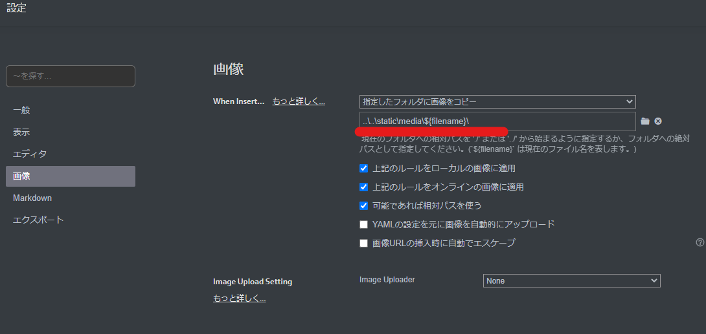
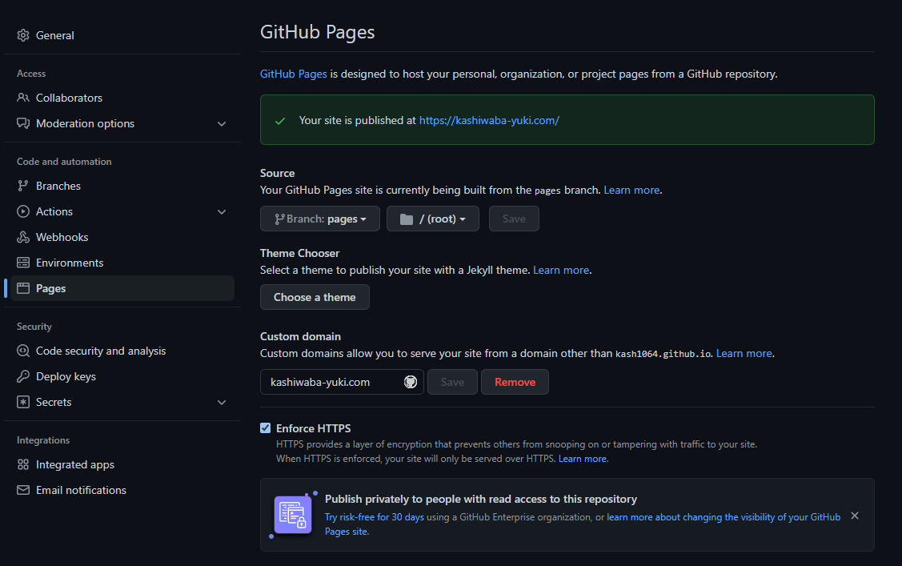

突然ですが、諸般の事情につきブログを移転することにしました。

[旧ブログ](https://yukituna.com/)の記事は順次こちらのブログに移植していこうと思います（手動でやる必要があるので面倒ですが…。）

新しいブログですが、MITライセンスで公開されているGatsbyテンプレートの[gatsby-starter-lumen](https://github.com/alxshelepenok/gatsby-starter-lumen)をベースに使用させてもらってます。

この記事では、新しいブログを公開するまでに実施した作業について備忘録としてまとめておきます。

<!-- omit in toc -->
## もくじ
- [今回作成する環境](#今回作成する環境)
  - [ローカル開発環境](#ローカル開発環境)
  - [デプロイ環境](#デプロイ環境)
- [Gatsby環境を構築する](#gatsby環境を構築する)
  - [Dockerをインストールする](#dockerをインストールする)
  - [Gatsby開発用のコンテナを作成する](#gatsby開発用のコンテナを作成する)
  - [Gatsbyブログの作成](#gatsbyブログの作成)
  - [トラブルシューティング：EACCES: permission denied, mkdir '/app/.npm/sentry-cli' が発生する場合](#トラブルシューティングeacces-permission-denied-mkdir-appnpmsentry-cli-が発生する場合)
  - [トラブルシューティング：socialImageのエラーが発生する場合](#トラブルシューティングsocialimageのエラーが発生する場合)
- [Gatsbyの設定を変更する](#gatsbyの設定を変更する)
  - [プロフィール設定を変更する](#プロフィール設定を変更する)
  - [サイトデザインの設定](#サイトデザインの設定)
  - [コンテンツを追加、編集する](#コンテンツを追加編集する)
- [Typoraの設定をする](#typoraの設定をする)
- [GitHub Pagesにデプロイする](#github-pagesにデプロイする)
  - [パスの設定](#パスの設定)
  - [デプロイ用のカスタムスクリプトの作成](#デプロイ用のカスタムスクリプトの作成)
  - [Pagesの設定](#pagesの設定)
- [まとめ](#まとめ)

## 今回作成する環境

今回は以下の環境を想定しています。

### ローカル開発環境

- Windows 10 Pro
- Docker
- Typora

この環境が実際に記事を書く環境になります。

Windowsホスト上のTyporaでMarkdownを編集し、動作確認はGatsby環境を構築したDockerコンテナ上で行います。

ちなみにTyporaは高機能Markdownエディタです。

最近有料化しましたが$15くらいの買い切りライセンスなので非常におすすめです。

参考：[Typora](https://typora.io/)

### デプロイ環境

ローカルで作成したブログは、GitHub Pagesにデプロイして公開します。

この際、独自ドメインを使用して公開できるように構成します。

## Gatsby環境を構築する

### Dockerをインストールする

現在Windows環境にDockerをインストールする方法としては、以下の2つの方法が主になると思います。

- WSL2にDockerをインストールする
- Docker Desktop for Windowsをインストールする

参考：[Install Docker Desktop on Windows | Docker Documentation](https://docs.docker.com/desktop/windows/install/)

今回はPowershellからDockerコマンドを実行していく予定なので、Docker Desktop for Windowsをインストールしました。

ちなみに、Docker Desktop for Windowsは少し前にライセンス有料化で話題になりましたが、個人利用の場合は引き続き無料で使用することができます。

インストール方法については上記のドキュメントのリンクからダウンロードしたインストーラを実行するだけでOKです。

### Gatsby開発用のコンテナを作成する

続いてGatsbyの開発環境を構築します。

基本的には以下のドキュメントを参照し、次のようなDockerfileを作成しました。

参考：[Part 0: Set Up Your Development Environment | Gatsby](https://www.gatsbyjs.com/docs/tutorial/part-0/)

``` Dockerfile
FROM ubuntu:20.04
ENV TZ=Asia/Tokyo

RUN mkdir -p /app/blog
ENV HOME=/app/
WORKDIR /app

RUN apt update && apt upgrade -y
RUN apt install tzdata -y
RUN apt install curl git python wget -y
RUN apt install nodejs npm -y
RUN npm install n -g
RUN n stable

RUN apt purge -y nodejs npm
RUN apt autoremove -y

RUN node -v
RUN npm install -g gatsby-cli
RUN npm install gh-pages --save-dev

RUN chown root:root ./* -R
WORKDIR $HOME/blog
EXPOSE 8000
```

Ubuntu 20.04のコンテナをベースに最新のNodeJSをインストールした後、`gatsby-cli`をインストールしました。

これによって`gatsby`コマンドが使用できるようになります。

また、`gh-pages`はGithub Pagesにデプロイする際に使用するパッケージです。

詳細は後述します。

なお、今回作成したイメージは[kashiwabayuki/gatsby-env](https://hub.docker.com/repository/docker/kashiwabayuki/gatsby-env)として公開しているので、以下のコマンドでPullすることも可能です。

``` bash
docker pull kashiwabayuki/gatsby-env
```

### Gatsbyブログの作成

コンテナイメージを作成した後、環境構築時のみコンテナにログインしていくつかのセットアップを実行する必要があります。

Powershell環境の場合、以下のコマンドでコンテナにログインできます。

``` powershell
$pwddir = (Get-Location -PSProvider FileSystem).Path
docker run -it --rm --volume $pwddir/src:/app -p 8000:8000 kashiwabayuki/gatsby-env
```

このコマンドで、コンテナのホームディレクトリ`/app`にローカルボリューム`src/`を紐づけてログインしています。

ログイン後、以下のコマンドで`gatsby-starter-lumen`を使用してGatsbyのコンテンツを作成します。

``` bash
gatsby new blog https://github.com/alxshelepenok/gatsby-starter-lumen
```

続いて、新たに生成された`blog`ディレクトリ配下で以下のコマンドを実行します。

``` bash
npm install
#もしエラーになる場合は npm install --legacy-peer-deps を実行する。
```

`npm install`コマンドでエラーが発生する場合は`--legacy-peer-deps`オプションを付けてから実行してみると良いです。

これでブログの初期設定は完了です。

以下のコマンドを実行してローカルサーバが起動すれば成功です。

``` bash
gatsby develop -H 0.0.0.0
```

### トラブルシューティング：EACCES: permission denied, mkdir '/app/.npm/sentry-cli' が発生する場合

再現条件が不定なので原因はよくわかっていないのですが、`npm install` を実行した際に`EACCES: permission denied, mkdir '/app/.npm/sentry-cli' `という権限エラーが発生する場合があります。

Dockerのユーザはrootにしているので通常発生しないことが想定されるのですが、僕の環境では何度か発生しました。

対処方としては、Dockerfileでエラーの発生するディレクトリに以下のように明示的に所有者をrootに設定してあげると解消されました。

``` dockerfile
RUN chown root:root ./* -R
```

エラーが発生しないときもあるので、原因は正直よくわかっていないです。。

### トラブルシューティング：socialImageのエラーが発生する場合

ちなみに、この時以下のようなエラーが発生する場合があります。

これは、各記事の`socialImage`の値が空になっているか、参照先の画像が存在していない場合、もしくは`static`ディレクトリが解決できない場合に発生するようです。

``` bash
Field "socialImage" must not have a selection since type "String" has no subfields.
```

本記事の手順の場合は問題ないですが、Windowsのホスト上で`gatsby develop`を実行した場合、`static`ディレクトリが解決できない既知の問題のためこのような問題が発生する場合があります。

解決のためには、以下のIssueに記載の回避策を試すか、本記事に記載のコンテナイメージを利用してください。

参考：[Field "socialImage" must not have a selection since type "String" has no subfields. · Issue #761 · alxshelepenok/gatsby-starter-lumen](https://github.com/alxshelepenok/gatsby-starter-lumen/issues/761)

## Gatsbyの設定を変更する

とりあえずここまでで最低限のGatsby環境が出来上がったので、次は初期セットアップを行っていきます。

### プロフィール設定を変更する

基本的なプロフィールやSNSなどの設定は`blog/config.js`から変更できます。

実際の設定は以下のようになります。

``` javascript
'use strict';

module.exports = {
  url: 'https://kashiwaba-yuki.com',
  pathPrefix: '/',
  title: 'かえるのひみつきち',
  subtitle: '',
  copyright: 'All rights reserved 2022 Kaeru-no-Himitsukichi.',
  disqusShortname: '',
  postsPerPage: 4,
  googleAnalyticsId: '',
  useKatex: false,
  menu: [
    {
      label: 'All Articles',
      path: '/'
    },
    {
      label: 'Development',
      path: '/tag/development'
    },
    {
      label: 'Notes',
      path: '/category/note'
    }
  ],
  author: {
    name: 'かしわば',
    photo: '/avatar.png',
    bio: 'リバースエンジニアになりたい趣味プログラマ。',
    contacts: {
      email: '',
      facebook: '',
      telegram: '',
      twitter: 'yuki_kashiwaba',
      github: 'kash1064',
      rss: '',
      vkontakte: '',
      linkedin: '',
      instagram: '',
      line: '',
      gitlab: '',
      weibo: '',
      codepen: '',
      youtube: '',
      soundcloud: '',
      medium: '',
    }
  }
};
```

特に`contacts`内のSNSアカウントについて、表示したくないものはコメントアウトではなく空欄にする必要があります。

コメントアウトするとエラーが発生します。

### サイトデザインの設定

サイトデザインを変更する場合は、各要素のテンプレートをそれぞれ編集する必要があります。

今回はベースのレイアウトは変更せず、配色などを一部変更しました。

基本のデザインを変更したい場合は`blog/src/assets/scss/base/_generic.scss`を編集します。

内容は以下のようになっており、各要素の文字サイズや色、フォントなども変更することができます。

``` css
/** 
 * Generic
 */
html {
  font-size: $typographic-root-font-size;
}

body {
  margin: 0 0 0 calc(100vw - 100%);
  font-family: $typographic-font-family;
  color: $typographic-base-font-color;
  line-height: $typographic-base-line-height;
  font-size: $typographic-base-font-size;
  -ms-text-size-adjust: 100%;
  -webkit-text-size-adjust: 100%;
  text-rendering: optimizeLegibility;
  -webkit-font-smoothing: antialiased;
  -moz-osx-font-smoothing: grayscale;
}

h1,
h2,
h3,
h4,
h5,
h6 {
  font-family: $typographic-font-family;
  font-weight: 600;
}

h1 {
  font-size: $typographic-base-font-size * 1.8;
  @include line-height(1.8);
  @include margin-top(4);
  @include margin-bottom(1);
}

h2 {
  font-size: $typographic-base-font-size * 1.6875;
  @include line-height(1.5);
  @include margin-top(2);
  @include margin-bottom(.5);
}

h3 {
  font-size: $typographic-base-font-size * 1.375;
  @include line-height(1);
  @include margin-top(2);
  @include margin-bottom(.5);
}

{{ 省略 }}
```

また、リンクの色や一部の要素のサイズなどは`blog/src/assets/scss/_variables.scss`で定義されている変数にて設定されています。

例えばリンクの色を変更したい場合は、`$color-primary`を変更する必要があります。

コンテンツの最大幅は`$layout-post-single-width`で設定されています。

そのため、僕のブログでも以下のようにベースカラーを一部変更しています。

``` css
// Colors
$color-base: #222;
$color-primary: #918D40;
$color-secondary: #A9D159;

$color-white: #FFF;
$color-gray: lighten($color-base, 40%);
$color-gray-border: lighten($color-base, 77%);
$color-gray-bg: lighten($color-base, 79%);
```

### コンテンツを追加、編集する

`gatsby-starter-lumen`を使用する場合、デフォルトでは以下の2タイプのコンテンツが用意されています。

- Pages：Aboutページなどの固定ページ
- Posts：ブログコンテンツ

これらはいずれも`blog/content/`ディレクトリの配下に配置されています。

Gatsbyは、`blog/src/cms/index.js`の定義に沿って`blog/content/`配下のファイルを探索し、指定された形式のページとして識別します。

そのため、デフォルトではすべてのブログページは`blog/content/posts`配下に置かれている必要がありますが、ここに`notes`などのカスタムディレクトリを追加したい場合は、以下のように`CMS.registerPreviewTemplate`にてディレクトリ名とテンプレートを紐づける必要があります。

``` javascript
// @flow strict
import CMS from 'netlify-cms-app';
import PagePreview from './preview-templates/page-preview';
import PostPreview from './preview-templates/post-preview';

CMS.registerPreviewTemplate('pages', PagePreview);
CMS.registerPreviewTemplate('posts', PostPreview);
CMS.registerPreviewTemplate('notes', PostPreview);
```

### 記事のURLからディレクトリ名を削除する

デフォルトでは、記事のURLは以下の形式になります。

``` bash
https://<カスタムドメイン>/<記事の存在するディレクトリ名>/<記事のSlug>
```

URLに`<記事の存在するディレクトリ名>`が埋まっていると、今後Markdownファイルのディレクトリを変更するたびにURLが変わってしまうのでよろしくありません。

そのため、URLに`<記事の存在するディレクトリ名>`が入らないように設定を変更します。

`blog/gatsby/on-create-node.js`の`createNodeField`を以下のように書き換えます。

``` javascript
if (node.internal.type === 'MarkdownRemark') {
  if (typeof node.frontmatter.slug !== 'undefined') {
    const dirname = getNode(node.parent).relativeDirectory;
    createNodeField({
      node,
      name: 'slug',
      // value: `/${dirname}/${node.frontmatter.slug}`
      value: `/${node.frontmatter.slug}`
    });
};
```

これでデプロイ時に生成されるURLからディレクトリ名を削除することができます。

### シンタックスハイライトの設定を変更する

今回使用したテーマのシンタックスハイライトはPrism.jsを利用しています。

そのため、シンタックスハイライトをカスタマイズしたい場合は以下のページからCSSを生成して`static\css\prismjs\theme.min.css`と置き換えてあげる必要があります。

参考：[Download ▲ Prism](https://prismjs.com/download.html#themes=prism-tomorrow&languages=markup+css+clike+javascript)

ちなみに、僕のブログでは以下の構成にしています。

``` css
/* PrismJS 1.27.0
https://prismjs.com/download.html#themes=prism-tomorrow&languages=markup+css+clike+javascript+aspnet+bash+c+csharp+cpp+csv+dart+django+go+http+java+makefile+markdown+markup-templating+nginx+php+powershell+python+ruby+rust+sql+typescript+yaml */
code[class*=language-],pre[class*=language-]{color:#ccc;background:0 0;font-family:Consolas,Monaco,'Andale Mono','Ubuntu Mono',monospace;font-size:1em;text-align:left;white-space:pre;word-spacing:normal;word-break:normal;word-wrap:normal;line-height:1.5;-moz-tab-size:4;-o-tab-size:4;tab-size:4;-webkit-hyphens:none;-moz-hyphens:none;-ms-hyphens:none;hyphens:none}pre[class*=language-]{padding:1em;margin:.5em 0;overflow:auto}:not(pre)>code[class*=language-],pre[class*=language-]{background:#2d2d2d}:not(pre)>code[class*=language-]{padding:.1em;border-radius:.3em;white-space:normal}.token.block-comment,.token.cdata,.token.comment,.token.doctype,.token.prolog{color:#999}.token.punctuation{color:#ccc}.token.attr-name,.token.deleted,.token.namespace,.token.tag{color:#e2777a}.token.function-name{color:#6196cc}.token.boolean,.token.function,.token.number{color:#f08d49}.token.class-name,.token.constant,.token.property,.token.symbol{color:#f8c555}.token.atrule,.token.builtin,.token.important,.token.keyword,.token.selector{color:#cc99cd}.token.attr-value,.token.char,.token.regex,.token.string,.token.variable{color:#7ec699}.token.entity,.token.operator,.token.url{color:#67cdcc}.token.bold,.token.important{font-weight:700}.token.italic{font-style:italic}.token.entity{cursor:help}.token.inserted{color:green}

# 追記
p > code[class*=language-text]{background:#F9F9F9 !important; color: #2d2d2d !important;}
```

最後の1行については、本文埋め込みの整形済みテキストの背景色と文字色を定義しています。

## Typoraの設定をする

僕が愛用しているTyporaというマークダウンエディタの非常に便利な機能の1つに、画像をコピペすると自動的に任意のローカルフォルダに保存してくれる機能があります。

Gatsbyの場合`blog/static/media`配下の画像に対して`/media`でアクセスできます。

そのため、以下のようにTyporaの設定で、コピペされた画像が`blog/static/media`配下の任意のディレクトリに配置されるように設定を行いました。



これで、デプロイ時にブログページが適切な画像を参照できるようになります。

## GitHub Pagesにデプロイする

さて、概ね形は整ったのでいよいよデプロイしていきます。

基本的には公式の手順をベースにしています。

参考：[How Gatsby Works with GitHub Pages | Gatsby](https://www.gatsbyjs.com/docs/how-to/previews-deploys-hosting/how-gatsby-works-with-github-pages/)

まず必要なのは公開用のGithubリポジトリです。

リポジトリの設定はパブリックにする必要があります。

公開リポジトリにプッシュが完了したら、Github Pagesへのデプロイを始めていきます。

### パスの設定

今回はカスタムドメインを使用するので、`blog\gatsby-config.js`の`pathPrefix`に`/`を設定します。

``` javascript
module.exports = {
  // pathPrefix: siteConfig.pathPrefix,
  pathPrefix: "/",
}
```

これは、URLでアクセスする際に適切なパスを使えるようにするために必要な設定です。

一方、カスタムドメインを指定しない場合は、`pathPrefix`にリポジトリ名を設定します。

### デプロイ用のカスタムスクリプトの作成

次にデプロイ用のスクリプトを設定します。

`blog\package.json`内の`scripts>deploy`を以下のように設定します。

``` javascript
"scripts": {
    
  "deploy": "rm -rf node_modules/.cache/gh-pages && gatsby clean && gatsby build --prefix-paths && echo 'kashiwaba-yuki.com' > public/CNAME && gh-pages -d public -b pages",

},
```

`rm -rf node_modules/.cache/gh-pages`は、ビルド時にエラーが発生しないよう、過去のキャッシュを削除しています。

`gatsby clean && gatsby build --prefix-paths`では、`gatsby`コマンドでコンテンツをビルドしています。

変更内容を確実に反映させるために`gatsby clean`が必要です。

`echo 'kashiwaba-yuki.com' > public/CNAME`は、カスタムドメインを使用するためのCNAMEファイルを公開ディレクトリに配置するための記述です。

これが無いとデプロイするたびにカスタムドメインが解除されます。

`gh-pages -d public -b pages`は`gh-pages`を使って`pages`ブランチにビルドしたコンテンツを配置しています。

Gitリポジトリにプッシュするため、コンテナ内からリポジトリにプッシュできるようにしておく必要があります。

### Pagesの設定

ここまで来たら後は簡単です。

公開リポジトリの設定画面を開き、「Pages」で公開用のブランチ`pages`を指定してGtihub Pagesを公開します。



今回はCNAMEファイルも作成してカスタムドメインが有効になっているので、このドメインに接続すれば作成したブログを確認することができます。

## まとめ

WordPressの旧ブログから順次こちらに移行していく予定です。

画像とか内部リンクとかの修正を手動でやる必要があるのでかなり手間がかかりそうです。。
