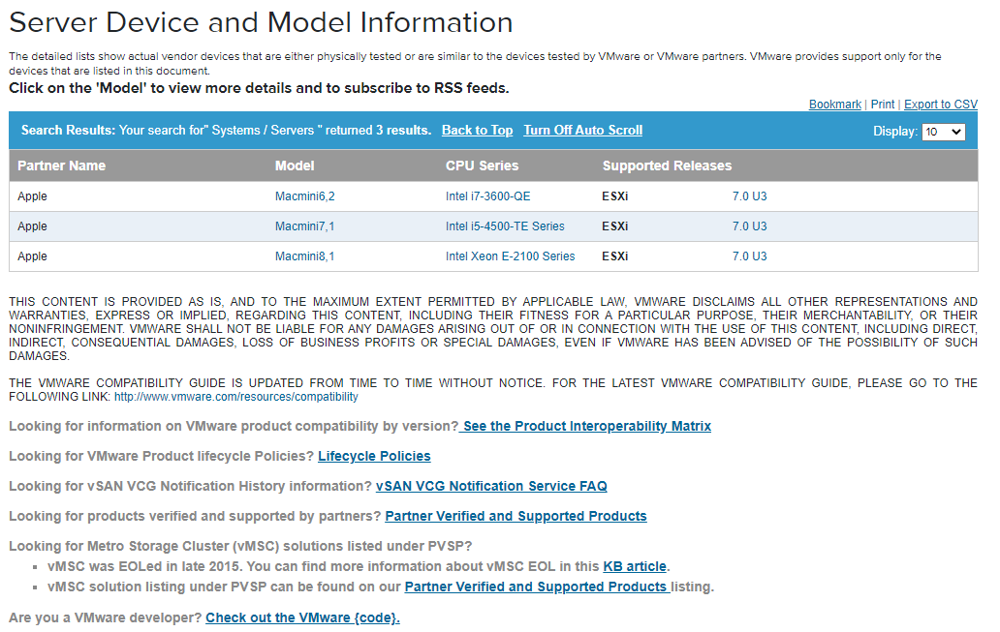
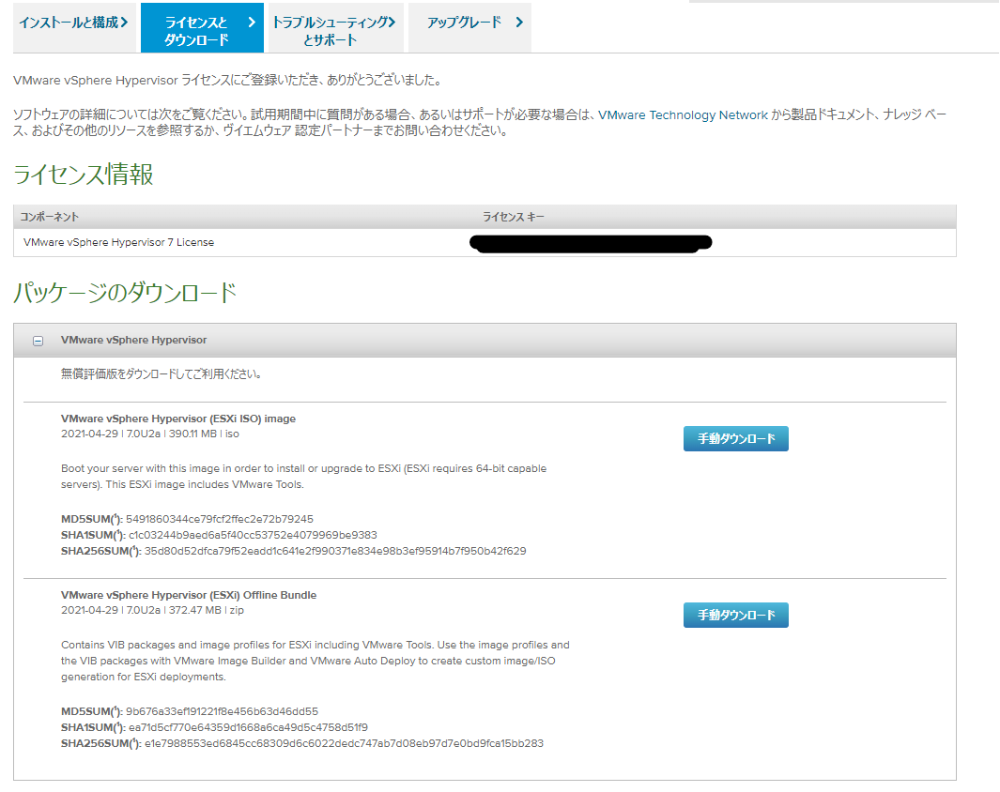

今回は

<!-- omit in toc -->

## もくじ

Mac miniに内臓のSSDにはインストールできないので

参考：[Install ESXi 7.0 on Mac mini 2018 - CodiMD](https://hackmd.mmmn.jp/s/BkixOMvAD)

参考：[vSphere Support for Apple Mac Mini Platform (71142)](https://kb.vmware.com/s/article/71142)

この`Macmini8,1`というのが今回購入した`Mac mini (2018)`です。

ESXiの7.0U3はちゃんと対応しているようです。

参考画像：[VMware Compatibility Guide - System Search](https://www.vmware.com/resources/compatibility/search.php?deviceCategory=server&details=1&partner=269&releases=578&keyword=macmini&page=1&display_interval=10&sortColumn=Partner&sortOrder=Asc)

参考：[Identify your Mac mini model - Apple Support](https://support.apple.com/en-us/HT201894)

## ESXiのインストール

参考：[Download VMware vSphere - VMware Customer Connect](https://customerconnect.vmware.com/en/downloads/info/slug/datacenter_cloud_infrastructure/vmware_vsphere/7_0)

参考：[VMware vSphere Hypervisor の無償ダウンロード](https://customerconnect.vmware.com/jp/web/vmware/evalcenter?p=free-esxi7)

