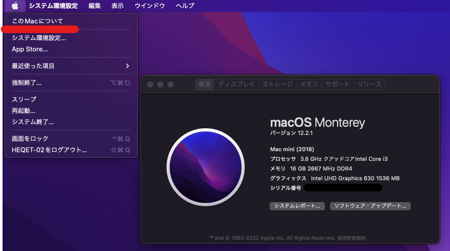
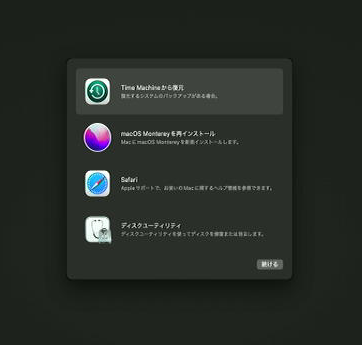
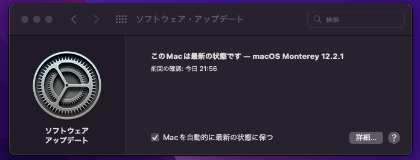
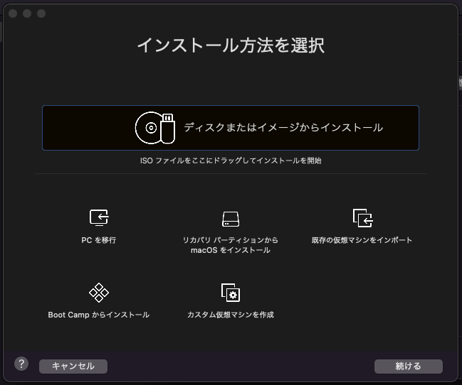
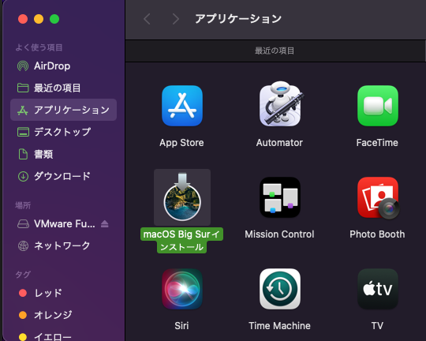
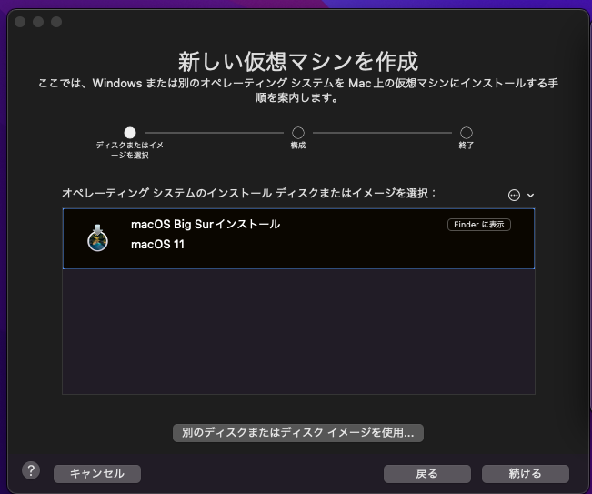
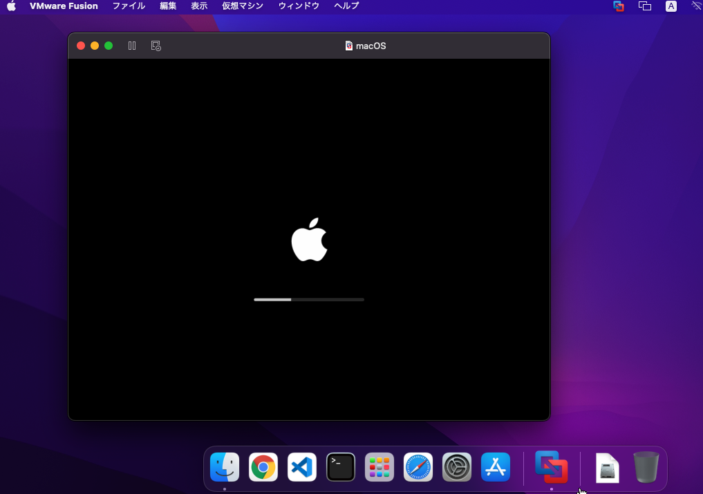

先日初めてのMac端末を手に入れたのでセットアップ手順やつまづいた点について記録しておきます。

今回はMac mini(Late2018)で以下のような環境をセットアップしていきます。

- Mac miniにインストールしたMacOSを現在最新のMonterey 12.2.1にアップグレードする
- VMWare fusion playerをインストールしてMacOS Big Surの仮想マシンを構築する
- LAN上のWindowsマシンからVNCでリモートアクセスできるようにする

初めてのMac機ということで結構手こずった点もあったのでその辺まとめておきます。

<!-- omit in toc -->
## もくじ
- [環境について](#環境について)
- [MacOSをクリーンインストールする](#macosをクリーンインストールする)
- [Mac OSをアップグレードする](#mac-osをアップグレードする)
- [VMWare Fusion Playerをインストールする](#vmware-fusion-playerをインストールする)
  - [仮想マシンのMacOSライセンスについて](#仮想マシンのmacosライセンスについて)
  - [インストール用のOSを取得する](#インストール用のosを取得する)
- [まとめ](#まとめ)

## 環境について

今回購入したMac miniのスペックは以下の通りです。

- Mac mini Late 2018
- Intel core i3 8100B
- 16GB RAM

本当はM1チップ搭載のLate2020が欲しかったのですが、VMWare ESXiがまだM1アーキテクチャをサポートしていなかったためLate2018にしました。

中古で買う予定だったのでLate2014と迷ったのですが、Late2018で一番安いCPUのIntel core i3 8100Bの評価がかなり良く、Late2014のIntel Core i7-4578Uよりもスペックがよさそうだったのでこちらを購入しました。

中古相場についても、Late2018のi3モデルとLate2014のi7モデルではほとんど価格は変わらなかったです。

また、Late2018はLate2014と違ってRAMの拡張もできるという点が最終的に決め手になりました。

## MacOSをクリーンインストールする

PCを購入したらまずはクリーンインストールをするのがお作法です。

MacOSの再インストールは初めてだったので少々戸惑いました。

MacOSの場合は、WindowsやLinuxのようにブートメディアを作成してBIOSからリセットする方法ではなく、Mac端末に内臓されている復旧ユーティリティからインターネットもしくは復旧メディア経由で再インストールを行います。

詳しくは以下のリンクが参考になります。

参考：[macOS を再インストールする方法 - Apple サポート (日本)](https://support.apple.com/ja-jp/HT204904)

Windowsキーボードの場合は[Winキー + R]を押しながらMac mini Late2018の電源を付けることで復旧ユーティリティが起動します。

僕の環境ではディスクユーティリティから既存のパーティションをすべて削除した上でパーティションを再構成し、インターネット経由でMac OSを再インストールしました。

ちなみに、今回は使用しませんでしたが以下のようにインストールメディアからのインストールも可能なようです。

参考：[以前のバージョンの macOS を入手する - Apple サポート (日本)](https://support.apple.com/ja-jp/HT211683)

参考：[macOS の起動可能なインストーラを作成する方法 - Apple サポート (日本)](https://support.apple.com/ja-jp/HT201372)

## Mac OSをアップグレードする

インストールが完了したらAppleIDと連携した後、[システム環境設定]>[ソフトウェア・アップデート]を開き、アップデートを実行します。

しばらく待つとアップグレードが完了します。

## VMWare Fusion Playerをインストールする

VMware Fusionは、MacOS上で実行できるホスト型のハイパーバイザです。

Windowsなどで使えるVMWare Workstationと同様にProとPlayerのエディションが存在し、Fusion Playerは無料での個人利用が可能です。

参考：[VMware Fusion の概要 | FAQ | JP](https://www.vmware.com/jp/products/fusion/faq.html)

Windowsなどで使えるWorkstation Playerの場合は、残念ながら無料ライセンスでは仮想化の最大のメリットともいえるスナップショット機能が使用できません。

しかし、なんとVMware Fusionは個人用の無料ライセンスでもスナップショット機能が使えるのです。

これは素晴らしい。

VMWare Fusionは以下のダウンロードページからダウンロード可能です。

参考：[Download VMware Fusion 12 - VMware Customer Connect](https://customerconnect.vmware.com/downloads/info/slug/desktop_end_user_computing/vmware_fusion/12_0)

インストーラをダウンロードできたら、次に以下のページにVMWareアカウントでログインして個人利用用のライセンスを取得します。

参考：[VMware Fusion Player – Personal Use License](https://customerconnect.vmware.com/web/vmware/evalcenter?p=fusion-player-personal)

VMWareアカウントがない場合はアカウント作成が必要です。

作成できたら「VMware Fusion Player – Personal Use」というライセンスが取得できます。

あとはダウンロードしたインストーラを実行して取得したライセンスを登録すればOKです。

### 仮想マシンのMacOSライセンスについて

仮想マシンを作成する前にMacOSの仮想マシンのライセンスについて確認しておきます。

Appleのライセンスを読むと、MacOSの仮想マシンは、Mac端末上でのみ最大2つのコピーを使用することができると書かれています。

> (iii) to install, use and run up to two (2) additional copies or instances of the Apple Software, or any prior macOS or OS X operating system software or subsequent release of the Apple Software, within virtual operating system environments on each Apple-branded computer you own or control that is already running the Apple Software, for purposes of: (a) software development; (b) testing during software development; (c) using macOS Server; or (d) personal, non-commercial use.

参考：[macOS Monterey License](https://www.apple.com/legal/sla/docs/macOSMonterey.pdf)

MacOSの仮想マシンを構築するのはOKですが、あくまでMac端末上でのみ許可されるという点に注意が必要ですね。

### インストール用のOSを取得する

インストールしたFusion Playerを起動すると、以下のような仮想マシンのセットアップ画面がでてきます。

ここで、「リカバリパーティションからMacOSをインストール」を選択すると、現在使用しているOSと同じバージョンの仮想マシンを簡単に立てることができます。

しかし、今回は検証用のマシンを作成したいので、一つ前のBig Surをインストールしていきます。

そのため、まずはOSイメージを取得します。

OSイメージはApp Storeからダウンロード可能ですが、現行バージョンより古いOSイメージはApp Storeのアプリの検索結果には表示されないため、Webから直接リンクにアクセスする必要があります。

各OSイメージのリンクは、以下の公式ページからアクセスできます。

参考：[以前のバージョンの macOS を入手する - Apple サポート (日本)](https://support.apple.com/ja-jp/HT211683)

このURLからApp Storeを開きOSイメージをダウンロードすると、イメージは「Application」ディレクトリに配置されます。

あとはこのイメージをFusion PlayerのGUIにドラッグ&ドロップすると、以下のように仮想マシンの作成に進むことができます。

細かいハードウェアのカスタマイズは割愛します。

これで、MacOS上で仮想MacOSを動かすことができました。

## まとめ

新しくMac端末を買ったので仮想マシンのセットアップまでやってみました。

本当はESXiを入れたかったのですが、どうやらMac miniの内臓SSDにESXiをインストールすることはできず、Thunderbolt 3で接続した外部SSDにインストールする必要があることがわかったので、今回はFusion Playerで代用しました。

また外部接続用のSSDが手に入ったらESXiの構築にもチャレンジしていこうと思います。