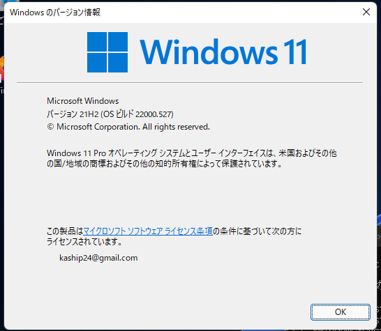
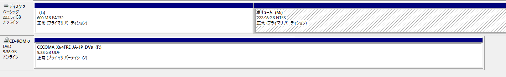
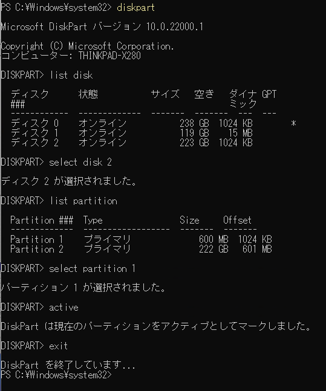
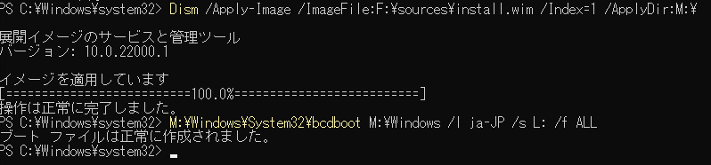

今回は外付けSSDからUSB経由でWindowsを起動可能なブートメディアを作成していきます。

外付けSSDからUSB経由でWindowsを起動可能なブートメディアの作成方法についてググると非常に多くの情報がでてきます。

Windowsマシンでは外付けSSDからのブートは実現できないとか、有料アプリを使えば実現できるとか、Macなら可能とか、ほんとに色々な情報があり混乱しました。

結論から言って、本記事執筆時点で最新のWindows10 21H2のバージョンでも外付けSSDからUSB経由で起動可能なブートメディアを作成することはできます。

以下の記事の手順でブート可能なSSDを作成することができました。

参考：[USBの外付けSSD/HDDからWindows10を起動する方法（無料/手動でWindows to GoをSSD/HDDにインストールする方法） | 西村誠一のパソコン無料サポートとWindowsフリーソフトblog](https://nisimura.org/usb_ssd_windows_install/)

<!-- omit in toc -->
## もくじ
- [USBからブート可能なSSDを作成する](#usbからブート可能なssdを作成する)
  - [インストールするディスクを初期化する](#インストールするディスクを初期化する)
  - [diskparでシステムパーティションを「active」にマークする](#diskparでシステムパーティションをactiveにマークする)
  - [diskparとは](#diskparとは)
- [DISMとBCDBootでISOイメージをディスクに展開する](#dismとbcdbootでisoイメージをディスクに展開する)
  - [DISMとは](#dismとは)
  - [BCDBootでシステムパーティションを作成する](#bcdbootでシステムパーティションを作成する)
- [まとめ](#まとめ)


## USBからブート可能なSSDを作成する

今回実践した手順は、失敗すると最悪の場合PCのストレージのデータがすべて消去されます。

そのため、実施する際は細心の注意を払うとともに、自己責任でお願いいたします。

僕は万が一にもメインPCのデータが飛ぶのは嫌だったので、サブのノートPCでブートメディアを作成しました。

作成した環境はWindows 11 21H2です。



### インストールするディスクを初期化する

Windowsの「ディスクの管理」ツールを使用して、ブートメディアに使用するSSDを以下の2つのボリュームに分割します。

- システムパーティション
  - ドライブレター：L
  - サイズ ：600MB
  - ファイルシステム：FAT32
- ボリュームパーティション
  - ドライブレター：M
  - サイズ：残りの空き領域すべて
  - ファイルシステム：NTFS

ここで初期化するディスクを間違えるとデータが消えてしまうので注意です。

特にCドライブとして使用しているディスクを消さないように注意しましょう。

ついでに今回展開するWindowsのISOファイルもダブルクリックしてマウントしておきましょう。

今回はドライブレター：Fとしてマウントされました。

初期化が完了した結果はこんな感じになります。



ここにブート可能なOSを展開していきます。

### diskparでシステムパーティションを「active」にマークする

通常のWindowsのインストーラを使用してインストールする場合、残念ながらUSB経由で接続したディスクへのインストールはサポートされていません。

そのため、ブート構成を自分で作成する必要があります。

以下のコマンドを管理者権限のPowershellで順に実行していきます。

環境によってディスクやパーティションの番号が異なるのでコピペしないように注意してください。

``` powershell
diskpart
list disk
// ブートメディアに使用するディスクの番号を指定
select disk 2

list partition
// システムパーティション用に600MBで初期化したパーティションの番号を選択
select partition 1

// activeとしてマークして終了
active
exit
```

実行結果はこんな感じになります。



### diskparとは

diskparコマンドインタプリタは、コンピュータ上のドライブを管理するツールです。

今回は、インストール対象のディスクにフォーカスした上でパーティションを列挙し、600MBのサイズで初期化した方のパーティションを「active」としてマークしました。

参考：[diskpart | Microsoft Docs](https://docs.microsoft.com/ja-jp/windows-server/administration/windows-commands/diskpart)

このパーティションを「active」としてマークすることで、BIOSまたはEFIに対してこのパーティションがOSのスタートアップファイルを含むことを通知することができるようになります。

続いて、この領域にOSのスタートアップファイルを配置していきます。

参考：[active | Microsoft Docs](https://docs.microsoft.com/ja-jp/windows-server/administration/windows-commands/active)

## DISMとBCDBootでISOイメージをディスクに展開する

続いて、ISOファイルをSSDに展開していきます。

以下のコマンドを管理者権限のPowershellで実行します。

こちらもドライブレターが僕の環境と異なる場合はコピペしないようにしてください。

完了まで結構時間がかかりました。

``` powershell
Dism /Apply-Image /ImageFile:F:\sources\install.wim /Index=1 /ApplyDir:M:\
M:\Windows\System32\bcdboot M:\Windows /l ja-JP /s L: /f ALL
```

実行結果はこんな感じでした。



### DISMとは

DISMは、イメージの展開と管理を行うことができるツールです。

DISMによってWindowsイメージや仮想ハードディスクが作成されます。

参考：[DISM の概要 | Microsoft Docs](https://docs.microsoft.com/ja-jp/windows-hardware/manufacture/desktop/what-is-dism?view=windows-11)

今回は`Apply-Image`オプションを使用しています。

これは、指定した領域にWindowsイメージを配置するオプションです。

参考：[Expand-WindowsImage (DISM) | Microsoft Docs](https://docs.microsoft.com/ja-jp/powershell/module/dism/expand-windowsimage?view=windowsserver2022-ps)

今回は`ImageFile`オプションの引数にISO内の`\sources\install.wim`を与え、先ほど初期化したディスクのフリー領域に配置しています。

`Index`オプションは1を指定しており、`install.wim`のインデックス1にあるデータを配置することを指定しています。

### BCDBootでシステムパーティションを作成する

最後に`BCDBoot`を実行してシステムパーティションを作成します。

`BCDBoot`の第1引数にはブート環境のソースとして使用するWindowsフォルダを指定します。

今回は先ほどDISMで配置したイメージのWindowsフォルダを指定しています。

`/l`はロケール指定のオプションです。今回は`ja-JP`を指定しています。

`/s <ボリューム文字>`のオプションではシステムパーティションに使用するパーティションのドライブ文字を指定します。

ここでは、システムパーティション用に600MBで初期化したパーティションを指定します。

`/f`オプションはファームウェアの指定です。

今回のように`ALL`を入れておけばBIOSにもUEFIにも対応させることができます。

参考：[BCDBoot のコマンド ライン オプション | Microsoft Docs](https://docs.microsoft.com/ja-jp/windows-hardware/manufacture/desktop/bcdboot-command-line-options-techref-di?view=windows-11)

## まとめ

これでUSBからブート可能なWindowsのディスクを作成することができました。

USB 3.1 Gen2でPCとSSDを接続して起動してみましたが、十分に速度が出ているので、体感的には内臓のM.2にインストールされているOSとそこまで遜色ない使用感です。

今までツール任せにしていたブート構成を手動で作成してみたので結構勉強になりました。
