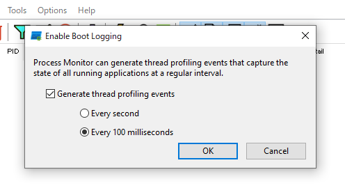
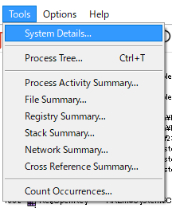
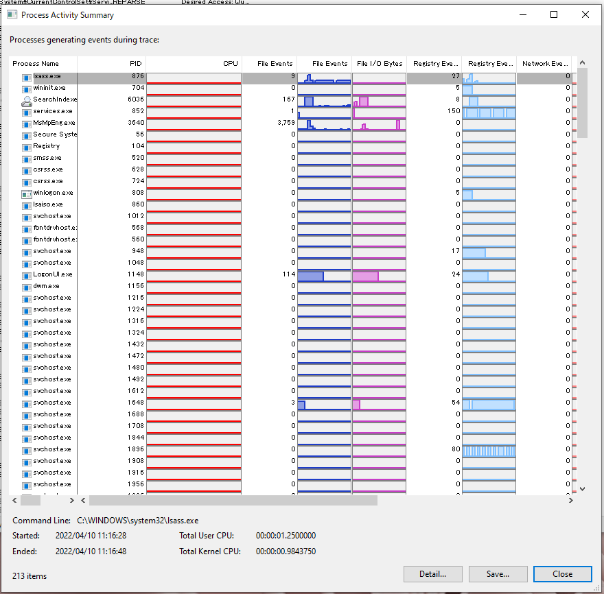
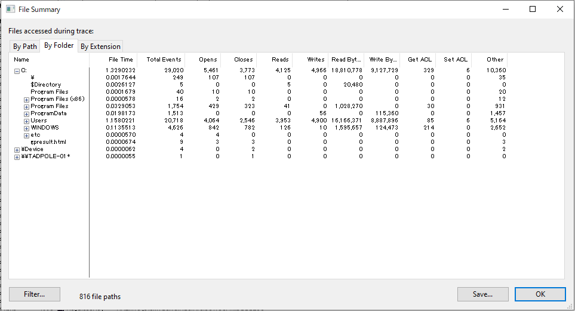
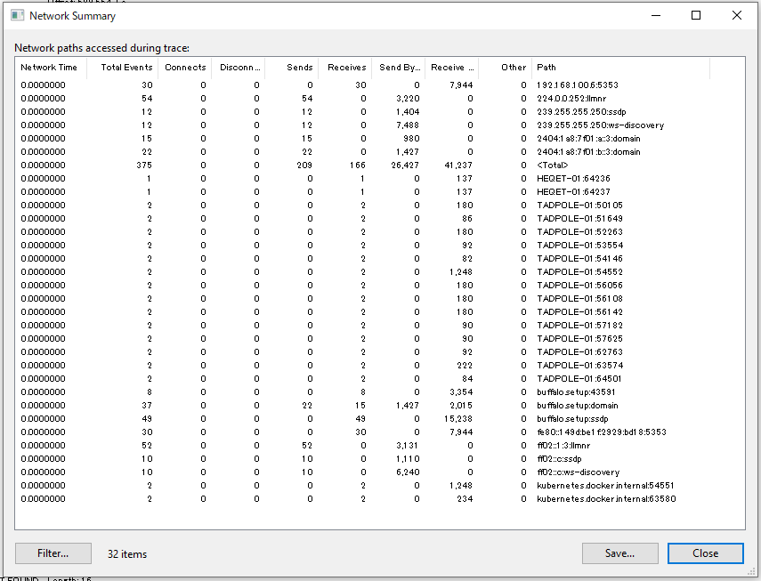
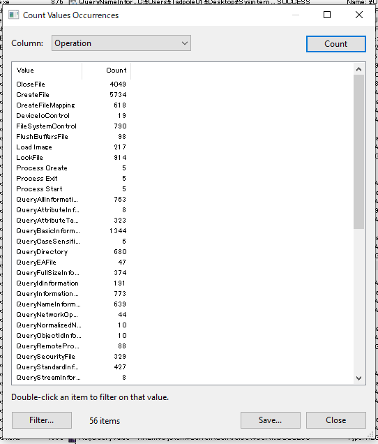
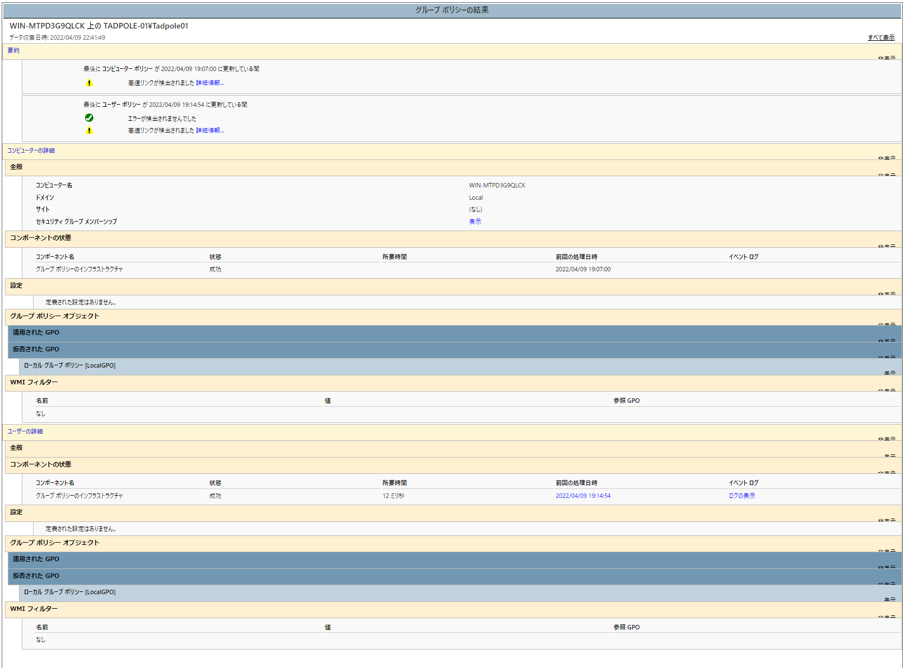
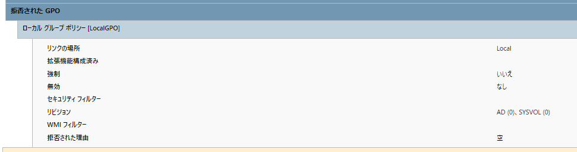
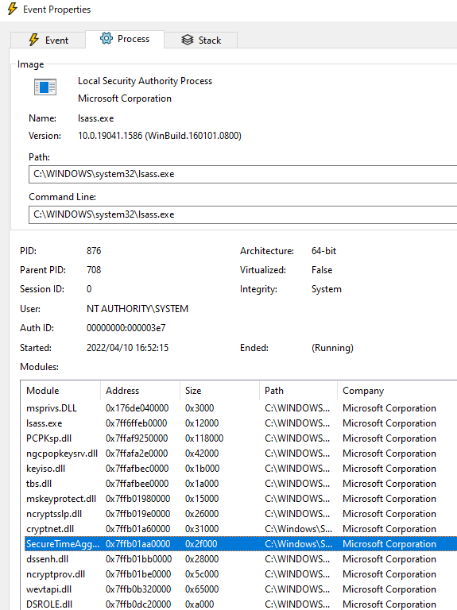

今回は

<!-- omit in toc -->

## もくじ


## ProcmonのTips

Procmonの基本的な使い方については以下記事が分かりやすいです。

参考：[Process Monitor ログの採取手順 | Japan Developer Support Core Team Blog](https://jpdscore.github.io/blog/debugging/collect-procmon/)

### Backing Fileを指定する

プロセスモニターが取得するログは基本オンメモリに保持されます。

しかし、後述するOS起動時のプロセスモニターログの取得や、長時間のログ取得が必要な場合は、`[File] - [Backing Files] `の設定からログの一時保存先のファイルを設定することができます。

### システム起動中のプロセスモニターログを取得する

また、[Options]の設定からシステム起動時のプロセスモニターログを取得することも可能です。

以下の設定で、起動時のログがBacking Fileに記録されます。



この設定は次回の起動時のみに有効になります。

そのため、再度起動時のログを取得したい場合にはその都度設定が必要です。

### 各種統計情報を出力する

Procmonでは、取得したログに関する統計情報を取得できます。



例えば、[Process Activity Summary]を選択すると、以下のように各プロセスのファイルイベントやレジストリイベント、I/Oサイズなどが可視化されます。



[File Summary]ではファイル名、フォルダ、拡張子別に統計されたファイルイベントを参照できます。



[Network Summary]では、通信先別のイベントの統計情報が参照できます。



また、[Count Values Occurrences]を使うと、ファイルパスやOperationなど、各属性ごとの数をカウントすることができます。



この情報から、どの項目がスパイクしているのかを特定することで、問題の原因特定に役立つ場合があります。

## Procmonを使ったトラブルシューティングのTips

### アクセス拒否エラー

操作に失敗する問題の場合は、プロセスモニターログから`Denied Access`となっているイベントを探すと原因に関連する情報を取得できる可能性があります。

例えば何らかの理由でレジストリキーに対して`Denied Access`となっている場合は、Procmonからイベントを右クリックして`Jump To`をクリックすることで直接そのレジストリを参照することができます。

例えば権限の問題でアクセスに失敗している場合には、問題の発生していない正常環境のプロパティから、ユーザやグループ、その権限について比較することで問題箇所が特定できる可能性が高いです。

### ファイルロックエラー

アクセス拒否とは別に、`FILE LOCKED WITH ONLY READERS`のエラーイベントが見つかる場合もあります。

この場合は、他のモジュールによって操作されているかを確認します。

### グループポリシーの調査

レジストリの権限などに不備がない場合は、グループポリシーに問題があるパターンも良くあります。

グループポリシーについて調査する場合は、例えば以下のようなコマンドでレポートを出力すると役に立つ場合があります。

``` powershell
gpresult.exe /h gpresult.html
```

レポートは以下のような出力になります。



この中には例えば、「拒否されたGPO」といった項目も含まれます。



これを参考にすることで、問題解決のための調査がスムーズになる場合もあります。

### ロードされたモジュールの確認

問題の発生したプロセスについて調査する場合、イベントの詳細からロードされたモジュールを確認し、不審なモジュールがロードされていないかを確認することが有効な調査手法の一つになる場合があります。



上記の例のように、読み込まれたモジュールがいずれもMicrosoftのモジュールであることが確認できます。

ここに不審なモジュールが追加されている場合は、詳細を確認してみるとよいと思います。

また、正常な環境で読み込まれるモジュールと比較して問題の原因を調査する際にも役に立ちます。


