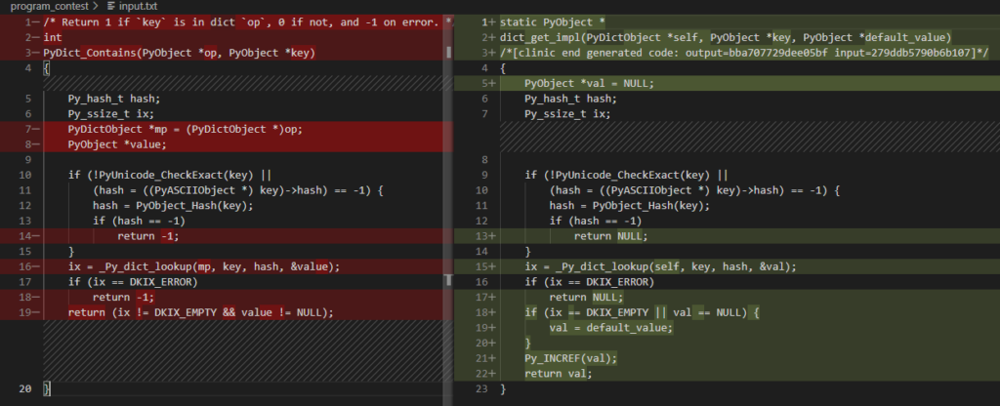

今回は、「Pythonの辞書にKeyが存在するか確かめる in と、配列探索の in が全く違って驚いた」話について書きます。

競技プログラミングなどをやっていると、各メソッドの計算量が気になると思います。

例えばPythonを使う場合、リストの中に値が存在するかを確認するための`Value in List`という構文の計算量はO(N)であるために、非常に時間がかかることはご存知のとおりかと思います。

手元の環境では、次のようなコードの実行時間は600ms程度でした。

``` Python
Arr = [i for i in range(pow(10, 7))]
print(pow(10, 5) in Arr)
```

これは、リスト内包表現で定義した要素数が10^7個の配列Arrに対して、ある値が存在するか否かを一つ一つ確かめる実装になっているためです。

一方で、Pythonの辞書型にも`Key in Dict`という、辞書にキーが存在するかどうかを確認するための記法が存在します。

恥ずかしながら、僕はこの計算量も同じくO(N)で時間がかかるので、キーの存在確認のためには、`Dict.get(Key)`のように、getメソッドを用いた方がいいとずっと思いこんできました。

しかし、Pythonの辞書にKeyが存在するか確かめる in と、配列探索の in は全く異なる実装であり、何なら`Dict.get(Key)`より`Key in Dict`の方が高速に動作するというのを初めて知ったので、こうして記事にまとめることにしました。

<!-- omit in toc -->
## もくじ
- [Key in Dict の実装について](#key-in-dict-の実装について)
- [おまけ：Value in Listの実装について](#おまけvalue-in-listの実装について)
- [まとめ](#まとめ)

## Key in Dict の実装について

まずは、`Key in Dict`の記法で呼び出される関数PyDict_Contains()について見ていきます。

``` python
/* Return 1 if `key` is in dict `op`, 0 if not, and -1 on error. */
int
PyDict_Contains(PyObject *op, PyObject *key)
{
    Py_hash_t hash;
    Py_ssize_t ix;
    PyDictObject *mp = (PyDictObject *)op;
    PyObject *value;

    if (!PyUnicode_CheckExact(key) ||
        (hash = ((PyASCIIObject *) key)->hash) == -1) {
        hash = PyObject_Hash(key);
        if (hash == -1)
            return -1;
    }
    ix = _Py_dict_lookup(mp, key, hash, &value);
    if (ix == DKIX_ERROR)
        return -1;
    return (ix != DKIX_EMPTY && value != NULL);
}
```

参考：[cpython/dictobject.c   python/cpython · GitHub](https://github.com/python/cpython/blob/818628c2da99ba0376313971816d472c65c9a9fc/Objects/dictobject.c)

Pythonの場合は、すべてのオブジェクトは、`PyObject `'型のポインターを介してアクセスされる仕様になっています。
ここで引数として与えられている`PyObject *op`は、検索対象の辞書オブジェクトを指している認識です。

さて、PyDict_Contains関数の処理を見ると、まずハッシュを計算し、そのハッシュを引数とした_Py_dict_lookup関数にて、キーが辞書に存在するかの判定を行っています。
※ _Py_dict_lookup()の処理についてはここでは割愛します。

つまり、リスト型の`Value in List`の構文と異なり、O(N)ではなくO(logN)の対数時間でキーの存在確認を行うことができるというわけです。

では、これまで僕がつかっていた`Dict.get(Key)`の構文はどのような処理を行っているのか確認してみます。

``` Python
static PyObject *
dict_get_impl(PyDictObject *self, PyObject *key, PyObject *default_value)
/*[clinic end generated code: output=bba707729dee05bf input=279ddb5790b6b107]*/
{
    PyObject *val = NULL;
    Py_hash_t hash;
    Py_ssize_t ix;

    if (!PyUnicode_CheckExact(key) ||
        (hash = ((PyASCIIObject *) key)->hash) == -1) {
        hash = PyObject_Hash(key);
        if (hash == -1)
            return NULL;
    }
    ix = _Py_dict_lookup(self, key, hash, &val);
    if (ix == DKIX_ERROR)
        return NULL;
    if (ix == DKIX_EMPTY || val == NULL) {
        val = default_value;
    }
    Py_INCREF(val);
    return val;
}
```

参考：[cpython/dictobject.c   python/cpython · GitHub](https://github.com/python/cpython/blob/818628c2da99ba0376313971816d472c65c9a9fc/Objects/dictobject.c)

なんと、`Key in Dict`の構文を使用した場合に呼び出されるPyDict_Contains関数と、ほとんど実装に差がないことがわかります。

Diffを取ってみると、主な実装の部分にはほとんど差異がないことがわかります。



また、驚いた点としては、`Dict.get(Key)`の構文で呼び出されるdict_get_impl関数の方が、Py_INCREF()というマクロの処理を呼び出しているために、ごくわずかに実行時間が長くなることがわかります。

参考：[参照カウント — Python 3.9.4 ドキュメント](https://docs.python.org/ja/3/c-api/refcounting.html)

実際にPythonの辞書型を使用する競技プログラミングの問題を、`Key in Dict`の構文と`Dict.get(Key)`の構文のそれぞれで実装してみたところ、`Key in Dict`の構文の方が実行時間が数ミリ秒短くなることが確認できました。

## おまけ：Value in Listの実装について

リストの中に値が存在するかを確認するための`Value in List`という構文についても、ついでなので中身を見てみました。

見たまんまではありますが、for文でリストオブジェクトの先頭アドレスから値を比較していくという、O(N)の処理になっています。

``` Python
static int
list_contains(PyListObject *a, PyObject *el)
{
    PyObject *item;
    Py_ssize_t i;
    int cmp;

    for (i = 0, cmp = 0 ; cmp == 0 && i < Py_SIZE(a); ++i) {
        item = PyList_GET_ITEM(a, i);
        Py_INCREF(item);
        cmp = PyObject_RichCompareBool(item, el, Py_EQ);
        Py_DECREF(item);
    }
    return cmp;
}
```

参考：[cpython/listobject.c  python/cpython · GitHub](https://github.com/python/cpython/blob/818628c2da99ba0376313971816d472c65c9a9fc/Objects/listobject.c)

## まとめ

競プロの問題を解いているときに、「せっかく連想配列使ってるのにKeyの探索を in で実装したらTLEになるのでは？？」という疑問からCPythonのソースコードを掘り下げるまでに至りました。

真面目に調べたので備忘録として記事にしてみましたが、CPythonのソースを追ってみたことで言語仕様への理解も深まったので、今後も似たようなことをやっていけたらと考えています。

ちなみに計算量だけを知りたい場合は、[TimeComplexity - Python Wiki](https://wiki.python.org/moin/TimeComplexity)が便利です。