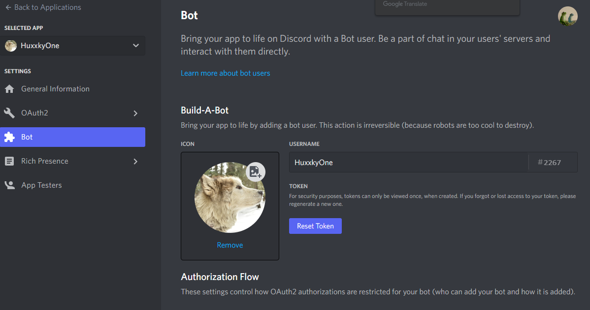
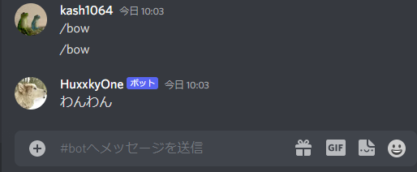

今回は

<!-- omit in toc -->

## もくじ


## Discord Botを作る

今回は[discord.py](https://discordpy.readthedocs.io/en/stable/)を使ってDiscord Botを作ります。

### Discord Tokenの取得

まずは以下のポータルにログインして、[New Application]からBOTを作成します。

参考：[Discord Developer Portal — My Applications](https://discord.com/developers/applications)

次に、BOT PermissionsからBOTに許可するアクションを選択し、Discord Tokenを発行します。



このTokenを使うことで、PythonスクリプトからBOTを操作することができます。

### BOTをテストする

最低限のBOTを動かしてみます。

以下のファイルツリーを使用します。

``` bash
├── discord_app
│   ├── Dockerfile
│   ├── requirements.txt
│   └── src
│       ├── config
│       │   ├── .env
│       │   ├── common_logger.py
│       │   └── environ_config.py
│       └── discord_bot.py
├── docker-compose.yml
```

- Dockerfile

``` Dockerfile
FROM python:3.9
ENV PYTHONUNBUFFERED 1

RUN mkdir -p /app
ENV HOME=/app
WORKDIR $HOME

RUN apt update && apt upgrade -y

ADD requirements.txt $HOME
RUN pip install -r requirements.txt
```

- requirements.txt

``` bash
aiohttp==3.6.3
async-timeout==3.0.1
attrs==21.2.0
certifi==2021.10.8
chardet==3.0.4
charset-normalizer==2.1.0
discord.py==1.7.3
django-environ==0.9.0
feedparser==6.0.10
idna==2.10
multidict==4.7.6
requests==2.28.1
sgmllib3k==1.0.0
urllib3==1.25.11
websockets==8.1
yarl==1.5.1
```

- docker-compose.yml

``` yaml
version: "3"
services:
  discord_app:
    build:
      context: ./discord_app
      dockerfile: Dockerfile
    container_name: discord_app
    volumes:
      - ./discord_app:/app
    tty: true
    stdin_open: true
    command: python src/discord_bot.py
```

- discord_bot.py

``` python
import discord
from config.environ_config import env

# Discord App
DISCORD_TOKEN = env("DISCORD_TOKEN")
client = discord.Client()

@client.event
async def on_ready():
    print("Bot is loggin")

@client.event
async def on_message(message):
    if message.author.bot:
        return

    if message.content == "/bow":
        await message.channel.send("わんわん")
```

- environ_config.py

``` python
import environ

env = environ.Env()
environ.Env.read_env()
```

- .env

``` bash
DISCORD_TOKEN=<コピーしたToken>
```

この構成で以下のコマンドを実行することで、BOTがDiscordにログインして操作を行うことができるようになります。

``` bash
$ docker-compose build
$ docker-compose up
```

実際に動かしてみました。



結構簡単ですね。