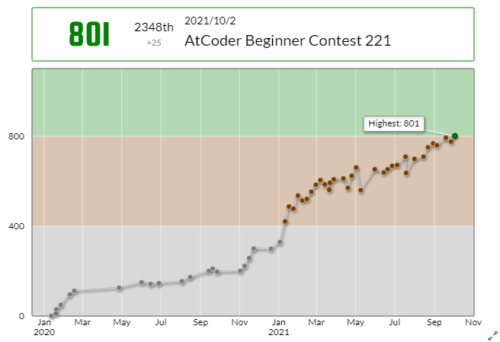

今日で2021年も終わりということで、下半期の活動を雑に振り返りつつ来年の抱負を書いていこうと思います。

[上半期の振り返り](/reports-20210531)はこちら(なぜか5/31に書いたやつ)。

<!-- omit in toc -->
## もくじ
- [2021年の目標](#2021年の目標)
  - [達成したこと](#達成したこと)
  - [達成していないこと](#達成していないこと)
  - [やってないこと](#やってないこと)
- [2022年の抱負](#2022年の抱負)
- [まとめ](#まとめ)

## 2021年の目標

振り返りですが、2021年1月1日に自分の中で設定していた今年の目標はこんな感じでした。

```bash
・自作ラズパイOSの開発
・CTFのReversing問解けるようになる
・AtCoder 水色になる
・HackTheBox ProHacker
・ブログまじめに更新する
・技術同人誌書く
・OSS コミット
・CISSP / PenTest+ 取得
・Azure 上位資格取得
・Rust と C をもうちょっと書けるようになる
```

5/31の振り返り時点で特に注力したいと思っていたことはこちら。

``` bash
・AtCoder 水色になる
・Rev/Crypto/Pwnを解けるようになる
・TOEIC受ける
・バグハンティング
```

改めて見てみると全然やってないですね！

### 達成したこと

以下の目標については上半期の時点で達成していました。

``` bash
・HackTheBox ProHacker
・ブログまじめに更新する
・技術同人誌書く
・OSS コミット
```

アップデートとしては、技術書典で頒布していたYARA本をインプレスR&amp;D技術の泉シリーズから、
「<a style="color: #66c5a2;" href="https://amzn.to/3wm3i5D" target="_blank" rel="noopener">やわらかYARA入門</a>」として11/5に出版しました。

Amazon等々で購入できます。

OSSのコミットはYARA本書いてからは全然やっていないので、2022年はまた何かのリポジトリに継続してコントリビューションしていきたいですね。

あとは、水色の目標達成には至りませんでしたが、10/2にAtCoderで入緑しました。

入緑以降はCTFばっかりやっててコンテスト出ていないので実質引退した感じになってます。



競プロをやってたことは基本的なアルゴリズムやデータ構造を学ぶ上で結構役に立ちました。

あとは某コンテストにCTFの問題提供をしたり、AWSのSAAを取得したり、WinDbgの検証記事を書いたり毎週コンテストに参加してWriteupを書いたりと精力的に活動してました。

### 達成していないこと

Rev問については初心者向けのCTFなら安定して全完できるくらいにはなりました。

ただ、SECCONは0完でしたし、野良CTFなどでも高難度の問題は解けないことが多いので今後も精進していこうと思います。

来年の主な目標はリバースエンジニアリングになりそうです。

### やってないこと

TOEICとバグハンティングについてはモチベ不足でそもそも取り組んでませんでした。

英語の技術書なども今年はぼちぼち読んでるのですが、1ページ読むのに大変に時間がかかるので、2022年こそはちゃんと英語の勉強もしようと思ってます。

バグハンティングは、CTFやリバースエンジニアリングやるついでに面白そうなネタがあれば取り組んでみようと考えています。

あとCISSPも過去問をちょろっとやってただけで全然進めてないです。

ちょうど最近同僚がCISSP取得して焦ってるので2022年は頑張って取ろうかと思ってます。

## 2022年の抱負

2022年は新しい仕事をすることになりそうなので、それによってがっつり方向転換しそうですが、以下のことを目標にしようと考えてます。

``` bash
・SECCON本戦レベルのRev問を解けるようになる
・WinDbgもしくはリバースエンジニアリング関連で技術書を書く
・Windowsプログラミング(カーネルドライバ/WinAPI)
・CISSP/TOEICスコア800点の取得
・Pwn/Cryptoの勉強
・OSS開発/コントリビューション
```

1つ1つが結構重いので目標としては少ないですが、これらを達成できるように頑張っていこうと思います。

リバースエンジニアリングについては最近停滞感があるので誰か強い師匠（的な存在）を探してみようかなと思ってます。

OSS活動はYARAのコントリビューションを続けたり、Ghidraの拡張機能の自作などに手を出してみたいなと考えています。

また、CTFは2021年の10月ごろに作った精進用チームの[0neP@dding](https://ctftime.org/team/168239)で毎週適当なコンテストに参加してWriteupを書くという活動をしてるので、2022年も継続していく予定です。

[0neP@dding](https://ctftime.org/team/168239)は現在メインメンバー2人とゲストメンバー1人で活動していて、特にPwnとCrypto担当募集してるので興味あればご連絡ください笑

あとは目標としては挙げてないですが、ハニーポット運用やマルウェア解析、バグハンティングなどにも強い関心があるので引き続き取り組んでいきたいと思ってます。

## まとめ

かなりざっくりですが2021年の振り返りと2022年の抱負を書きました。

2022年は結構生活面で大きな変化があり忙しくなりそうではありますが、引き続き精進を続けていきたいと思います。

IT技術者になって4年目の年になるので、そろそろ社会的貢献度の大きい活動などもやっていきたい所存…。