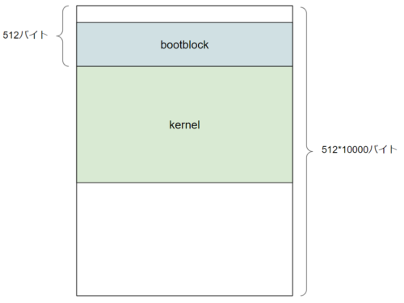

[はじめてのOSコードリーディング ~UNIX V6で学ぶカーネルのしくみ](https://amzn.to/3q8TU3K)にインスパイアされて[xv6 OS](https://github.com/mit-pdos/xv6-public)を読んでます。

リバースエンジニアリングに強くなりたいのと、カーネルとかOSに詳しくなりたいと思っています。

[詳解 Linuxカーネル](https://amzn.to/3I6fkVt)が結構重かったので、もう少し軽めのところから始めたいと思っていたところ、UNIX V6というOSがトータルで1万行くらいのコード量で、人類でもギリギリ理解できるということを知り、興味を持ちました。

ただ、UNIX V6自体はx86CPUでは動作しないため、基本的には、UNIXv6をX86アーキテクチャで動くようにした[xv6 OS](https://github.com/mit-pdos/xv6-public)のリポジトリをForkした[kash1064/xv6-public: xv6 OS](https://github.com/kash1064/xv6-public)のソースコードを読んでいくことにしました。

xv6は、もともとMITのOSの講義のために開発された教育用のOSです。

参考：[Xv6, a simple Unix-like teaching operating system](https://pdos.csail.mit.edu/6.828/2012/xv6.html)

この講義で使用するテキストもオンラインで配布されています。

参考：[xv6 a simple, Unix-like teaching operating system](https://pdos.csail.mit.edu/6.828/2012/xv6/book-rev7.pdf)

Fork元のリポジトリは現在メンテナンスされておらず、RISC-Vで動作するUNIXv6のメンテナンスが行われています。

<!-- omit in toc -->
## もくじ
- [イメージファイルの構造](#イメージファイルの構造)
  - [xv6.img](#xv6img)
  - [fs.img](#fsimg)
- [bootblockを読む](#bootblockを読む)
  - [コンパイラ](#コンパイラ)
  - [メモ：位置独立なコード(PIC)](#メモ位置独立なコードpic)
  - [bootmain.cの全体像](#bootmaincの全体像)
  - [bootblock.oの全体像](#bootblockoの全体像)
  - [ブートプログラムのリンク](#ブートプログラムのリンク)
  - [リアルモードとプロテクトモード](#リアルモードとプロテクトモード)
  - [リアルモードで起動する](#リアルモードで起動する)
  - [cliとstiでCPU割込みを禁止](#cliとstiでcpu割込みを禁止)
  - [セグメントレジスタの初期化](#セグメントレジスタの初期化)
  - [A20 Lineの有効化](#a20-lineの有効化)
  - [プロテクトモードへの移行](#プロテクトモードへの移行)
  - [プロテクトモードでのメモリアドレス参照](#プロテクトモードでのメモリアドレス参照)
  - [lgdt gdtdesc](#lgdt-gdtdesc)
  - [32bitモードの開始](#32bitモードの開始)
  - [なぜljmp命令を使用するのか](#なぜljmp命令を使用するのか)
  - [プロテクトモード移行後の設定](#プロテクトモード移行後の設定)
  - [セグメントレジスタの初期化](#セグメントレジスタの初期化-1)
  - [bootmain.cの呼び出し](#bootmaincの呼び出し)
  - [カーネルのロード](#カーネルのロード)
  - [ディスクからELFカーネルイメージをロードする](#ディスクからelfカーネルイメージをロードする)
  - [ディスクからセクタを読み取る](#ディスクからセクタを読み取る)
  - [読み込んだカーネルの確認](#読み込んだカーネルの確認)
  - [プログラムヘッダの読み込み](#プログラムヘッダの読み込み)
- [まとめ](#まとめ)
- [参考書籍](#参考書籍)

## イメージファイルの構造

xv6は、`xv6.img`と`fs.img`という2つのイメージファイルを使用して起動します。

### xv6.img

`xv6.img`は、以下のような構造です。

``` bash
# Makefile
xv6.img: bootblock kernel
	dd if=/dev/zero of=xv6.img count=10000
	dd if=bootblock of=xv6.img conv=notrunc
	dd if=kernel of=xv6.img seek=1 conv=notrunc
```

`dd if=/dev/zero of=xv6.img count=10000`は、`512*10^4`バイト(51.2MBバイト)を`/dev/zero`から読みだして`xv6.img`として保存します。

ddコマンドのブロックサイズ(`bs`)はデフォルトで512であるため、このような挙動になります。

`conv=notrunc`は、元のファイルのサイズを維持したまま、指定したバイナリの書き込みを行うオプションです。

これによって、512バイトのbootblock が、`xv6.img`の先頭から書き込まれた際に、元の`xv6.img`のサイズが維持されます。

`seek=1`は、ブロック単位で書き込み開始位置をスキップするオプションです。

ブロックサイズはデフォルトでは512であるため、`dd if=kernel of=xv6.img seek=1 conv=notrunc`は、先頭512バイト目からkernelを配置することを意味しています。

これらのコマンドを見てわかる通り、`512*10^4`バイト(51.2MBバイト)の空のイメージファイルを生成した後、先頭512バイトにbootblockを配置し、さらにその後にkernelを配置しています。


空になったままのスペースはシステムが使用します。

### fs.img

`fs.img`は以下のような構造です。

``` bash
# Makefile
UPROGS=\
	_cat\
	_echo\
	_forktest\
	_grep\
	_init\
	_kill\
	_ln\
	_ls\
	_mkdir\
	_rm\
	_sh\
	_stressfs\
	_usertests\
	_wc\
	_zombie\

mkfs: mkfs.c fs.h
	gcc -Werror -Wall -o mkfs mkfs.c

fs.img: mkfs README $(UPROGS)
	./mkfs fs.img README $(UPROGS)
```

各種コマンドプログラムの本体やREADMEが格納されています。

ユーザが操作するディスクです。

## bootblockを読む

まずはbootblockについてです。

``` bash
bootblock: bootasm.S bootmain.c
	$(CC) $(CFLAGS) -fno-pic -O -nostdinc -I. -c bootmain.c
	$(CC) $(CFLAGS) -fno-pic -nostdinc -I. -c bootasm.S
	$(LD) $(LDFLAGS) -N -e start -Ttext 0x7C00 -o bootblock.o bootasm.o bootmain.o
	$(OBJDUMP) -S bootblock.o > bootblock.asm
	$(OBJCOPY) -S -O binary -j .text bootblock.o bootblock
	./sign.pl bootblock
```

ビルドオプションから見ていきます。

### コンパイラ

以下は、Makefileの中の`$(CC)`に関連した箇所です。

``` bash
# Cross-compiling (e.g., on Mac OS X)
# TOOLPREFIX = i386-jos-elf

# Using native tools (e.g., on X86 Linux)
#TOOLPREFIX = 

# Try to infer the correct TOOLPREFIX if not set
ifndef TOOLPREFIX
TOOLPREFIX := $(shell if i386-jos-elf-objdump -i 2>&1 | grep '^elf32-i386$$' >/dev/null 2>&1; \
	then echo 'i386-jos-elf-'; \
	elif objdump -i 2>&1 | grep 'elf32-i386' >/dev/null 2>&1; \
	then echo ''; \
	else echo "***" 1>&2; \
	echo "*** Error: Couldn't find an i386-*-elf version of GCC/binutils." 1>&2; \
	echo "*** Is the directory with i386-jos-elf-gcc in your PATH?" 1>&2; \
	echo "*** If your i386-*-elf toolchain is installed with a command" 1>&2; \
	echo "*** prefix other than 'i386-jos-elf-', set your TOOLPREFIX" 1>&2; \
	echo "*** environment variable to that prefix and run 'make' again." 1>&2; \
	echo "*** To turn off this error, run 'gmake TOOLPREFIX= ...'." 1>&2; \
	echo "***" 1>&2; exit 1; fi)
endif

CC = $(TOOLPREFIX)gcc
```

デフォルトでは`gcc`を使ってコンパイルします。

もしLinuxではなくMacOSなどの環境でビルドする場合は、`TOOLPREFIX`の設定を変更してクロスコンパイルする必要があります。

参考：[OS X Yosemiteでxv6をbuildして動かすまで - Qiita](https://qiita.com/maru-n@github/items/9cf83944403b3fbb8422)

続いて、以下は`CFLAGS`の箇所です。

``` bash
CFLAGS = -fno-pic -static -fno-builtin -fno-strict-aliasing -O2 -Wall -MD -ggdb -m32 -Werror -fno-omit-frame-pointer
CFLAGS += $(shell $(CC) -fno-stack-protector -E -x c /dev/null >/dev/null 2>&1 && echo -fno-stack-protector)
```

オプションの部分については割愛しますが、デフォルトの設定を追っていきます。

参考：[Man page of GCC](https://linuxjm.osdn.jp/html/GNU_gcc/man1/gcc.1.html)

|       オプション        |                             用途                             |
| :---------------------: | :----------------------------------------------------------: |
|        -fno-pic         |              位置独立なコード(PIC)を生成しない               |
|         -static         |            プログラムを静的リンクでコンパイルする            |
|      -fno-builtin       |    コンパイラに組み込まれているビルドイン関数を利用しない    |
|  -fno-strict-aliasing   |                 厳密なエイリアシングの無効化                 |
|           -O2           |      サポートされているすべての最適化オプションを有効化      |
|          -Wall          |          すべてのコンパイラの警告メッセージを有効化          |
|           -MD           | システムヘッダーファイルとユーザーヘッダーファイルの両方を一覧 |
|          -ggdb          |              gdbを対象としたデバッグ情報を生成               |
|          -m32           |              32bitオブジェクトとしてコンパイル               |
|         -Werror         |     未使用の関数引数があった場合、コンパイルエラーとする     |
| -fno-omit-frame-pointer | フレームポインタを必要としない関数のレジスタにもフレームポインタを保持する |

### メモ：位置独立なコード(PIC)

位置独立なコード(PIC)または位置独立実行形式(PIE)とは、メモリのどこに配置されても正しく実行できる機械語を指します。

PICは主に共有ライブラリなどに利用されます。

参考：[Position Independent Code (PIC) in shared libraries - Eli Bendersky's website](https://eli.thegreenplace.net/2011/11/03/position-independent-code-pic-in-shared-libraries/)

参考：[Linux の共有ライブラリを作るとき PIC でコンパイルするのはなぜか - bkブログ](http://0xcc.net/blog/archives/000107.html)

### bootmain.cの全体像

xv6のビルドを行う際、まず初めに以下の`bootmain.o`から、`bootmain.o`が生成されます。

``` c
// Boot loader.
//
// Part of the boot block, along with bootasm.S, which calls bootmain().
// bootasm.S has put the processor into protected 32-bit mode.
// bootmain() loads an ELF kernel image from the disk starting at
// sector 1 and then jumps to the kernel entry routine.

#include "types.h"
#include "elf.h"
#include "x86.h"
#include "memlayout.h"

#define SECTSIZE  512

void readseg(uchar*, uint, uint);

void
bootmain(void)
{
  struct elfhdr *elf;
  struct proghdr *ph, *eph;
  void (*entry)(void);
  uchar* pa;

  elf = (struct elfhdr*)0x10000;  // scratch space

  // Read 1st page off disk
  readseg((uchar*)elf, 4096, 0);

  // Is this an ELF executable?
  if(elf->magic != ELF_MAGIC)
    return;  // let bootasm.S handle error

  // Load each program segment (ignores ph flags).
  ph = (struct proghdr*)((uchar*)elf + elf->phoff);
  eph = ph + elf->phnum;
  for(; ph < eph; ph++){
    pa = (uchar*)ph->paddr;
    readseg(pa, ph->filesz, ph->off);
    if(ph->memsz > ph->filesz)
      stosb(pa + ph->filesz, 0, ph->memsz - ph->filesz);
  }

  // Call the entry point from the ELF header.
  // Does not return!
  entry = (void(*)(void))(elf->entry);
  entry();
}

void
waitdisk(void)
{
  // Wait for disk ready.
  while((inb(0x1F7) & 0xC0) != 0x40)
    ;
}

// Read a single sector at offset into dst.
void
readsect(void *dst, uint offset)
{
  // Issue command.
  waitdisk();
  outb(0x1F2, 1);   // count = 1
  outb(0x1F3, offset);
  outb(0x1F4, offset >> 8);
  outb(0x1F5, offset >> 16);
  outb(0x1F6, (offset >> 24) | 0xE0);
  outb(0x1F7, 0x20);  // cmd 0x20 - read sectors

  // Read data.
  waitdisk();
  insl(0x1F0, dst, SECTSIZE/4);
}

// Read 'count' bytes at 'offset' from kernel into physical address 'pa'.
// Might copy more than asked.
void
readseg(uchar* pa, uint count, uint offset)
{
  uchar* epa;

  epa = pa + count;

  // Round down to sector boundary.
  pa -= offset % SECTSIZE;

  // Translate from bytes to sectors; kernel starts at sector 1.
  offset = (offset / SECTSIZE) + 1;

  // If this is too slow, we could read lots of sectors at a time.
  // We'd write more to memory than asked, but it doesn't matter --
  // we load in increasing order.
  for(; pa < epa; pa += SECTSIZE, offset++)
    readsect(pa, offset);
}
```

定義されている関数は以下の4つです。

- void bootmain(void)
- void waitdisk(void)
- void readsect(void *dst, uint offset)
- void readsect(void *dst, uint offset)

各関数の挙動については後で追っていきます。

### bootblock.oの全体像

続いて、`bootasm.S`から`bootasm.o`が生成され、先ほど生成した`bootmain.o`とリンクされて`bootblock.o`が生成されます。

以下は`bootasm.S`です。

``` asm
#include "asm.h"
#include "memlayout.h"
#include "mmu.h"

# Start the first CPU: switch to 32-bit protected mode, jump into C.
# The BIOS loads this code from the first sector of the hard disk into
# memory at physical address 0x7c00 and starts executing in real mode
# with %cs=0 %ip=7c00.

.code16                       # Assemble for 16-bit mode
.globl start
start:
  cli                         # BIOS enabled interrupts; disable

  # Zero data segment registers DS, ES, and SS.
  xorw    %ax,%ax             # Set %ax to zero
  movw    %ax,%ds             # -> Data Segment
  movw    %ax,%es             # -> Extra Segment
  movw    %ax,%ss             # -> Stack Segment

  # Physical address line A20 is tied to zero so that the first PCs 
  # with 2 MB would run software that assumed 1 MB.  Undo that.
seta20.1:
  inb     $0x64,%al               # Wait for not busy
  testb   $0x2,%al
  jnz     seta20.1

  movb    $0xd1,%al               # 0xd1 -> port 0x64
  outb    %al,$0x64

seta20.2:
  inb     $0x64,%al               # Wait for not busy
  testb   $0x2,%al
  jnz     seta20.2

  movb    $0xdf,%al               # 0xdf -> port 0x60
  outb    %al,$0x60

  # Switch from real to protected mode.  Use a bootstrap GDT that makes
  # virtual addresses map directly to physical addresses so that the
  # effective memory map doesn't change during the transition.
  lgdt    gdtdesc
  movl    %cr0, %eax
  orl     $CR0_PE, %eax
  movl    %eax, %cr0

//PAGEBREAK!
  # Complete the transition to 32-bit protected mode by using a long jmp
  # to reload %cs and %eip.  The segment descriptors are set up with no
  # translation, so that the mapping is still the identity mapping.
  ljmp    $(SEG_KCODE<<3), $start32

.code32  # Tell assembler to generate 32-bit code now.
start32:
  # Set up the protected-mode data segment registers
  movw    $(SEG_KDATA<<3), %ax    # Our data segment selector
  movw    %ax, %ds                # -> DS: Data Segment
  movw    %ax, %es                # -> ES: Extra Segment
  movw    %ax, %ss                # -> SS: Stack Segment
  movw    $0, %ax                 # Zero segments not ready for use
  movw    %ax, %fs                # -> FS
  movw    %ax, %gs                # -> GS

  # Set up the stack pointer and call into C.
  movl    $start, %esp
  call    bootmain

  # If bootmain returns (it shouldn't), trigger a Bochs
  # breakpoint if running under Bochs, then loop.
  movw    $0x8a00, %ax            # 0x8a00 -> port 0x8a00
  movw    %ax, %dx
  outw    %ax, %dx
  movw    $0x8ae0, %ax            # 0x8ae0 -> port 0x8a00
  outw    %ax, %dx
spin:
  jmp     spin

# Bootstrap GDT
.p2align 2                                # force 4 byte alignment
gdt:
  SEG_NULLASM                             # null seg
  SEG_ASM(STA_X|STA_R, 0x0, 0xffffffff)   # code seg
  SEG_ASM(STA_W, 0x0, 0xffffffff)         # data seg

gdtdesc:
  .word   (gdtdesc - gdt - 1)             # sizeof(gdt) - 1
  .long   gdt                             # address gdt
```

中身を見る前に、ブートプログラムのリンクについて見てみます。

### ブートプログラムのリンク

リンクは以下のコマンドで実行します。

``` bash
ld -m elf_i386 -N -e start -Ttext 0x7C00 -o bootblock.o bootasm.o bootmain.o
```

`ld`コマンドは、複数のバイナリを結合し、新たな実行プログラムをコンパイルすることができるコマンドです。

参考：[ld - コマンド (プログラム) の説明 - Linux コマンド集 一覧表](https://kazmax.zpp.jp/cmd/l/ld.1.html)

上記のコマンドでは、`elf_i386`バイナリとしてリンクされます。

参考：[x86 - GNU Linker differences between the different 32bit emulation modes? - Unix & Linux Stack Exchange](https://unix.stackexchange.com/questions/471056/gnu-linker-differences-between-the-different-32bit-emulation-modes?rq=1)

`-N`オプションによってtextセクションとdataセクションは読み書き可能となり、`start`シンボルがエントリポイントとして扱われます。

また、エントリポイントの開始アドレスは`0x7C00`に定義されます。

これは、x86CPUの場合は、起動時にBIOSのPOST(Power On Self Test)が実行された後、MBRからブートプログラムを読み込んで`0x7C00`に展開し、ブートセクタとします。

なぜこの位置に展開されるのかについては、以下の神記事に非常に詳しく書いてありました。

参考：[Assembler/なぜx86ではMBRが"0x7C00"にロードされるのか？(完全版) - Glamenv-Septzen.net](https://www.glamenv-septzen.net/view/614)

簡単にまとめると、ROM BIOSの必要とする最小メモリである32KBを開けておきたいというニーズと、0x0から0x3FFまでの範囲は割込みベクタとして予約されているため、結果としてブートセクタを32KBの末尾に置くことにしたとのことです。

そのため、ブートセクタの領域512Bと、MBRのbootstrap用のデータ/スタック領域として512Bを確保した結果、`0x7C00(32KB - 1024B) `がブートセクタの先頭アドレスになったそうです。

このあたりは過去に読んだ自作OS本にはあまり詳しく書いていなかった(気がする)のでとても参考になりました。

これでブートプログラムが出来上がったので、まずは中身を見ていこうと思います。

### リアルモードとプロテクトモード

`x86CPU`では、起動時に`Intel 8086`とソフトウェア互換のある「リアルモード」で起動します。

`Intel 8086`は16bitです。

そのため、リアルモードは16bitで動作する状態になります。

参考：[Intel 8086 - Wikipedia](https://en.wikipedia.org/wiki/Intel_8086)

ここから、32bitに移行するための処理を追っていきます。

リアルモードで動作する処理は以下の部分です。

``` assembly
#include "asm.h"
#include "memlayout.h"
#include "mmu.h"

# Start the first CPU: switch to 32-bit protected mode, jump into C.
# The BIOS loads this code from the first sector of the hard disk into
# memory at physical address 0x7c00 and starts executing in real mode
# with %cs=0 %ip=7c00.

.code16                       # Assemble for 16-bit mode
.globl start
start:
  cli                         # BIOS enabled interrupts; disable

  # Zero data segment registers DS, ES, and SS.
  xorw    %ax,%ax             # Set %ax to zero
  movw    %ax,%ds             # -> Data Segment
  movw    %ax,%es             # -> Extra Segment
  movw    %ax,%ss             # -> Stack Segment

  # Physical address line A20 is tied to zero so that the first PCs 
  # with 2 MB would run software that assumed 1 MB.  Undo that.
seta20.1:
  inb     $0x64,%al               # Wait for not busy
  testb   $0x2,%al
  jnz     seta20.1

  movb    $0xd1,%al               # 0xd1 -> port 0x64
  outb    %al,$0x64

seta20.2:
  inb     $0x64,%al               # Wait for not busy
  testb   $0x2,%al
  jnz     seta20.2

  movb    $0xdf,%al               # 0xdf -> port 0x60
  outb    %al,$0x60

  # Switch from real to protected mode.  Use a bootstrap GDT that makes
  # virtual addresses map directly to physical addresses so that the
  # effective memory map doesn't change during the transition.
  lgdt    gdtdesc
  movl    %cr0, %eax
  orl     $CR0_PE, %eax
  movl    %eax, %cr0

//PAGEBREAK!
  # Complete the transition to 32-bit protected mode by using a long jmp
  # to reload %cs and %eip.  The segment descriptors are set up with no
  # translation, so that the mapping is still the identity mapping.
  ljmp    $(SEG_KCODE<<3), $start32

.code32  # Tell assembler to generate 32-bit code now.
start32:
{{ 省略 }}
```

### リアルモードで起動する

以下では、`.code16`を先頭に書くことで、コードが16bitで実行される想定となるようにアセンブラに指示をしています。

`start`セクションは、先ほどエントリポイントとしてリンクされたシンボルです。

``` assembly
.code16                       # Assemble for 16-bit mode
.globl start
start:
  cli                         # BIOS enabled interrupts; disable

  # Zero data segment registers DS, ES, and SS.
  xorw    %ax,%ax             # Set %ax to zero
  movw    %ax,%ds             # -> Data Segment
  movw    %ax,%es             # -> Extra Segment
  movw    %ax,%ss             # -> Stack Segment
```

参考：[Objdump of .code16 and .code32 x86 assembly - Stack Overflow](https://stackoverflow.com/questions/32395542/objdump-of-code16-and-code32-x86-assembly)

### cliとstiでCPU割込みを禁止

`cli`は、CPUの割込みを禁止する命令です。

`cli`が呼び出されてから、`sti`命令が呼び出されるまでの区間の処理は、CPUの割込みが禁止されます。(正確にはCPUからの割込み要求は発生するが無視される)

参考：[CLI : Clear Interrupt Flag (x86 Instruction Set Reference)](https://c9x.me/x86/html/file_module_x86_id_31.html)

これは、BIOSに設定された割込みが有効化されたままだと、ブートプログラムの処理が正しく動作しなくなるためです。

そのため、ブートプログラム側でスタックポインタや割込み設定を行っている間は、割込みを無効化しておく必要があります。

### セグメントレジスタの初期化

次の4行では、AXレジスタ、DSレジスタ、ESレジスタ、SSレジスタをそれぞれ`0x0000`に初期化しています。

AXレジスタはアキュムレータですが、他の3つのレジスタはセグメントレジスタです。

参考：[Intel 8086 - Wikipedia](https://en.wikipedia.org/wiki/Intel_8086)

参考：[Intel 8086 CPU 基礎 - Qiita](https://qiita.com/timwata/items/e7b7a18cc80b31fd940a)

ここでは、BIOSに設定されたセグメントレジスタの値を初期化しています。

一応各セグメントレジスタの用途について簡単に書いておきます。

|  レジスタ  |                             用途                             |
| :--------: | :----------------------------------------------------------: |
| DSレジスタ |            データ用のデフォルトセグメントレジスタ            |
| ESレジスタ |   データ用のセグメントレジスタ<br />通常はDSレジスタを使用   |
| SSレジスタ | スタック用のセグメントレジスタで、SPやBPによるメモリ参照時に使用 |
| CSレジスタ | コード用のセグメントレジスタ<br />命令ポインタ(IP)はCSレジスタを使用 |

参考：[8086 のレジスタ](http://www.tamasoft.co.jp/lasm/help/lasm1to2.htm)

### A20 Lineの有効化

`Intel 8086`では、後方互換のためにデフォルトでA20 Line(メモリアクセスの21番目のbit)が無効化されています。

そのため、最大2MBのメモリ領域にアクセスするためには、A20 Lineを有効化する必要があります。

A20 Lineは初めはKBC(キーボードコントローラ)に接続されています。

KBCとは、キーボードからの入力をCPUに伝えるための機構です。

KBCは、キーボードからシリアル通信で受け取った情報を一度バッファに格納し、KBCの制御コマンドか、CPUに転送する入力データかをチェックします。

CPUに転送するデータの場合は`0x60`、制御コマンドの場合は`0x64`のポートからデータが転送されます。

ここで、以下のコードではそれぞれ、KBCのバッファに未処理の入力がない状態を確認してから、`0x60`と`0x64`のポートにそれぞれ制御コマンドを送信することで、A20を有効化します。

``` assembly
  # Physical address line A20 is tied to zero so that the first PCs 
  # with 2 MB would run software that assumed 1 MB.  Undo that.
seta20.1:
  inb     $0x64,%al               # Wait for not busy
  testb   $0x2,%al
  jnz     seta20.1

  movb    $0xd1,%al               # 0xd1 -> port 0x64
  outb    %al,$0x64

seta20.2:
  inb     $0x64,%al               # Wait for not busy
  testb   $0x2,%al
  jnz     seta20.2

  movb    $0xdf,%al               # 0xdf -> port 0x60
  outb    %al,$0x60
```

上記の例では、制御コマンド`0xd1`をポート`0x64`に送信した後、`0xdf`がポート`0x60`に送信され、A20が有効になります。

参考：[A20 Line - OSDev Wiki](https://wiki.osdev.org/A20_Line)

参考：[A20 gateとkeyboard controller(xv6を例にして) - 私のひらめき日記](https://cstmize.hatenablog.jp/entry/2019/06/11/A20_gate%E3%81%A8keyboard_controller%E3%81%A8%E3%81%AE%E3%82%84%E3%82%8A%E3%81%A8%E3%82%8A%28xv6%E3%82%92%E4%BE%8B%E3%81%AB%E3%81%97%E3%81%A6%29)

参考：[assembly - The A20 Line with JOS - Stack Overflow](https://stackoverflow.com/questions/15768683/the-a20-line-with-jos)

### プロテクトモードへの移行

ここからプログラムの操作はプロテクトモードに移行します。

プロテクトモードは「保護」リアルモードとは異なり、メモリ空間が保護されます。

つまり、プロテクトモードではプログラムは許可されたメモリ空間にのみアクセスすることが可能となります。

このため、リアルモードからプロテクトモードに移行する際には、ロードするカーネルがアクセス可能なメモリ空間を事前に定義する必要があります。

``` assembly
  # Switch from real to protected mode.  Use a bootstrap GDT that makes
  # virtual addresses map directly to physical addresses so that the
  # effective memory map doesn't change during the transition.
  lgdt    gdtdesc
  movl    %cr0, %eax
  orl     $CR0_PE, %eax
  movl    %eax, %cr0

//PAGEBREAK!
  # Complete the transition to 32-bit protected mode by using a long jmp
  # to reload %cs and %eip.  The segment descriptors are set up with no
  # translation, so that the mapping is still the identity mapping.
  ljmp    $(SEG_KCODE<<3), $start32

.code32  # Tell assembler to generate 32-bit code now.
start32:
```

プロテクトモードへの移行自体は以下の行で行っています。

``` assembly
movl    %cr0, %eax
orl     $CR0_PE, %eax
movl    %eax, %cr0
```

x86CPUでは、プロテクトモードを有効化するためにコントロールレジスタのPEフラグを1にする必要があります。

上記のアセンブリコードでは、`or`演算を用いてコントロールレジスタのPEフラグを1に設定しています。

これでプロテクトモードへの移行が完了します。

※GDTの初期化を先に完了させておく必要があります。

参考：[Control register - Wikipedia](https://en.wikipedia.org/wiki/Control_register)

### プロテクトモードでのメモリアドレス参照

プロテクトモードでは、メモリアドレスの参照のためにGDT(グローバルディスクリプタテーブル)が使用されます。

GDT周りの機構については長くなったので別の記事にメモ書きとしてまとめました。

参考：[x86CPUのメモリ保護機構に関するメモ書き(GDTとLDT)](/linux-got-plt)

### lgdt gdtdesc

まず、`lgdt`命令はGDTのデータ構造をGDTRに登録するための命令です。

ここに格納している`gdtdesc`は、`bootasm.S`内で定義された以下のラベルです。

``` assembly
# Bootstrap GDT
.p2align 2                                # force 4 byte alignment
gdt:
  SEG_NULLASM                             # null seg
  SEG_ASM(STA_X|STA_R, 0x0, 0xffffffff)   # code seg
  SEG_ASM(STA_W, 0x0, 0xffffffff)         # data seg

gdtdesc:
  .word   (gdtdesc - gdt - 1)             # sizeof(gdt) - 1
  .long   gdt                             # address gdt
```

`.p2align 2 `は、この直後の命令やデータを4バイト境界に強制的に配置させます。

これは、4の倍数のアドレスを開始点としてデータを配置することを意味します。

参考：[c - What is meant by "memory is 8 bytes aligned"? - Stack Overflow](https://stackoverflow.com/questions/2846914/what-is-meant-by-memory-is-8-bytes-aligned)

次の行では、`SEG_NULLASM`マクロなどが配置されている行に`gtd`ラベルを付けています。

これらのマクロは、`asm.h`で定義されている以下のマクロです。

``` assembly
//
// assembler macros to create x86 segments
//

#define SEG_NULLASM                                             \
        .word 0, 0;                                             \
        .byte 0, 0, 0, 0

// The 0xC0 means the limit is in 4096-byte units
// and (for executable segments) 32-bit mode.
#define SEG_ASM(type,base,lim)                                  \
        .word (((lim) >> 12) & 0xffff), ((base) & 0xffff);      \
        .byte (((base) >> 16) & 0xff), (0x90 | (type)),         \
                (0xC0 | (((lim) >> 28) & 0xf)), (((base) >> 24) & 0xff)

#define STA_X     0x8       // Executable segment
#define STA_W     0x2       // Writeable (non-executable segments)
#define STA_R     0x2       // Readable (executable segments)
```

x86CPUにおけるGDTは、基本的には8バイトのディスクリプタをいくつも並べた構造になっています。

参考：[Global Descriptor Table - Wikipedia](https://en.wikipedia.org/wiki/Global_Descriptor_Table)

参考：[ゼロからのOS自作入門](https://amzn.to/3qXYsZX)

以下は、[30日でできる! OS自作入門](https://amzn.to/3qZSCY7)で紹介されていたディスクリプタの構造体です。

こちらの方がxv6OSのコードよりもわかりやすかったので貼っておきます。

``` c
struct SEGMENT_DESCRIPTOR{
    short limit_low, base_low;
    char base_mid, access_right;
    char limit_high, base_high;
};
```

参考：[30日でできる! OS自作入門](https://amzn.to/3qZSCY7)

GDTの先頭(1つ目のディスクリプタ)には、すべての値が0に設定されたヌルディスクリプタを配置します。

これはシステムからは参照されることはありません。

ヌルディスクリプタはセグメントレジスタを無効化するために使用されます。

参考：[Why x86 processor need a NULL descriptor in GDT? - Stack Overflow](https://stackoverflow.com/questions/37861691/why-x86-processor-need-a-null-descriptor-in-gdt)

2番目のディスクリプタはコードセグメント、3番目のディスクリプタはデータセグメントのディスクリプタを定義しています。

コードセグメントは読み取りと実行、データセグメントは書き込み権限が付与されています。

最後に、このマクロで作成したGDTのアドレスを使用して、`lgdt gdtdesc`命令によってGDTRを初期化します。

GDTRには48bitの値を格納します。

上位32bitには、GDTの先頭アドレス(gdtラベル)が格納されます。

下位16bitには、リミット値(GDTのエントリ数)が格納されます。

参考：[GDTR（Global Descriptor Table Register） - ゆずさん研究所](https://yz2cm.hatenadiary.org/entry/20140502/1399006500)

プログラムがLDTなどのディスクリプタを利用する際には、GDTRにセットされた先頭アドレスからのオフセットとして参照されることになります。

これでGDTRの初期化が完了しました。

参考：[assembly - Why in xv6 there's sizeof(gdt)-1 in gdtdesc - Stack Overflow](https://stackoverflow.com/questions/67901342/why-in-xv6-theres-sizeofgdt-1-in-gdtdesc)

参考：[OS起動編⑮-2 entryother.S (Unix xv6を読む～OSコードリーディング～) - 野良プログラマーのCS日記](https://jupiteroak.hatenablog.com/entry/2021/12/10/073000)

### 32bitモードの開始

GDTRの初期化とプロテクトモードへの移行が完了したため、ここからは32bitモードで動作することになります。

``` assembly
//PAGEBREAK!
  # Complete the transition to 32-bit protected mode by using a long jmp
  # to reload %cs and %eip.  The segment descriptors are set up with no
  # translation, so that the mapping is still the identity mapping.
  ljmp    $(SEG_KCODE<<3), $start32

.code32  # Tell assembler to generate 32-bit code now.
start32:
```

`ljmp`命令は第1オペランドにセグメントセレクタをとり、第2オペランドにオフセットアドレス(`start32`ラベル)を与えることで、セレクタに対応するセグメントベース+オフセットのアドレスにジャンプする命令です。

`SEG_KCODE`は`mmu.h`内で以下のように定義されています。

``` c
// various segment selectors.
#define SEG_KCODE 1  // kernel code
#define SEG_KDATA 2  // kernel data+stack
#define SEG_UCODE 3  // user code
#define SEG_UDATA 4  // user data+stack
#define SEG_TSS   5  // this process's task state
```

上記より、`$(SEG_KCODE<<3)`が定義するセグメントセレクタは、`0b1000`となります。

これは、GDTの2つ目のセグメントであるコードセグメントを指します。

セグメントセレクタは、以下のページの通り16bitで構成され、上位13bitにはディスクリプタのインデックス(GDTの先頭からのインデックス)が定義され、下位3bitにはテーブルインジゲータ(TI)と要求特権レベル(RPL)が定義されます。

参考：[セグメント・セレクタ - ゆずさん研究所](https://yz2cm.hatenadiary.org/entry/20140502/1399012324)

TIが0の場合、GDTを参照します。(1の場合はLDTを参照)

また、RPLが0の場合は、特権アクセスを意味します。

ここで、`$(SEG_KCODE<<3)`が定義するセグメントセレクタ`0b1000`は、インデックスが1、TIが0、RPLが0と定義されたセグメントレジスタになります。

### なぜljmp命令を使用するのか

このコードには少し違和感がありました。

`%cr0`の設定が完了してプロテクトモードに移行するところまで処理を進めた場合、わざわざ`ljmp`命令を呼び出さなくても`start32`の処理が呼び出されるはずです。

``` assembly
  lgdt    gdtdesc
  movl    %cr0, %eax
  orl     $CR0_PE, %eax
  movl    %eax, %cr0
  ljmp    $(SEG_KCODE<<3), $start32

.code32  # Tell assembler to generate 32-bit code now.
start32:
{{ 省略 }}
```

ここでわざわざ`ljmp`命令を使用しているのは、リアルモードで動作していた際にCPUが高速化のためにメモリから先読みした命令を破棄するためです。

CPUには命令を高速に実行するためにパイプラインという仕組みがあり、これによって次の命令を先読みしています。

しかし、プロテクトモードに移行するとリアルモードとは機械語の解釈が変わるため、これをリセットする必要がありまし。

`ljmp`命令を呼び出すことで、`cs`レジスタや`eip`レジスタの値がリロードされます。

### プロテクトモード移行後の設定

あと少しで`bootasm.S`の処理をすべて追うことができます。

最後に見るのは以下の挙動です。

``` assembly
.code32  # Tell assembler to generate 32-bit code now.
start32:
  # Set up the protected-mode data segment registers
  movw    $(SEG_KDATA<<3), %ax    # Our data segment selector
  movw    %ax, %ds                # -> DS: Data Segment
  movw    %ax, %es                # -> ES: Extra Segment
  movw    %ax, %ss                # -> SS: Stack Segment
  movw    $0, %ax                 # Zero segments not ready for use
  movw    %ax, %fs                # -> FS
  movw    %ax, %gs                # -> GS

  # Set up the stack pointer and call into C.
  movl    $start, %esp
  call    bootmain

  # If bootmain returns (it shouldn't), trigger a Bochs
  # breakpoint if running under Bochs, then loop.
  movw    $0x8a00, %ax            # 0x8a00 -> port 0x8a00
  movw    %ax, %dx
  outw    %ax, %dx
  movw    $0x8ae0, %ax            # 0x8ae0 -> port 0x8a00
  outw    %ax, %dx
spin:
  jmp     spin
```

### セグメントレジスタの初期化

ここでは、CS以外のセグメントレジスタの初期化を行っています。

リアルモードからプロテクトモードに移行したことで、セグメントセレクタの用法が変わりました。

具体的には、リアルモードではメモリアドレスを参照する場合に、セグメント部を16倍してオフセットに加算する方式を取っていたものが、プロテクトモードではセグメントディスクリプタの参照に変わります。

参考：[Insider's Computer Dictionary：8086 とは？ - ＠IT](https://atmarkit.itmedia.co.jp/icd/root/02/5785802.html)

そのため、プロテクトモードではセグメントレジスタにはセグメントセレクタを格納する必要があります。

``` assembly
start32:
  # Set up the protected-mode data segment registers
  movw    $(SEG_KDATA<<3), %ax    # Our data segment selector
  movw    %ax, %ds                # -> DS: Data Segment
  movw    %ax, %es                # -> ES: Extra Segment
  movw    %ax, %ss                # -> SS: Stack Segment
  
  movw    $0, %ax                 # Zero segments not ready for use
  movw    %ax, %fs                # -> FS
  movw    %ax, %gs                # -> GS
```

セグメントセレクタは`$(SEG_KDATA<<3)`で設定されます。

`SEG_KDATA`は`mmu.h`内で2と定義されていました。

つまり、`$(SEG_KDATA<<3)`は`0b1000`となります。

これは、GDTの3番目に定義したセグメントディスクリプタ`SEG_ASM(STA_W, 0x0, 0xffffffff)`を指定するセレクタになります。

これらの値を用いて、DS、ES、SSの各セグメントレジスタを初期化しています。

また、FSとGSには0を格納しています。

セグメントセレクタが0の場合、セグメントレジスタは無効化されます。

### bootmain.cの呼び出し

ここからは、`bootmain.c`に処理が移行します。

`$start`は初めに見た通り、`0x7C00`に配置されています。

つまり、スタックポインタ(スタックを積むベースのアドレス)は`0x7C00`になるわけですね。

``` assembly
# Set up the stack pointer and call into C.
movl    $start, %esp
call    bootmain
```

上記より、今までの理解を図にするとこのようになるかと思います。(違ってたらごめんなさい)


ちなみに以下は`bootmain.c`がReturnされた後の処理となるので今回は割愛します。

``` assembly
  # If bootmain returns (it shouldn't), trigger a Bochs
  # breakpoint if running under Bochs, then loop.
  movw    $0x8a00, %ax            # 0x8a00 -> port 0x8a00
  movw    %ax, %dx
  outw    %ax, %dx
  movw    $0x8ae0, %ax            # 0x8ae0 -> port 0x8a00
  outw    %ax, %dx
spin:
  jmp     spin
```

### カーネルのロード

ようやくプロテクトモードへの移行も完了し、処理が`bootmain.c`に切り替わりました。

`bootmain.c`には、以下の4つの関数が定義されていますす。

- void bootmain(void)
- void waitdisk(void)
- void readsect(void *dst, uint offset)
- void readsect(void *dst, uint offset)

ここからは`bootmain.c`の挙動について追っていきます。

### ディスクからELFカーネルイメージをロードする

`bootmain()`は、ディスクからELFカーネルイメージをロードするための関数です。

先頭から順に見ていきます。

``` c
void bootmain(void)
{
  struct elfhdr *elf;
  struct proghdr *ph, *eph;
  void (*entry)(void);
  uchar* pa;

  elf = (struct elfhdr*)0x10000;  // scratch space

  // Read 1st page off disk
  readseg((uchar*)elf, 4096, 0);

  // Is this an ELF executable?
  if(elf->magic != ELF_MAGIC)
    return;  // let bootasm.S handle error

  // Load each program segment (ignores ph flags).
  ph = (struct proghdr*)((uchar*)elf + elf->phoff);
  eph = ph + elf->phnum;
  for(; ph < eph; ph++){
    pa = (uchar*)ph->paddr;
    readseg(pa, ph->filesz, ph->off);
    if(ph->memsz > ph->filesz)
      stosb(pa + ph->filesz, 0, ph->memsz - ph->filesz);
  }

  // Call the entry point from the ELF header.
  // Does not return!
  entry = (void(*)(void))(elf->entry);
  entry();
}
```

始めに宣言されている構造体`elfhdr`と`proghdr`は、どちらも`elf.h`で定義されています。

``` c
// Format of an ELF executable file

#define ELF_MAGIC 0x464C457FU  // "\x7FELF" in little endian

// File header
struct elfhdr {
  uint magic;  // must equal ELF_MAGIC
  uchar elf[12];
  ushort type;
  ushort machine;
  uint version;
  uint entry;
  uint phoff;
  uint shoff;
  uint flags;
  ushort ehsize;
  ushort phentsize;
  ushort phnum;
  ushort shentsize;
  ushort shnum;
  ushort shstrndx;
};

// Program section header
struct proghdr {
  uint type;
  uint off;
  uint vaddr;
  uint paddr;
  uint filesz;
  uint memsz;
  uint flags;
  uint align;
};

// Values for Proghdr type
#define ELF_PROG_LOAD           1

// Flag bits for Proghdr flags
#define ELF_PROG_FLAG_EXEC      1
#define ELF_PROG_FLAG_WRITE     2
#define ELF_PROG_FLAG_READ      4
```

この構造体の詳細については以下のページのままなので割愛します。

参考：[Executable and Linkable Format - Wikipedia](https://en.wikipedia.org/wiki/Executable_and_Linkable_Format)

次の行の`void (*entry)(void);`では関数ポインタの宣言をしています。

最終的に、ロードしたELFヘッダのエントリポイントを取得して呼び出します。

### ディスクからセクタを読み取る

次は以下の箇所を見ていきます。

``` c
elf = (struct elfhdr*)0x10000;  // scratch space

// Read 1st page off disk
readseg((uchar*)elf, 4096, 0);
```

`elf = (struct elfhdr*)0x10000;`の行は何をしているのかいまいちわかっていなかったのですが、`0x10000`番地からの領域を`elfhdr`構造体としてキャストすることで、ポインタ変数`elf`を通してこの領域にアクセスできるようにしています。

このポインタ変数`elf`は、次の行で`unsigned char`型のポインタにキャストされ、`readseg`関数の第1引数として渡されています。

参考：[xv6 のブートローダーを読む](https://vmm.dev/ja/lowlevel/xv6/xv6-1.md)

`readseg((uchar*)elf, 4096, 0);`の行では、`(uchar*)elf`のアドレスに4096バイトのデータをロードします。

ELFヘッダのサイズが52バイトであるにも関わらず4096バイトを読み込んでいる理由については下記が参考になりました。

参考：[x86 - XV6: bootmain - loading kernel ELF header - Stack Overflow](https://stackoverflow.com/questions/64795450/xv6-bootmain-loading-kernel-elf-header)

プログラム側からは、ELFヘッダとプログラムヘッダの組み合わせのサイズが呼び出し時点では不明なため、ELFヘッダとプログラムヘッダが4KBの範囲内に収まっていることを期待して、1ページ分のデータを読み込んでいる、という背景のようです。

※x86CPUの1ページ分のサイズは4069バイト(4KB)

参考：[Why is the page size of Linux (x86) 4 KB, how is that calculated? - Stack Overflow](https://stackoverflow.com/questions/11543748/why-is-the-page-size-of-linux-x86-4-kb-how-is-that-calculated)

`readseg`関数は以下のようなコードです。

内部の処理では、`readsect`関数によって2番目のセクタ(セクタ1)から、4096バイト分のデータを1セクタずつディスクから読み込み、`uchar* pa`の領域に書き込んでいきます。

``` c
// Read 'count' bytes at 'offset' from kernel into physical address 'pa'.
// Might copy more than asked.
void readseg(uchar* pa, uint count, uint offset)
{
  uchar* epa;
  epa = pa + count;

  // Round down to sector boundary.
  pa -= offset % SECTSIZE;
  
  // Translate from bytes to sectors; kernel starts at sector 1.
  offset = (offset / SECTSIZE) + 1;

  // If this is too slow, we could read lots of sectors at a time.
  // We'd write more to memory than asked, but it doesn't matter --
  // we load in increasing order.
  for(; pa < epa; pa += SECTSIZE, offset++)
    readsect(pa, offset);
}
```

こちらが`readsect`関数です。

``` c
// Read a single sector at offset into dst.
void readsect(void *dst, uint offset)
{
  // Issue command.
  waitdisk();
  outb(0x1F2, 1);   // count = 1
  outb(0x1F3, offset);
  outb(0x1F4, offset >> 8);
  outb(0x1F5, offset >> 16);
  outb(0x1F6, (offset >> 24) | 0xE0);
  outb(0x1F7, 0x20);  // cmd 0x20 - read sectors

  // Read data.
  waitdisk();
  insl(0x1F0, dst, SECTSIZE/4);
}
```

このようなディスクの呼び出しは`Cylinder-head-sector(CHS)`と呼ばれる方法を使用しています。

昨今のOSでこのようなディスク読み出しを実装しているものは(おそらく)無いのでCHSの詳細については割愛します。

参考：[Cylinder-head-sector - Wikipedia](https://en.wikipedia.org/wiki/Cylinder-head-sector)

参考：[c - xv6 boot loader: Reading sectors off disk using CHS - Stack Overflow](https://stackoverflow.com/questions/61028931/xv6-boot-loader-reading-sectors-off-disk-using-chs)

ここでなぜ`offset = (offset / SECTSIZE) + 1;`の行で、2番目のセクタ(セクタ1)からデータを読み込んでいるのかというと、Makefileの項で確認した通り、カーネルプログラムはイメージの先頭512バイトの位置に配置されているためです。



xv6OSでは、`\#define SECTSIZE  512`とある通り、1セクタ分のサイズが512バイトと定義されています。

そのため、2セクタ目の先頭にはカーネルの先頭バイトが存在していることが期待されます。

### 読み込んだカーネルの確認

次の処理では、カーネルが正常に読み込まれているか確認するため、マジックナンバを参照しています。

``` c
// Is this an ELF executable?
if(elf->magic != ELF_MAGIC)
	return;  // let bootasm.S handle error
```

### プログラムヘッダの読み込み

続いて、プログラムヘッダを読み込みます。

基本的にはカーネルを読み込んだ際とほとんど同じ挙動のようです。

``` c
// Load each program segment (ignores ph flags).
ph = (struct proghdr*)((uchar*)elf + elf->phoff);
eph = ph + elf->phnum;
for(; ph < eph; ph++){
  pa = (uchar*)ph->paddr;
  readseg(pa, ph->filesz, ph->off);
  if(ph->memsz > ph->filesz)
    stosb(pa + ph->filesz, 0, ph->memsz - ph->filesz);
}
```

まず、`(uchar*)elf + elf->phoff`のアドレスを`proghdr`構造体としてキャストします。

`(uchar*)elf + elf->phoff`はプログラムヘッダの開始オフセットです。

先ほど4096バイト分のデータを読み込んだことで、ELFヘッダとともにプログラムヘッダもすべて読み込まれていることが期待されているため、`(uchar*)elf + elf->phoff`の位置にはすでにプログラムヘッダの情報が格納されています。

ここから、各プログラムセグメントのデータをロードします。

この処理によって、実際に実行されるプログラムがロードされます。

なお、`stosb`は`x86.h`で定義されており、`ph->memsz`が`ph->filesz`よりも大きい場合に0埋めするために利用されています。

``` c
static inline void
stosb(void *addr, int data, int cnt)
{
  asm volatile("cld; rep stosb" :
               "=D" (addr), "=c" (cnt) :
               "0" (addr), "1" (cnt), "a" (data) :
               "memory", "cc");
}
```

参考：[elf - Difference between p_filesz and p_memsz of Elf32_Phdr - Stack Overflow](https://stackoverflow.com/questions/27958743/difference-between-p-filesz-and-p-memsz-of-elf32-phdr/31011428#31011428)

これでディスクからカーネルプログラムを読み込むことができたので、以降の処理はカーネルに任せることとなります。

``` c
// Call the entry point from the ELF header.
// Does not return!
entry = (void(*)(void))(elf->entry);
entry();
```

## まとめ

結構時間がかかりましたがxv6 UNIXのブートストラップについて深掘りしつつ読み込みました。

次回からようやく本題(カーネルのソースコードを読む)に入れそうです。

## 参考書籍

- [30日でできる! OS自作入門](https://amzn.to/3qZSCY7)
- [ゼロからのOS自作入門](https://amzn.to/3qXYsZX)
- [はじめてのOSコードリーディング ~UNIX V6で学ぶカーネルのしくみ](https://amzn.to/3q8TU3K)
- [詳解 Linuxカーネル](https://amzn.to/3I6fkVt)
- [作って理解するOS x86系コンピュータを動かす理論と実装](https://amzn.to/3JRUdI2)
