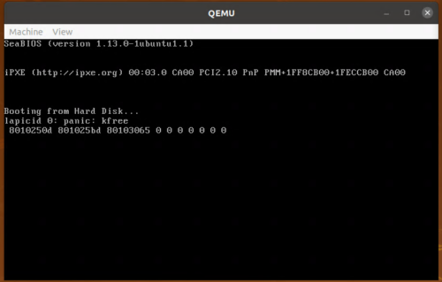

[はじめてのOSコードリーディング ~UNIX V6で学ぶカーネルのしくみ](https://amzn.to/3q8TU3K)にインスパイアされて[xv6 OS](https://github.com/mit-pdos/xv6-public)を読んでます。

UNIX V6自体はx86CPUでは動作しないため、基本的には、UNIXv6をX86アーキテクチャで動くようにした[xv6 OS](https://github.com/mit-pdos/xv6-public)のリポジトリをForkした[kash1064/xv6-public: xv6 OS](https://github.com/kash1064/xv6-public)のソースコードを読んでいくことにしました。

[前回](/unix-xv6-002-load-kernel)まででxv6OSのビルドと起動プロセスまで読み進めました。

いよいよカーネルを読み進めていきます。

まずは`main.c`から読んでいきます。

基本的にはCのソースコードを読みつつ、必要に応じて`kernel.asm`と`kernel.sym`を参照してgdbデバッグを行う流れで処理を追っていきます。

<!-- omit in toc -->
## もくじ
- [main関数](#main関数)
- [kinit1関数](#kinit1関数)
  - [kinit1関数の引数](#kinit1関数の引数)
  - [initlock関数](#initlock関数)
  - [freerange関数](#freerange関数)
  - [kfree関数](#kfree関数)
- [kinit2関数](#kinit2関数)
- [xv6のロックについて](#xv6のロックについて)
  - [acquire関数](#acquire関数)
  - [release関数](#release関数)
- [おまけ：デバッガでpanic関数を呼び出してみる](#おまけデバッガでpanic関数を呼び出してみる)
- [おまけ：memsetについて](#おまけmemsetについて)
- [まとめ](#まとめ)
- [参考書籍](#参考書籍)

## main関数

[前回](/unix-xv6-002-load-kernel)の記事では、`main.c`のmain関数を呼び出すところまで見ていきました。

ここからは、カーネル本体の動きを見ていきます。

まず、`main.c`の中からmain関数の行のみを抜粋しました。

``` c
static void startothers(void);
static void mpmain(void)  __attribute__((noreturn));
extern pde_t *kpgdir;
extern char end[]; // first address after kernel loaded from ELF file

// Bootstrap processor starts running C code here.
// Allocate a real stack and switch to it, first
// doing some setup required for memory allocator to work.
int
main(void)
{
  kinit1(end, P2V(4*1024*1024)); // phys page allocator
  kvmalloc();      // kernel page table
  mpinit();        // detect other processors
  lapicinit();     // interrupt controller
  seginit();       // segment descriptors
  picinit();       // disable pic
  ioapicinit();    // another interrupt controller
  consoleinit();   // console hardware
  uartinit();      // serial port
  pinit();         // process table
  tvinit();        // trap vectors
  binit();         // buffer cache
  fileinit();      // file table
  ideinit();       // disk 
  startothers();   // start other processors
  kinit2(P2V(4*1024*1024), P2V(PHYSTOP)); // must come after startothers()
  userinit();      // first user process
  mpmain();        // finish this processor's setup
}
```

関数がずらっと並んでおり、上から順に実行されています。

この記事では、`kinit1`と`kinit2`関数について見ていきます。

## kinit1関数

最初に実行されるkinit1関数は、`kalloc.c`で定義されている関数です。

xv6カーネルは`kinit1`と`kinit2`を呼び出してメモリアロケータの初期化を行います。

``` c
// Initialization happens in two phases.
// 1. main() calls kinit1() while still using entrypgdir to place just
// the pages mapped by entrypgdir on free list.
// 2. main() calls kinit2() with the rest of the physical pages
// after installing a full page table that maps them on all cores.
void
kinit1(void *vstart, void *vend)
{
  initlock(&kmem.lock, "kmem");
  kmem.use_lock = 0;
  freerange(vstart, vend);
}

void
kinit2(void *vstart, void *vend)
{
  freerange(vstart, vend);
  kmem.use_lock = 1;
}
```

カーネルは実行時に、ページテーブルやプロセス、ユーザメモリ、カーネルスタック、パイプバッファなどのために物理メモリ領域を割り当てて解放しておく必要があります。

xv6OSの場合は、カーネル本体が格納されるアドレスの末尾から`PHYSTOP`までの物理メモリが割り当て領域として使用されます。

`PHYSTOP`は`memlayout.h`にて以下のように定義されています。

``` c
#define EXTMEM  0x100000            // Start of extended memory
#define PHYSTOP 0xE000000           // Top physical memory
#define DEVSPACE 0xFE000000         // Other devices are at high addresses
```

このメモリ領域の割り当てと解放はページ単位で行われます。

カーネルは、解放されたページを連結リスト型で保持しており、割り当て時にはリストからそのページを削除する動きになります。

参考：[xv6 - DRAFT as of September 4, 2018 P32-33](https://pdos.csail.mit.edu/6.828/2018/xv6/book-rev11.pdf)

参考：[メモリ管理、アドレス空間、ページテーブル](http://www.coins.tsukuba.ac.jp/~yas/coins/os2-2011/2012-01-24/)

### kinit1関数の引数

`kinit1`では、引数として受け取ったカーネルのendアドレスから4MiBまでの領域を「ロックなし」で使用できるようにするためのアロケータの初期化を行います。

ここから`kinit2`関数が呼び出されるまでは、カーネル末尾から4MiB分のアドレスをロックなしで割り当てられるようにした状態で稼働します。

これは、`main`関数内で呼び出されている処理の大部分ではロックや4MiB以上のメモリ領域を使用することができないからであるようです。

`kinit1`関数の引数には、`vstart`と`vend`が与えられています。

まず第1引数の`vstart`に該当する引数ですが、これは`main.c`で宣言されている以下の変数です。

`extern`宣言がされており、`kernel.ld`で定義された`PROVIDE(end = .);`を取得しています。

``` c
extern char end[]; // first address after kernel loaded from ELF file
```

また、`vend`には`P2V(4*1024*1024)`が与えられています。

`P2V`は`memlayout.h`で定義されたマクロで物理アドレスを仮想アドレスに変換する(=単純にKERNBASEを加算する)だけのマクロです。

``` c
#define V2P(a) (((uint) (a)) - KERNBASE)
#define P2V(a) ((void *)(((char *) (a)) + KERNBASE))
```

呼び出し時には`4*1024*1024`(=4MiB)にKERNBASEを加算した`0x80400000`が与えられます。

実際に`kinit1`呼び出し時の引数をgdbで確認したところ次のようになりました。

``` bash
kinit1 (vstart=0x801154a8, vend=0x80400000)
```

順番が前後しますが、`kinit1`ではこの2つの値を`freerange`関数の引数として与えてメモリ領域の確保を行います。

ソースコードを上から順に見ていきたいので、先に`initlock`関数を確認します。

### initlock関数

`initlock`関数は、`spinlock.c`で定義された関数で、`kmem`構造体内の`spinlock`構造体の初期化を行う関数です。

`kmem`構造体は`kalloc.c`で以下のように定義されています。

``` c
struct {
  struct spinlock lock;
  int use_lock;
  struct run *freelist;
} kmem;
```

また、`spinlock`構造体は`spinlock.h`で定義された以下の構造体です。

コメントには排他制御と書かれており、ロックを行う際に使用しているようです。

``` c
// Mutual exclusion lock.
struct spinlock {
  uint locked;       // Is the lock held?

  // For debugging:
  char *name;        // Name of lock.
  struct cpu *cpu;   // The cpu holding the lock.
  uint pcs[10];      // The call stack (an array of program counters)
                     // that locked the lock.
};
```

`initlock`関数では、この`spinlock`構造体のポインタと名前の文字列を受けとって初期化を行っています。

``` c
void initlock(struct spinlock *lk, char *name)
{
  lk->name = name;
  lk->locked = 0;
  lk->cpu = 0;
}
```

`kinit1`からこの関数を呼び出す際には、「kmem」という名前で初期化を行っていることがわかります。

``` c
void kinit1(void *vstart, void *vend)
{
  initlock(&kmem.lock, "kmem");
  kmem.use_lock = 0;
  freerange(vstart, vend);
}
```

次の行では`use_lock`の値も0に初期化しています。

ここではロックを無効化しています。

しばらく後に呼び出される`kinit2`では、`kmem.use_lock`が1に設定されます。

また、実際にここでは、単に`kmem`の初期化を行ったのみでロックは行われていません。

ここで初期化した構造体を利用してロックを行うためには、`spinlock.c`で定義されている`void acquire(struct spinlock *lk)`関数を呼び出す必要があります。

この関数については実際に使用するときに確認します。

参考：[Homework: xv6 locking](https://pdos.csail.mit.edu/6.828/2017/homework/xv6-lock.html)

### freerange関数

`freerange`関数は`kalloc.c`で定義されている関数で、`vstart`と`vend`を引数にとり、`PGROUNDUP`を使用してアラインメントされた物理アドレス領域を解放する関数です。

``` c
void freerange(void *vstart, void *vend)
{
  char *p;
  p = (char*)PGROUNDUP((uint)vstart);
  for(; p + PGSIZE <= (char*)vend; p += PGSIZE)
    kfree(p);
}
```

`PGROUNDUP`は`mmu.h`で以下のように定義されています。

``` c
// Page directory and page table constants.
#define NPDENTRIES      1024    // # directory entries per page directory
#define NPTENTRIES      1024    // # PTEs per page table
#define PGSIZE          4096    // bytes mapped by a page

#define PTXSHIFT        12      // offset of PTX in a linear address
#define PDXSHIFT        22      // offset of PDX in a linear address

#define PGROUNDUP(sz)  (((sz)+PGSIZE-1) & ~(PGSIZE-1))
#define PGROUNDDOWN(a) (((a)) & ~(PGSIZE-1))
```

`PGROUNDUP`は引数として受け取ったアドレスを`PGSIZE`の倍数にアラインメントするマクロです。

これによって、引数`sz`以上の最小の`PGSIZE`の倍数が返されます。

`~`は`Bitwise NOT`演算子です。

また、`(PGSIZE-1)`は`PGSIZE`に対する最大の余りになるため、これを加算した上でbit反転した`(pgsize-1)`とのANDを取ることで、`PGSIZE`未満の端数を切り捨ててアラインメントすることができます。

参考：[c - What do PGROUNDUP and PGROUNDDOWN in xv6 mean? - Stack Overflow](https://stackoverflow.com/questions/43289022/what-do-pgroundup-and-pgrounddown-in-xv6-mean)

計算がちょっとわかりづらかったので、リバーシングしたPythonスクリプトを作成しました。

``` python
def rev_PGROUNDUP(sz):
    print("***************rev_PGROUNDUP***************")
    pgsize = 4096
    num1 = (sz)+(pgsize-1)
    num2 = ~(pgsize-1)
    result = num1 & num2
    print("pgsize               : {}".format(pgsize))
    print("pgsize[bin]          : {}".format(bin(pgsize)))
    print("(sz)+(pgsize-1)      : {}".format(num1))
    print("(sz)+(pgsize-1)[bin] : {}".format(bin(num1)))
    print("~(pgsize-1)          : {}".format(num2))
    print("~(pgsize-1)[bin]     : {}".format(bin(num2)))
    print("result               : {}".format(result))
    print("result[bin]          : {}".format(bin(result)))
    return result
```

これを実行すると以下のようになります。

``` bash
rev_PGROUNDUP(100)
***************rev_PGROUNDUP***************
pgsize               : 4096
pgsize[bin]          : 0b1000000000000
(sz)+(pgsize-1)      : 4195
(sz)+(pgsize-1)[bin] : 0b1000001100011
~(pgsize-1)          : -4096
~(pgsize-1)[bin]     : -0b1000000000000
result               : 4096
result[bin]          : 0b1000000000000
```

`sz`として100が入力された場合は、アラインメントされて切り上げされた結果4096が戻り値となります。

話を`freerange`関数に戻します。

`PGROUNDUP`の引数には`vstart`が与えられており、戻り値が`p`に格納されます。

``` c
void freerange(void *vstart, void *vend)
{
  char *p;
  p = (char*)PGROUNDUP((uint)vstart);
  for(; p + PGSIZE <= (char*)vend; p += PGSIZE)
    kfree(p);
}
```

ここで、`p`は`PGSIZE`でアラインメントされたアドレスとなります。

ここから`vend`のアドレスに到達するまで、`PGSIZE`ごと(ページごと)に`kfree`関数によって物理アドレスが解放され、ページリストの初期化が行われます。

### kfree関数

`kfree`関数はメモリの解放を行い、ページリストに解放したページを追加する関数です。

`kalloc.c`で定義されています。

引数には解放するページの開始アドレスを使用します。

`kinit1`関数から呼び出される場合、引数に与えられる値は`PGSIZE`でアラインメントされたアドレスになるため、4096バイト境界にアラインメントされていることが保証されます。

``` c
//PAGEBREAK: 21
// Free the page of physical memory pointed at by v,
// which normally should have been returned by a
// call to kalloc().  (The exception is when
// initializing the allocator; see kinit above.)
void kfree(char *v)
{
  struct run *r;

  if((uint)v % PGSIZE || v < end || V2P(v) >= PHYSTOP)
    panic("kfree");

  // Fill with junk to catch dangling refs.
  memset(v, 1, PGSIZE);

  if(kmem.use_lock)
    acquire(&kmem.lock);
  r = (struct run*)v;
  r->next = kmem.freelist;
  kmem.freelist = r;
  if(kmem.use_lock)
    release(&kmem.lock);
}
```

関数が呼び出されると、`run`構造体の宣言を行っています。

`run`構造体は`kalloc.c`で定義されており、参照先の`run`構造体のみを持つ単方向リストです。

解放済みのページを格納する`freelist`として`kmem`の中に格納されます。

``` c
struct run {
  struct run *next;
};

struct {
  struct spinlock lock;
  int use_lock;
  struct run *freelist;
} kmem;
```

次の行では、引数として受け取ったアドレスが`PGSIZE`でアラインメントされており、かつページサイズの割り当てに十分な領域が存在しているかを確認しています。

ここでチェックに失敗した場合は`panic`関数が呼び出されます。

``` c
if((uint)v % PGSIZE || v < end || V2P(v) >= PHYSTOP) panic("kfree");
```

`panic`関数については後述します。

次の行ではページの先頭アドレス`v`から`PGSIZE`分のアドレス領域を1で埋めています。

``` c
// Fill with junk to catch dangling refs.
memset(v, 1, PGSIZE);
```

`memset`についても後述します。

`memset`によるメモリ領域の初期化が完了したら以下の行が実行されます。

``` c
if(kmem.use_lock) acquire(&kmem.lock);
r = (struct run*)v;
r->next = kmem.freelist;
kmem.freelist = r;
if(kmem.use_lock) release(&kmem.lock);
```

`kinit1`の実行時は、ロックは無効化されているため`acquire`と`release`は呼び出されません。

そのため、`kmem.freelist`の先頭に新しい`run`構造体が1ページ分追加され、`kfree`の処理は終了します。

これで`freerange`関数の処理も終了するため、`kinit1`の処理も終了し、`main.c`の次の関数の実行に進みます。

## kinit2関数

`kinit1`からしばらくカーネルの処理を実行した後、`kinit2`関数が呼び出されます。

`kinit2`関数はロックを有効化し、さらに大きなサイズのメモリ領域を確保します。

動作は`kinit1`とほぼ同じです。

``` c
kinit2(P2V(4*1024*1024), P2V(PHYSTOP)); // must come after startothers()
```

`vstart`には4MiBのアドレスが割り当てされ、`vend`にはアドレス領域の終端として設定されている`0xE000000`が与えられます。

``` c
void kinit2(void *vstart, void *vend)
{
  freerange(vstart, vend);
  kmem.use_lock = 1;
}
```

`kmem.use_lock = 1;`の行以外は`kinit1`と同じです。

`freerange`で`vstart`から`vend`までの領域を解放してページリストに追加した後、ロックを有効化して終了します。

これ以降はロックが有効化されているため、メモリの確保と解放のために`acquire`関数と`release`関数が呼び出されるようになります。

`acquire`関数と`release`関数はどちらも`spinlock.c`で定義されています。

## xv6のロックについて

`acquire`関数と`release`関数を読む前にxv6におけるロックの仕様を確認します。

xv6OSはマルチプロセッサ環境で動作します。

マルチプロセッサ環境の場合、複数のCPUが物理メモリリソースを共有しています。

そのため、それぞれのCPUの処理が共有リソースを勝手に書き換えて問題を引き起こしたり競合したりしないようにするための仕組みがロックです。

ロックによって任意のメモリ領域の排他制御を行うことで、そのメモリ領域に対して1つのCPUのみが操作可能な状態にすることができます。

参考：[xv6](https://pdos.csail.mit.edu/6.828/2018/xv6/book-rev11.pdf)

xv6OSでは、スピンロックとスリーブロックの2種類のロックが実装されています。

`acquire`関数と`release`関数で行っているロックはスピンロックです。

参考：[スピンロック - Wikipedia](https://ja.wikipedia.org/wiki/%E3%82%B9%E3%83%94%E3%83%B3%E3%83%AD%E3%83%83%E3%82%AF)

スピンロックによって、プロセスがメモリリソースを確保する際に、対象がすでにロックされている場合は、ロックが解除されるまでループを行って待機します。

### acquire関数

`aquire`関数は`spinlock`構造体のポインタを引数としてロックを行います。

ここでやりたいことはシンプルで、`spinlock`構造体の`locked`に1をセットすることを試み、ロックが確保できるまでループして処理を待機させることです。

``` c
// Acquire the lock.
// Loops (spins) until the lock is acquired.
// Holding a lock for a long time may cause
// other CPUs to waste time spinning to acquire it.
void acquire(struct spinlock *lk)
{
  pushcli(); // disable interrupts to avoid deadlock.
  if(holding(lk))
    panic("acquire");

  // The xchg is atomic.
  while(xchg(&lk->locked, 1) != 0);

  // Tell the C compiler and the processor to not move loads or stores
  // past this point, to ensure that the critical section's memory
  // references happen after the lock is acquired.
  __sync_synchronize();

  // Record info about lock acquisition for debugging.
  lk->cpu = mycpu();
  getcallerpcs(&lk, lk->pcs);
}
```

`spinlock`構造体の定義も再掲しておきます。

``` c
// Mutual exclusion lock.
struct spinlock {
  uint locked;       // Is the lock held?

  // For debugging:
  char *name;        // Name of lock.
  struct cpu *cpu;   // The cpu holding the lock.
  uint pcs[10];      // The call stack (an array of program counters)
                     // that locked the lock.
};
```

`acquire`関数の処理を順に見ていきます。

``` c
pushcli(); // disable interrupts to avoid deadlock.
if(holding(lk)) panic("acquire");
```

`pushcli`関数は`spinlock.c`で定義された関数です。

`cli`と同様に割込みを抑制させていますが、ここではスタックを利用してネストされた割込み禁止命令を実現しています。

この処理によって、この後`xchg`でロックを確保する際に割込みが有効な状態でロックが保持される状況によってデッドロックが発生することを防いでいます。

割込みを再開するには`popcli`関数を呼び出します。

`acquire`関数では`popcli`関数は呼び出されません。

`acquire`関数で実行された`pushcli`関数に対応した`popcli`関数は`release`関数が実行します。

``` c
// Pushcli/popcli are like cli/sti except that they are matched:
// it takes two popcli to undo two pushcli.  Also, if interrupts
// are off, then pushcli, popcli leaves them off.
void pushcli(void)
{
  int eflags;

  eflags = readeflags();
  cli();
  if(mycpu()->ncli == 0) mycpu()->intena = eflags & FL_IF;
  mycpu()->ncli += 1;
}

void popcli(void)
{
  if(readeflags()&FL_IF)
    panic("popcli - interruptible");
  if(--mycpu()->ncli < 0)
    panic("popcli");
  if(mycpu()->ncli == 0 && mycpu()->intena)
    sti();
}
```

次の`holding`関数では、CPUがロックされているかを確認します。

``` c
// Check whether this cpu is holding the lock.
int holding(struct spinlock *lock)
{
  int r;
  pushcli();
  r = lock->locked && lock->cpu == mycpu();
  popcli();
  return r;
}
```

`mycpu()`は`proc.c`で定義されている関数です。

xv6OSはCPUごとに`cpu`構造体を管理しています。

`cpu`構造体は`proc.h`で以下のように定義されており、そのCPUで現在実行しているプロセスや入れ子になったスピンロックの数など様々な情報が格納されます。

``` c
// Per-CPU state
struct cpu {
  uchar apicid;                // Local APIC ID
  struct context *scheduler;   // swtch() here to enter scheduler
  struct taskstate ts;         // Used by x86 to find stack for interrupt
  struct segdesc gdt[NSEGS];   // x86 global descriptor table
  volatile uint started;       // Has the CPU started?
  int ncli;                    // Depth of pushcli nesting.
  int intena;                  // Were interrupts enabled before pushcli?
  struct proc *proc;           // The process running on this cpu or null
};
```

`mycpu`関数は現在のCPUの`cpu`構造体を参照するためのポインタを返します。

呼び出し前には必ず割込みを無効化しておく必要があります。

つまり、`if(holding(lk)) panic("acquire");`は、引数の`spinlock`構造体を参照し、CPUがロックされていることを確認しています。

続いて、ロックののセットを確認します。

``` c
// The xchg is atomic.
while(xchg(&lk->locked, 1) != 0);
```

ここで、ロックの操作時に競合が発生しないよう、操作をアトミックにする必要があります。

`xchg`はこれを実現するための特殊なx86命令です。

もしロックがセットされている場合、`xchg(&lk->locked, 1)`は1を返し、ループが継続されます。

もしロックが解除されていた場合、`xchg`によって新たにロックが設定されます。

その後、ループを終了しロックを確保します。

参考：[OSDev.org • View topic - How can xchg return a value?](https://forum.osdev.org/viewtopic.php?f=1&t=33690)

``` c
// Tell the C compiler and the processor to not move loads or stores
// past this point, to ensure that the critical section's memory
// references happen after the lock is acquired.
__sync_synchronize();

// Record info about lock acquisition for debugging.
lk->cpu = mycpu();
getcallerpcs(&lk, lk->pcs);
```

次に、`__sync_synchronize`関数は組込み関数でメモリバリアを行います。

参考：[c++ - What does __sync_synchronize do? - Stack Overflow](https://stackoverflow.com/questions/982129/what-does-sync-synchronize-do/982179)

続いて、`lk->cpu`に`mycpu`関数で取得した`cpu`構造体を格納します。

最後に`getcallerpcs`関数を呼び出しています。

これはデバッグ用のコールスタックを格納しています。

``` c
// Record the current call stack in pcs[] by following the %ebp chain.
void getcallerpcs(void *v, uint pcs[])
{
  uint *ebp;
  int i;

  ebp = (uint*)v - 2;
  for(i = 0; i < 10; i++){
    if(ebp == 0 || ebp < (uint*)KERNBASE || ebp == (uint*)0xffffffff)
      break;
    pcs[i] = ebp[1];     // saved %eip
    ebp = (uint*)ebp[0]; // saved %ebp
  }
  for(; i < 10; i++)
    pcs[i] = 0;
}
```

`panic`関数が呼び出されたときに出力される情報はここで格納しているようですね。

### release関数

`release`関数には、ここまでに記載したい内容以上に特筆する点はないので詳細は割愛します。

``` c
// Release the lock.
void release(struct spinlock *lk)
{
  if(!holding(lk)) panic("release");

  lk->pcs[0] = 0;
  lk->cpu = 0;

  // Tell the C compiler and the processor to not move loads or stores
  // past this point, to ensure that all the stores in the critical
  // section are visible to other cores before the lock is released.
  // Both the C compiler and the hardware may re-order loads and
  // stores; __sync_synchronize() tells them both not to.
  __sync_synchronize();

  // Release the lock, equivalent to lk->locked = 0.
  // This code can't use a C assignment, since it might
  // not be atomic. A real OS would use C atomics here.
  asm volatile("movl $0, %0" : "+m" (lk->locked) : );

  popcli();
}
```

最後の`asm volatile("movl $0, %0" : "+m" (lk->locked) : );`の行で`locked`に0を設定し、ロックを解除しています。

## おまけ：デバッガでpanic関数を呼び出してみる

`panic`関数は`console.c`で定義されています。

CPU割込みを禁止した上で無限ループを発生させて、これ以上処理が行われないようにしているようです。

``` c
void panic(char *s)
{
  int i;
  uint pcs[10];

  cli();
  cons.locking = 0;
  // use lapiccpunum so that we can call panic from mycpu()
  cprintf("lapicid %d: panic: ", lapicid());
  cprintf(s);
  cprintf("\n");
  getcallerpcs(&s, pcs);
  for(i=0; i<10; i++)
    cprintf(" %p", pcs[i]);
  panicked = 1; // freeze other CPU
  for(;;)
    ;
}
```

実際に何が出力されるのか確認するために、gdbで`panic`を発生させてみることにしました。

gdbで以下のコマンドを順に実行していきます。

``` bash
# QEMUに接続してpanic関数を呼び出す直前にブレークポイントを設定
$ target remote localhost:26000
$ b *0x80102499
$ continue

# panic関数を呼び出すようにフラグレジスタを改ざんして実行
$ info registers eflags
eflags         0x93                [ IOPL=0 SF AF CF ]
$ set $CF = 0
$ set $eflags ^= (1 << $CF)
$ info registers eflags
eflags         0x92                [ IOPL=0 SF AF ]
$ continue
```

これでQEMUのコンソールを確認したところ、`kfree`関数の呼び出し時に`panic`が呼び出されたことがわかります。

最後の行に表示されているアドレスはリターンアドレスのスタックっぽいです。



## おまけ：memsetについて

`memset`は`string.c`で以下のように定義されています。

``` c
void* memset(void *dst, int c, uint n)
{
  if ((int)dst%4 == 0 && n%4 == 0){
    c &= 0xFF;
    stosl(dst, (c<<24)|(c<<16)|(c<<8)|c, n/4);
  } else
    stosb(dst, c, n);
  return dst;
}
```

`memset`は、任意のメモリ領域に値を書き込むことのできる関数ですが、以下のglibの`memset`とは実装が異なるように見えます。

``` c
void *
inhibit_loop_to_libcall
memset (void *dstpp, int c, size_t len)
{
  long int dstp = (long int) dstpp;

  if (len >= 8)
    {
      size_t xlen;
      op_t cccc;

      cccc = (unsigned char) c;
      cccc |= cccc << 8;
      cccc |= cccc << 16;
      if (OPSIZ > 4)
	/* Do the shift in two steps to avoid warning if long has 32 bits.  */
	cccc |= (cccc << 16) << 16;

      /* There are at least some bytes to set.
	 No need to test for LEN == 0 in this alignment loop.  */
      while (dstp % OPSIZ != 0)
	{
	  ((byte *) dstp)[0] = c;
	  dstp += 1;
	  len -= 1;
	}

      /* Write 8 `op_t' per iteration until less than 8 `op_t' remain.  */
      xlen = len / (OPSIZ * 8);
      while (xlen > 0)
	{
	  ((op_t *) dstp)[0] = cccc;
	  ((op_t *) dstp)[1] = cccc;
	  ((op_t *) dstp)[2] = cccc;
	  ((op_t *) dstp)[3] = cccc;
	  ((op_t *) dstp)[4] = cccc;
	  ((op_t *) dstp)[5] = cccc;
	  ((op_t *) dstp)[6] = cccc;
	  ((op_t *) dstp)[7] = cccc;
	  dstp += 8 * OPSIZ;
	  xlen -= 1;
	}
      len %= OPSIZ * 8;

      /* Write 1 `op_t' per iteration until less than OPSIZ bytes remain.  */
      xlen = len / OPSIZ;
      while (xlen > 0)
	{
	  ((op_t *) dstp)[0] = cccc;
	  dstp += OPSIZ;
	  xlen -= 1;
	}
      len %= OPSIZ;
    }

  /* Write the last few bytes.  */
  while (len > 0)
    {
      ((byte *) dstp)[0] = c;
      dstp += 1;
      len -= 1;
    }

  return dstpp;
}
```

参考：[glibc/memset.c at master · lattera/glibc](https://github.com/lattera/glibc/blob/master/string/memset.c)

`memset`は、任意のアドレス範囲に特定の値を高速に書き込むことができ、初期化などに使用されます。

単純にforループなどで実装するよりも高速に動作するように実装されているようです。

参考：[c++ - Memset Definition and use - Stack Overflow](https://stackoverflow.com/questions/13327155/memset-definition-and-use)

xv6の`memset`はglibのものよりかなり簡単な実装にはなっていますが、`stosb`命令や`stosl`を使用してforループよりも高速に動作するように実装されているようです。

実際にgdbを使ってmemsetが動いていることを確認します。

まずは`memset`の実行直前にブレークポイントを仕掛けます。

``` bash
$ target remote localhost:26000
$ b memset
$ continue
```

ブレークポイントを設定したので、ページの先頭アドレスから0x1000バイト分の中身をのぞいてみたところ、すべて0になっていました。

``` bash
# memset実行直前のメモリの状態を見る
$ x/1000 0x80116000
0x80116000:	0x00000000	0x00000000	0x00000000	0x00000000
{ 中略 }
0x80116f90:	0x00000000	0x00000000	0x00000000	0x00000000
```

続いて`memset`終了直後に同じメモリ領域をのぞいてみると、すべてのバイト値が1になっていることが確認できました。(4バイトごとに出力が区切られているのでわかりづらいですが。)

``` bash
# memset実行直後のメモリの状態を見る
$ finish
$ $ x/1000 0x80116000
0x80116000:	0x01010101	0x01010101	0x01010101	0x01010101
{ 中略 }
0x80116f90:	0x01010101	0x01010101	0x01010101	0x01010101
```

## まとめ

ようやくカーネル本体に進みました。

とはいえ`main`関数の1つ目の関数を読んだだけで結構なボリュームになってしまったので、続きは次の記事にまとめようと思います。

## 参考書籍

- [30日でできる! OS自作入門](https://amzn.to/3qZSCY7)
- [ゼロからのOS自作入門](https://amzn.to/3qXYsZX)
- [はじめてのOSコードリーディング ~UNIX V6で学ぶカーネルのしくみ](https://amzn.to/3q8TU3K)
- [詳解 Linuxカーネル](https://amzn.to/3I6fkVt)
- [作って理解するOS x86系コンピュータを動かす理論と実装](https://amzn.to/3JRUdI2)


