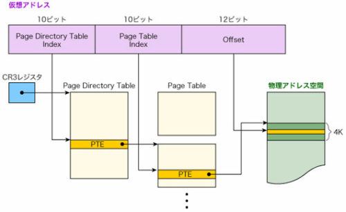
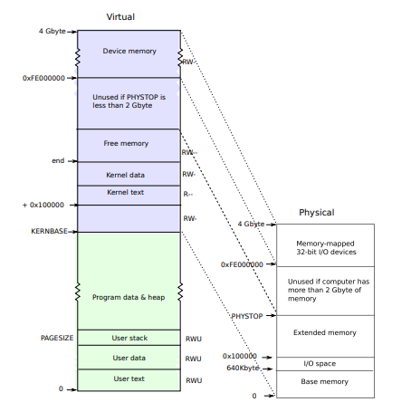
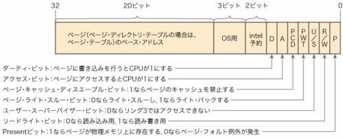

[はじめてのOSコードリーディング ~UNIX V6で学ぶカーネルのしくみ](https://amzn.to/3q8TU3K)にインスパイアされて[xv6 OS](https://github.com/mit-pdos/xv6-public)を読んでます。

UNIX V6自体はx86CPUでは動作しないため、基本的には、UNIXv6をX86アーキテクチャで動くようにした[xv6 OS](https://github.com/mit-pdos/xv6-public)のリポジトリをForkした[kash1064/xv6-public: xv6 OS](https://github.com/kash1064/xv6-public)のソースコードを読んでいくことにしました。

[前回](/unix-xv6-004-kernel-main-01)は`main`関数で初めに実行される`kinit1`関数による排他制御周りの挙動を確認しました。

今回は`kvmalloc`関数によるxv6カーネルのページテーブルの初期化を追っていきます。

<!-- omit in toc -->
## もくじ
- [32bitページングについて](#32bitページングについて)
  - [PDTとPT](#pdtとpt)
  - [仮想アドレスから物理アドレスを参照する流れ](#仮想アドレスから物理アドレスを参照する流れ)
- [kvmalloc関数](#kvmalloc関数)
  - [仮想メモリについて](#仮想メモリについて)
  - [setupkvm関数](#setupkvm関数)
  - [kalloc関数によるページの確保](#kalloc関数によるページの確保)
  - [仮想アドレスのPTEの作成](#仮想アドレスのpteの作成)
  - [freevm関数](#freevm関数)
- [switchkvm関数](#switchkvm関数)
- [まとめ](#まとめ)
- [参考書籍](#参考書籍)

## 32bitページングについて

今回はxv6OSの`kvmalloc`関数から読んでいきます。

`kvmalloc`関数はカーネルのページテーブルを作成する関数です。

そのため、ソースコードを読む前に、32bit環境でのページング機構について整理しておきます。

ページング機構はMMU(Memory Management Unit)によって実装されます。

x86環境では、MMUはPD(ページングディレクトリ)とPT(ページングテーブル)を利用してメモリマップを行います。

### PDTとPT

PDTとPTにはそれぞれPDE(ページディレクトリエントリ)とPTE(ページテーブルエントリ)が含まれます。

PDEとPTEはどちらも1つ当たり4バイト(32bit)のサイズであり、PDにはPDEが、PTにはPTEが、それぞれ1024個含まれます。

これによってPDEとPTEはどちらも4KiBのサイズ(x86におけるデフォルトの1ページ分)になります。

各エントリの詳細については以下のリンク先が参考になります。

参考：[Paging - OSDev Wiki](https://wiki.osdev.org/Paging)

### 仮想アドレスから物理アドレスを参照する流れ

仮想アドレスを物理アドレスに変換する際、仮想アドレスは以下の3つに分割されます。

- 最上位10bit：PDEのインデックス
- 次の10bit：PTEのインデックス
- 最下位12bit：ページオフセット

アドレス変換の際、MMUはPDを参照して仮想アドレスのインデックスからPDEを特定します。

次にPDEの情報と、仮想アドレスのインデックスからPTEを特定します。

PTEは物理アドレスのベースアドレスを解決するため、仮想アドレスのオフセットと合わせて参照先の物理アドレスを特定することができます。

詳細な流れは以下の図がわかりやすかったため引用しています。



参照画像：[第6回 メモリー上のデータを見えなくする（前編） | 日経クロステック（xTECH）](https://xtech.nikkei.com/it/article/COLUMN/20071107/286632/)

PDは単なるPDEの配列形式になっています。

PDの先頭アドレスはCR3レジスタに格納されています。

## kvmalloc関数

さて、[前回](https://yukituna.com/3869/)に引き続きカーネルの`main`関数の処理を追っていきます。

``` c
// Bootstrap processor starts running C code here.
// Allocate a real stack and switch to it, first
// doing some setup required for memory allocator to work.
int main(void)
{
  kinit1(end, P2V(4*1024*1024)); // phys page allocator
  kvmalloc();      // kernel page table
  mpinit();        // detect other processors
  lapicinit();     // interrupt controller
  seginit();       // segment descriptors
  picinit();       // disable pic
  ioapicinit();    // another interrupt controller
  consoleinit();   // console hardware
  uartinit();      // serial port
  pinit();         // process table
  tvinit();        // trap vectors
  binit();         // buffer cache
  fileinit();      // file table
  ideinit();       // disk 
  startothers();   // start other processors
  kinit2(P2V(4*1024*1024), P2V(PHYSTOP)); // must come after startothers()
  userinit();      // first user process
  mpmain();        // finish this processor's setup
}
```

[前回](https://yukituna.com/3869/)は`kinit1`関数が終了するところまで進めたので、今回は`kvmalloc`関数から見ていきます。

`kvmalloc`関数は`vm.c`で以下のように定義されています。

``` c
// Allocate one page table for the machine for the kernel address
// space for scheduler processes.
void kvmalloc(void)
{
  kpgdir = setupkvm();
  switchkvm();
}
```

`kvmalloc`関数はカーネルのページテーブルを変更します。

ここで、カーネルがプロセスのアドレス空間を管理するための設計を持ったページテーブルに切り替えます。

参考：[P.30 xv6OS](https://pdos.csail.mit.edu/6.828/2018/xv6/book-rev11.pdf)

なお、xv6OSではプロセスごとに1つのページテーブルが作成され、プロセスの実行時にはカーネルは現在のプロセスのページテーブルを使用します。

また、`kpgdir`というCPUが実行していないプロセスを管理するページテーブルが用意されています。

### 仮想メモリについて

xv6OSだけでなく、WindowsやLinuxなどの32bitOS(x86アーキテクチャ)では、プロセスごとに仮想メモリというプライベートなメモリ空間が割り当てられます。

各プロセスごとの仮想アドレス空間は独立しているため、それぞれが任意のアドレスから2GiB分の仮想アドレスを指定してメモリアクセスを行うことができます。

(プロセス側があるアドレスの参照を行ったときに、実際に物理メモリのどのアドレスを参照することになるかは、カーネル側で管理します。)

この仕組みによって、ページングを行っていてもプロセスは常に仮想アドレスに対してメモリアクセスを行うことができるため、アプリケーション側は物理メモリのアドレス変更を考慮することなく開発することができます。

また、32bitOSは最大4GiBまでのアドレス空間しか管理することができません。

しかし、プロセスごとに仮想アドレス空間を作成しページングの仕組みを利用することで、実際よりも大きなメモリ空間を利用してシステムを動かすことができるようになります。

そのほかにも、プロセス間でメモリ空間が独立していることによってメモリの競合を防いだりやアクセス制御を行ったりすることもできます。

ちなみに、なぜ32bitOSの扱うことができるアドレス空間が最大4GiBなのに、仮想アドレス空間は2GiBなのかというと、上位2GiBはカーネルに予約されているためのようです。

詳しくは以下の図が参考になります。


参考画像：[P.31 xv6OS](https://pdos.csail.mit.edu/6.828/2018/xv6/book-rev11.pdf)

### setupkvm関数

とりあえず`kvmalloc`関数の処理を追ってみます。

`kpgdir = setupkvm();`の行では、`setupkvm`関数の戻り値を`pde_t`型の`kpgdir`に格納しています。

ちなみに、`pde_t`型は`mmu.h`で以下のように定義されており、`uint`型であることがわかります。

``` c
typedef uint pte_t;
```

`setupkvm`関数は`vm.c`で以下のように定義されています。

``` c
// Set up kernel part of a page table.
pde_t* setupkvm(void)
{
  pde_t *pgdir;
  struct kmap *k;

  if((pgdir = (pde_t*)kalloc()) == 0) return 0;
  memset(pgdir, 0, PGSIZE);
  if (P2V(PHYSTOP) > (void*)DEVSPACE) panic("PHYSTOP too high");
  for(k = kmap; k < &kmap[NELEM(kmap)]; k++)
    if(mappages(pgdir, k->virt, k->phys_end - k->phys_start,
                (uint)k->phys_start, k->perm) < 0) 
    {
      freevm(pgdir);
      return 0;
    }
  return pgdir;
}
```

まずは変数宣言の部分です。

``` c
pde_t *pgdir;
struct kmap *k;
```

`pde_t`は前述の通り`uint`と同義です。

次の`kmap`構造体は`vm.c`で定義されているカーネルのメモリマッピングテーブルです。

``` c
// This table defines the kernel's mappings, which are present in
// every process's page table.
static struct kmap {
  void *virt;
  uint phys_start;
  uint phys_end;
  int perm;
} kmap[] = {
 { (void*)KERNBASE, 0,             EXTMEM,    PTE_W}, // I/O space
 { (void*)KERNLINK, V2P(KERNLINK), V2P(data), 0},     // kern text+rodata
 { (void*)data,     V2P(data),     PHYSTOP,   PTE_W}, // kern data+memory
 { (void*)DEVSPACE, DEVSPACE,      0,         PTE_W}, // more devices
};
```

開始・終了アドレスと権限が定義されています。

初期化されているテーブルのマッピングは、先ほど貼った以下の画像のレイアウトと一致します。



参考画像：[P.31 xv6OS](https://pdos.csail.mit.edu/6.828/2018/xv6/book-rev11.pdf)

### kalloc関数によるページの確保

ページテーブルの初期化後、使用するメモリ領域の確認と初期化を行っています。

``` c
if((pgdir = (pde_t*)kalloc()) == 0) return 0;
memset(pgdir, 0, PGSIZE);
if (P2V(PHYSTOP) > (void*)DEVSPACE) panic("PHYSTOP too high");
```

`kalloc`関数は`kalloc.c`で定義されている以下の関数です。

``` c
// Allocate one 4096-byte page of physical memory.
// Returns a pointer that the kernel can use.
// Returns 0 if the memory cannot be allocated.
char* kalloc(void)
{
  struct run *r;
  if(kmem.use_lock) acquire(&kmem.lock);
  r = kmem.freelist;
  if(r) kmem.freelist = r->next;
  if(kmem.use_lock) release(&kmem.lock);
  return (char*)r;
}
```

[前回](https://yukituna.com/3869/)の記事で確認した通り、この時点ではまだロックは無効化されています。

そのため`acquire`関数と`release`関数は無視します。

`kmem.freelist`には、解放されているページが短方向連結リストで格納されています。

つまり、`kalloc`関数は単に解放されている領域の有無を確認して、1ページ分の領域を確保している処理を行っているようです。

確保に成功した場合`kalloc`関数は確保したページのポインタ(?)を返却し、`pgdir`に格納します。

これによって、次の行の`memset(pgdir, 0, PGSIZE);`で確保した1ページ分のメモリ領域を0で初期化することができます。

`memset`関数の挙動も[前回](https://yukituna.com/3869/)の記事で確認したので割愛します。

最後の行は`PHYSTOP`の値が`DEVSPACE`を超過していないかを検証しているだけなので割愛します。

最終的に確保された1ページ分の領域`pgdir`が、この後PDTとして使用されます。

### 仮想アドレスのPTEの作成

ここまでの処理で`pgdir`には確保した1ページ分のメモリ領域の参照が格納されています。

``` c
for(k = kmap; k < &kmap[NELEM(kmap)]; k++) 
{
    if(mappages(pgdir, k->virt, k->phys_end - k->phys_start, (uint)k->phys_start, k->perm) < 0) 
	{
        freevm(pgdir);
        return 0;
	}
}
return pgdir;
```

`NELEM`は`defs.h`で定義された以下のマクロで、固定サイズの配列の要素数を返却します。

``` c
// number of elements in fixed-size array
#define NELEM(x) (sizeof(x)/sizeof((x)[0]))
```

つまり、`k = kmap; k < &kmap[NELEM(kmap)]; k++`のループ条件は単にすべての`kmap`配列の要素に対して処理を実行せよという命令と同義です。

ここで肝になるのが以下の行です。

``` c
if(mappages(pgdir, k->virt, k->phys_end - k->phys_start,(uint)k->phys_start, k->perm) < 0) 
{
	freevm(pgdir);
    return 0;
}
```

`mappages`関数は、`vm.c`で定義された関数で、 引数として与えられた仮想アドレスのPTE(ページテーブルエントリ)を作成し、同じく引数として与えられた物理アドレスを参照します。

PTEはページに対応する物理アドレスの値とアクセス制御や属性に関する情報を保持します。



参考画像：[第6回 メモリー上のデータを見えなくする（前編） | 日経クロステック（xTECH）](https://xtech.nikkei.com/it/article/COLUMN/20071107/286632/)

参考：[０から作るOS開発　ページングその１　ページとPTEとPDE](http://softwaretechnique.web.fc2.com/OS_Development/kernel_development07.html)

まずはソースコードを見てみます。

``` c
// Create PTEs for virtual addresses starting at va that refer to
// physical addresses starting at pa. va and size might not
// be page-aligned.
static int mappages(pde_t *pgdir, void *va, uint size, uint pa, int perm)
{
  char *a, *last;
  pte_t *pte;

  a = (char*)PGROUNDDOWN((uint)va);
  last = (char*)PGROUNDDOWN(((uint)va) + size - 1);
  for(;;){
    if((pte = walkpgdir(pgdir, a, 1)) == 0)
      return -1;
    if(*pte & PTE_P)
      panic("remap");
    *pte = pa | perm | PTE_P;
    if(a == last)
      break;
    a += PGSIZE;
    pa += PGSIZE;
  }
  return 0;
}
```

`mappages`は以下の5つの引数を受け取ります。

- *pgdir：確保したページ(PDT)
- *va：PTEを作成する仮想アドレス
- size：紐づける物理アドレス領域のサイズ
- pa：紐づける物理アドレスの先頭アドレス
- perm：割り当てる権限

まず、PTEを作成する仮想アドレスと紐づける物理アドレス領域のサイズをもとにしてページサイズでアラインメントされたアドレスが`a`と`last`に格納されます。

アラインメントに使用する`PGROUNDDOWN`については過去の記事で解説済みのため割愛します。

次のループはこの`a`が`last`と一致するまでページサイズを加算しつつ実行されます。

``` c
for(;;){
  if((pte = walkpgdir(pgdir, a, 1)) == 0) return -1;
  if(*pte & PTE_P) panic("remap");
  *pte = pa | perm | PTE_P;
  if(a == last) break;
  a += PGSIZE;
  pa += PGSIZE;
}
```

実際にPTEの領域を確保しているのは`walkpgdir`関数です。

`walkpgdir`関数は`vm.c`で定義された関数です。

引数として受け取ったページテーブル`pgdir`のPTEのアドレスを返します。

``` c

// Return the address of the PTE in page table pgdir
// that corresponds to virtual address va.  If alloc!=0,
// create any required page table pages.
static pte_t * 
walkpgdir(pde_t *pgdir, const void *va, int alloc)
{
  pde_t *pde;
  pte_t *pgtab;

  pde = &pgdir[PDX(va)];
  if(*pde & PTE_P){
    pgtab = (pte_t*)P2V(PTE_ADDR(*pde));
  } else {
    if(!alloc || (pgtab = (pte_t*)kalloc()) == 0) return 0;
    // Make sure all those PTE_P bits are zero.
    memset(pgtab, 0, PGSIZE);
    // The permissions here are overly generous, but they can
    // be further restricted by the permissions in the page table
    // entries, if necessary.
    *pde = V2P(pgtab) | PTE_P | PTE_W | PTE_U;
  }
  return &pgtab[PTX(va)];
}
```

まず、`pde = &pgdir[PDX(va)];`の行ではPDTとして確保しているページのうち、PTEを格納するインデックスを解決しています。

`PDX(va)`は`mmu.h`で定義されているマクロで、仮想アドレスから`page directory index`を解決しています。

``` c
// A virtual address 'la' has a three-part structure as follows:
//
// +--------10------+-------10-------+---------12----------+
// | Page Directory |   Page Table   | Offset within Page  |
// |      Index     |      Index     |                     |
// +----------------+----------------+---------------------+
//  \--- PDX(va) --/ \--- PTX(va) --/

// page directory index
#define PDX(va)         (((uint)(va) >> PDXSHIFT) & 0x3FF)

// page table index
#define PTX(va)         (((uint)(va) >> PTXSHIFT) & 0x3FF)

#define PTXSHIFT        12      // offset of PTX in a linear address
#define PDXSHIFT        22      // offset of PDX in a linear address
```

続いて、`if(*pde & PTE_P)`の行では、取得したPDEのPresentビットを確認します。

PDEのPresentビットはページが現在物理メモリにあるのか仮想メモリにあるのかを特定するために使用します。

参考：[Paging - OSDev Wiki](https://wiki.osdev.org/Paging)

ここでは、引数として受け取った仮想アドレスのPDEの有無を検証しているようです。

初期状態では、`memset`関数によってPDは0に初期化されているため、以下の処理が呼び出されます。

``` c
if(!alloc || (pgtab = (pte_t*)kalloc()) == 0) return 0;

// Make sure all those PTE_P bits are zero.
memset(pgtab, 0, PGSIZE);
// The permissions here are overly generous, but they can
// be further restricted by the permissions in the page table
// entries, if necessary.
*pde = V2P(pgtab) | PTE_P | PTE_W | PTE_U;
```

第3引数の`alloc`が1に設定されており、かつ仮想アドレスに対応するPDEが存在しない場合、ここで必要なPTが作成されます。

`kalloc`関数の挙動は先ほども確認したので割愛します。

ここで取得された1ページ分の領域は`pgtab`として参照されます。

また、`memset`によってすべてのバイトが0に初期化されます。

そして、PDEには物理アドレスに変換された`pgtab`のアドレスと、PDEに設定される権限が与えられます。

最終的に`walkpgdir`関数の戻り値としては、引数で受け取った仮想アドレスに対応するPDEから解決されるPDTの参照となります。

``` c
return &pgtab[PTX(va)];
```

さて、`walkpgdir`関数が終了したので`mappages`関数に戻ります。

``` c
for(;;){
  if((pte = walkpgdir(pgdir, a, 1)) == 0) return -1;
  if(*pte & PTE_P) panic("remap");
  *pte = pa | perm | PTE_P;
  if(a == last) break;
  a += PGSIZE;
  pa += PGSIZE;
}
```

`pte`にはこの仮想アドレスに対応するPTEの領域が確保されました。

`walkpgdir`関数が実行された段階ではまだPTEはすべて0で初期化されたままですので、`*pte = pa | perm | PTE_P;`の行で物理アドレスとパーミッションの割り当てを行っています。

これで、`mappages`関数によって仮想アドレスと物理アドレスを紐づけるPTEの作成が完了しました。

### freevm関数

最後に`setupkvm`関数に戻ります。

以下のループは`kmap`配列の要素の数だけ繰り返されていました。

`mappages`関数によって、仮想アドレスと物理アドレスを紐づけるPDEとPTEが作成されました。

``` c
for(k = kmap; k < &kmap[NELEM(kmap)]; k++)
{
  if(mappages(pgdir, k->virt, k->phys_end - k->phys_start,
              (uint)k->phys_start, k->perm) < 0) {
    freevm(pgdir);
    return 0;
  }
}
return pgdir;
```

もしページテーブルの作成に失敗した場合、`freevm`関数の引数にここまで使用してきたPDTのページ`pgdir`が与えられメモリ領域が解放されます。

`freevm`関数も`vm.c`で定義された関数です。

`freevm`関数この時点では実行されないため、詳細は割愛します。

``` c
// Free a page table and all the physical memory pages
// in the user part.
void freevm(pde_t *pgdir)
{
  uint i;
  if(pgdir == 0) panic("freevm: no pgdir");
  deallocuvm(pgdir, KERNBASE, 0);
  for(i = 0; i < NPDENTRIES; i++){
    if(pgdir[i] & PTE_P){
      char * v = P2V(PTE_ADDR(pgdir[i]));
      kfree(v);
    }
  }
  kfree((char*)pgdir);
}
```

## switchkvm関数

ここまでで`setupkvm`関数の処理は終了し、戻り値としてカーネルのPDTが返却されます。

``` c
// Allocate one page table for the machine for the kernel address
// space for scheduler processes.
void kvmalloc(void)
{
  kpgdir = setupkvm();
  switchkvm();
}
```

この記事の前半で確認した通り、カーネルの参照するPDTの先頭アドレスは、x86ではCR3レジスタに格納されます。

`switchkvm`関数の挙動はシンプルで、CR3レジスタに作成したPDTの仮想アドレスを物理アドレスに変換して格納しています。

``` c
// Switch h/w page table register to the kernel-only page table,
// for when no process is running.
void switchkvm(void)
{
  lcr3(V2P(kpgdir));   // switch to the kernel page table
}
```

`lcr3`関数は`x86.h`に定義されています。

``` c
static inline void
lcr3(uint val)
{
  asm volatile("movl %0,%%cr3" : : "r" (val));
}
```

これで`kvmalloc`関数によるカーネルのページテーブルの作成と切り替えが完了しました。

## まとめ

これでxv6カーネルの`main`関数で呼び出している18個の関数のうち、3つのソースコードを読みました。

まだまだ先は長いですが少しずつ進めていきます。

## 参考書籍

- [30日でできる! OS自作入門](https://amzn.to/3qZSCY7)
- [ゼロからのOS自作入門](https://amzn.to/3qXYsZX)
- [はじめてのOSコードリーディング ~UNIX V6で学ぶカーネルのしくみ](https://amzn.to/3q8TU3K)
- [詳解 Linuxカーネル](https://amzn.to/3I6fkVt)
- [作って理解するOS x86系コンピュータを動かす理論と実装](https://amzn.to/3JRUdI2)