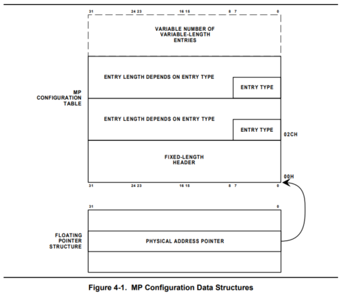
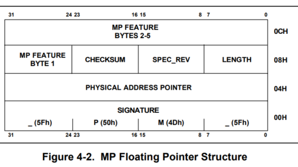
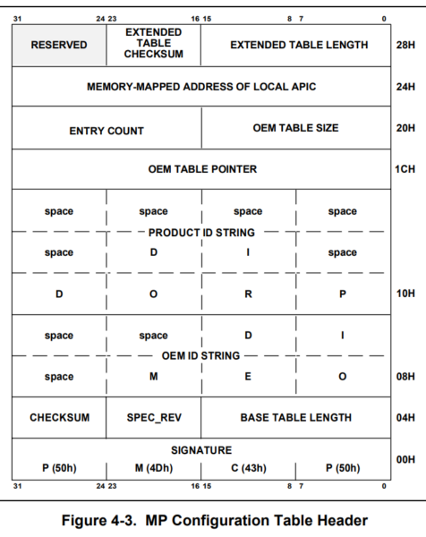
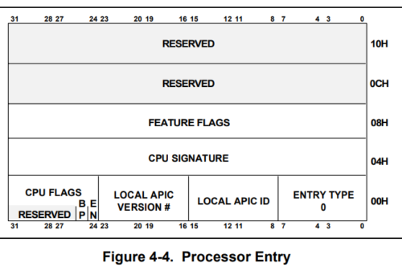
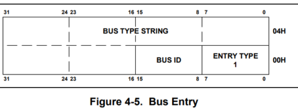
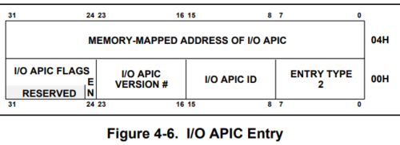
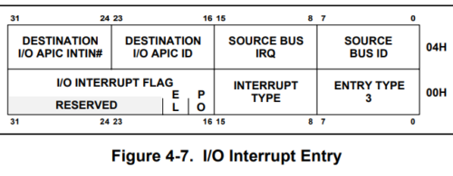
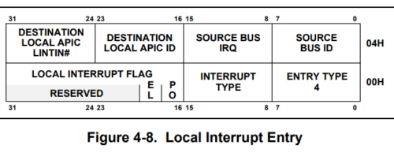

[はじめてのOSコードリーディング ~UNIX V6で学ぶカーネルのしくみ](https://amzn.to/3q8TU3K)にインスパイアされて[xv6 OS](https://github.com/mit-pdos/xv6-public)を読んでます。

UNIX V6自体はx86CPUでは動作しないため、基本的には、UNIXv6をX86アーキテクチャで動くようにした[xv6 OS](https://github.com/mit-pdos/xv6-public)のリポジトリをForkした[kash1064/xv6-public: xv6 OS](https://github.com/kash1064/xv6-public)のソースコードを読んでいくことにしました。

[前回](/unix-xv6-005-kernel-main-02)は`main`関数で実行される`kvmalloc`関数によるページテーブル割り当ての挙動を確認しました。

今回は`mpinit`関数の挙動を追っていきます。

<!-- omit in toc -->
## もくじ
- [mpinit関数](#mpinit関数)
  - [各種構造体変数の宣言](#各種構造体変数の宣言)
  - [MP仕様について](#mp仕様について)
  - [MPフローティングポインタ構造体の取得](#mpフローティングポインタ構造体の取得)
  - [MPコンフィグレーションテーブルの取得](#mpコンフィグレーションテーブルの取得)
  - [MPコンフィグレーションテーブルからIOAPICを取得する](#mpコンフィグレーションテーブルからioapicを取得する)
  - [プロセッサの情報を取得する](#プロセッサの情報を取得する)
  - [Processor Entryの情報取得](#processor-entryの情報取得)
  - [IOAPICの情報取得](#ioapicの情報取得)
  - [IMCRの変更](#imcrの変更)
- [まとめ](#まとめ)
- [参考書籍](#参考書籍)

## mpinit関数

`mpinit`関数は`mp.c`で定義されている以下の関数です。

「mp」はたぶんマルチプロセッサの意ですが、他のプロセッサを検出する役割を持つ関数が`mpinit`関数です。

``` c
void mpinit(void)
{
  uchar *p, *e;
  int ismp;
  struct mp *mp;
  struct mpconf *conf;
  struct mpproc *proc;
  struct mpioapic *ioapic;

  if((conf = mpconfig(&mp)) == 0) panic("Expect to run on an SMP");
  ismp = 1;
  lapic = (uint*)conf->lapicaddr;
  for(p=(uchar*)(conf+1), e=(uchar*)conf+conf->length; p<e; ){
    switch(*p){
    case MPPROC:
      proc = (struct mpproc*)p;
      if(ncpu < NCPU) {
        cpus[ncpu].apicid = proc->apicid;  // apicid may differ from ncpu
        ncpu++;
      }
      p += sizeof(struct mpproc);
      continue;
    case MPIOAPIC:
      ioapic = (struct mpioapic*)p;
      ioapicid = ioapic->apicno;
      p += sizeof(struct mpioapic);
      continue;
    case MPBUS:
    case MPIOINTR:
    case MPLINTR:
      p += 8;
      continue;
    default:
      ismp = 0;
      break;
    }
  }
  if(!ismp)
    panic("Didn't find a suitable machine");

  if(mp->imcrp){
    // Bochs doesn't support IMCR, so this doesn't run on Bochs.
    // But it would on real hardware.
    outb(0x22, 0x70);   // Select IMCR
    outb(0x23, inb(0x23) | 1);  // Mask external interrupts.
  }
}
```

それではソースコードを順に読んでいきます。

### 各種構造体変数の宣言

関数呼び出し後、複数の構造体変数を宣言しています。

``` c
uchar *p, *e;
int ismp;

struct mp *mp;
struct mpconf *conf;
struct mpproc *proc;
struct mpioapic *ioapic;
```

これらはいずれも`mp.h`で定義されています。

構造体の定義は以下です。

詳細は実際に使用するソースコードを読む際に見ていくため、一旦割愛します。

``` c
// See MultiProcessor Specification Version 1.[14]

struct mp {             // floating pointer
  uchar signature[4];           // "_MP_"
  void *physaddr;               // phys addr of MP config table
  uchar length;                 // 1
  uchar specrev;                // [14]
  uchar checksum;               // all bytes must add up to 0
  uchar type;                   // MP system config type
  uchar imcrp;
  uchar reserved[3];
};

struct mpconf {         // configuration table header
  uchar signature[4];           // "PCMP"
  ushort length;                // total table length
  uchar version;                // [14]
  uchar checksum;               // all bytes must add up to 0
  uchar product[20];            // product id
  uint *oemtable;               // OEM table pointer
  ushort oemlength;             // OEM table length
  ushort entry;                 // entry count
  uint *lapicaddr;              // address of local APIC
  ushort xlength;               // extended table length
  uchar xchecksum;              // extended table checksum
  uchar reserved;
};

struct mpproc {         // processor table entry
  uchar type;                   // entry type (0)
  uchar apicid;                 // local APIC id
  uchar version;                // local APIC verison
  uchar flags;                  // CPU flags
    #define MPBOOT 0x02           // This proc is the bootstrap processor.
  uchar signature[4];           // CPU signature
  uint feature;                 // feature flags from CPUID instruction
  uchar reserved[8];
};

struct mpioapic {       // I/O APIC table entry
  uchar type;                   // entry type (2)
  uchar apicno;                 // I/O APIC id
  uchar version;                // I/O APIC version
  uchar flags;                  // I/O APIC flags
  uint *addr;                  // I/O APIC address
};
```

### MP仕様について

ソースコードを読む前に、MP仕様についてまとめておきます。

MPテーブルとは、x86CPUの持っているOSにマルチプロセッサの情報を取得させるための仕組みです。

MPテーブルにはx86CPUのMP仕様に関連した情報が格納されています。

以下は、Interlのドキュメントに記載されていたMP仕様のデータ構造の図です。

`FLOATING POINTER STRUCTURE`から`FIXED-LENGTH HEADER`を参照しています。



参考画像：[Intel MultiProcessor Specification  | ManualsLib](https://www.manualslib.com/manual/77733/Intel-Multiprocessor.html)

この`FLOATING POINTER STRUCTURE`は、MPフローティングポインタ構造体であり、xv6OSでは`mp`構造体として定義されていました。

システムにMPフローティングポインタ構造体が存在する場合、そのシステムはMP仕様に準拠していることを意味します。

MPフローティングポインタ構造体には以下の情報が含まれます。

- MPコンフィグレーションテーブルへのポインタ
- その他のMP情報へのポインタ

MPコンフィグレーションテーブルは、xv6OSで`mpconf`構造体として定義されています。

後述する`mpconfig`関数では、MPフローティングポインタ構造体を取得した後に、その情報からMPコンフィグレーションテーブルを取得する処理が定義されています。

では、OSはどうやってMPフローティングポインタ構造体を見つけるのかという点ですが、Interlの仕様書によると、MPフローティングポインタ構造体は以下のいずれかに存在するよう定義されているため、OSはこれらを検索してMPフローティングポインタ構造体の有無を確認することになります。

- 拡張BIOSデータ領域（EBDA）の最初の1KiB以内の領域
- システムベースメモリ領域の最後の1KiB以内の範囲
- `0x0F0000`から`0x0FFFFFF`の間のBIOS ROMアドレス空間

xv6OSでも、`mpsearch`関数と`mpsearch1`関数によって、上記の領域の探索が行われます。

これらの関数については後述します。

次にMPコンフィグレーションテーブルですが、これは通常オプションの設定のようです。

システムがデフォルトの場合はMPコンフィグレーションテーブルの定義は不要ですが、CPUの数が変動する可能性のある場合などは必須になります。(実質的に汎用OSでは必須ってことでしょうか)

MPコンフィグレーションテーブルにはAPICやプロセッサ、バス、割込みに関する設定情報が含まれます。

また新しくAPICという単語がでてきましたが、これはIntelのマルチプロセッサCPUで使用される割込み制御の機構です。

APICについてはxv6OSで割込みコントローラを設定するときに詳しく見ていこうと思います。

参考：[APIC - OSDev Wiki](https://wiki.osdev.org/APIC)

MP仕様についてはWEBページや書籍からはあまり有益な情報が得られなかったので、詳しく知るにはIntelの仕様書を読むのが一番早いと思います。

参考：[Chapter 4 Mp Configuration Table; Mp Configuration Data Structures - Intel MultiProcessor Specification [Page 37] | ManualsLib](https://www.manualslib.com/manual/77733/Intel-Multiprocessor.html?page=37#manual)

### MPフローティングポインタ構造体の取得

というわけでさっそく以下のコードを見ます。

``` c
if((conf = mpconfig(&mp)) == 0) panic("Expect to run on an SMP");
```

`mpconfig`関数の引数として`mp`構造体を与え、戻り値を`mpconf`構造体の変数である`conf`に格納しています。

ここでは、`mpconf`構造体の変数`conf`を初期化するとともに、システムがSMPで動作しているかをチェックします。

SMPとは、`Symmetric multiprocessing`あるいは`shared-memory multiprocessing`の略称で、要するに複数のCPUがメモリリソースを共有するマルチプロセッサシステムを意味しています。

参考：[Symmetric multiprocessing - Wikipedia](https://en.wikipedia.org/wiki/Symmetric_multiprocessing)

参考：[Symmetric Multiprocessing - OSDev Wiki](https://wiki.osdev.org/Symmetric_Multiprocessing)

一旦`mpconfig`関数のソースコードを見てみましょう。

`mpconfig`関数は、`mpinit`関数で宣言した`mp`構造体オブジェクトのアドレスを引数として、`mpconf`構造体を戻り値とする関数です。

この関数によってMPテーブルが検索され、引数として受け取った`mp`構造体オブジェクトと戻り値の`mpconf`構造体の初期化が行われます。

``` c
// Search for an MP configuration table.  For now,
// don't accept the default configurations (physaddr == 0).
// Check for correct signature, calculate the checksum and,
// if correct, check the version.
// To do: check extended table checksum.
static struct mpconf* mpconfig(struct mp **pmp)
{
  struct mpconf *conf;
  struct mp *mp;

  if((mp = mpsearch()) == 0 || mp->physaddr == 0) return 0;
  conf = (struct mpconf*) P2V((uint) mp->physaddr);
  if(memcmp(conf, "PCMP", 4) != 0) return 0;
  if(conf->version != 1 && conf->version != 4) return 0;
  if(sum((uchar*)conf, conf->length) != 0) return 0;
  *pmp = mp;
  return conf;
}
```

`mp`構造体は前述したMPフローティングポインタ構造体を指します。

`mpconfig`関数が呼び出された時点ではまだシステムのMPフローティングポインタ構造体は取得できていないので、まずMPフローティングポインタ構造体を探索する必要があります。

このために呼び出されるのが`mpsearch`関数と`mpsearch1`関数です。

``` c
// Look for an MP structure in the len bytes at addr.
static struct mp* mpsearch1(uint a, int len)
{
  uchar *e, *p, *addr;
  addr = P2V(a);
  e = addr+len;
  for(p = addr; p < e; p += sizeof(struct mp))
  {
    if(memcmp(p, "_MP_", 4) == 0 && sum(p, sizeof(struct mp)) == 0) return (struct mp*)p;
  }
  return 0;
}

// Search for the MP Floating Pointer Structure, which according to the
// spec is in one of the following three locations:
// 1) in the first KB of the EBDA;
// 2) in the last KB of system base memory;
// 3) in the BIOS ROM between 0xE0000 and 0xFFFFF.
static struct mp* mpsearch(void)
{
  uchar *bda;
  uint p;
  struct mp *mp;

  bda = (uchar *) P2V(0x400);
  if((p = ((bda[0x0F]<<8)| bda[0x0E]) << 4)){
    if((mp = mpsearch1(p, 1024))) return mp;
  } else {
    p = ((bda[0x14]<<8)|bda[0x13])*1024;
    if((mp = mpsearch1(p-1024, 1024))) return mp;
  }
  return mpsearch1(0xF0000, 0x10000);
}
```

前述した通り、MPフローティングポインタ構造体が存在する場合は、以下のいずれかに配置されています。

- 拡張BIOSデータ領域（EBDA）の最初の1KiB以内の領域
- システムベースメモリ領域の最後の1KiB以内の範囲
- `0x0F0000`から`0x0FFFFFF`の間のBIOS ROMアドレス空間

これらの領域を検索してMPフローティングポインタ構造体が見つかった場合は`mp`に格納されます。

このとき、MPフローティングポインタ構造体が見つからない場合、もしくはMPフローティングポインタ構造体が持つMPコンフィグレーションテーブルのアドレスが空の場合はカーネルを終了します。

``` c
if((mp = mpsearch()) == 0 || mp->physaddr == 0) return 0;
```

MPフローティングポインタ構造体は以下の構造になっています。

``` c
struct mp {             // floating pointer
  uchar signature[4];           // "_MP_"
  void *physaddr;               // phys addr of MP config table
  uchar length;                 // 1
  uchar specrev;                // [14]
  uchar checksum;               // all bytes must add up to 0
  uchar type;                   // MP system config type
  uchar imcrp;
  uchar reserved[3];
};
```

`mp`構造体の定義は上記ですが、Intel仕様書の図の方がイメージしやすいので一緒に貼っておきます。



参考画像：[Intel MultiProcessor Specification  | ManualsLib](https://www.manualslib.com/manual/77733/Intel-Multiprocessor.html)

最初の4バイトの`SIGNATURE`には`_MP_`が格納されていることが期待されます。

`mpsearch`関数と`mpsearch1`関数で探索を行う場合には、この`SIGNATURE`を探索しています。

`physaddr`にはMPコンフィグレーションテーブルのアドレスが格納されており、ここからはこの情報を元にMPコンフィグレーションテーブルを取得していきます。

### MPコンフィグレーションテーブルの取得

MPフローティングポインタ構造体を取得したら、MPコンフィグレーションテーブルの仮想アドレスを取得し、`mpconf`構造のポインタ変数`conf`として格納します。

``` c
struct mpconf *conf;
conf = (struct mpconf*) P2V((uint) mp->physaddr);

if(memcmp(conf, "PCMP", 4) != 0) return 0;
if(conf->version != 1 && conf->version != 4) return 0;
if(sum((uchar*)conf, conf->length) != 0) return 0;
```

MPコンフィグレーションテーブルは以下の構造になっています。

``` c
struct mpconf {         // configuration table header
  uchar signature[4];           // "PCMP"
  ushort length;                // total table length
  uchar version;                // [14]
  uchar checksum;               // all bytes must add up to 0
  uchar product[20];            // product id
  uint *oemtable;               // OEM table pointer
  ushort oemlength;             // OEM table length
  ushort entry;                 // entry count
  uint *lapicaddr;              // address of local APIC
  ushort xlength;               // extended table length
  uchar xchecksum;              // extended table checksum
  uchar reserved;
};
```

以下はIntel仕様書から引用した構造図です。



参考画像：[Intel MultiProcessor Specification  | ManualsLib](https://www.manualslib.com/manual/77733/Intel-Multiprocessor.html)

最初の4バイト分の領域に`SIGNATURE`が格納されていますが、これは`PCMP`になることが期待されます。

xv6OSでは、取得したMPコンフィグレーションテーブルの確認のため、`memcmp`関数にて先頭4バイトが`PCMP`に一致するかをチェックしています。

``` c
if(memcmp(conf, "PCMP", 4) != 0) return 0;
if(conf->version != 1 && conf->version != 4) return 0;
if(sum((uchar*)conf, conf->length) != 0) return 0;
```

また、バージョン情報が適切であるか、データサイズが実際のサイズと一致するかについてもチェックを行っています。

これで`mpinit`関数の以下の処理が終わり、MPフローティングポインタとMPコンフィグレーションテーブルを取得することができました。

``` c
if((conf = mpconfig(&mp)) == 0) panic("Expect to run on an SMP");
```

### MPコンフィグレーションテーブルからIOAPICを取得する

つづいて、`mpioapic`構造体の`ioapic`にMPコンフィグレーションテーブルの`lapicaddr`から取得したアドレスを格納します。

``` c
int ismp;
struct mpioapic *ioapic;

ismp = 1;
lapic = (uint*)conf->lapicaddr;
```

`mpioapic`構造体は以下の構造体です。

``` c
struct mpioapic {       // I/O APIC table entry
  uchar type;                   // entry type (2)
  uchar apicno;                 // I/O APIC id
  uchar version;                // I/O APIC version
  uchar flags;                  // I/O APIC flags
  uint *addr;                  // I/O APIC address
};
```

Intel仕様書の図は以下です。


参考画像：[Intel MultiProcessor Specification  | ManualsLib](https://www.manualslib.com/manual/77733/Intel-Multiprocessor.html)

IOAPICは外部割込みを複数のCPUで分散するための機構です。

APICが外部割込みの機構であることは前述しましたが、APICにはローカルAPICとIOAPICの2種類があるようです。

xv6OSではローカルAPICについては`lapic.c`で、IOAPICについては`ioapic.c`で実装されています。

ローカルAPICはCPUに内臓された割込みで、IOAPICはI/Oデバイスから受けとった割込みを、リダイレクションテーブルの情報を元にCPUに通知します。

IOAPICはIOAPICテーブルを持っており、x86CPUは`memory-mapped I/O`を通してこのテーブルのエントリを定義できます。

`memory-mapped I/O`は簡単に言うとCPUとI/Oデバイス間で入出力を行う方法の一つで、物理アドレス空間にI/Oデバイスの入出力のための空間を用意し、CPUのメモリの読み書きの機能を利用して入出力を行う方法です。

参考：[I/O APICについて - 睡分不足](https://mmi.hatenablog.com/entry/2017/04/09/132708)

参考：[メモリマップドI/O - Wikipedia](https://ja.wikipedia.org/wiki/%E3%83%A1%E3%83%A2%E3%83%AA%E3%83%9E%E3%83%83%E3%83%97%E3%83%89I/O)

PCIをI/Oデバイスに持つ一般的なシステムの場合、IOAPICはPCIの割込み信号の変化を検知し、リダイレクションテーブルの情報を元にCPUに割込みメッセージを発行します。

この情報はCPU内部のローカルAPICが受け取り、割込みハンドラを呼び出して割込み処理を行った後、EOI(End of Interrupt)コマンドをIOAPICに返すことで、IOAPICに対して割込みの完了を通知します。

詳しくは実際に割込み処理を実装するところまで進んだらやります。たぶん。

参考：[APIC - Wikipedia](https://ja.wikipedia.org/wiki/APIC)

参考：[APIC - OSDev Wiki](https://wiki.osdev.org/APIC)

参考：[IOAPIC - OSDev Wiki](https://wiki.osdev.org/IOAPIC)

参考：[82093AA I/O ADVANCED PROGRAMMABLE INTERRUPT CONTROLLER (IOAPIC)](https://pdos.csail.mit.edu/6.828/2008/readings/ia32/ioapic.pdf)

APICの仕組みは、x86CPUとそのマザーボードのようなマルチプロセッサ環境での割込みを制御するための割込みコントローラが必要になったことで生まれました。

もともと実装されていたPICと呼ばれるシンプルな割込み機構では、マルチプロセッサ構成での割込み処理に対応できなかったようです。

xv6OSもマルチプロセッサ構成を前提としているので、PICからの割込みを無視してローカルAPICとIOAPICを使用した割込み処理を実装します。

参考：[P45](https://pdos.csail.mit.edu/6.828/2018/xv6/book-rev11.pdf)

xv6OSのコードでは`mpioapic`構造体の`ioapic`にMPコンフィグレーションテーブルの`lapicaddr`から取得したアドレスを格納しています。

`lapicaddr`に格納されているのはメモリマップドされたローカルAPICのアドレスです。

`lapicaddr`を格納する変数`lapic`は`defs.h`でグローバル変数として定義されています。

この関数の中では以降使用することはなく、`lapic.c`で使用することになります。

``` c
extern volatile uint*    lapic;
```

### プロセッサの情報を取得する

`lapicaddr`の取得が完了した後のループを見てみます。

`conf`には、先ほど取得したMPコンフィグレーションテーブルが格納されています。

Intelの仕様書より、MPコンフィグレーションテーブルエントリは、MPコンフィグレーションテーブルヘッダ(MPコンフィグレーションテーブルの先頭アドレス)から、可変数で続いていくことがわかります。

MPコンフィグレーションテーブルエントリは、先ほど例示した`Processor Entries`の他に、`Bus Entry`、`I/O APIC Entry`、`I/O Interrupt Entry`、`Local Interrupt Entry`などがあります。(他にも拡張エントリが存在します)

これらはいずれも先頭1バイトにユニークな`Entry Point`が定義されています。

- Processor Entry



- Bus Entry



- I/O APIC Entry



- I/O Interrupt Entry



- Local Interrupt Entry



参考画像：[Intel MultiProcessor Specification  | ManualsLib](https://www.manualslib.com/manual/77733/Intel-Multiprocessor.html)

xv6OSの以下のコードでも、MPコンフィグレーションヘッダの先頭から各エントリをチェックしていき、先頭の`Entry Type`の値に応じて処理を分岐させています。

``` c
for(p=(uchar*)(conf+1), e=(uchar*)conf+conf->length; p<e; ){
  switch(*p){
          
  case MPPROC:
    proc = (struct mpproc*)p;
    if(ncpu < NCPU) {
      cpus[ncpu].apicid = proc->apicid;  // apicid may differ from ncpu
      ncpu++;
    }
    p += sizeof(struct mpproc);
    continue;
          
  case MPIOAPIC:
    ioapic = (struct mpioapic*)p;
    ioapicid = ioapic->apicno;
    p += sizeof(struct mpioapic);
    continue;
          
  case MPBUS:
  case MPIOINTR:
  case MPLINTR:
    p += 8;
    continue;
          
  default:
    ismp = 0;
    break;
  }
}
```

チェックしているエントリは以下のように定義されています。

``` c
// Table entry types
#define MPPROC    0x00  // One per processor
#define MPBUS     0x01  // One per bus
#define MPIOAPIC  0x02  // One per I/O APIC
#define MPIOINTR  0x03  // One per bus interrupt source
#define MPLINTR   0x04  // One per system interrupt source
```

### Processor Entryの情報取得

まずは`Processor Entry`の場合です。

ここでは`mpproc`構造体のオブジェクトとして`Processor Entriy`を取得し、`Local APIC ID`の値をすべての`cpus`配列に順に格納しています。

``` c
case MPPROC:
  proc = (struct mpproc*)p;
  if(ncpu < NCPU) {
    cpus[ncpu].apicid = proc->apicid;  // apicid may differ from ncpu
    ncpu++;
  }
  p += sizeof(struct mpproc);
  continue;
```

ちなみにここで使用されている`NCPU`は`param.h`で以下のように定数として定義されています。

xv6OSは最大で8CPUまでサポートしているようです。

``` c
#define NCPU      8  // maximum number of CPUs
```

### IOAPICの情報取得

続いては`IOAPIC`の情報を取得します。

``` c
case MPIOAPIC:
  ioapic = (struct mpioapic*)p;
  ioapicid = ioapic->apicno;
  p += sizeof(struct mpioapic);
  continue;
```

各構造体などについては前述したので割愛します。

### IMCRの変更

これで`mp.c`の処理はほぼ完了しました。

最後に`IMCR`を無効化します。

IMCRは割り込みモード構成レジスタと呼ばれ、PICモードから変更するためには`IMCR`の変更が必要になるようです。

参考：[x86 - Where is the IMCR defined in the docs? - Reverse Engineering Stack Exchange](https://reverseengineering.stackexchange.com/questions/26308/where-is-the-imcr-defined-in-the-docs)

参考：[OSDev.org • View topic - Set IMCR to 0x1 to mask external interrupts?](https://forum.osdev.org/viewtopic.php?f=1&t=29102)

参考：[Default Configurations; Symmetric I/O Mode - Intel MultiProcessor Specification [Page 31] | ManualsLib](https://www.manualslib.com/manual/77733/Intel-Multiprocessor.html?page=31)

## まとめ

次回は`lapicinit`関数から始めます。

今回取得した情報を利用して割込みコントローラを実装するようです。

だんだん頭がついてこなくなってきたのでちょっと気合入れて頑張ろうと思います。

## 参考書籍

- [30日でできる! OS自作入門](https://amzn.to/3qZSCY7)
- [ゼロからのOS自作入門](https://amzn.to/3qXYsZX)
- [はじめてのOSコードリーディング ~UNIX V6で学ぶカーネルのしくみ](https://amzn.to/3q8TU3K)
- [詳解 Linuxカーネル](https://amzn.to/3I6fkVt)
- [作って理解するOS x86系コンピュータを動かす理論と実装](https://amzn.to/3JRUdI2)
