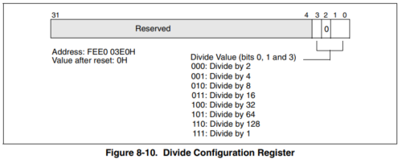
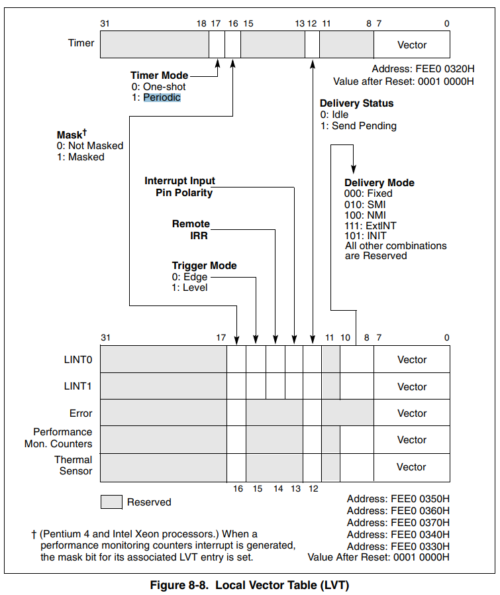
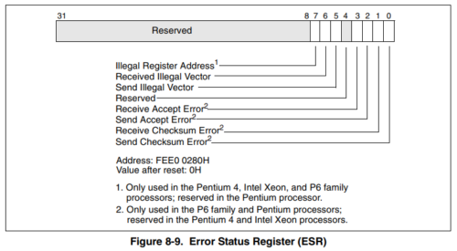
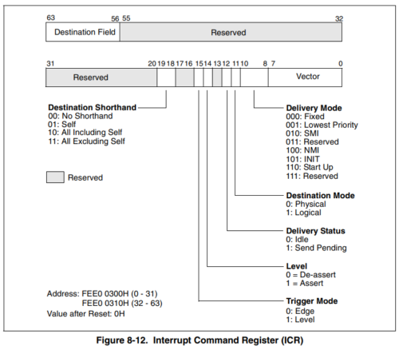

[はじめてのOSコードリーディング ~UNIX V6で学ぶカーネルのしくみ](https://amzn.to/3q8TU3K)にインスパイアされて[xv6 OS](https://github.com/mit-pdos/xv6-public)を読んでます。

UNIX V6自体はx86CPUでは動作しないため、基本的には、UNIXv6をX86アーキテクチャで動くようにした[xv6 OS](https://github.com/mit-pdos/xv6-public)のリポジトリをForkした[kash1064/xv6-public: xv6 OS](https://github.com/kash1064/xv6-public)のソースコードを読んでいくことにしました。

[前回](/unix-xv6-006-kernel-main-03)は`main`関数で実行される`mpinit`関数によるマルチプロセッサ構成でのCPU情報の取得を確認しました。

今回は`lapicinit`関数の挙動を追っていきます。

<!-- omit in toc -->
## もくじ
- [lapicinit関数](#lapicinit関数)
  - [ローカルAPICレジスタ](#ローカルapicレジスタ)
  - [Spurious Interrupt Vectorの設定とローカルAPICの有効化](#spurious-interrupt-vectorの設定とローカルapicの有効化)
  - [タイマの設定](#タイマの設定)
  - [Disable logical interrupt lines](#disable-logical-interrupt-lines)
  - [Disable performance counter overflow interrupts](#disable-performance-counter-overflow-interrupts)
  - [Error Registerのセット](#error-registerのセット)
  - [ESRのクリア](#esrのクリア)
  - [EOIのチェック](#eoiのチェック)
  - [Interrupt Command Registerのセット](#interrupt-command-registerのセット)
- [まとめ](#まとめ)
- [参考書籍](#参考書籍)

## lapicinit関数

今回は`main`関数で最初に実行される関数群の`lapicinit`関数から見ていきます。

ここでは割込みコントローラの初期化を行います。

``` c
lapicinit();     // interrupt controller
```

`lapicinit`関数は`lapic.c`で以下のように定義されています。

``` c
void lapicinit(void)
{
  if(!lapic) return;

  // Enable local APIC; set spurious interrupt vector.
  lapicw(SVR, ENABLE | (T_IRQ0 + IRQ_SPURIOUS));

  // The timer repeatedly counts down at bus frequency
  // from lapic[TICR] and then issues an interrupt.
  // If xv6 cared more about precise timekeeping,
  // TICR would be calibrated using an external time source.
  lapicw(TDCR, X1);
  lapicw(TIMER, PERIODIC | (T_IRQ0 + IRQ_TIMER));
  lapicw(TICR, 10000000);

  // Disable logical interrupt lines.
  lapicw(LINT0, MASKED);
  lapicw(LINT1, MASKED);

  // Disable performance counter overflow interrupts
  // on machines that provide that interrupt entry.
  if(((lapic[VER]>>16) & 0xFF) >= 4) lapicw(PCINT, MASKED);

  // Map error interrupt to IRQ_ERROR.
  lapicw(ERROR, T_IRQ0 + IRQ_ERROR);

  // Clear error status register (requires back-to-back writes).
  lapicw(ESR, 0);
  lapicw(ESR, 0);

  // Ack any outstanding interrupts.
  lapicw(EOI, 0);

  // Send an Init Level De-Assert to synchronise arbitration ID's.
  lapicw(ICRHI, 0);
  lapicw(ICRLO, BCAST | INIT | LEVEL);
  while(lapic[ICRLO] & DELIVS)
    ;

  // Enable interrupts on the APIC (but not on the processor).
  lapicw(TPR, 0);
}
```

`if(!lapic) return;`ではグローバル変数`lapic`に値が格納されているかをチェックしています。

### ローカルAPICレジスタ

変数`lapic`は[前回](https://yukituna.com/3898/)確認したMPテーブルの取得の中でMPフローティングポインタ内の`lapicaddr`のアドレスが格納されていました。

実際にこのグローバル変数に格納されている値をデバッガで確認してみます。

``` bash
$ b *0x801027a0
$ continue
```

変数`lapic`の中身を見てみたところ、アドレス`0xfee00000`が格納されていました。

``` bash
$ info variables lapic
File lapic.c:
44:	volatile uint *lapic;

$ p lapic
$1 = (volatile uint *) 0xfee00000
```

この`lapic`は、メモリマップされたローカルAPICレジスタです。

ローカルAPICレジスタはMPコンフィグレーションテーブルの指すアドレスにメモリマップされた32bitのデータです。

16バイト境界にアラインメントされたオフセットにある、32bitの各要素をローカルAPICレジスタとして設定します。

詳細は以下のページが参考になります。

参考：[APIC - OSDev Wiki](https://wiki.osdev.org/APIC)

以降は、ローカルAPICレジスタの設定を行っていきます。

その際、`lapic.c`で定義された以下の値を使用します。

``` c
// Local APIC registers, divided by 4 for use as uint[] indices.
#define ID      (0x0020/4)   // ID
#define VER     (0x0030/4)   // Version
#define TPR     (0x0080/4)   // Task Priority
#define EOI     (0x00B0/4)   // EOI
#define SVR     (0x00F0/4)   // Spurious Interrupt Vector
  #define ENABLE     0x00000100   // Unit Enable
#define ESR     (0x0280/4)   // Error Status
#define ICRLO   (0x0300/4)   // Interrupt Command
  #define INIT       0x00000500   // INIT/RESET
  #define STARTUP    0x00000600   // Startup IPI
  #define DELIVS     0x00001000   // Delivery status
  #define ASSERT     0x00004000   // Assert interrupt (vs deassert)
  #define DEASSERT   0x00000000
  #define LEVEL      0x00008000   // Level triggered
  #define BCAST      0x00080000   // Send to all APICs, including self.
  #define BUSY       0x00001000
  #define FIXED      0x00000000
#define ICRHI   (0x0310/4)   // Interrupt Command [63:32]
#define TIMER   (0x0320/4)   // Local Vector Table 0 (TIMER)
  #define X1         0x0000000B   // divide counts by 1
  #define PERIODIC   0x00020000   // Periodic
#define PCINT   (0x0340/4)   // Performance Counter LVT
#define LINT0   (0x0350/4)   // Local Vector Table 1 (LINT0)
#define LINT1   (0x0360/4)   // Local Vector Table 2 (LINT1)
#define ERROR   (0x0370/4)   // Local Vector Table 3 (ERROR)
  #define MASKED     0x00010000   // Interrupt masked
#define TICR    (0x0380/4)   // Timer Initial Count
#define TCCR    (0x0390/4)   // Timer Current Count
#define TDCR    (0x03E0/4)   // Timer Divide Configuration
```

### Spurious Interrupt Vectorの設定とローカルAPICの有効化

先に進みます。

この行では`lapicw`関数によって`Spurious Interrupt Vector`を設定してローカルAPICの有効化を行います。

``` c
// Enable local APIC; set spurious interrupt vector.
lapicw(SVR, ENABLE | (T_IRQ0 + IRQ_SPURIOUS));
```

`lapicw`関数はこの後も頻繁に使用される以下の関数です。

``` c
static void
lapicw(int index, int value)
{
  lapic[index] = value;
  lapic[ID];  // wait for write to finish, by reading
}
```

`index`と`value`を引数として、`lapic`の値を書き換えます。

`lapic[ID]`のIDは`lapic.c`で`(0x0020/4)`と定義されています。

`lapic[ID];`は特に設定変更などを行っている処理ではなく、この値を参照させることで、その前に命令した`lapic`の書き込みが終了するのを待つことを目的としています。

`lapicw(SVR, ENABLE | (T_IRQ0 + IRQ_SPURIOUS));`の行について見ていきます。

インデックスは`SVR`を指定しています。

これは`(0x00F0/4)`として` Spurious Interrupt Vector Register`のオフセットを指します。

以下記事に記載の通り、`Spurious Interrupt Vector Register`のbit8(`0x100`)をセットすることによってAPICを有効にすることができます。

参考：[APIC - OSDev Wiki](https://wiki.osdev.org/APIC)

また、ローカルAPICが割込みを受信できるようにするためには、`Spurious Interrupt Vector`を設定する必要があります。

`Spurious Interrupt Vector Register`の下位8bitには`Spurious Interrupt Vector`のIRQ番号がマッピングされます。

そのため、`0x100`と`0x3f`のORを取った`0x13f`が`Spurious Interrupt Vector Register`にセットされます。

この下位ビット`0x3f`ですが、`T_IRQ0 + IRQ_SPURIOUS`の演算結果として登場しています。

`T_IRQ0`などの値は`traps.h`で定義されています。

``` c
// These are arbitrarily chosen, but with care not to overlap
// processor defined exceptions or interrupt vectors.
#define T_SYSCALL       64      // system call
#define T_DEFAULT      500      // catchall

#define T_IRQ0          32      // IRQ 0 corresponds to int T_IRQ

#define IRQ_TIMER        0
#define IRQ_KBD          1
#define IRQ_COM1         4
#define IRQ_IDE         14
#define IRQ_ERROR       19
#define IRQ_SPURIOUS    31
```

[OSDev Wiki](https://wiki.osdev.org/APIC)の解説だと、`Spurious Interrupt Vector`にセットする一番簡単な値は`0xff`であると書かれていますが、xv6OSでは`0x1f`でした。

(この理由はいまいちよくわかってません。。)

### タイマの設定

続いては以下の行です。

``` c
// The timer repeatedly counts down at bus frequency
// from lapic[TICR] and then issues an interrupt.
// If xv6 cared more about precise timekeeping,
// TICR would be calibrated using an external time source.
lapicw(TDCR, X1);
lapicw(TIMER, PERIODIC | (T_IRQ0 + IRQ_TIMER));
lapicw(TICR, 10000000);
```

`TDCR`は`(0x03E0/4)`ですが、これは`Divide Configuration Register (for Timer)`のオフセットです。

この設定はローカルAPICタイマの周期を設定する際に使用します。

ローカルAPICタイマとは、各プロセッサのローカルAPICに内臓されているタイマで、そのプロセッサのみに対して割込みを発生させます。

ローカルAPICタイマは、カーネルから`Timer Initial Count`として設定された値を初期値として一定の間隔でデクリメントしていき、0になったときに割込みを発生させます。

このデクリメント速度は、CPUのバス周波数を`Timer Divide Configuration`の値で割った値に依存します。

ローカルAPICタイマでは、`Periodic mode`と`One-shot mode`の2種類の挙動を定義できます。

`Periodic mode`の場合は、0になったカウントは自動的に初期値に戻り、デクリメントが再開されます。

`One-shot mode`の場合は、カウントが0になって割込みを発生させた場合、プログラムが明示的に初期値を設定するまでカウントは0のままとなります。

参考：[APIC timer - OSDev Wiki](https://wiki.osdev.org/APIC_timer)

参考：[タイマー割り込みとして、Local APICのタイマ割り込みを選択したことを示すメッセージ - ZDNet Japan](https://japan.zdnet.com/article/20365986/)

xv6OSでは、`Timer Divide Configuration`の値は`0x0000000B`に設定されます。



参考画像：[Intel SDM vol3](http://flint.cs.yale.edu/cs422/doc/24547212.pdf)

また、`Timer Initial Count`の値は`lapicw(TICR, 10000000);`によって`10000000`に設定されます。

ちなみに以下の行は、`Local Vector Table 0 (TIMER)`の設定を行っています。

``` c
lapicw(TIMER, PERIODIC | (T_IRQ0 + IRQ_TIMER));
```

`Local Vector Table(LVT)`自体はローカルAPICにおけるイベントを割込みベクタに変換するためのテーブルです。

LVTによって、ソフトウェアはローカル割込みがCPUに送信される方法を指定することができます。



参考画像：[Intel SDM vol3](http://flint.cs.yale.edu/cs422/doc/24547212.pdf)

LVTは以下の32bitレジスタから構成されています。詳細は実際に使用するときに見ていきます。

- LVT Timer Register (FEE0 0320H)
- LVT Thermal Monitor Register (FEE0 0330H)
- LVT Performance Counter Register (FEE0 0340H)
- LVT LINT0 Register (FEE0 0350H)
- LVT LINT1 Register (FEE0 0360H)
- LVT Error Register (FEE0 0370H)

ここで、`TIMER`は`(0x0320/4)`の`LVT Timer Register`を指定しています。

`LVT Timer Register`はAPICのタイマが割込みを発生させた場合の割込みを指定します。

ここでは`PERIODIC`によってLVTの18bit目の`Timer Mode`を1にセットすることで、タイマの動作を`Periodic mode`に変更しています。

また、`T_IRQ0 + IRQ_TIMER`では、割込みベクタを設定していますが、セットしている値は`0x20`となっているようです。
(ググってもダイレクトな情報ソース見つからなかったのですが、たぶん`INT 0x20`みたいなタイマ割込みを指している？わからん。)

### Disable logical interrupt lines

次いきます。

`(0x0350/4)`と`(0x0360/4)`にそれぞれ`0x00010000`をセットしています。

``` c
// Disable logical interrupt lines.
lapicw(LINT0, MASKED);
lapicw(LINT1, MASKED);
```

まず、`(0x0340/4)`と`(0x0350/4)`は`LVT LINT0 Register`と`LVT LINT1 Register`でした。

これらはどちらも、LINT0およびLINT1ピンからの割込みを定義する割込みベクタです。

ここで、17bit目をセットしてマスクを有効化しています。

(なんでこの2つを無効化する必要があるのかは全然わかりませんでした！なぜ！！)

### Disable performance counter overflow interrupts

次行きます。

``` c
// Disable performance counter overflow interrupts
// on machines that provide that interrupt entry.
if(((lapic[VER]>>16) & 0xFF) >= 4) lapicw(PCINT, MASKED);
```

`PCINT`はオーバフローが発生したときに割込みを生成する`LVT Performance Counter Register`を特定の条件下でマスクしています。

その条件は、ローカルAPICの`Version Register`の値を16bit右シフトして下位8bitを取ったときの値が4より大きくなることです。

意味は全然わかりませんでした。。

とりあえずデバッガで実行してみたらこの行は実行されなかったので、xv6OSは`LVT Performance Counter Register`をマスクしないものとして先に進みます…。

### Error Registerのセット

`LVT Error Register`の割込みベクタをセットしています。

``` c
// Map error interrupt to IRQ_ERROR.
lapicw(ERROR, T_IRQ0 + IRQ_ERROR);
```

### ESRのクリア

ここではESRをクリアしています。

``` c
// Clear error status register (requires back-to-back writes).
lapicw(ESR, 0);
lapicw(ESR, 0);
```

ESRは`Error Status Register`の略で、エラーが発生したときにbitがセットされます。

対応は以下の図。



参考画像：[Intel SDM vol3](http://flint.cs.yale.edu/cs422/doc/24547212.pdf)

なんで2回クリアしているのかは、またしても謎です。

### EOIのチェック

EOIは`End of interrupt`の略で、特定の割込み処理が完了したことを示す信号で、PICに送信されます。

``` c
// Ack any outstanding interrupts.
lapicw(EOI, 0);
```

参考：[End of interrupt - Wikipedia](https://en.wikipedia.org/wiki/End_of_interrupt)

EOIレジスタには互換性のために0をセットしておく必要があります。

### Interrupt Command Registerのセット

`ICRHI`と`ICRLOはどちらも`Interrupt Command Register`です。

これら2つのレジスタは、CPUに割込みを送信するために使用されます。

なお、`(0x0300/4)`にデータが書き込まれたときは割込みが発生しますが、`(0x0310/4)`に書き込まれた時には割込みは発生しないため、`ICRHI`から`ICRHO`の順で値をセットしています。

 ``` c
 // Send an Init Level De-Assert to synchronise arbitration ID's.
 lapicw(ICRHI, 0);
 lapicw(ICRLO, BCAST | INIT | LEVEL);
 while(lapic[ICRLO] & DELIVS);
 ```

ここでは、`INIT Level De-assert`によってシステム内のすべてのローカルAPICに同期メッセージを送信し、その`arbitration ID`をAPICに設定しています。



参考画像：[Intel SDM vol3](http://flint.cs.yale.edu/cs422/doc/24547212.pdf)

最後に`TPR(Task Priority Register)`に0をセットすることで、CPUがすべての割込みを処理できるようになるため、割込み機能が有効化されます。

``` c
// Enable interrupts on the APIC (but not on the processor).
lapicw(TPR, 0);
```

ちなみにTPRに15をセットすると、すべての割込みが禁止されます。

## まとめ

これで`main`関数から呼び出された`lapicinit`関数の処理が全部終わりました。

今回いまいち理解できないまま進んでしまった部分も多かったので、わかり次第追記していこうと思います。

次回はいよいよセグメントディスクリプタです。

だんだん本格的にカーネルの動きが見えてきて楽しくなってきました。

## 参考書籍

- [30日でできる! OS自作入門](https://amzn.to/3qZSCY7)
- [ゼロからのOS自作入門](https://amzn.to/3qXYsZX)
- [はじめてのOSコードリーディング ~UNIX V6で学ぶカーネルのしくみ](https://amzn.to/3q8TU3K)
- [詳解 Linuxカーネル](https://amzn.to/3I6fkVt)
- [作って理解するOS x86系コンピュータを動かす理論と実装](https://amzn.to/3JRUdI2)