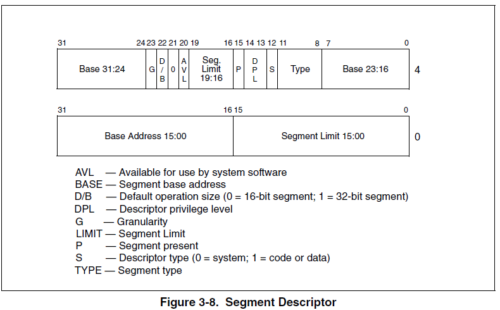

[はじめてのOSコードリーディング ~UNIX V6で学ぶカーネルのしくみ](https://amzn.to/3q8TU3K)にインスパイアされて[xv6 OS](https://github.com/mit-pdos/xv6-public)を読んでます。

UNIX V6自体はx86CPUでは動作しないため、基本的には、UNIXv6をX86アーキテクチャで動くようにした[xv6 OS](https://github.com/mit-pdos/xv6-public)のリポジトリをForkした[kash1064/xv6-public: xv6 OS](https://github.com/kash1064/xv6-public)のソースコードを読んでいくことにしました。

[前回](/unix-xv6-007-kernel-main-04)は`main`関数で実行される`lapicinit`関数によるローカルAPICの設定を確認しました。

今回は`seginit`関数の挙動を追っていきます。

<!-- omit in toc -->
## もくじ
- [seginit関数](#seginit関数)
  - [cpus関数](#cpus関数)
  - [GDTのセット](#gdtのセット)
- [まとめ](#まとめ)
- [参考書籍](#参考書籍)

## seginit関数

`seginit`関数はCPUにカーネルセグメントディスクリプタを設定します。

``` c
seginit();       // segment descriptors
```

`seginit`関数は`vm.c`で以下のように定義されています。

``` c
// Set up CPU's kernel segment descriptors.
// Run once on entry on each CPU.
void seginit(void)
{
  struct cpu *c;

  // Map "logical" addresses to virtual addresses using identity map.
  // Cannot share a CODE descriptor for both kernel and user
  // because it would have to have DPL_USR, but the CPU forbids
  // an interrupt from CPL=0 to DPL=3.
  c = &cpus[cpuid()];
  c->gdt[SEG_KCODE] = SEG(STA_X|STA_R, 0, 0xffffffff, 0);
  c->gdt[SEG_KDATA] = SEG(STA_W, 0, 0xffffffff, 0);
  c->gdt[SEG_UCODE] = SEG(STA_X|STA_R, 0, 0xffffffff, DPL_USER);
  c->gdt[SEG_UDATA] = SEG(STA_W, 0, 0xffffffff, DPL_USER);
  lgdt(c->gdt, sizeof(c->gdt));
}
```

ソースコードを読んでいきます。

まず、`cpu`構造体は`proc.h`で次のように定義されていました。

``` c
// Per-CPU state
struct cpu {
  uchar apicid;                // Local APIC ID
  struct context *scheduler;   // swtch() here to enter scheduler
  struct taskstate ts;         // Used by x86 to find stack for interrupt
  struct segdesc gdt[NSEGS];   // x86 global descriptor table
  volatile uint started;       // Has the CPU started?
  int ncli;                    // Depth of pushcli nesting.
  int intena;                  // Were interrupts enabled before pushcli?
  struct proc *proc;           // The process running on this cpu or null
};
```

`cpu`構造体は、配列`cpus`に格納されています。

これは、[マルチプロセッサ 編](/unix-xv6-006-kernel-main-03)で見た通り`param.h`で定義された`NCPU`に設定されている通り、最大8つのCPUをサポートする配列です。

### cpus関数

配列`cpus`から`cpu`構造体を取得する箇所を見てみます。

``` c
struct cpu *c;
c = &cpus[cpuid()];
```

`cpuid`関数は`proc.c`で以下のように定義された関数です。

`mycpu`関数の戻り値から`cpu`を引いた値を返します(何やってるんだろう…)。

``` c
// Must be called with interrupts disabled
int cpuid() {
  return mycpu()-cpus;
}

// Must be called with interrupts disabled to avoid the caller being
// rescheduled between reading lapicid and running through the loop.
struct cpu* mycpu(void)
{
  int apicid, i;
  
  if(readeflags()&FL_IF) panic("mycpu called with interrupts enabled\n");
  
  apicid = lapicid();
  // APIC IDs are not guaranteed to be contiguous. Maybe we should have
  // a reverse map, or reserve a register to store &cpus[i].
  for (i = 0; i < ncpu; ++i) {
    if (cpus[i].apicid == apicid) return &cpus[i];
  }
  panic("unknown apicid\n");
}
```

`mycpu`関数の肝は以下のコードです。

``` c
apicid = lapicid();
// APIC IDs are not guaranteed to be contiguous. Maybe we should have
// a reverse map, or reserve a register to store &cpus[i].
for (i = 0; i < ncpu; ++i) {
  if (cpus[i].apicid == apicid) return &cpus[i];
}
```

`lapicid`関数は、`lapic.c`で定義されている、ローカルAPICからAPICIDを取得して24bitの右シフトを行ったものを返却する関数です。

``` c
int lapicid(void)
{
  if (!lapic) return 0;
  return lapic[ID] >> 24;
}
```

変数`lapic`には、[マルチプロセッサ 編](/unix-xv6-006-kernel-main-03)で見た通り`mp.c`でローカルAPICのアドレスが格納されています。

Intelのマルチプロセッサ仕様書(5-1)によると、ローカルAPICはベースメモリアドレス`0x0FEE00000`に置かれ、ローカルAPICIDは0から始まるハードウェアに連続して割り当てされるようです。

参考：[INTEL MULTIPROCESSOR SPECIFICATION Pdf Download | ManualsLib](https://www.manualslib.com/manual/77733/Intel-Multiprocessor.html)

デバッガで確認してみたところ、初回呼び出し時は`lapic[ID]`の値は0でした。

つまり`lapicid`の戻り値も0になります。

これによって`apicid = lapicid();`の`apicid`には0が入ります。

続くループの処理をデバッガで確認したところ、`cpus[i].apicid `の値も0で`apicid`と一致するため、`&cpus[i]`には`&cpus[0]`が返却さえｒました。

``` c
for (i = 0; i < ncpu; ++i) {
  if (cpus[i].apicid == apicid) return &cpus[i];
}
```

つまり、`return mycpu()-cpus;`も0となり、最初の`cpuid`関数実行時の戻り値は0となることを確認しました。

これによって、初回起動時の`c = &cpus[cpuid()];`は`c = &cpus[0];`となります。

### GDTのセット

というわけで、続く以下の行では、`&cpus[0]`の`gdt[NSEGS]`要素に値をセットしていることがわかります。

``` c
// Map "logical" addresses to virtual addresses using identity map.
// Cannot share a CODE descriptor for both kernel and user
// because it would have to have DPL_USR, but the CPU forbids
// an interrupt from CPL=0 to DPL=3.
c = &cpus[cpuid()];
c->gdt[SEG_KCODE] = SEG(STA_X|STA_R, 0, 0xffffffff, 0);
c->gdt[SEG_KDATA] = SEG(STA_W, 0, 0xffffffff, 0);
c->gdt[SEG_UCODE] = SEG(STA_X|STA_R, 0, 0xffffffff, DPL_USER);
c->gdt[SEG_UDATA] = SEG(STA_W, 0, 0xffffffff, DPL_USER);
lgdt(c->gdt, sizeof(c->gdt));
```

`&cpus[0]`は前述した`cpu`構造体であり、`gdt`は以下のように定義されています。

``` c
struct segdesc gdt[NSEGS];   // x86 global descriptor table
```

`segdesc`構造体は`mmu.h`で定義されている構造体です。

``` c
#ifndef __ASSEMBLER__
// Segment Descriptor
struct segdesc {
  uint lim_15_0 : 16;  // Low bits of segment limit
  uint base_15_0 : 16; // Low bits of segment base address
  uint base_23_16 : 8; // Middle bits of segment base address
  uint type : 4;       // Segment type (see STS_ constants)
  uint s : 1;          // 0 = system, 1 = application
  uint dpl : 2;        // Descriptor Privilege Level
  uint p : 1;          // Present
  uint lim_19_16 : 4;  // High bits of segment limit
  uint avl : 1;        // Unused (available for software use)
  uint rsv1 : 1;       // Reserved
  uint db : 1;         // 0 = 16-bit segment, 1 = 32-bit segment
  uint g : 1;          // Granularity: limit scaled by 4K when set
  uint base_31_24 : 8; // High bits of segment base address
};
```

ちなみに`NSEGS`も、`mmu.h`で定数6として定義されています。

``` c
// cpu->gdt[NSEGS] holds the above segments.
#define NSEGS     6
```

ここで定義されている`segdesc`構造体は、セグメントディスクリプタです。



参考画像：[Intel SDM vol3](http://flint.cs.yale.edu/cs422/doc/24547212.pdf)

セグメントディスクリプタは、[x86CPUのメモリ保護機構に関するメモ書き(GDTとLDT)](/linux-memory-protect-gdt-ldt)で軽く触れたGDTとLDTのエントリとなるデータ構造です。

セグメントディスクリプタは、CPUにセグメントのサイズやアドレス、またアクセス権限や状態を通知します。

x86CPUでは、この仕組みによってメモリ保護を実現していました。

`SEG_KCODE`などのセグメントセレクタと、割り当てしている権限についてはブートストラップを参照したときにも確認したので、この記事では割愛します。

参考：[xv6OSを真面目に読みこんでカーネルを完全に理解する -ブートストラップ編-](/unix-xv6-001-bootstrap)

## まとめ

カーネル側でセグメントディスクリプタの初期化を行いました。

次回は`picinit`関数から。。。

## 参考書籍

- [30日でできる! OS自作入門](https://amzn.to/3qZSCY7)
- [ゼロからのOS自作入門](https://amzn.to/3qXYsZX)
- [はじめてのOSコードリーディング ~UNIX V6で学ぶカーネルのしくみ](https://amzn.to/3q8TU3K)
- [詳解 Linuxカーネル](https://amzn.to/3I6fkVt)
- [作って理解するOS x86系コンピュータを動かす理論と実装](https://amzn.to/3JRUdI2)