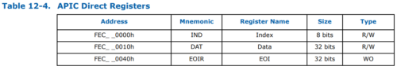
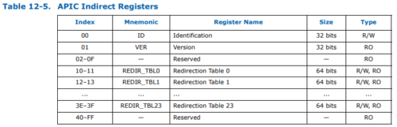
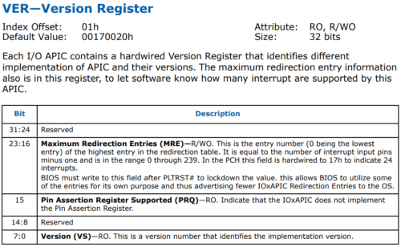
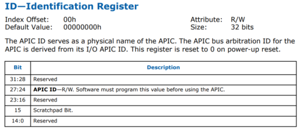
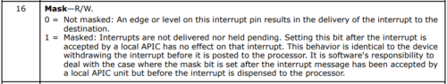

[はじめてのOSコードリーディング ~UNIX V6で学ぶカーネルのしくみ](https://amzn.to/3q8TU3K)にインスパイアされて[xv6 OS](https://github.com/mit-pdos/xv6-public)を読んでます。

UNIX V6自体はx86CPUでは動作しないため、基本的には、UNIXv6をX86アーキテクチャで動くようにした[xv6 OS](https://github.com/mit-pdos/xv6-public)のリポジトリをForkした[kash1064/xv6-public: xv6 OS](https://github.com/kash1064/xv6-public)のソースコードを読んでいくことにしました。

[前回](/unix-xv6-008-kernel-main-05)は`main`関数で実行される`seginit`関数を確認しました。

今回は`picinit`関数と`ioapicinit`関数の挙動を追っていきます。

<!-- omit in toc -->
## もくじ
- [picinit関数](#picinit関数)
- [ioapicinit関数](#ioapicinit関数)
  - [メモリマップされたIOAPICレジスタ領域の参照](#メモリマップされたioapicレジスタ領域の参照)
  - [Dataレジスタ経由でデータの読み書きを行う](#dataレジスタ経由でデータの読み書きを行う)
  - [Redirection Tableの初期化](#redirection-tableの初期化)
- [まとめ](#まとめ)
- [参考書籍](#参考書籍)

## picinit関数

`picinit`関数は`picirq.c`で定義された関数です。

以下の通りかなり小さい関数です。

```c
#include "types.h"
#include "x86.h"
#include "traps.h"

// I/O Addresses of the two programmable interrupt controllers
#define IO_PIC1         0x20    // Master (IRQs 0-7)
#define IO_PIC2         0xA0    // Slave (IRQs 8-15)

// Don't use the 8259A interrupt controllers.  Xv6 assumes SMP hardware.
void picinit(void)
{
  // mask all interrupts
  outb(IO_PIC1+1, 0xFF);
  outb(IO_PIC2+1, 0xFF);
}

//PAGEBREAK!
// Blank page.
```

`outb`は`x86.h`で定義された以下の関数です。

``` c
static inline void outb(ushort port, uchar data)
{
  asm volatile("out %0,%1" : : "a" (data), "d" (port));
}
```

任意のポートにデータを送信するアセンブリを発行します。

参考：[assembly - what does "outb" in AT&T asm mean? - Stack Overflow](https://stackoverflow.com/questions/8365746/what-does-outb-in-att-asm-mean)

ここでは、`0x21`と`0xA1`という`8259 PIC`に関連したポートをマスクしています。

`8259 PIC`は、割込み要求を受け入れ、CPUに送信する割込みコントローラですが、SMPをサポートするxv6OSではAPICによる割込みを実装するため、無効化する必要があります。

ここで、`0x21`と`0xA1`は、どちらも`8259 PIC`のデータポートになります。

以下のOSDevのWikiにある通り、ローカルAPICとIOAPICによる割込みを実装する場合は、これらのデータポートに`0xFF`を設定して`8259 PIC`を無効化します。

参考：[8259 PIC - OSDev Wiki](https://wiki.osdev.org/PIC)

参考：[assembly - I/O Port Addressing - Stack Overflow](https://stackoverflow.com/questions/62329557/i-o-port-addressing)

## ioapicinit関数

`picinit`関数の処理が完了し、PICが無効化されました。

続いて、`ioapic.c`で定義された`ioapicinit`関数が`main`関数から呼び出されます。

この関数では、IOAPICの初期化を行います。

``` c
void ioapicinit(void)
{
  int i, id, maxintr;

  ioapic = (volatile struct ioapic*)IOAPIC;
  maxintr = (ioapicread(REG_VER) >> 16) & 0xFF;
  id = ioapicread(REG_ID) >> 24;
  if(id != ioapicid) cprintf("ioapicinit: id isn't equal to ioapicid; not a MP\n");

  // Mark all interrupts edge-triggered, active high, disabled,
  // and not routed to any CPUs.
  for(i = 0; i <= maxintr; i++){
    ioapicwrite(REG_TABLE+2*i, INT_DISABLED | (T_IRQ0 + i));
    ioapicwrite(REG_TABLE+2*i+1, 0);
  }
}

```

コードを順番に見ていきます。

### メモリマップされたIOAPICレジスタ領域の参照

`ioapic = (volatile struct ioapic*)IOAPIC;`の行では変数`ioapic`に`ioapic`構造体を設定しています。

`IOAPIC`は`0xFEC00000`として`ioapic.c`で定義されています。

``` c
// ioapic.c
#define IOAPIC  0xFEC00000   // Default physical address of IO APIC
```

IOAPICのアドレスはデフォルトで`0xFEC00000`になることが保証されているため、このアドレスを固定値として指定しています。

参考：[x86 - About the IO-APIC 82093AA - Stack Overflow](https://stackoverflow.com/questions/24828186/about-the-io-apic-82093aa)

`ioapic`構造体は、以下のように非常にシンプルな構造になっています。

``` c
// IO APIC MMIO structure: write reg, then read or write data.
struct ioapic {
  uint reg;
  uint pad[3];
  uint data;
};
```

参考：[Memory Mapped Registers for Accessing IOAPIC Registers](http://web.archive.org/web/20161130153145/http://download.intel.com/design/chipsets/datashts/29056601.pdf)



参考画像：[Intel 9 Series Chipset Platform Controller Hub Datasheet](https://www.intel.com/content/dam/www/public/us/en/documents/datasheets/9-series-chipset-pch-datasheet.pdf)

最初の`reg`がインデックスとして使用され、`data`の領域を利用して読み書きを行われます。

実際に起動時に`ioapic`の領域に格納される値がどうなっているのか気になったのでデバッガで確認してみました。

`0xFEC00000`から20バイト分の領域を見てみましたが、この時点ではすべて0でした。

``` bash
$ x/5wx 0xfec00000
0xfec00000:	0x00000000	0x00000000	0x00000000	0x00000000
0xfec00010:	0x00000000
```

### Dataレジスタ経由でデータの読み書きを行う

続いて以下のコードを見ます。

``` c
maxintr = (ioapicread(REG_VER) >> 16) & 0xFF;
id = ioapicread(REG_ID) >> 24;
if(id != ioapicid) cprintf("ioapicinit: id isn't equal to ioapicid; not a MP\n");
```

`ioapicread`関数は、引数として受け取った値を`ioapic`の`reb`に書き込み、その後`data`の値を取得して返却する関数です。

``` c
static uint ioapicread(int reg)
{
  ioapic->reg = reg;
  return ioapic->data;
}
```

IOAPICでは、`ioapic->reg`がインデックスレジスタとして使用され、間接的にデータの読み書きを行うことができます。

インデックスレジスタとレジスタの対応は以下の通りです。



参考画像：[Intel 9 Series Chipset Platform Controller Hub Datasheet](https://www.intel.com/content/dam/www/public/us/en/documents/datasheets/9-series-chipset-pch-datasheet.pdf)

参考：[I/O APICについて - 睡分不足](https://mmi.hatenablog.com/entry/2017/04/09/132708)

`maxintr = (ioapicread(REG_VER) >> 16) & 0xFF;`の行では、インデックスレジスタに1を指定してバージョン情報を取得しています。

``` bash
$ x/5wx 0xfec00000
0xfec00000:	0x00000001	0x00000000	0x00000000	0x00000000
0xfec00010:	0x00170020
```

`maxintr`には`0x17`が入ります。

これはバージョンレジスタの23:16bitの範囲にあるMREを取得しているようです。

ここで取得できる情報は割込み入力PINの数から1を引いた数になるみたいです。(おそらくこれが定義できる割込みの最大数に?)



参考画像：[Intel 9 Series Chipset Platform Controller Hub Datasheet](https://www.intel.com/content/dam/www/public/us/en/documents/datasheets/9-series-chipset-pch-datasheet.pdf)

次の行では`id`として`0x0`を取得しました。

これはIDレジスタの27:24bitの範囲の値でAPIC IDの値になります。(1つ目が0なのでたぶん初回実行時の値が0になっている?)



参考画像：[Intel 9 Series Chipset Platform Controller Hub Datasheet](https://www.intel.com/content/dam/www/public/us/en/documents/datasheets/9-series-chipset-pch-datasheet.pdf)

この値が`ioapicid`と一致するかを検証しています。

`ioapicid`は[マルチプロセッサ編](/unix-xv6-006-kernel-main-03)で見た通り、MPコンフィグレーションテーブルから取得したAPICの番号でした。

### Redirection Tableの初期化

最後に、`ioapicwrite`関数で全ての`Redirection Table`を無効化しています。

``` c
// Mark all interrupts edge-triggered, active high, disabled,
// and not routed to any CPUs.
for(i = 0; i <= maxintr; i++){
  ioapicwrite(REG_TABLE+2*i, INT_DISABLED | (T_IRQ0 + i));
  ioapicwrite(REG_TABLE+2*i+1, 0);
}
```

`ioapicwrite`関数は以下のようにインデックスと書き込みデータを使用して書き込みを行う関数です。

``` c
static void ioapicwrite(int reg, uint data)
{
  ioapic->reg = reg;
  ioapic->data = data;
}
```

`INT_DISABLED`は、`0x00010000`として定義されています。

これによって、17番目のbitに1をセットすることができます。



参考画像：[Intel 9 Series Chipset Platform Controller Hub Datasheet](https://www.intel.com/content/dam/www/public/us/en/documents/datasheets/9-series-chipset-pch-datasheet.pdf)

このbitはMaskフラグになっており、セットされた場合割込みが送信されなくなります。

下位8bitに設定している値は割込みベクタです。

なんで初期化時に無効化してるんでしょうか。。

たぶん以降のコードを読めばわかると思うので引き続き進めていこうと思います。

## まとめ

今回は`picinit`と`ioapicinit`まで読み進めました。

まだ読んでいない`main`関数で実行している関数も残り10個になり、折り返しに差し掛かってきました。

次回は`consoleinit`関数を読んでいきます。

## 参考書籍

- [30日でできる! OS自作入門](https://amzn.to/3qZSCY7)
- [ゼロからのOS自作入門](https://amzn.to/3qXYsZX)
- [はじめてのOSコードリーディング ~UNIX V6で学ぶカーネルのしくみ](https://amzn.to/3q8TU3K)
- [詳解 Linuxカーネル](https://amzn.to/3I6fkVt)
- [作って理解するOS x86系コンピュータを動かす理論と実装](https://amzn.to/3JRUdI2)