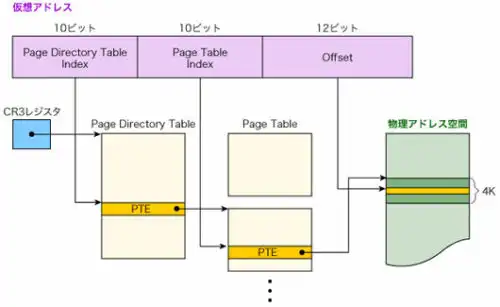
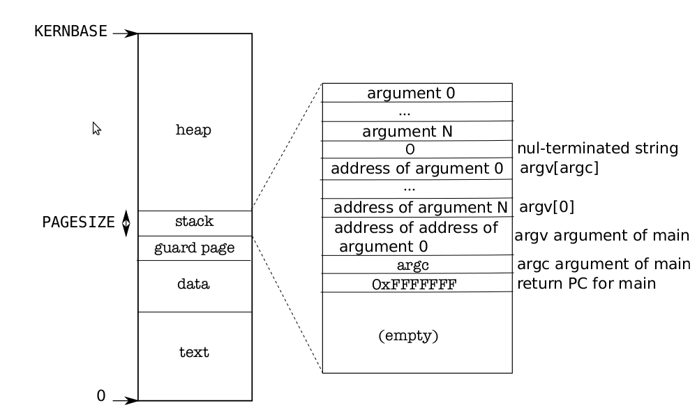

[はじめてのOSコードリーディング ~UNIX V6で学ぶカーネルのしくみ](https://amzn.to/3q8TU3K)にインスパイアされて[xv6 OS](https://github.com/mit-pdos/xv6-public)を読んでます。

UNIX V6自体はx86CPUでは動作しないため、基本的には、UNIXv6をX86アーキテクチャで動くようにした[xv6 OS](https://github.com/mit-pdos/xv6-public)のリポジトリをForkした[kash1064/xv6-public: xv6 OS](https://github.com/kash1064/xv6-public)のソースコードを読んでいくことにしました。

[前回](/unix-xv6-011-kernel-main-08)は`main`関数で実行される`uartinit`関数の動きを確認しました。

今回は`pinit`関数の挙動を追っていきます。

<!-- omit in toc -->

## もくじ


## pinit関数

`pinit`関数は、`proc.c`で以下のように定義されている関数です。

中身はシンプルで`initlock`関数で`ptable`構造体の持つ`spinlock`構造体を初期化しています。

``` c
void pinit(void)
{
  initlock(&ptable.lock, "ptable");
}
```

`initlock`関数は[メモリ割り当て・排他制御 編](/unix-xv6-004-kernel-main-01)で見た通り`spinlock.c`で定義された関数で、`kmem`構造体内の`spinlock`構造体の初期化を行う関数です。

`spinlock`構造体は`spinlock.h`で定義された以下の構造体で、排他制御のためのメモリロックを行う際に使用します。

``` c
// Mutual exclusion lock.
struct spinlock {
  uint locked;       // Is the lock held?

  // For debugging:
  char *name;        // Name of lock.
  struct cpu *cpu;   // The cpu holding the lock.
  uint pcs[10];      // The call stack (an array of program counters)
                     // that locked the lock.
};
```

今回初期化している`ptable`構造体は次のように定義されたものでした。

``` c
struct {
  struct spinlock lock;
  struct proc proc[NPROC];
} ptable;
```

ここで登場している`proc`構造体は`proc.h`で以下のように定義されています。

``` c
// Per-process state
struct proc {
  uint sz;                     // Size of process memory (bytes)
  pde_t* pgdir;                // Page table
  char *kstack;                // Bottom of kernel stack for this process
  enum procstate state;        // Process state
  int pid;                     // Process ID
  struct proc *parent;         // Parent process
  struct trapframe *tf;        // Trap frame for current syscall
  struct context *context;     // swtch() here to run process
  void *chan;                  // If non-zero, sleeping on chan
  int killed;                  // If non-zero, have been killed
  struct file *ofile[NOFILE];  // Open files
  struct inode *cwd;           // Current directory
  char name[16];               // Process name (debugging)
};
```

各要素については併記されているコメントを見ると分かりますが、いくつか気になった点を見ていきます。

まず`pde_t* pgdir`ですが、これは[ページテーブル(PDT/PTD) 編](/unix-xv6-005-kernel-main-02)で確認したとおり`uint`と同義で、PDEのインデックスを指すものです。

復習にはなりますが、PDEとPTEを使った仮想アドレス解決の流れは以下の画像のようになっていました。



参照画像：[第6回 メモリー上のデータを見えなくする（前編） | 日経クロステック（xTECH）](https://xtech.nikkei.com/it/article/COLUMN/20071107/286632/)

xv6では各プロセスごとに個別のページテーブルが用意されます。

そのため、`pde_t* pgdir`が指すのはそのプロセス固有のページテーブルのインデックスとなります。

プロセスの仮想アドレスは0からマッピングされ、最大で`KERNBASE`として定義されている`0x80000000`までの範囲を使用することができます。

実行中のプロセスのユーザメモリの領域は以下の図のようになります。



参照画像：[Chapter 2 Page tables — xv6 0 documentation](https://pekopeko11.sakura.ne.jp/unix_v6/xv6-book/en/Page_tables.html#process-address-space)

詳しくは実際にプロセスを作成する処理を追う際に確認します。

`struct trapframe *tf;`はシステムコールのトラップフレームを格納する構造体で以下のように定義されています。

``` c
//PAGEBREAK: 36
// Layout of the trap frame built on the stack by the
// hardware and by trapasm.S, and passed to trap().
struct trapframe {
  // registers as pushed by pusha
  uint edi;
  uint esi;
  uint ebp;
  uint oesp;      // useless & ignored
  uint ebx;
  uint edx;
  uint ecx;
  uint eax;

  // rest of trap frame
  ushort gs;
  ushort padding1;
  ushort fs;
  ushort padding2;
  ushort es;
  ushort padding3;
  ushort ds;
  ushort padding4;
  uint trapno;

  // below here defined by x86 hardware
  uint err;
  uint eip;
  ushort cs;
  ushort padding5;
  uint eflags;

  // below here only when crossing rings, such as from user to kernel
  uint esp;
  ushort ss;
  ushort padding6;
};
```

こちらも詳細については実際にトラップフレームを書き込む際に見ていきます。

参考：[MITのxv6を読もう - 第3章 trapの処理方法 - - FPGA開発日記](https://msyksphinz.hatenablog.com/entry/2015/07/04/020000)


