この記事では、[WinDbgのユーザモードデバッグチュートリアルを試してみた](/windows-windbg-002-tutorial)で使用したチュートリアルの環境を利用して、WinDbgの基本的なUI操作についてまとめていきます。

WinDbgを用いたWindowsのデバッグやダンプの解析方法について公開している情報については、以下のページに一覧をまとめているので、よければご覧ください。

参考：[WinDbgを用いたデバッグとトラブルシューティングのテクニック](/windows-windbg-001-index)

本記事では、以下の内容についてまとめています。

<!-- omit in toc -->
## もくじ
- [WinDbgのUIについて](#windbgのuiについて)
  - [1. Open Souce File ([Ctrl+O]キー)](#1-open-souce-file-ctrloキー)
  - [2. Insert or remove breakpoint ([F9]キー)](#2-insert-or-remove-breakpoint-f9キー)
  - [3. Command ([Alt+1]キー)](#3-command-alt1キー)
  - [4. Watch （[Alt+2]キー）](#4-watch-alt2キー)
  - [5. Locals （[Alt+3]キー）](#5-locals-alt3キー)
  - [6. Registers （[Alt+4]キー）](#6-registers-alt4キー)
  - [7. Memory Window （[Alt+5]キー）](#7-memory-window-alt5キー)
  - [8. Call Stack ([Alt+6]キー)](#8-call-stack-alt6キー)
  - [9. Disassembly ([Alt+7]キー)](#9-disassembly-alt7キー)
  - [10. Scratch Pad ([Alt+8]キー)](#10-scratch-pad-alt8キー)
  - [11. Processes and Threads ([Alt+9]キー)](#11-processes-and-threads-alt9キー)
  - [12.  Command Brouser ([Ctrl+N]キー)](#12--command-brouser-ctrlnキー)
  - [13.  Source mode ON](#13--source-mode-on)
  - [14.  Source mode OFF](#14--source-mode-off)
  - [15.  Font](#15--font)
  - [16.  Options](#16--options)
- [まとめ](#まとめ)

## WinDbgのUIについて

今回利用しているWinDbgのバージョンは`WinDbg10.0.22000.1 AMD64`です。

こちらはWinDbgを起動した直後のGUIです。管理者権限で起動しています。

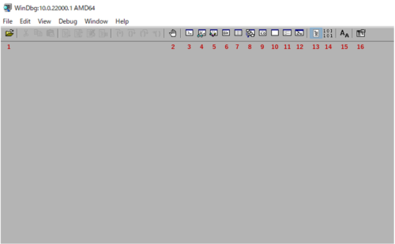

それぞれのボタンは次の機能を持ちます。

| 番号 |            機能             | ショートカット |
| :--: | :-------------------------: | :------------: |
|  1   |       Open Souce File       |     Ctrl+O     |
|  2   | Insert or remove breakpoint |       F9       |
|  3   |           Command           |     Alt+1      |
|  4   |            Watch            |     Alt+2      |
|  5   |           Locals            |     Alt+3      |
|  6   |          Registers          |     Alt+4      |
|  7   |        Memory Window        |     Alt+5      |
|  8   |         Call Stack          |     Alt+6      |
|  9   |         Disassembly         |     Alt+7      |
|  10  |         Scratch Pad         |     Alt+8      |
|  11  |    Processes and Threads    |     Alt+9      |
|  12  |       Command Brouser       |     Ctrl+N     |
|  13  |       Source mode ON        |      N/A       |
|  14  |       Source mode OFF       |      N/A       |
|  15  |            Font             |      N/A       |
|  16  |           Options           |      N/A       |

各ツールバーボタンの説明については、以下のリファレンスに記載があります。

参考：[ツール バー ボタン - Windows drivers | Microsoft Docs](https://docs.microsoft.com/ja-jp/windows-hardware/drivers/debugger/toolbar-buttons)

各ショートカットについても以下のリファレンスに記載があります。

参考：[Keyboard Shortcuts - Windows drivers | Microsoft Docs](https://docs.microsoft.com/en-us/windows-hardware/drivers/debugger/keyboard-shortcuts)

### 1. Open Souce File ([Ctrl+O]キー)

ツールバーの一番左端にある1番のボタンは、`Open Source File`ボタンです。

このボタンをクリックすると、エクスプローラーウィンドウが開き、ソースファイルをWinDbgで開くことができます。
※ 実行ファイルやプロセスへのアタッチはできません。

参考：[File Open Source File - Windows drivers | Microsoft Docs](https://docs.microsoft.com/en-us/windows-hardware/drivers/debugger/file---open-source-file)

ショートカットキーは[Ctrl+O]キーです。

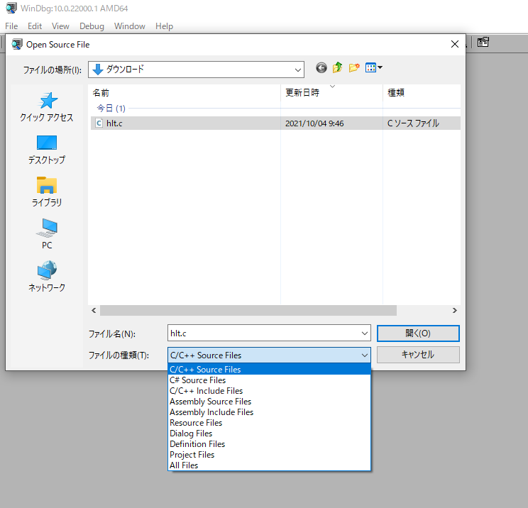

ソースファイルを開くと、以下のようにWinDbg上でソースファイルの中のソースコードを参照することができます。
※ これは読み取り専用であり、書き込みはできません。

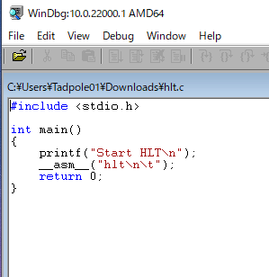

### 2. Insert or remove breakpoint ([F9]キー)

2番のボタンは、`Insert or remove breakpoint`です。

アクティブなウィンドウがSourceウィンドウか、Disassemblyウィンドウのときのみ利用可能です。

このボタンを任意の箇所を選択した状態で押すことで、ブレークポイントの設定を切り替えることができます。

ショートカットキーは、[F9]キーです。

参考：[Edit Breakpoints - Windows drivers | Microsoft Docs](https://docs.microsoft.com/en-us/windows-hardware/drivers/debugger/edit---breakpoints)

例えば、次の例では、メモ帳アプリの`notepad!wWinMain`にブレークポイントが設定されています。

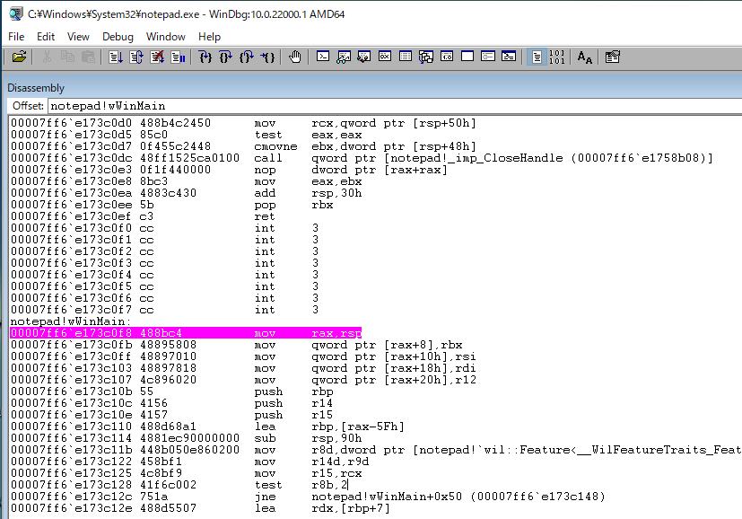

ここで、ブレークポイントに設定された箇所（色のついた行）にカーソルを置いた状態で`Insert or remove breakpoint`ボタンか、[F9]キーを押すことで、ブレークポイント設定を解除できます。

逆に、ブレークポイントに設定されていない箇所（色のついていない行）でこのボタンを実行することで、新たなブレークポイントを設定することもできます。

### 3. Command ([Alt+1]キー)

Commandウィンドウが閉じている状態で3番のボタンをクリックすることで、新たにCommandウィンドウを開くことができます。

ショートカットキーは[Alt+1]キーです。

参考：[View Command - Windows drivers | Microsoft Docs](https://docs.microsoft.com/en-us/windows-hardware/drivers/debugger/view---command)

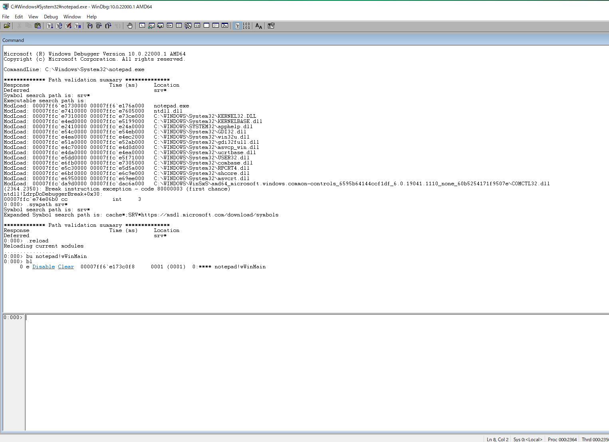

### 4. Watch （[Alt+2]キー）

4番のボタンをクリックすることで、Watchウィンドウを開くことができます。

ショートカットキーは[Alt+2]キーです。

参考：[View Watch - Windows drivers | Microsoft Docs](https://docs.microsoft.com/en-us/windows-hardware/drivers/debugger/view---watch)

Watchウィンドウには、グローバル変数、ローカル変数、レジスタに関する情報が表示されます。
Watchウィンドウの詳細については以下のドキュメントを参照してください。

参考：[ウォッチ ウィンドウの使用 - Windows drivers | Microsoft Docs](https://docs.microsoft.com/ja-jp/windows-hardware/drivers/debugger/watch-window)

### 5. Locals （[Alt+3]キー）

5番のボタンをクリックすることで、Localsウィンドウを開くことができます。

ショートカットキーは[Alt+3]キーです。

参考：[ローカルの表示 - Windows drivers | Microsoft Docs](https://docs.microsoft.com/ja-jp/windows-hardware/drivers/debugger/view---locals)

Localsウィンドウでは、ローカル変数を一覧することができます。

参考：[WinDbg でのローカル変数の表示と編集 - Windows drivers | Microsoft Docs](https://docs.microsoft.com/ja-jp/windows-hardware/drivers/debugger/locals-window)

### 6. Registers （[Alt+4]キー）

6番のボタンをクリックすることで、Registersウィンドウを開くことができます。

ショートカットキーは[Alt+4]キーです。

参考：[レジスタの表示 - Windows drivers | Microsoft Docs](https://docs.microsoft.com/ja-jp/windows-hardware/drivers/debugger/view---registers)

Registersウィンドウを用いたレジスタの表示と編集方法については、以下のドキュメントを参照してください。

参考：[WinDbg でのレジスタの表示と編集 - Windows drivers | Microsoft Docs](https://docs.microsoft.com/ja-jp/windows-hardware/drivers/debugger/registers-window)

### 7. Memory Window （[Alt+5]キー）

7番のボタンをクリックすることで、Memoryウィンドウを開くことができます。

ショートカットキーは[Alt+5]キーです。

参考：[メモリの表示 - Windows drivers | Microsoft Docs](https://docs.microsoft.com/ja-jp/windows-hardware/drivers/debugger/view---memory)

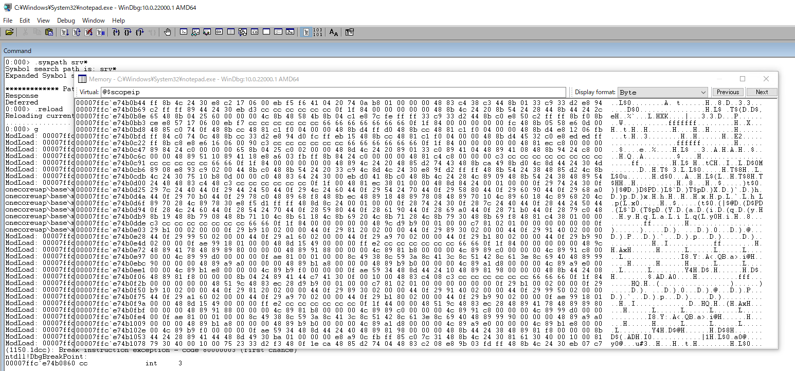

Memoryウィンドウの用法については以下のドキュメントを参照してください。

参考：[WinDbg でのメモリの表示と編集 - Windows drivers | Microsoft Docs](https://docs.microsoft.com/ja-jp/windows-hardware/drivers/debugger/memory-window)

### 8. Call Stack ([Alt+6]キー)

8番のボタンをクリックすることで、Call Stackウィンドウを開くことができます。

ショートカットキーは[Alt+6]キーです。

参考：[呼び出し履歴の表示 - Windows drivers | Microsoft Docs](https://docs.microsoft.com/ja-jp/windows-hardware/drivers/debugger/view---call-stack)

Call Stackウィンドウにはスタック内の呼び出し履歴情報が表示されます。

これは、Commandウィンドウで`k`コマンドを実行して呼び出したスタックトレースの情報と同一になります。

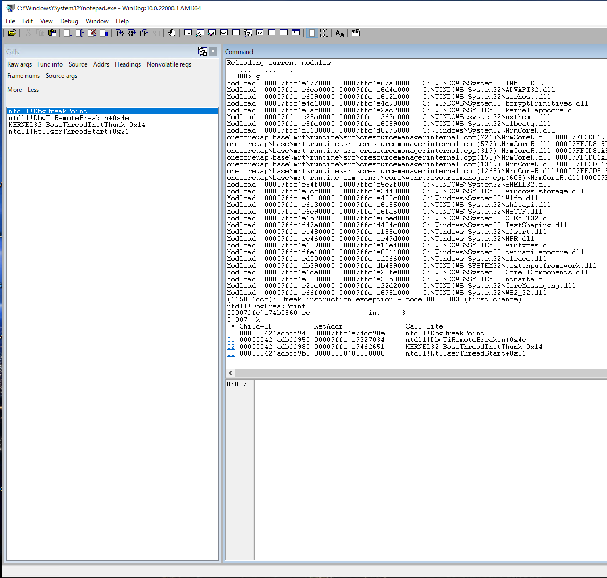

Call Stackウィンドウについては以下のドキュメントを参照してください。

参考：[WinDbg でのコール スタックの表示 - Windows drivers | Microsoft Docs](https://docs.microsoft.com/ja-jp/windows-hardware/drivers/debugger/calls-window)

### 9. Disassembly ([Alt+7]キー)

9番のボタンをクリックすることで、Disassemblyウィンドウを開くことができます。

ショートカットキーは[Alt+7]キーです。

参考：[逆アセンブリの表示 - Windows drivers | Microsoft Docs](https://docs.microsoft.com/ja-jp/windows-hardware/drivers/debugger/view---disassembly)

Disassemblyウィンドウでは、デバッグ対象のアセンブリコードを表示することができます。

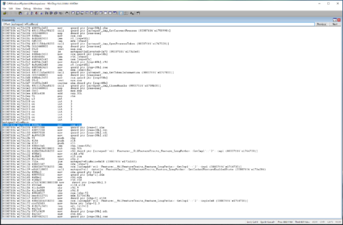

Disassemblyウィンドウについては以下を参照してください。

参考：[WinDbg でのアセンブリ コードのデバッグ - Windows drivers | Microsoft Docs](https://docs.microsoft.com/ja-jp/windows-hardware/drivers/debugger/disassembly-window)

### 10. Scratch Pad ([Alt+8]キー)

10番のボタンをクリックすることで、Scratch Pad ウィンドウを開くことができます。

ショートカットキーは[Alt+8]キーです。

Scratch Padとは、テキストを入力し、保存できるクリップボードです。

参考：[スクラッチ パッドの使用 - Windows drivers | Microsoft Docs](https://docs.microsoft.com/ja-jp/windows-hardware/drivers/debugger/scratch-pad)

### 11. Processes and Threads ([Alt+9]キー)

11番のボタンをクリックすることで、Processes and Threadsウィンドウを開くことができます。

ショートカットキーは [Alt+9]キーです。

このウィンドウでは、デバッグ中のすべてのプロセスの一覧を参照できます。
以下の画像の例では、`notepad.exe`のプロセスの下に、プロセス内のスレッドがツリー状に表示されています。

ここで、プロセスの表示は`<デバッガーが使用する内部の10進数プロセスインデックス>:<16進数のプロセス ID> プロセスのアプリケーション名`の形式になります。

また、各スレッドの表示は、`<デバッガーが使用する内部の10進数のスレッドインデックス>:<16進数のスレッド ID>`を意味します。

参考：[WinDbg でのプロセスとスレッドの制御 - Windows drivers | Microsoft Docs](https://docs.microsoft.com/ja-jp/windows-hardware/drivers/debugger/processes-and-threads-window)

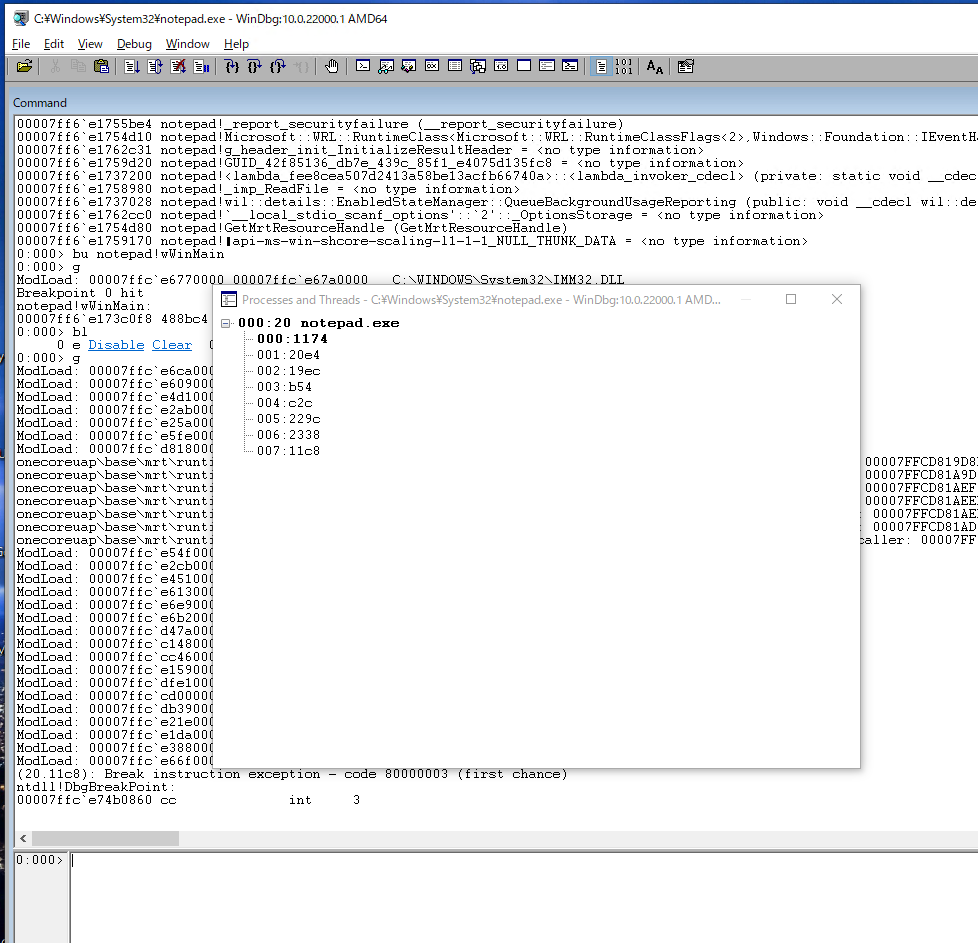

### 12.  Command Brouser ([Ctrl+N]キー)

12番のボタンをクリックすることで、Command Brouserウィンドウを開くことができます。

ショートカットキーは[Ctrl+N]キーです。

このウィンドウでは、コマンドの出力結果を取得することができます。

実行するコマンドは、Commandウィンドウで入力するコマンドと同一ですが、コマンドの実行履歴などを利用して効率的なコマンド実行を実現できます。

参考：[WinDbg でのコマンド ブラウザー ウィンドウの使用 - Windows drivers | Microsoft Docs](https://docs.microsoft.com/ja-jp/windows-hardware/drivers/debugger/command-browser-window)

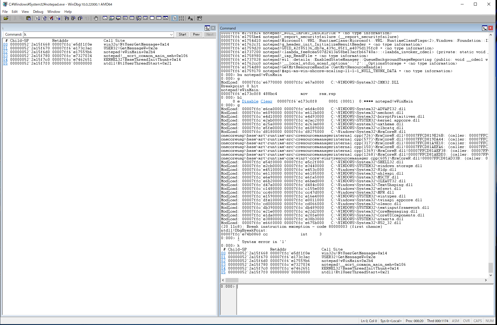

### 13.  Source mode ON

デバッガーをソースモードに切り替えます。

ソースモードがアクティブである場合、ステータスバーで ASM を使用することはできません。

参考：[デバッグソースモード - Windows drivers | Microsoft Docs](https://docs.microsoft.com/ja-jp/windows-hardware/drivers/debugger/debug---source-mode)

### 14.  Source mode OFF

デバッガーをアセンブリモードに切り替えます。

参考：[デバッグソースモード - Windows drivers | Microsoft Docs](https://docs.microsoft.com/ja-jp/windows-hardware/drivers/debugger/debug---source-mode)

### 15.  Font

デバッグウィンドウのフォントを変更できます。

参考：[フォントの表示 - Windows drivers | Microsoft Docs](https://docs.microsoft.com/ja-jp/windows-hardware/drivers/debugger/view---font)

### 16.  Options

オプションウィンドウを開きます。
オプションウィンドウでは、以下の項目を設定可能です。

- ソースウィンドウでタブ文字を表示する場合のタブの幅
- 同時に開くことができるドキュメントまたはソースウィンドウの数
- ソース言語の解析によるシンタックスハイライトを有効化します
- マウスホバー時の解析を有効化します
- Enterキーで直前のコマンドを再実行する機能を有効化します
- 自動スクロール機能を制御します
- ワークスペースをWinDbgに保存する時間と頻度を制御します
- 簡易編集モードを有効化します
- 表示されるテキストの色を変更します

参考：[オプションの表示 - Windows drivers | Microsoft Docs](https://docs.microsoft.com/ja-jp/windows-hardware/drivers/debugger/view---options)

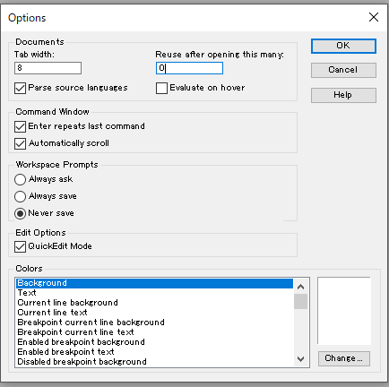

## まとめ

今回は、WinDbgを用いたデバッグや解析の際に利用するウィンドウのインターフェースについてまとめました。

WinDbgを用いたWindowsのデバッグやダンプの解析方法について公開しているその他情報については、以下のページのリストをご覧ください。

参考：[WinDbgを用いたデバッグとトラブルシューティングのテクニック](/windows-windbg-001-index)
