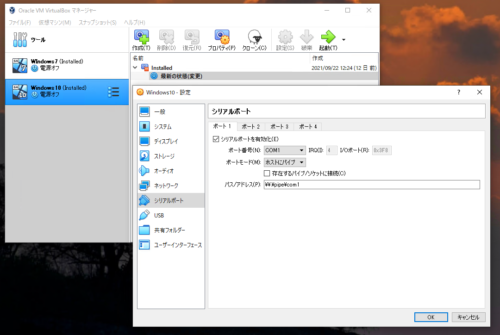
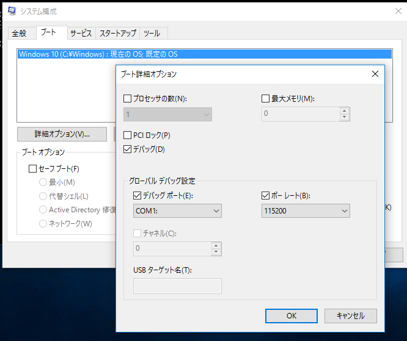
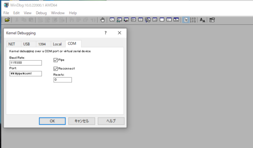
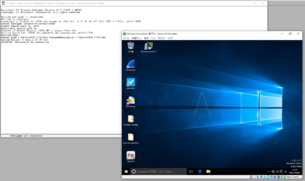
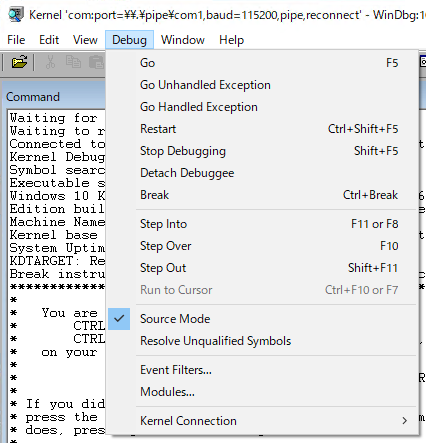
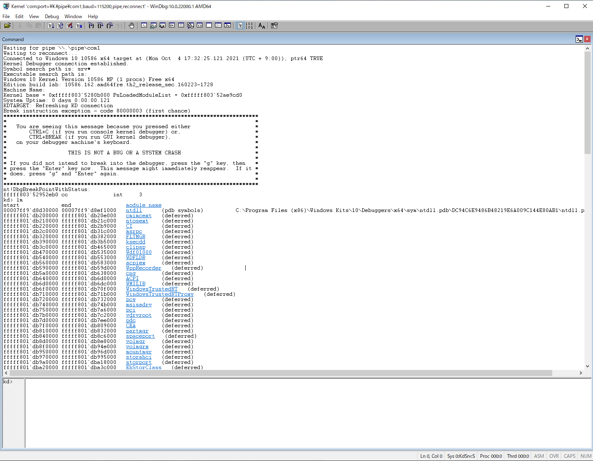
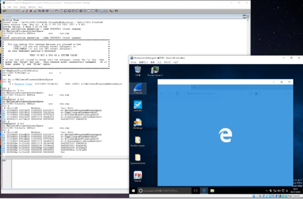

WinDbgによるWindowsデバッグやダンプ解析によるトラブルシューティングに習熟することを目指しています。

[WinDbgのユーザモードデバッグチュートリアルを試してみた](/windows-windbg-002-tutorial)の記事では、公式チュートリアルの内容を参考にWinDbgでユーザモードプロセスのデバッグを行う最初の一歩について紹介しました。

今回の記事では、WinDbgを用いてカーネル モードデバッグを実施する方法についてまとめます。

WinDbgを用いたWindowsのデバッグやダンプの解析方法について公開している情報については、以下のページに一覧をまとめているので、よければご覧ください。

参考：[WinDbgを用いたデバッグとトラブルシューティングのテクニック](/windows-windbg-001-index)

この記事では以下の内容についてまとめています。

<!-- omit in toc -->
## もくじ
- [カーネルモードデバッグのための環境構築](#カーネルモードデバッグのための環境構築)
  - [今回使用する環境](#今回使用する環境)
  - [VirtualBoxの設定変更](#virtualboxの設定変更)
  - [カーネルモードデバッグの有効化](#カーネルモードデバッグの有効化)
  - [WinDbgの設定をする](#windbgの設定をする)
- [WinDbgでカーネルデバッグを行う](#windbgでカーネルデバッグを行う)
  - [WinDbgからカーネルを停止する](#windbgからカーネルを停止する)
  - [カーネルモードデバッグでモジュール一覧を表示する](#カーネルモードデバッグでモジュール一覧を表示する)
  - [カーネルモジュールにブレークポイントを設定する](#カーネルモジュールにブレークポイントを設定する)
- [まとめ](#まとめ)


## カーネルモードデバッグのための環境構築

WinDbgを用いてカーネルモードデバッグを行うためには、WinDbgを使用する「ホストコンピュータ」と、デバッグ対象のターゲットコンピュータの2つを用意し、下記のいずれかの方法で接続する必要があります。

- イーサネット
- USB 2.0 / USB 3.0
- シリアル (null モデムとも呼ばれる)

参考：[WinDbg の概要 (カーネル モード) - Windows drivers | Microsoft Docs](https://docs.microsoft.com/ja-jp/windows-hardware/drivers/debugger/getting-started-with-windbg--kernel-mode-)

※ より正確には、すべてのカーネルプロセスにアクセスしてデバッグを行うためには2台のマシンが必要です。
1台のマシンでローカルカーネルデバッグを実施することもできますが、OSの稼働を止める必要があるような解析は行うことができず、制限が発生します。

参考：[単一コンピューターのローカル カーネル デバッグの手動設定 - Windows drivers | Microsoft Docs](https://docs.microsoft.com/ja-jp/windows-hardware/drivers/debugger/setting-up-local-kernel-debugging-of-a-single-computer-manually)

なお、通常カーネルモードデバッグを行う際には2台のコンピュータが必要ですが、WinDbgは仮想マシンにインストールしたWindowsに対してもカーネルモードデバッグを行うことができます。

今回は、VirtualBox上に構築したWindowsマシンに対してカーネルモードデバッグを仕掛けていきます。

### 今回使用する環境

- ホストマシン
  - Windows10 Pro 20H2
  - WinDbg 10.0.22000.1 AMD64 (管理者権限で起動)
  - VirtualBox 6.1.26
- ターゲットマシン
  - Windows 10 Pro 1511 (VirtualBox上に構築)

### VirtualBoxの設定変更

今回は、VirtualBox側ですでにWindowsの仮想マシンが構築されていることを前提とします。

カーネルモードデバッグを行うために、VirtualBoxの仮想マシン側でCOMポートの設定を行います。

1. ホストマシンのVirtualBoxマネージャで、デバッグ対象の仮想マシンの設定を開きます。
2. 次に[シリアルポート]の設定項目を開き、[ポート1]を有効化します。
3. ここで、以下の設定をそれぞれ実施します。

- ポート番号：COM1
- ポートモード：ホストにパイプ
- パス/アドレス：`\\.\pipe\com1`



これでVirtualBox側の設定は完了したので、仮想マシンを起動します。

### カーネルモードデバッグの有効化

仮想マシンが起動したら、コマンドラインを管理者権限で起動して、以下のコマンドを入力します。

``` powershell
bcdedit /debug on
bcdedit /dbgsettings serial debugport:1 baudrate:115200
```

もしくは、`Msconfig.exe`を起動して、詳細オプションからCOM1ポートを指定してデバッグを有効化します。



上記の設定が完了したら、ホストマシン側でWinDbgの設定を行います。

### WinDbgの設定をする

ホストマシン側で、WinDbgを管理者権限で起動します。

カーネルモードデバッグの場合は、WinDbgも管理者権限で起動しておく必要があります。
もしユーザモードで起動している場合は、`Kernel debugger failed initialization, Win32 error 5 アクセス拒否されました`というエラーとともにカーネルモードデバッグに失敗します。

WinDbgを管理者権限で起動したら、[File]>[Kernel Debug]を選択し、以下の画像のように名前付きパイプを利用してターゲットマシンに接続させます。



ここまで完了したところで[OK]をクリックすると、カーネルデバッグ用のCommandウィンドウが起動し、COMポートへの接続を待機し始めます。

``` powershell
Waiting for pipe \\.\pipe\com1
Waiting to reconnect...
```

最後に、ターゲット側のWindowsマシンを再起動します。

すると、以下の画面のようにWinDbgがターゲットマシンに接続され、ターゲットマシンがテストモードで起動しました。



これで、WinDbgでWindowsのカーネルデバッグを実施する準備が完了しました。

## WinDbgでカーネルデバッグを行う

WinDbgがCOMポート経由でターゲットマシンに接続したことで、カーネルデバッグの準備が整いました。

しかし、現在はターゲットマシンのWindowsOSが稼働しているため、WinDbgのCommandウィンドウによる操作を行うことができません。

WinDbgでカーネルデバッグを進めるためには、一度Windowsカーネルを停止する必要があります。

### WinDbgからカーネルを停止する

カーネルデバッグのためにWindowsカーネルを停止するには、WinDbg上部のツールバーから[Break]ボタンをクリックするか、[Ctrl+Break]キーを押して下さい。

または、WinDbg上部の[Debug]メニューから[Break]を選択することでも停止が可能です。



すると、次のような出力の後にCommandウィンドウから操作が可能になります。

```powershell
Connected to Windows 10 10586 x64 target at (Mon Oct  4 17:32:25.121 2021 (UTC + 9:00)), ptr64 TRUE
Kernel Debugger connection established.
Symbol search path is: srv*
Executable search path is: 
Windows 10 Kernel Version 10586 MP (1 procs) Free x64
Edition build lab: 10586.162.amd64fre.th2_release_sec.160223-1728
Machine Name:
Kernel base = 0xfffff803`5280b000 PsLoadedModuleList = 0xfffff803`52ae9cd0
System Uptime: 0 days 0:00:00.121
KDTARGET: Refreshing KD connection
Break instruction exception - code 80000003 (first chance)
*******************************************************************************
*                                                                             *
*   You are seeing this message because you pressed either                    *
*       CTRL+C (if you run console kernel debugger) or,                       *
*       CTRL+BREAK (if you run GUI kernel debugger),                          *
*   on your debugger machine's keyboard.                                      *
*                                                                             *
*                   THIS IS NOT A BUG OR A SYSTEM CRASH                       *
*                                                                             *
* If you did not intend to break into the debugger, press the "g" key, then   *
* press the "Enter" key now.  This message might immediately reappear.  If it *
* does, press "g" and "Enter" again.                                          *
*                                                                             *
*******************************************************************************
nt!DbgBreakPointWithStatus:
fffff803`52952eb0 cc              int     3
```

### カーネルモードデバッグでモジュール一覧を表示する

カーネルモードデバッグの場合でも、Commandウィンドウから行う基本的な操作は、[こちらの記事](/windows-windbg-002-tutorial)で紹介したユーザモードデバッグとほぼ同一です。

試しに、`lm`コマンドを実行して読み込まれているモジュールの一覧を出力してみました。



続いて、`x nt!MmCreate*`を実行して、ntモジュールのいくつかのシンボル一覧を取得します。

``` powershell
kd> x nt!MmCreate*
fffff803`52bd46ac nt!MmCreateTeb (MmCreateTeb)
fffff803`52c5733c nt!MmCreatePeb (MmCreatePeb)
fffff803`528ecfb8 nt!MmCreateMdl (MmCreateMdl)
fffff803`528a5fc8 nt!MmCreateSystemSection (MmCreateSystemSection)
fffff803`52c08c40 nt!MmCreateSection (MmCreateSection)
fffff803`52c4a2fc nt!MmCreateProcessAddressSpace (MmCreateProcessAddressSpace)
fffff803`52c08d30 nt!MmCreateCacheManagerSection (MmCreateCacheManagerSection)
fffff803`52c88c8c nt!MmCreateSpecialImageSection (MmCreateSpecialImageSection)
fffff803`5281cda0 nt!MmCreateKernelStack (MmCreateKernelStack)
fffff803`52e2e838 nt!MmCreateMirror (MmCreateMirror)
```

### カーネルモジュールにブレークポイントを設定する

次に、`bu nt!MmCreateProcessAddressSpace`を実行し、ブレークポイントを設定します。

``` powershell
kd> bu nt!MmCreateProcessAddressSpace
kd> bl
     0 e Disable Clear  fffff803`52c4a2fc     0001 (0001) nt!MmCreateProcessAddressSpace
```

ここで`g`コマンドを実行してWindowsカーネルの実行を再開すると、新しいプロセスが起動するごとに設定したブレークポイント設定により、その都度カーネルが停止し、WinDbgによるデバッグモードに移行します。

例えば、今回はターゲットマシン環境でMicrosoft Edgeアプリケーションを起動してみました。
すると、新たなプロセス起動時の処理で`nt!MmCreateProcessAddressSpace`が呼び出されたため、カーネルが停止し、WinDbgでのデバッグが可能になります。

ここから、WinDbgによりWindowsカーネルの処理をステップ実行したり、スタックトレースを参照したり、レジストリの情報を書き換えたり、といった操作が可能になります。

以下の画像は、Microsoft Edgeの起動中の状態までステップ実行し、スタックトレースを出力した状態の画像です。



## まとめ

今回は、WinDbgを用いたカーネルデバッグの設定方法と、簡単な操作について紹介しました。

実際にカーネルデバッグを用いてトラブルシューティングを行うテクニックについては、また違う記事でまとめていく予定です。

WinDbgを用いたWindowsのデバッグやダンプの解析方法について公開しているその他情報については、以下のページのリストをご覧ください。

参考：[WinDbgを用いたデバッグとトラブルシューティングのテクニック](/windows-windbg-001-index)