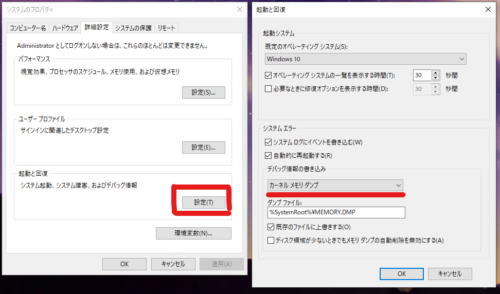
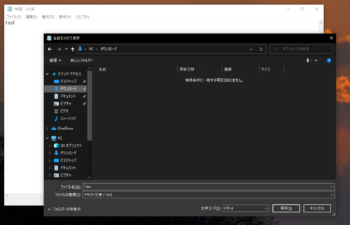
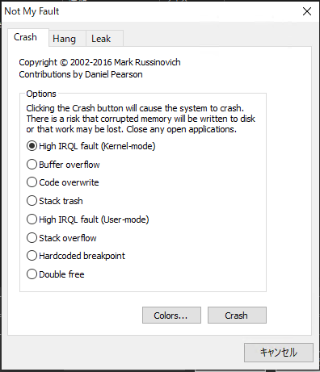
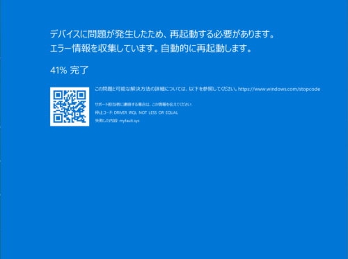
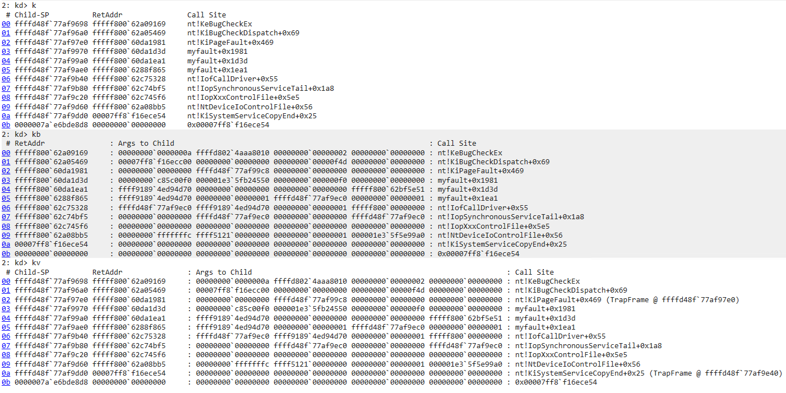

WinDbgによるWindowsデバッグやダンプ解析によるトラブルシューティングに習熟することを目指しています。

[WinDbgでWindows10環境のカーネルデバッグを行う最初の一歩](/windows-windbg-004-kernel-debug)の記事では、WinDbgでカーネルモードデバッグを行う最初の一歩について紹介しました。

今回は、ライブデバッグではなく、カーネルメモリダンプの解析方法について紹介します。

WinDbgを用いたWindowsのデバッグやダンプの解析方法について公開している情報については、以下のページに一覧をまとめているので、よければご覧ください。

参考：[WinDbgを用いたデバッグとトラブルシューティングのテクニック](/windows-windbg-001-index)

この記事では以下の内容についてまとめています。

<!-- omit in toc -->
## もくじ
- [今回利用するツール](#今回利用するツール)
  - [WinDbg Preview](#windbg-preview)
  - [NotMyFault](#notmyfault)
- [カーネルメモリダンプを取得する](#カーネルメモリダンプを取得する)
  - [コントロールパネルから設定を変更する](#コントロールパネルから設定を変更する)
  - [NotMyFaultを取得する](#notmyfaultを取得する)
  - [メモリダンプを取得する](#メモリダンプを取得する)
- [カーネルメモリダンプの解析を行う](#カーネルメモリダンプの解析を行う)
  - [WinDbgにダンプファイルを読み込む](#windbgにダンプファイルを読み込む)
  - [メモリダンプ読み込み時の出力を読む](#メモリダンプ読み込み時の出力を読む)
  - [!analyze -v で自動解析を行う](#analyze--v-で自動解析を行う)
  - [スタックバックトレースの解析](#スタックバックトレースの解析)
  - [トラップフレームからスレッドを復元する](#トラップフレームからスレッドを復元する)
  - [プロセスを確認する](#プロセスを確認する)
- [まとめ](#まとめ)


## 今回利用するツール

今回は、Windows10環境にて、次の2つのツールを使用します。

- WinDbg Preview
- notmyfault64

### WinDbg Preview

WinDbg Previewは、Microsoft Storeから入手可能なUWP版のWinDbgです。

Windows Debug Toolsの中に含まれている従来のWinDbgと比較して、UIがかなりモダンになっていたり、タイムトラベルデバッグ（TTD）に対応していたりと機能強化されています。

なお、従来のWinDbgとは同じエンジンを使用しているらしく、すべての機能が引き続き利用できます。

参考：[WinDbg プレビューを使用したデバッグ - Windows drivers | Microsoft Docs](https://docs.microsoft.com/ja-jp/windows-hardware/drivers/debugger/debugging-using-windbg-preview)

### NotMyFault

NotMyFaultは、本来コンピュータがクラッシュしたときに生成されるメモリダンプを手動で取得するために用いるツールです。

以下のドキュメント内のリンクから取得できます。

参考：[カーネル ダンプまたは完全なクラッシュ ダンプを生成する - Windows Client Management | Microsoft Docs](https://docs.microsoft.com/ja-jp/windows/client-management/generate-kernel-or-complete-crash-dump)

## カーネルメモリダンプを取得する

解析のため、まずはカーネルメモリダンプを取得していきます。

### コントロールパネルから設定を変更する

メモリダンプを取得する端末でコントロールパネルを開き、[システムとセキュリティ]を開きます。

次に[システムの詳細設定]をクリックして、[システムのプロパティ]ウィンドウを開きます。

そして、[起動と回復]セクションの[設定]をクリックし、起動したウィンドウ内の[デバッグ情報の書き込み]の設定を[カーネルメモリダンプ]に変更します。

最終的に、以下の画像の設定になっていればOKです。



### NotMyFaultを取得する

以下のドキュメント内の[メモリダンプファイルを手動で生成する]の項から、NotMyFaultの入ったZIPファイルダウンロードし、解凍します。

参考：[カーネル ダンプまたは完全なクラッシュ ダンプを生成する - Windows Client Management | Microsoft Docs](https://docs.microsoft.com/ja-jp/windows/client-management/generate-kernel-or-complete-crash-dump)

### メモリダンプを取得する

すべてのウィンドウを閉じ、メモ帳アプリを開きます。

適当に文字を書き込んだところで保存を実行し、以下の画像のようにファイルを書き込む前の状態で操作を中断します。



この状態で、先ほど解凍したNotMyFaultを実行します。
※ 途中で同意を求められるのでOKを選択してください。

起動すると次の画面が表示されるので、初期状態のまま[Crash]をクリックします。



すると、Windowsマシンでブルースクリーンが発生して再起動されます。



再起動後、`C:\Windows`直下に、`MEMORY.DMP`が存在することを確認します。
※ 僕の環境では大体450MBくらいになりました。

これでカーネルメモリダンプの取得が完了しました。

## カーネルメモリダンプの解析を行う

### WinDbgにダンプファイルを読み込む

解析を行うために、WinDbgを管理者権限で起動します。

次に、[File]から[Open dump file]を選択し、先ほど出力された`MEMORY.DMP`をインポートします。
（メモリダンプがWinDbgに読み込まれるまで数分かかる場合があります。）

メモリダンプが読み込まれると、以下の出力が確認できます。

``` powershell
Loading Dump File [C:\Windows\MEMORY.DMP]
Kernel Bitmap Dump File: Kernel address space is available, User address space may not be available.

Symbol search path is: srv*
Executable search path is: 
Windows 10 Kernel Version 19041 MP (3 procs) Free x64
Product: WinNt, suite: TerminalServer SingleUserTS
Edition build lab: 19041.1.amd64fre.vb_release.191206-1406
Machine Name:
Kernel base = 0xfffff800`62600000 PsLoadedModuleList = 0xfffff800`6322a230
Debug session time: Thu Oct  7 20:33:12.945 2021 (UTC + 9:00)
System Uptime: 0 days 0:00:54.755
Loading Kernel Symbol
```

### メモリダンプ読み込み時の出力を読む

前項の出力結果から、次の情報が取得できます。

- 読み込まれたダンプファイルがカーネルメモリダンプであること
- WindowsのカーネルバージョンとCPUのコア数、bit数
- Kernel base と PsLoadedModuleList のアドレス
- Debug session time：STOPエラー（ブルースクリーン）が発生した時間
- System Uptime：システムがクラッシュまでに稼働していた時間（今回は検証環境なので54秒）

特に`Debug session time`や`System Uptime`はトラブルシューティングの際に重要な情報になることもあるので、確認しておくとよいでしょう。

### !analyze -v で自動解析を行う

次に、以下のコマンドを入力して自動解析を行います。

```powershell
!analyze -v
```

最新のWinDbgの自動解析機能はかなり高機能であり、`!analyze -v`コマンドだけでも非常に多くのことがわかります。

このコマンドを実行すると多くの出力が得られますが、その中からいくつか抜粋して確認していきます。

まず最初に出力されるのは、クラッシュ原因の解析結果です。
トラブルシューティングの際はまずこの出力を手掛かりにしていくのが効果的な場合もあります。

```powershell
2: kd> !analyze -v
*******************************************************************************
*                                                                             *
*                        Bugcheck Analysis                                    *
*                                                                             *
*******************************************************************************

DRIVER_IRQL_NOT_LESS_OR_EQUAL (d1)
An attempt was made to access a pageable (or completely invalid) address at an
interrupt request level (IRQL) that is too high.  This is usually
caused by drivers using improper addresses.
If kernel debugger is available get stack backtrace.
Arguments:
Arg1: ffffd8024aaa8010, memory referenced
Arg2: 0000000000000002, IRQL
Arg3: 0000000000000000, value 0 = read operation, 1 = write operation
Arg4: fffff80060da1981, address which referenced memory
```

今回は、NotMyFaultの`High IRQL Fault(Kernel-mode)`を選択してシステムをクラッシュさせたため、`DRIVER_IRQL_NOT_LESS_OR_EQUAL (d1)`エラーが発生したことが示されています。

参考：[Bug Check 0xD1 DRIVER_IRQL_NOT_LESS_OR_EQUAL - Windows drivers | Microsoft Docs](https://docs.microsoft.com/en-us/windows-hardware/drivers/debugger/bug-check-0xd1--driver-irql-not-less-or-equal)

このエラーは、`PASSIVE_LEVEL(=最も低い割込みレベル)`より高いレベルの`Interrupt Request Level (IRQL) `で動作するコードをページプール領域に展開しようとした際に発生するエラーです。

詳しくは次の記事が参考になります。

参考：[デバドラ講座12 │ サイエンスパーク株式会社](https://sciencepark.co.jp/device_driver/dvdr/report-12/)

続いてレジストリ情報が出力されたあと、クラッシュした原因のプロセスとスタックトレースが出力されます。

``` powershell
PROCESS_NAME:  notmyfault64.exe

TRAP_FRAME:  ffffd48f77af97e0 -- (.trap 0xffffd48f77af97e0)
NOTE: The trap frame does not contain all registers.
Some register values may be zeroed or incorrect.
rax=00000000c85c00f0 rbx=0000000000000000 rcx=ffffd80241e00340
rdx=0000000000000890 rsi=0000000000000000 rdi=0000000000000000
rip=fffff80060da1981 rsp=ffffd48f77af9970 rbp=0000000000000002
 r8=ffffd8024abbdc80  r9=0000000000000000 r10=ffffd80241e002c0
r11=ffffd8024aa9bff0 r12=0000000000000000 r13=0000000000000000
r14=0000000000000000 r15=0000000000000000
iopl=0         nv up ei ng nz na pe nc
myfault+0x1981:
fffff800`60da1981 8b03            mov     eax,dword ptr [rbx] ds:00000000`00000000=????????
Resetting default scope

STACK_TEXT:  
ffffd48f`77af9698 fffff800`62a09169     : 00000000`0000000a ffffd802`4aaa8010 00000000`00000002 00000000`00000000 : nt!KeBugCheckEx
ffffd48f`77af96a0 fffff800`62a05469     : 00007ff8`f16ecc00 00000000`00000000 00000000`00000f4d 00000000`00000000 : nt!KiBugCheckDispatch+0x69
ffffd48f`77af97e0 fffff800`60da1981     : 00000000`00000000 ffffd48f`77af99c8 00000000`00000000 00000000`00000000 : nt!KiPageFault+0x469
ffffd48f`77af9970 fffff800`60da1d3d     : 00000000`c85c00f0 000001e3`5fb24550 00000000`000000f0 00000000`00000000 : myfault+0x1981
ffffd48f`77af99a0 fffff800`60da1ea1     : ffff9189`4ed94d70 00000000`00000000 00000000`00000000 fffff800`62bf5e51 : myfault+0x1d3d
ffffd48f`77af9ae0 fffff800`6288f865     : ffff9189`4ed94d70 00000000`00000001 ffffd48f`77af9ec0 00000000`00000001 : myfault+0x1ea1
ffffd48f`77af9b40 fffff800`62c75328     : ffffd48f`77af9ec0 ffff9189`4ed94d70 00000000`00000001 fffff800`00000000 : nt!IofCallDriver+0x55
ffffd48f`77af9b80 fffff800`62c74bf5     : 00000000`00000000 ffffd48f`77af9ec0 00000000`00000000 ffffd48f`77af9ec0 : nt!IopSynchronousServiceTail+0x1a8
ffffd48f`77af9c20 fffff800`62c745f6     : 00000000`00000000 00000000`00000000 00000000`00000000 00000000`00000000 : nt!IopXxxControlFile+0x5e5
ffffd48f`77af9d60 fffff800`62a08bb5     : 00000000`fffffffc ffff5121`00000000 00000000`00000001 000001e3`5f5e99a0 : nt!NtDeviceIoControlFile+0x56
ffffd48f`77af9dd0 00007ff8`f16ece54     : 00000000`00000000 00000000`00000000 00000000`00000000 00000000`00000000 : nt!KiSystemServiceCopyEnd+0x25
0000007a`e6bde8d8 00000000`00000000     : 00000000`00000000 00000000`00000000 00000000`00000000 00000000`00000000 : 0x00007ff8`f16ece54

SYMBOL_NAME:  myfault+1981
MODULE_NAME: myfault
IMAGE_NAME:  myfault.sys
STACK_COMMAND:  .thread ; .cxr ; kb
BUCKET_ID_FUNC_OFFSET:  1981
FAILURE_BUCKET_ID:  AV_myfault!unknown_function
OS_VERSION:  10.0.19041.1
BUILDLAB_STR:  vb_release
OSPLATFORM_TYPE:  x64
OSNAME:  Windows 10
FAILURE_ID_HASH:  {9745090a-9bce-ccba-c096-ca6e9ca04c64}
Followup:     MachineOwner
```

このように、`!analyze -v`だけでもかなりの情報を確認することができます。

### スタックバックトレースの解析

続いて、スタックバックトレースを解析してみます。

スタックバックトレースの表示コマンドについては、以下のドキュメントを参照。

参考：[k、kb、kc、kd、kp、kP、kv (スタック バックトレースの表示) - Windows drivers | Microsoft Docs](https://docs.microsoft.com/ja-jp/windows-hardware/drivers/debugger/k--kb--kc--kd--kp--kp--kv--display-stack-backtrace-)

ここでは、`k / kb / kv`の3つのコマンド結果を比較してみました。



`kv`の方が情報量が多いことがわかります。
このコマンドではフレームポインターの省略された情報(FPO) 情報も表示します。

ここで、`(TrapFrame @ ffffd48f`77af97e0)`という表示に注視します。

これはトラップフレーム(割り込み発生時のレジスタ、スタック)といって、この時点のスレッドの状態を復元するための非常に重要な情報です。

### トラップフレームからスレッドを復元する

`.trap`コマンドを使ってトラップフレームからスレッドの復元をしてみます。

トラップフレームで復元した時点でのレジスタの情報が出力されました。

``` powershell
2: kd> .trap ffffd48f`77af97e0
NOTE: The trap frame does not contain all registers.
Some register values may be zeroed or incorrect.
rax=00000000c85c00f0 rbx=0000000000000000 rcx=ffffd80241e00340
rdx=0000000000000890 rsi=0000000000000000 rdi=0000000000000000
rip=fffff80060da1981 rsp=ffffd48f77af9970 rbp=0000000000000002
 r8=ffffd8024abbdc80  r9=0000000000000000 r10=ffffd80241e002c0
r11=ffffd8024aa9bff0 r12=0000000000000000 r13=0000000000000000
r14=0000000000000000 r15=0000000000000000
iopl=0         nv up ei ng nz na pe nc
myfault+0x1981:
fffff800`60da1981 8b03            mov     eax,dword ptr [rbx] ds:00000000`00000000=????????
```

また、スタックバックトレースの結果からも、トラップフレーム時点の状態に戻っていることがわかります。

``` powershell
2: kd> kv
  *** Stack trace for last set context - .thread/.cxr resets it
 # Child-SP          RetAddr               : Args to Child                                                           : Call Site
00 ffffd48f`77af9970 fffff800`60da1d3d     : 00000000`c85c00f0 000001e3`5fb24550 00000000`000000f0 00000000`00000000 : myfault+0x1981
01 ffffd48f`77af99a0 fffff800`60da1ea1     : ffff9189`4ed94d70 00000000`00000000 00000000`00000000 fffff800`62bf5e51 : myfault+0x1d3d
02 ffffd48f`77af9ae0 fffff800`6288f865     : ffff9189`4ed94d70 00000000`00000001 ffffd48f`77af9ec0 00000000`00000001 : myfault+0x1ea1
03 ffffd48f`77af9b40 fffff800`62c75328     : ffffd48f`77af9ec0 ffff9189`4ed94d70 00000000`00000001 fffff800`00000000 : nt!IofCallDriver+0x55
04 ffffd48f`77af9b80 fffff800`62c74bf5     : 00000000`00000000 ffffd48f`77af9ec0 00000000`00000000 ffffd48f`77af9ec0 : nt!IopSynchronousServiceTail+0x1a8
05 ffffd48f`77af9c20 fffff800`62c745f6     : 00000000`00000000 00000000`00000000 00000000`00000000 00000000`00000000 : nt!IopXxxControlFile+0x5e5
06 ffffd48f`77af9d60 fffff800`62a08bb5     : 00000000`fffffffc ffff5121`00000000 00000000`00000001 000001e3`5f5e99a0 : nt!NtDeviceIoControlFile+0x56
07 ffffd48f`77af9dd0 00007ff8`f16ece54     : 00000000`00000000 00000000`00000000 00000000`00000000 00000000`00000000 : nt!KiSystemServiceCopyEnd+0x25 (TrapFrame @ ffffd48f`77af9e40)
08 0000007a`e6bde8d8 00000000`00000000     : 00000000`00000000 00000000`00000000 00000000`00000000 00000000`00000000 : 0x00007ff8`f16ece54
```

### プロセスを確認する

ここからは、ファイルの保存途中で停止したメモ帳プログラムの動きをメモリダンプから解析してみます。

次のコマンドで、稼働中のプロセスの一覧を参照できます。

``` powershell
!process 0 0
```

参考：[プロセス (WinDbg) - Windows drivers | Microsoft Docs](https://docs.microsoft.com/ja-jp/windows-hardware/drivers/debugger/-process)

`!process 0 0`のように、1番目の数値を0にした場合は、全プロセスについて情報が出力されます。

特定のプロセスに関する情報のみを表示する場合は、1番目の値でプロセスの16進数アドレス、またはプロセスIDを指定します。

また、2番目の数値を変更することでより詳細な情報を出力させることができます。

`!process 0 0`とした場合は、すべてのプロセスについて時間と優先度の統計情報が出力されます。

`!process 0 1`とした場合は、プロセスに関連付けられているスレッドとイベントの一覧と、それらの待機状態に関する情報も出力させることができます。

この出力の中から、メモ帳のプロセスの情報を探し当てます。

``` powershell
PROCESS ffff9189527e9080
    SessionId: 2  Cid: 1e90    Peb: bb6f2ac000  ParentCid: 15e8
    DirBase: 1d822d000  ObjectTable: ffffd80249eb8040  HandleCount: 817.
    Image: notepad.exe
```

続いて、このプロセスのアドレスを利用して、プロセスの詳細情報を出力してみます。

フラグ（2番目の値）を7に設定することで、1つのプロセスの完全な詳細を表示することができます。

``` powershell
2: kd> !process ffff9189527e9080 7
PROCESS ffff9189527e9080
    SessionId: 2  Cid: 1e90    Peb: bb6f2ac000  ParentCid: 15e8
    DirBase: 1d822d000  ObjectTable: ffffd80249eb8040  HandleCount: 817.
    Image: notepad.exe
    VadRoot ffff918953a30a20 Vads 285 Clone 0 Private 2175. Modified 340. Locked 2.
    DeviceMap ffffd80247fe8cf0
    Token                             ffffd8024a19c770
    ElapsedTime                       00:00:47.378
    UserTime                          00:00:00.000
    KernelTime                        00:00:00.000
    QuotaPoolUsage[PagedPool]         430688
    QuotaPoolUsage[NonPagedPool]      39648
    Working Set Sizes (now,min,max)  (11788, 50, 345) (47152KB, 200KB, 1380KB)
    PeakWorkingSetSize                11793
    VirtualSize                       2101500 Mb
    PeakVirtualSize                   2101501 Mb
    PageFaultCount                    14745
    MemoryPriority                    BACKGROUND
    BasePriority                      8
    CommitCharge                      3452

        THREAD ffff91895309d080  Cid 1e90.1e94  Teb: 000000bb6f2ad000 Win32Thread: ffff9189523d0fc0 WAIT: (UserRequest) UserMode Non-Alertable
            ffff918953118260  SynchronizationEvent
            ffff918952d83d80  QueueObject
        Not impersonating
        DeviceMap                 ffffd80247fe8cf0
        Owning Process            ffff9189527e9080       Image:         notepad.exe
        Attached Process          N/A            Image:         N/A
        Wait Start TickCount      3492           Ticks: 12 (0:00:00:00.187)
        Context Switch Count      10798          IdealProcessor: 2             
        UserTime                  00:00:00.140
        KernelTime                00:00:00.328
        Win32 Start Address 0x00007ff7e2e85a30
        Stack Init ffffd48f777bffd0 Current ffffd48f777bead0
        Base ffffd48f777c0000 Limit ffffd48f777ba000 Call 0000000000000000
        Priority 10 BasePriority 8 PriorityDecrement 0 IoPriority 2 PagePriority 5
        Child-SP          RetAddr               Call Site
        ffffd48f`777beb10 fffff800`6280c970     nt!KiSwapContext+0x76
        ffffd48f`777bec50 fffff800`6280be9f     nt!KiSwapThread+0x500
        ffffd48f`777bed00 fffff800`628805ce     nt!KiCommitThreadWait+0x14f
        ffffd48f`777beda0 fffff800`62c6f620     nt!KeWaitForMultipleObjects+0x2be
        ffffd48f`777beeb0 ffffeccb`d0c3798d     nt!ObWaitForMultipleObjects+0x2f0
        ffffd48f`777bf3b0 ffffeccb`d0b46c5e     win32kfull!xxxMsgWaitForMultipleObjectsEx+0xd9
        ffffd48f`777bf460 ffffeccb`d15d6fd0     win32kfull!NtUserMsgWaitForMultipleObjectsEx+0x3fe
        fffff800`62a08bb5     win32k!NtUserMsgWaitForMultipleObjectsEx+0x20
        ffffd48f`777bfdd0 00007ff8`eed7a104     nt!KiSystemServiceCopyEnd+0x25 (TrapFrame @ ffffd48f`777bfe40)
        000000bb`6f17e2d8 00000000`00000000     0x00007ff8`eed7a104
{{ 中略 }}
```

この出力情報から、ファイルを保存しようとしているタイミングのプロセスの情報を取得することができました。

※今回はカーネルメモリダンプなので、カーネルモードプロセスの情報しか含まれていません。
ユーザモードのプロセスの情報も見る場合は、完全メモリダンプを取得する必要があります。

## まとめ

今回は、Windows環境でカーネルメモリダンプを取得する方法と、WinDbgを用いた簡単な解析方法について紹介しました。

今後は、より高度な解析手法についてもまとめていく予定です。

WinDbgを用いたWindowsのデバッグやダンプの解析方法について公開しているその他情報については、以下のページのリストをご覧ください。

参考：[WinDbgを用いたデバッグとトラブルシューティングのテクニック](/windows-windbg-001-index)s