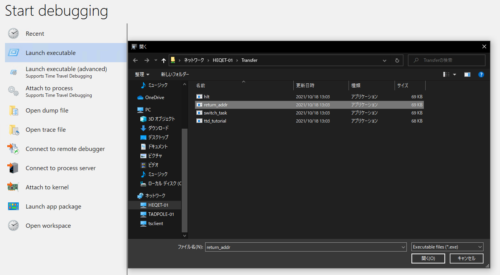
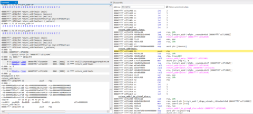
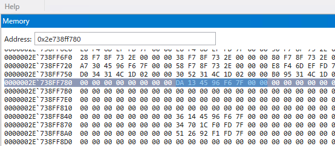
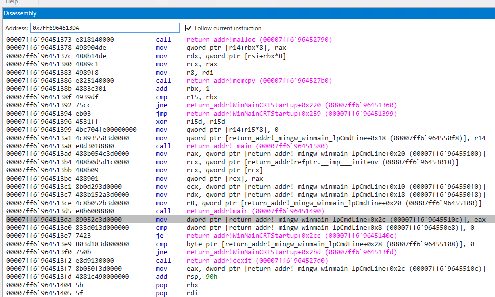
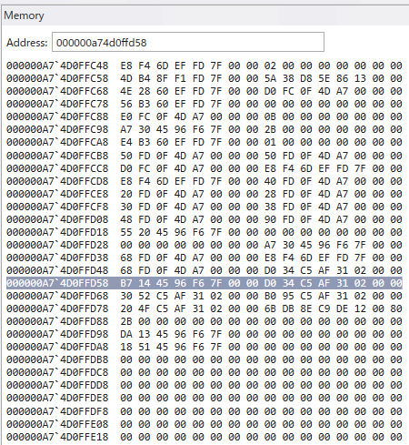
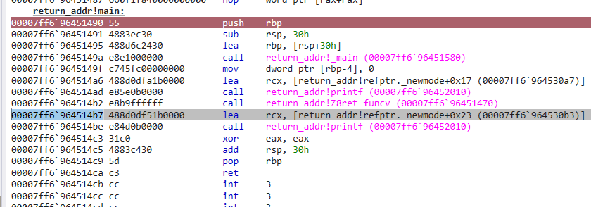
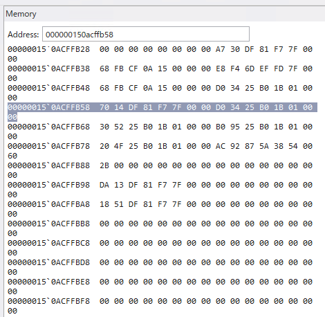
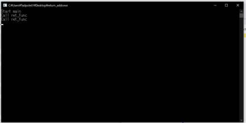

WinDbgによるWindowsデバッグやダンプ解析によるトラブルシューティングに習熟することを目指しています。

[WinDbgのユーザモードデバッグチュートリアルを試してみた](/windows-windbg-002-tutorial)では、WinDbgを用いてユーザモードアプリケーションのデバッグを行う方法について紹介しました。

今回は、ユースケース別のWinDbgの使い方として、ユーザモードアプリケーションのライブデバッグ時に、メモリやレジスタの情報を確認する方法について紹介します。

WinDbgを用いたWindowsのデバッグやダンプの解析方法について公開している情報については、以下のページに一覧をまとめているので、よければご覧ください。

参考：[WinDbgを用いたデバッグとトラブルシューティングのテクニック](/windows-windbg-001-index)

<!-- omit in toc -->
## もくじ
- [今回の目標](#今回の目標)
- [本記事で使用するサンプルプログラム](#本記事で使用するサンプルプログラム)
- [WinDbgでアプリケーションを起動する](#windbgでアプリケーションを起動する)
- [main 関数のアドレスにブレークポイントを設定する](#main-関数のアドレスにブレークポイントを設定する)
- [return_addr関数にブレークポイントを設定する](#return_addr関数にブレークポイントを設定する)
- [メモリの情報を参照する](#メモリの情報を参照する)
- [メモリの情報を改ざんする](#メモリの情報を改ざんする)
- [まとめ](#まとめ)

## 今回の目標

今回の目標は以下の2点です。

1. 関数呼び出し時に、RSP/BSPに関数の実行が終了した後に呼び出される命令のアドレスが格納されることを確認する
2. RSPの参照するメモリ情報を改ざんして、任意の関数を実行させる

今回は、WinDbgによるユーザモードアプリケーションのライブデバッグで、プログラムの各所にブレークポイントを設定し、関数呼び出し時のスタックの情報を参照していきます。

また、WinDbgからメモリの情報を改ざんして、任意のプログラムを実行させてみます。

## 本記事で使用するサンプルプログラム

今回テストに使用するのは、以下のソースコードからなるプログラムです。

実行されると`ret_func`関数を呼び出して、いくつか文字列を出力した後に終了するプログラムです。

``` cpp
// return_addr.cpp
#include <stdio.h>

int ret_func() {
    printf("Call ret_func\n");
    return 0;
}

int main() {
    printf("Start main\n");
    ret_func();
    printf("Return ret_func\n");
    return 0;
}
```

サンプルコードについては、[kash1064/Try2WinDbg](https://github.com/kash1064/Try2WinDbg)に置いてあります。

サンプルプログラムをシンボルファイル(（.pdb）付きでコンパイルする方法については、以下の記事でまとめているので良ければご参照ください。

参考：[llvm-mingwを使ってLinux環境でもシンボルファイル（.pdb）を作成する方法](/windows-windbg-006-symbol)

それでは、このソースコードをコンパイルした`return_addr.exe`を使用して、さっそく解析を行っていきます。

## WinDbgでアプリケーションを起動する

今回はUWP版のWinDbg Previewを使用して解析を行います。
Windowsストアからダウンロードできます。

まずは、コンパイルした`return_addr.exe`をWinDbgから実行します。



すると、起動前の状態で停止し、デバッグコマンドか使用できるようになります。

まずはシンボルファイルを読み込ませていきます。

僕の環境では、デスクトップに`return_addr.pdb`を配置しているため、`.sympath+ <デスクトップのパス>`としてます。
シンボルファイルのパスを追加した後は`.reload`コマンドを実行します。

``` powershell
.sympath+ C:\Users\Tadpole01\Desktop
.reload
```

シンボルファイルが適切に読み込まれている場合、以下の画像のように`ttd_tutorial.exe`の関数名などをWinDbgが解釈して表示することができるようになります。

`㏐`コマンドでモジュール一覧を表示した際に、以下のように`(pdb symbols)`と表示されていればOKです。

``` powershell
0:000> lm
start             end                 module name
00007ff7`cd710000 00007ff7`cd72a000   return_addr C (pdb symbols)          C:\ProgramData\Dbg\sym\return_addr.pdb\28CEC53415E7CD7D4C4C44205044422E1\return_addr.pdb
00007ffd`ef320000 00007ffd`ef5e9000   KERNELBASE   (deferred)             
00007ffd`ef5f0000 00007ffd`ef6f0000   ucrtbase   (deferred)             
00007ffd`f01b0000 00007ffd`f026e000   KERNEL32   (deferred)             
00007ffd`f18d0000 00007ffd`f1ac5000   ntdll      (pdb symbols)          C:\ProgramData\Dbg\sym\ntdll.pdb\96EF4ED537402DAAA51D4A4212EA4B2C1\ntdll.pdb
```

## main 関数のアドレスにブレークポイントを設定する

プログラムのデバッグのためにブレークポイントを設定したいので、まずはmain関数のアドレスを特定していきます。

`x /D /f return_addr!m*`を実行すると、mから始まるシンボルの一覧が表示されます。

``` powershell
0:000> x /D /f return_addr!m*
 A B C D E F G H I J K L M N O P Q R S T U V W X Y Z

00007ff6`96451490 return_addr!main (main)
00007ff6`964527b0 return_addr!memcpy (memcpy)
00007ff6`96452790 return_addr!malloc (malloc)
00007ff6`96451420 return_addr!mainCRTStartup (mainCRTStartup)
00007ff6`964516a0 return_addr!matherr (_matherr)
```

main関数は`00007ff7 cd711490 `にあることがわかりました。

`bu`コマンドでブレークポイントを設定し、`bl`コマンドで設定されたことを確認します。

``` powershell
0:000> bu 00007ff7`cd711490
0:000> bl
     1 e Disable Clear  00007ff7`cd711490     0001 (0001)  0:**** return_addr!main
```

`g`コマンドでプログラムを実行したところ、main関数の開始時点で停止するところまで進めることができました。



## return_addr関数にブレークポイントを設定する

今回は、関数呼び出し時のベースポインタに格納される値を確認することを目的にしています。

そのため、次はDisassemblyウインドウで確認した`ret_func`関数の先頭アドレスにブレークポイントを設定します。

``` powershell
0:000> bu 00007ff6`96451470
0:000> bl
     0 e Disable Clear  00007ff6`96451470     0001 (0001)  0:**** return_addr!Z8ret_funcv
     1 e Disable Clear  00007ff6`96451490     0001 (0001)  0:**** return_addr!main
```

`g`コマンドで実行したところで、`r`コマンドを使ってレジスタ情報を出力します。

``` powershell
0:000> g
Breakpoint 0 hit
return_addr!Z8ret_funcv:
00007ff6`96451470 4883ec28        sub     rsp,28h

0:000> r
rax=000000000000000b rbx=0000000000000001 rcx=00000000ffffffff
rdx=00007ffdef6e0980 rsi=0000021d4c3134d0 rdi=000000000000002b
rip=00007ff696451470 rsp=0000002e738ff748 rbp=0000002e738ff780
 r8=0000002e738fdb78  r9=0000021d4c31a47b r10=0000000000000000
r11=0000002e738ff660 r12=0000000000000000 r13=0000000000000000
r14=0000021d4c315230 r15=0000000000000001
iopl=0         nv up ei pl nz na pe nc
cs=0033  ss=002b  ds=002b  es=002b  fs=0053  gs=002b             efl=00000202
return_addr!Z8ret_funcv:
00007ff6`96451470 4883ec28        sub     rsp,28h
```

関数呼び出し直後の`rbp`レジスタの値は`0x2e738ff780`であることがわかりました。

## メモリの情報を参照する

次に、Memoryウインドウのアドレスバーに`rbp`レジスタの指すアドレスを入力し、メモリの情報を確認します。

どうやら、`0x7FF6964513DA`という値が格納されているようです。（リトルエンディアン表記なので逆から読みます。）



このアドレスについて、Disassemblyウインドウで確認したところ、`main`関数の実行が完了して戻り値を返した後に実行される命令のアドレスであることがわかりました。



次に、`ret_func`関数の実行が完了した後に呼び出されるアドレスを確認するため、関数が呼び出された瞬間の`rsp`レジスタの値を確認してみます。

レジスタの情報から`0xa74d0ffd58`がスタックポインタのアドレスであることがわかりましたので、Memoryウインドウを確認してみます。

どうやら、`0x7FF6964514B7`という値が格納されているようです。



先ほど同様Disassemblyウインドウを確認すると、`ret_func`関数の実行が完了した後に呼び出される予定の命令のアドレスであることが確認できました。



## メモリの情報を改ざんする

最後に、`ret_func`関数終了後にジャンプする`rsp`レジスタのアドレスが指すメモリの情報を改ざんして、任意の関数を実行させたいと思います。

WinDbgでは、Memoryウインドウの値を直接書き換えることで、メモリの情報を任意の値に改ざんすることが可能です。（管理者権限でWinDbgを起動しておく必要があります）

参考：[WinDbg でのメモリの表示と編集 - Windows drivers | Microsoft Docs](https://docs.microsoft.com/ja-jp/windows-hardware/drivers/debugger/memory-window)

なお、僕の環境で利用しているWinDbg Previewでは、Memoryウインドウから値の改ざんができませんでした。（Windows Debug Toolsに含まれる WinDbg X64 では可能だったので、Preview版が未対応であるか、バグである可能性があります。）

そのため、今回はMemoryウインドウからではなく、`e`コマンドを利用してメモリの情報を改ざんしていきます。

参考：[e、ea、eb、ed、eD、ef、ep、eq、eu、ew、eza (値の入力) - Windows drivers | Microsoft Docs](https://docs.microsoft.com/ja-jp/windows-hardware/drivers/debugger/e--ea--eb--ed--ed--ef--ep--eq--eu--ew--eza--ezu--enter-values-)

改ざんしたいアドレスは、`rsp`レジスタの指し示している`0x000000150acffb58`です。

このアドレスの値を、`ret_func`関数の呼び出しアドレスに変更して、もう一度`ret_func`関数が実行されるように改ざんしていきます。

`ret_func`関数の呼び出しアドレスは`0x00007ff7 81df1470`です。

以下のコマンドでまとめてメモリの情報を改ざんできます。（リトルエンディアン記法なので、逆から入力してます）

``` powershell
eb 000000150acffb58 0x70 0x14 0xdf 0x81 0xf7 0x7f 0x00 0x00
```

コマンドを実行すると、見事にメモリの情報を書き換えることができました！



これで`g`コマンドでプログラムの実行を再開したところ、`ret_func`関数の処理が終了した後にもう一度`ret_func`関数が呼び出され、本来一度しか表示されないはずの`Call ret_func`というテキストが2回出力されました。



## まとめ

今回は、WinDbgでメモリの情報を参照したり改ざんしたりする方法について紹介しました。

WinDbgを用いたWindowsのデバッグやダンプの解析方法について公開しているその他情報については、以下のページのリストをご覧ください。

参考：[WinDbgを用いたデバッグとトラブルシューティングのテクニック](/windows-windbg-001-index)