WinDbgによるWindowsデバッグやダンプ解析によるトラブルシューティングに習熟することを目指しています。

今回は、UWP版のWinDbg Previewから利用可能になった Time Travel Debugging 機能の公式チュートリアルを試していきます。

参考：[Time Travel Debugging - サンプル アプリのチュートリアル - Windows drivers | Microsoft Docs](https://docs.microsoft.com/ja-jp/windows-hardware/drivers/debugger/time-travel-debugging-walkthrough)

WinDbgを用いたWindowsのデバッグやダンプの解析方法について公開している情報については、以下のページに一覧をまとめているので、よければご覧ください。

参考：[WinDbgを用いたデバッグとトラブルシューティングのテクニック](/windows-windbg-001-index)

この記事では以下の内容についてまとめています。

<!-- omit in toc -->
## もくじ
- [Time Travel Debugging とは](#time-travel-debugging-とは)
  - [TTDで作成されるファイル](#ttdで作成されるファイル)
  - [TTDでできないこと](#ttdでできないこと)
- [チュートリアル：サンプルプログラムの準備](#チュートリアルサンプルプログラムの準備)
- [ttd_sample.exe をTTDでトレースする](#ttd_sampleexe-をttdでトレースする)
- [TTDでトラブルシューティングを行う](#ttdでトラブルシューティングを行う)
  - [シンボルファイルを読み込む](#シンボルファイルを読み込む)
  - [トレースファイルから例外を確認する](#トレースファイルから例外を確認する)
  - [TTDトレース内のイベント一覧を確認する](#ttdトレース内のイベント一覧を確認する)
  - [例外の詳細を取得する](#例外の詳細を取得する)
  - [例外が発生したタイミングにジャンプする](#例外が発生したタイミングにジャンプする)
  - [Step Into Back!!!](#step-into-back)
  - [BSPの指すアドレスのメモリデータを参照する](#bspの指すアドレスのメモリデータを参照する)
  - [補足：ESPとEBPについて](#補足espとebpについて)
  - [問題の原因箇所を特定する](#問題の原因箇所を特定する)
  - [GetCppConGreetingPwy関数のデバッグ](#getcppcongreetingpwy関数のデバッグ)
- [まとめ](#まとめ)

## Time Travel Debugging とは

Time Travel Debugging(TTD) 機能を使用することで、ユーザは実行中のプロセスの挙動を記録して、あとで「前後に」再生することができます。

参考：[Time Travel Debugging - 概要 - Windows drivers | Microsoft Docs](https://docs.microsoft.com/ja-jp/windows-hardware/drivers/debugger/time-travel-debugging-overview)

TTDを利用した場合、以下の利点があります。

- ライブデバッグとは異なり、問題が発生したタイミングに「巻き戻し」て解析を行うことができる
- TTDのトレースファイルを共有することで、問題再現時の情報の共有が容易になる
- クラッシュダンプと異なり、問題の原因となるコード実行時の情報を含む
- 統合言語クエリ（LINQ）を用いてトレースに対してクエリを実行できる

一方で、TTDの記録には大きなオーバーヘッドが必要になり、数分程度の記録でもGB単位の容量になる場合があります。

TTD機能はWinDbg Previewで利用可能な機能ですが、VisualStudioでも同様に利用することが可能なようです。

参考：[Introducing Time Travel Debugging for Visual Studio Enterprise 2019 - Visual Studio Blog](https://devblogs.microsoft.com/visualstudio/introducing-time-travel-debugging-for-visual-studio-enterprise-2019/)

### TTDで作成されるファイル

トレース時には、通常以下の3つのファイルが作成されます。

- .idx ファイル：トレース情報にアクセスするためのインデックス
- .run ファイル：コードの実行が保存されるファイル
- .out ファイル：TTD実行時の情報が出力されるファイル

特に.idx ファイルと.run ファイルは、トレースに要する時間によって非常に大きなサイズになる場合があります。

### TTDでできないこと

本記事執筆時点（2021/10/17）のWinDbg Previewで行うTTDでは、以下の3点については実現していない点に注意が必要です。

- カーネルモードプロセスのトレース
- TTD再生時のメモリ書き込み
- Protected Process Light（PPL）で保護されたプロセスのトレース

特に、TTDトレースは読み取り専用となるため、条件分岐のタイミングにブレークポイントを設定して、レジスタを書き換えて任意のアドレスに分岐させるといった、ライブデバッグでよく行われる手法はTTDでは使用できません。

## チュートリアル：サンプルプログラムの準備

それではここから、TTDの公式チュートリアルを実践していきたいと思います。

参考：[Time Travel Debugging - サンプル アプリのチュートリアル - Windows drivers | Microsoft Docs](https://docs.microsoft.com/ja-jp/windows-hardware/drivers/debugger/time-travel-debugging-walkthrough)

今回使用した環境は以下の通り。

- WIndows 10 Pro 20H2
- WInDbg Preview 1.2106.26002.0（管理者権限で起動）

サンプルプログラムについては、VisualStudioではなくllvm-mingwでクロスコンパイルしたものを使用していきます。

サンプルプログラムのソースコードと、コンパイル環境については以下の記事にまとめています。

参考：[llvm-mingwを使ってLinux環境でもシンボルファイル（.pdb）を作成する方法](/windows-windbg-006-symbol)

今回使用したサンプルプログラムは以下のようなコードです。

``` cpp
#include <array>
#include <cstring> 
#include <stdio.h>
#include <string.h>

void GetCppConGreeting(wchar_t *buffer, size_t size)
{
    wchar_t const *const message = L"HELLO FROM THE WINDBG TEAM. GOOD LUCK IN ALL OF YOUR TIME TRAVEL DEBUGGING!";

    wcscpy_s(buffer, size, message);
}

int main()
{
    std::array<wchar_t, 50> greeting{};
    GetCppConGreeting(greeting.data(), sizeof(greeting));

    wprintf(L"%ls\n", greeting.data());

    return 0;
}
```

公式チュートリアルのソースコードを参考に作成した実行ファイル（ttd_sample.exe）をPowerShellから実行したところ、何らかの理由でプログラムが異常終了します。

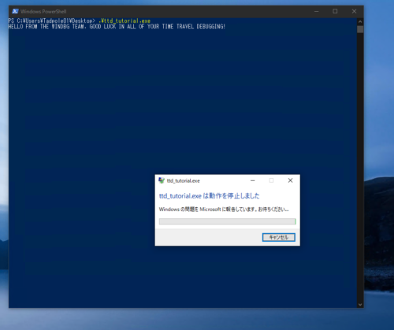

この異常終了の原因をTTDを用いて特定していくのが、このチュートリアルのシナリオになります。

## ttd_sample.exe をTTDでトレースする

まずはWindowsストアからダウンロードしたWinDbg Previewを管理者権限で起動します。

次に、右上の[ファイル]から、以下の画像のように[Launch executable(advanced)]を選択します。

ここから、デバッグ対象のバイナリを実行して、TTDトレースを取得することができます。

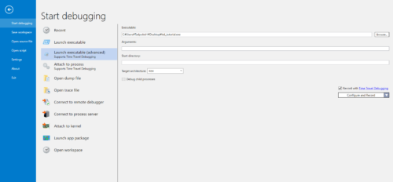

今回は、[Executable]の欄に、先ほどコンパイルした`ttd_sample.exe`の絶対パスを入力しています。

また、右下の[Record with Time Travel Debugging]のチェックを有効化します。

あとの項目については、今回はデフォルトのままで問題ないので[Record]ボタンをクリックします。

[Configure location]ウィンドウでは、トレースファイルの保存先を設定できます。
任意のフォルダを選択して[Record]ボタンをクリックしてください。

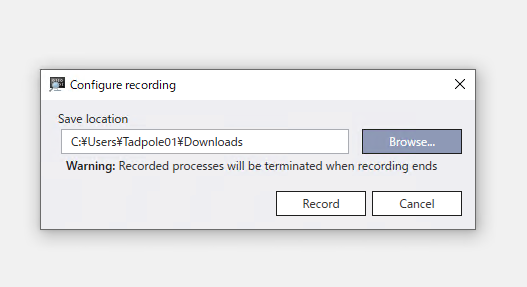

アプリケーションが実行され、障害が再現されました。この時点でTTDトレースが取得されているため、[プログラムの終了]をクリックしてアプリケーションを終了します。

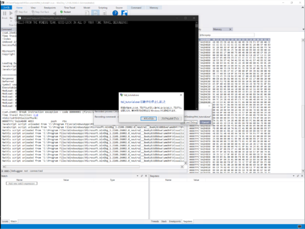

アプリケーションが終了すると、自動的にTTDトレースが開始され、Timelinesの位置が先頭の状態で開始されます。

ここから、いよいよTTDを用いたトラブルシューティングを開始します。

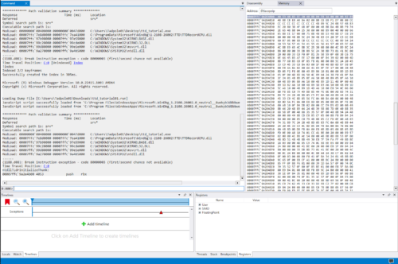

このままTTD解析を行うこともできますが、せっかくなので保存されたトレースファイルを開いて解析を行いましょう。

一度WinDbgを閉じたあと、再度管理者権限で起動します。

先ほどと同じく[ファイル]の一覧から、今度は[Open trace file]を選択して、作成された.runファイルを開きます。

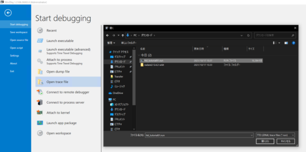

これでトレースファイルがWinDbgに読み込まれ、解析ができるようになりました。

## TTDでトラブルシューティングを行う

ここからは、取得したトレースファイルを解析して、トラブルシューティングを行います。

### シンボルファイルを読み込む

公式チュートリアルでは、まず初めにシンボルファイルのパスをWinDbgに読み込ませていきます。

僕の環境では、デスクトップに`ttd_tutorial.pdb`を配置しているため、`.sympath+ <デスクトップのパス>`としてます。
シンボルファイルのパスを追加した後は`.reload`コマンドを実行します。

``` powershell
.sympath+ C:\Users\Tadpole01\Desktop
.reload
```

シンボルファイルが適切に読み込まれている場合、以下の画像のように`ttd_tutorial.exe`の関数名などをWinDbgが解釈して表示することができるようになります。

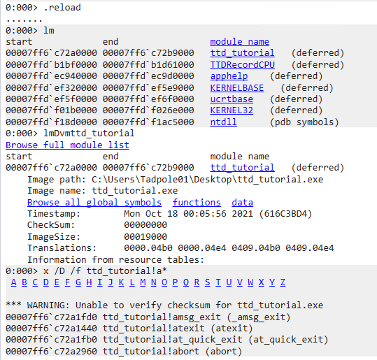

シンボルファイルの読み込みまで完了したら、いよいよ解析を始めていきます。

### トレースファイルから例外を確認する

トレースファイルを開くと、次のように`code 80000003`例外が発生したことがわかります。

``` powershell
(19e0.1f9c): Break instruction exception - code 80000003 (first/second chance not available)
Time Travel Position: D:0 [Unindexed] Index
!index
Indexed 2/2 keyframes
Successfully created the index in 362ms.
```

また、ここに表示されている`Time Travel Position`は、TTDトレースの位置を表しています。（ポジションの情報は、実行環境によって変わる場合があります。）

`!ttdexe.tt <Time Travel Position>`のようなコマンドを実行することで、任意のトレースポイントにジャンプすることもできます。

参考：[タイムトラベルデバッグ拡張機能! tt コマンド - Windows drivers | Microsoft Docs](https://docs.microsoft.com/ja-jp/windows-hardware/drivers/debugger/time-travel-debugging-extension-tt)

``` PowerShell
0:000> !ttdext.tt D:0
Setting position: D:0
(19e0.1f9c): Break instruction exception - code 80000003 (first/second chance not available)
Time Travel Position: D:0
ntdll!LdrInitializeThunk:
00007ffd`f1944b00 4053            push    rbx
```

### TTDトレース内のイベント一覧を確認する

続いて、`dx -r1 @$curprocess.TTD.Events`を呼び出して、TTDトレースの中で発生したイベントの一覧を取得します。

参考：[TTD イベントオブジェクト - Windows drivers | Microsoft Docs](https://docs.microsoft.com/ja-jp/windows-hardware/drivers/debugger/time-travel-debugging-event-objects)

以下の出力を見ると、プログラムの実行時に各種モジュールがロードされた後にスレッドが立ち上がり、例外が発生したためスレッドを停止して、各モジュールをアンロードしてプロセス終了した一連の流れを確認できました。

``` powershell
0:000> dx -r1 @$curprocess.TTD.Events
@$curprocess.TTD.Events                
    [0x0]            : Module ttd_tutorial.exe Loaded at position: 2:0
    [0x1]            : Module TTDRecordCPU.dll Loaded at position: 3:0
    [0x2]            : Module apphelp.dll Loaded at position: 4:0
    [0x3]            : Module KERNELBASE.dll Loaded at position: 5:0
    [0x4]            : Module ucrtbase.dll Loaded at position: 6:0
    [0x5]            : Module KERNEL32.DLL Loaded at position: 7:0
    [0x6]            : Module ntdll.dll Loaded at position: 8:0
    [0x7]            : Thread UID:   2 TID: 0x1F9C created at D:0
    [0x8]            : Exception 0xC0000005 of type Hardware at PC: 0X52005400200045
    [0x9]            : Thread UID:   2 TID: 0x1F9C terminated at 96:1
    [0xa]            : Module apphelp.dll Unloaded at position: FFFFFFFFFFFFFFFE:0
    [0xb]            : Module TTDRecordCPU.dll Unloaded at position: FFFFFFFFFFFFFFFE:0
    [0xc]            : Module ttd_tutorial.exe Unloaded at position: FFFFFFFFFFFFFFFE:0
    [0xd]            : Module KERNEL32.DLL Unloaded at position: FFFFFFFFFFFFFFFE:0
    [0xe]            : Module KERNELBASE.dll Unloaded at position: FFFFFFFFFFFFFFFE:0
    [0xf]            : Module ntdll.dll Unloaded at position: FFFFFFFFFFFFFFFE:0
    [0x10]           : Module ucrtbase.dll Unloaded at position: FFFFFFFFFFFFFFFE
```

### 例外の詳細を取得する

例外のイベントをクリックして詳細を表示したところ、例外発生時の`Time Travel Position`が`7C:0`であることがわかりました。（ポジションは実行環境によって変わる可能性があります。）

``` powershell
0:000> dx -r1 @$curprocess.TTD.Events[8]
@$curprocess.TTD.Events[8]                 : Exception 0xC0000005 of type Hardware at PC: 0X52005400200045
    Type             : Exception
    Position         : 7C:0 [Time Travel]
    Exception        : Exception 0xC0000005 of type Hardware at PC: 0X52005400200045
```

また、子要素の[Exception]を選択することで、さらに詳細な例外の情報も取得することができます。

``` powershell
0:000> dx -r1 @$curprocess.TTD.Events[8].Exception
@$curprocess.TTD.Events[8].Exception                 : Exception 0xC0000005 of type Hardware at PC: 0X52005400200045
    Position         : 7C:0 [Time Travel]
    Type             : Hardware
    ProgramCounter   : 0x52005400200045
    Code             : 0xc0000005
    Flags            : 0x0
    RecordAddress    : 0x0
```

### 例外が発生したタイミングにジャンプする

ここで、`7C:0 [Time Travel]`をクリックして、例外が発生した位置にジャンプします。

画面下部の[Timelines]のカーソルの位置が進みました。

TTDでは、現在の`Time Travel Position`でトレースされたメモリやレジスタの情報を参照することができます。

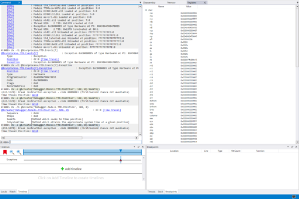

WinDbgでは、`p`コマンドでレジスタの情報を参照できます。

``` powershell
Time Travel Position: 7C:0
0:000> r
rax=0000000000000000 rbx=0000000000000001 rcx=00000000ffffffff
rdx=00007ffdef6e0980 rsi=000002b36fa33520 rdi=000000000000002c
rip=0052005400200045 rsp=000000b936effb20 rbp=004d004900540020
 r8=000000b936efde98  r9=000002b36fa3899c r10=0000000000000000
r11=000000b936eff980 r12=0000000000000000 r13=0000000000000000
r14=000002b36fa2d110 r15=0000000000000001
iopl=0         nv up ei pl nz na pe nc
cs=0033  ss=002b  ds=002b  es=002b  fs=0053  gs=002b             efl=00000202
00520054`00200045 ??              ???
```

上記のように、`rsp`と`rbp`レジスタの値が大きく異なる場合、何らかの理由でスタックが破壊されている可能性があります。

### Step Into Back!!!

ここから、スタックが破壊されたタイミングを特定するために、時間を戻します。

画面の通り[Step Into Back]ボタンをクリックすることで、1つずつトレース位置を戻すことができます。

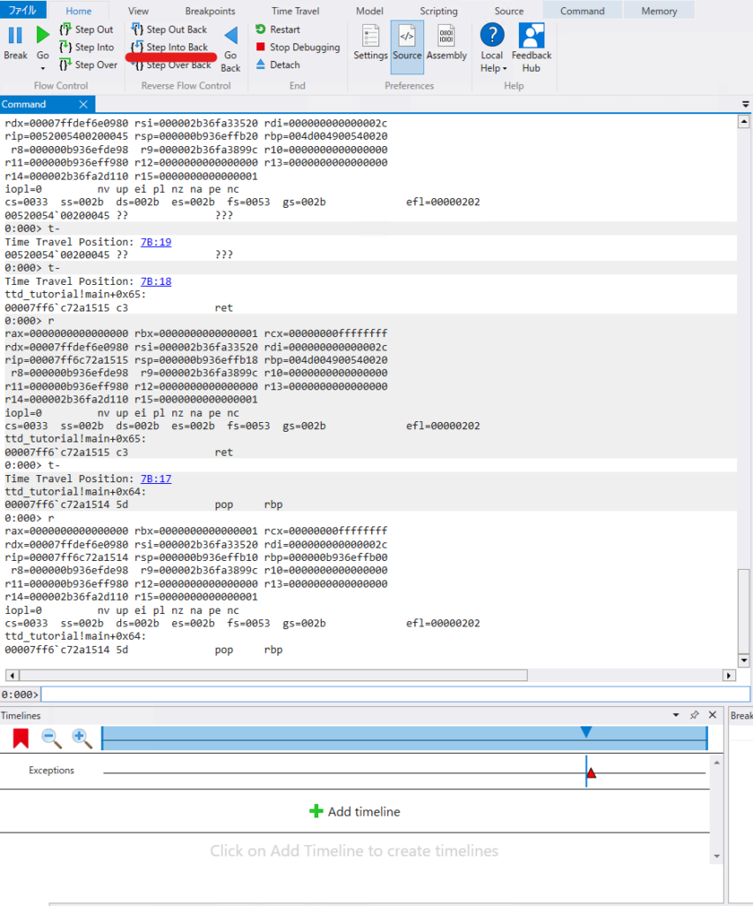

`Time Travel Position: 7B:17`の時点では正常であった`rbp`レジスタの値が、`Time Travel Position: 7B:18`のタイミングで破損したことが推察できます。

### BSPの指すアドレスのメモリデータを参照する

スタックが破壊される直前にBSPが保持していたアドレス情報が、`0xb936effb00`であることが確認できました。

次は、このBSPが示すメモリアドレスの情報を表示してみます。

WinDbgの[View]から、memoryウィンドウを開き、アドレスバーに`0xb936effb00`を入力します。

このとき、[Memory]タブの[Text]の設定項目を[none]から[ASCII]に変更することで、メモリデータ内の文字列を表示させることができるようになります。

以下の画像のように、BSPの指すアドレスにはどうやら文字列が格納されていることがわかります。

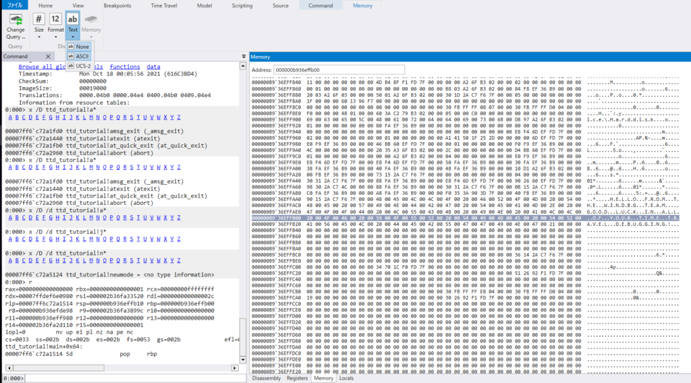

### 補足：ESPとEBPについて

少しだけコンピュータの話に触れておきます。

x64アーキテクチャなどのCPUで稼働するコンピュータ上で関数を呼び出す場合は、CALL命令が利用されます。

CALL命令は、簡単に言うと以下の処理を実行する命令です。

- CALL命令の次の命令のアドレスをスタックに格納する（CALLする関数の処理がすべて完了したら、この時スタックしたアドレスが呼び出される）
- CALLする関数のメモリアドレスにジャンプする

参考：[x86-64プロセッサのスタックを理解する - Qiita](https://qiita.com/tobira-code/items/75d3034aed8bb9828981)

詳しくは、こちらの記事にまとめていますので、良ければ参照してください。

参考：[WinDbgでスタックポインタの指すメモリの情報を書き換えて任意の関数を実行させてみる](/windows-windbg-007-memory-spoofing)

### 問題の原因箇所を特定する

ここで、先ほど確認したように、BSPレジスタの値が示すアドレスは文字列になっていました。

今回のサンプルのようなプログラムの場合、BSPに格納されているアドレスは、main関数の処理が完了した後に呼び出される命令のアドレスとなることが想定されます。

では、一体どこでスタックが破壊されたのか、それを特定していきましょう。

次のコマンドでmain関数にブレークポイントを設定した状態で、[Go Back]ボタンを押して時間を巻き戻します。

``` powershell
bu ttd_tutorial!main
```

するとmain関数の先頭で停止するので、BSPにメモリアドレスがプッシュされるまで[Step Into]で処理を進めます。

BSPにアドレスがプッシュされた直後のメモリの情報を見ると、この時点ではまだ文字列ではなく、main関数実行後に呼び出される命令のアドレスが格納されています。

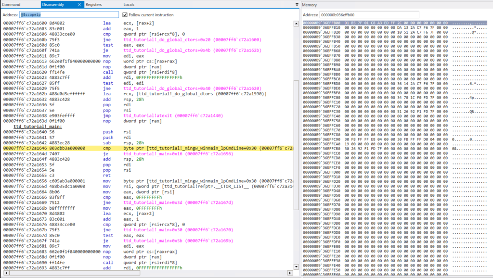

DisassemblyウインドウとMemoryウインドウを見比べながら何度か[Step Over]で処理を進めていくと、`GetCppConGreetingPwy`関数を呼び出した直後にスタックが破壊されたことがわかりました。

↓ スタック破壊前

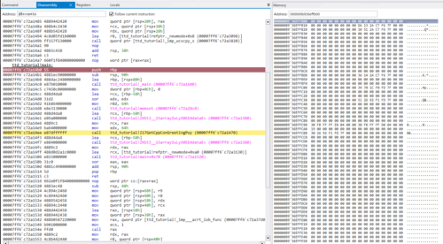

↓ スタック破壊後

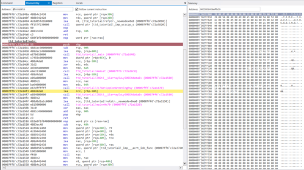

このことから、スタック破壊の原因は`GetCppConGreetingPwy`関数に存在することが特定できました。

### GetCppConGreetingPwy関数のデバッグ

TTDトレース内の時間を少し戻して、今度は`GetCppConGreetingPwy`関数の処理を追ってみました。

すると、`wcscpy_s`関数を呼び出した直後にスタックが破壊されたことがわかりました。

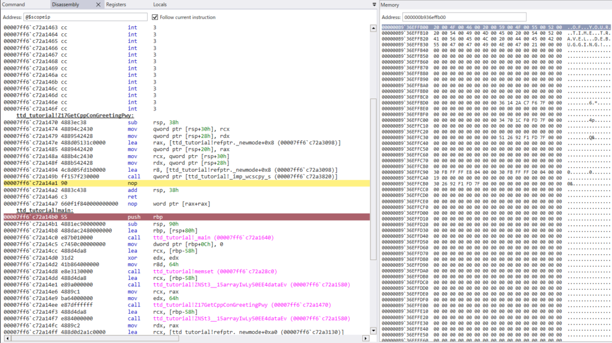

ここまで特定できたところで、ソースコードを見てみます。

``` cpp
#include <array>
#include <cstring> 
#include <stdio.h>
#include <string.h>

void GetCppConGreeting(wchar_t *buffer, size_t size)
{
    wchar_t const *const message = L"HELLO FROM THE WINDBG TEAM. GOOD LUCK IN ALL OF YOUR TIME TRAVEL DEBUGGING!";

    wcscpy_s(buffer, size, message);
}

int main()
{
    std::array<wchar_t, 50> greeting{};
    GetCppConGreeting(greeting.data(), sizeof(greeting));

    wprintf(L"%ls\n", greeting.data());

    return 0;
}
```

どうやらワイド文字列で50字分しか設定されていなかった配列`greeting`に対して、75文字の`message`を書き込んだことで、スタックオーバフローが発生したことが原因のようです。

そこで配列`greeting`の要素数を75に修正した`ttd_tutorial_fixed.cpp`を使用して`ttd_tutorial_fixed.exe`を作成しました。

これで無事にエラーが解消され、無事に実行に成功しました！

``` powershell
$ ttd_tutorial_fixed.exe
HELLO FROM THE WINDBG TEAM. GOOD LUCK IN ALL OF YOUR TIME TRAVEL DEBUGGING!
```

## まとめ

過去と未来の双方向にトレースしていくことができるTTDによるデバッグを試してみました。

特に、メモリダンプやプロセスダンプからはわからなかった過去のメモリやレジスタの状態がわかるため、非常に解析がスムーズになりました。

また、ライブデバッグと異なり前の処理に戻ることができるため、「ブレークポイントを設定して問題を再発させて・・・」という手間がなくなる点も非常に便利でした。

今後もTTDを活用したデバッグ手法についてまとめていこうと思っております。

WinDbgを用いたWindowsのデバッグやダンプの解析方法について公開しているその他情報については、以下のページのリストをご覧くださいますと幸いです。

参考：[WinDbgを用いたデバッグとトラブルシューティングのテクニック](/windows-windbg-001-index)