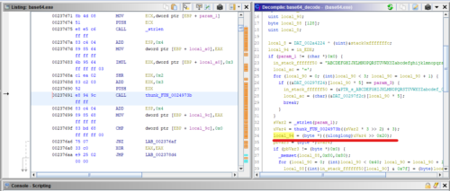
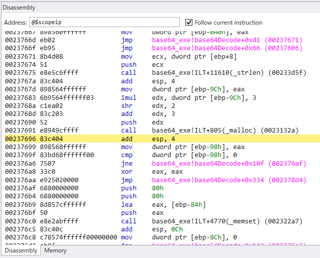

今回は独自実装したBase64モジュールをGhidraでデコンパイルした後にWinDbgで処理を追っていきたいと思います。

<!-- omit in toc -->
## もくじ
- [Base64の実装とビルド](#base64の実装とビルド)
- [Base64の実装について](#base64の実装について)
  - [Base64とは](#base64とは)
  - [Base64のソースコード](#base64のソースコード)
  - [Base64プログラムのヘッダファイル](#base64プログラムのヘッダファイル)
- [WinDbgでTime Travel Debuggingを取得する](#windbgでtime-travel-debuggingを取得する)
- [Base64プログラムをGhidraでデコンパイルする](#base64プログラムをghidraでデコンパイルする)
  - [entrypointからmain関数を特定する](#entrypointからmain関数を特定する)
  - [Base64Encode関数のデコンパイル結果を読む](#base64encode関数のデコンパイル結果を読む)
  - [Base64Decode関数のデコンパイル結果を読む](#base64decode関数のデコンパイル結果を読む)
- [TTDトレースの解析](#ttdトレースの解析)
  - [シンボルファイルのロード](#シンボルファイルのロード)
  - [ブレークポイントを設定する](#ブレークポイントを設定する)
  - [WinDbgとGhidraのイメージベースをそろえる](#windbgとghidraのイメージベースをそろえる)
  - [解析したいポイントにブレークポイントを設定する](#解析したいポイントにブレークポイントを設定する)
  - [アセンブリを読む](#アセンブリを読む)
- [まとめ](#まとめ)

## Base64の実装とビルド

まずは今回の解析に使用するプログラムをビルドします。

ソースコードは以下のリポジトリにあります。

参考：[kash1064/Try2WinDbg](https://github.com/kash1064/Try2WinDbg)

Base64エンコードとデコードのプログラムについては、以下の記事で紹介されているものが`WTFPL v2`で配布されているとのことでしたのでありがたく拝借しました。

参考：[CでBASE64のエンコード/デコードを行う関数 - Qiita](https://qiita.com/leak4mk0/items/6c7f708dd59d52e0bc5c)

一部の実装については独自にカスタマイズしていますが、ベースは概ね変わりません。

この記事で紹介しているソースコードについても、参照元を踏襲し`WTFPL v2`で公開しておりますので、自由にお使いください。

なお、Base64エンコードおよびデコードの結果については保証しませんのであしからず。

ビルドは以下のコマンドで実施します。

cl.exeを利用できるように、事前に開発者用コマンドプロンプトを設定しておく必要があります。

``` bash
git clone https://github.com/kash1064/Try2WinDbg
cd Try2WinDbg

# cl.exeを利用できるように、事前に開発者用コマンドプロンプトを設定しておく
cl /c ./build/c/base64.c
link /DEBUG /PDB:./build/symbol/base64.pdb ./base64.obj /OUT:./build/bin/base64.exe
```

ビルドができない環境でも、`Try2WinDbg/trace/base64_trace.zip`の中にあるTTDトレースファイルを使うことでTTDを使った解析を行うことができます。

TTDトレースの読み込みについては以下の記事でまとめてます。

参考：[【WinDbg Preview】Time Travel Debuggingで始める新しいデバッグ手法](/windows-windbg-008-time-travel-debugging)

## Base64の実装について

### Base64とは

Base64は、[RFC4648](https://datatracker.ietf.org/doc/html/rfc4648)で定義されているデータのエンコーディング方法です。

様々なバイト列をASCIIデータに変換することができるので、データの保存や転送など、様々な状況で利用されます。

Base64は、エンコーディングするバイナリデータを24bit単位で区切り、さらに6bitずつに分割することで、様々なデータを64文字の事前に定義された文字列に変換することができます。

ここで、エンコーディング元のバイナリデータが24bit単位で区切れない長さの場合、パディングと呼ばれる文字が追加されます。

パディングの文字はRFCで`=`と定義されていますが、同じくRFCで定義されているURL安全なBase64エンコーディングの場合は`_`が使用されます。

### Base64のソースコード

以下が今回使用するBase64プログラムのソースコードです。

長いので詳細な解説はしません。

ビルドしたプログラムを実行するとmain関数で定義されたテストが実行されますが、他のプログラムにリンクすることで関数単位で呼び出すことも可能です。

``` c

#include <assert.h>
#include <stdlib.h>
#include <stdio.h>
#include <string.h>
#include "base64.h"

char *base64Encode(const char *data, const size_t size, const BASE64_TYPE type)
{
    BASE64_SPEC base64_spec;
    size_t length;
    char *base64;
    char *cursor;
    int lineLength;
    int i;
    int j;

    if (data == NULL) {
        return NULL;
    }

    // base64_specの初期化
    base64_spec = BASE64_SPECS[0];
    for (i = 0; i < (int)BASE64_SPECS_LENGTH; i++) {
        if (BASE64_SPECS[i].type == type) {
            base64_spec = BASE64_SPECS[i];
            break;
        }
    }

    // エンコード後の文字列格納領域の確保
    length = ((size * 4) / 3) + 3;

    // mallocの戻り値は確保したメモリブロックを指すポインタ
    base64 = malloc(length);
    if (base64 == NULL) {
        return NULL;
    }

    cursor = base64;
    lineLength = 0;

    // 3文字単位でエンコードを行う(エンコード後は4文字になる)
    for (i = 0, j = size; j > 0; i += 3, j -= 3) {
        if (j == 1) {
            *(cursor++) = base64_spec.table[(data[i + 0] >> 2 & 0x3f)];
            *(cursor++) = base64_spec.table[(data[i + 0] << 4 & 0x30)];
            *(cursor++) = base64_spec.pad;
            *(cursor++) = base64_spec.pad;
        }
        else if (j == 2) {
            *(cursor++) = base64_spec.table[(data[i + 0] >> 2 & 0x3f)];
            *(cursor++) = base64_spec.table[(data[i + 0] << 4 & 0x30) | (data[i + 1] >> 4 & 0x0f)];
            *(cursor++) = base64_spec.table[(data[i + 1] << 2 & 0x3c)];
            *(cursor++) = base64_spec.pad;
        }
        else {
            *(cursor++) = base64_spec.table[(data[i + 0] >> 2 & 0x3f)];
            *(cursor++) = base64_spec.table[(data[i + 0] << 4 & 0x30) | (data[i + 1] >> 4 & 0x0f)];
            *(cursor++) = base64_spec.table[(data[i + 1] << 2 & 0x3c) | (data[i + 2] >> 6 & 0x03)];
            *(cursor++) = base64_spec.table[(data[i + 2] << 0 & 0x3f)];
        }
    }
    *cursor = 0;

    return base64;
}

char *base64Decode(const char *base64, size_t *retSize, const BASE64_TYPE type)
{
    BASE64_SPEC base64_spec;
    char table[0x80];
    size_t length;
    char *data;
    char *cursor;
    int i;
    int j;

    if (base64 == NULL) {
        return NULL;
    }

    // base64_specの初期化
    base64_spec = BASE64_SPECS[0];
    for (i = 0; i < (int)BASE64_SPECS_LENGTH; i++) {
        if (BASE64_SPECS[i].type == type) 
        {
            base64_spec = BASE64_SPECS[i];
            break;
        }
    }

    // デコードするBase64文字列用のメモリ領域の確保
    length = strlen(base64);
    data = malloc(length * 3 / 4 + 3);
    if (data == NULL) {
        return NULL;
    }

    memset(table, 0x80, sizeof(table));
    for (i = 0; i < BASE64_TABLE_LENGTH; i++) {
        table[base64_spec.table[i] & 0x7f] = i;
    }

    cursor = data;
    for (i = 0, j = 0; i < (int)length; i++, j = i % 4) {
        char ch;
        if (base64[i] == base64_spec.pad)
        {
            break;
        }
        ch = table[base64[i] & 0x7f];
        if (ch & 0x80) {
            continue;
        }
        if (j == 0) {
            *cursor = ch << 2 & 0xfc;
        }
        else if (j == 1) {
            *(cursor++) |= ch >> 4 & 0x03;
            *cursor = ch << 4 & 0xf0;
        }
        else if (j == 2) {
            *(cursor++) |= ch >> 2 & 0x0f;
            *cursor = ch << 6 & 0xc0;
        }
        else {
            *(cursor++) |= ch & 0x3f;
        }
    }
    *cursor = 0;
    *retSize = cursor - data;

    return data;
}

int main(void) {
    int i;
    for (i = 0; i < (int)BASE64_TESTS_LENGTH; i++) {
        BASE64_TEST test;
        char *data;
        char *base64;
        size_t size;

        test = BASE64_TESTS[i];

        base64 = base64Encode(test.data, test.size, test.type);
        printf("BASE64(\"%s\") = \"%s\"\n", test.data, base64);
        assert(strcmp(base64, test.base64) == 0);

        data = base64Decode(base64, &size, test.type);
        printf("DATA(\"%s\") = \"%s\"\n", base64, data);
        assert(size == test.size);
        assert(memcmp(data, test.data, size) == 0);

        free(base64);
        free(data);
    }

    return 0;
}
```

### Base64プログラムのヘッダファイル

以下は、Base64プログラムのヘッダファイルです。

``` c
#ifndef __BASE64_H__
#define __BASE64_H__

// Data

// Base64 tables
static const char BASE64_TABLE[] = {
    "ABCDEFGHIJKLMNOPQRSTUVWXYZabcdefghijklmnopqrstuvwxyz0123456789+/"};

static const char BASE64_TABLE_URL[] = {
    "ABCDEFGHIJKLMNOPQRSTUVWXYZabcdefghijklmnopqrstuvwxyz0123456789-_"};

static const char BASE64_TABLE_CUSTOM1[] = {
    "ABCDEFGHIJKLMNOPQRSTUVWXYZabcdefghijklmnopqrstuvwxyz0123456789-_"};

static const int BASE64_TABLE_LENGTH = {
    sizeof(BASE64_TABLE) / sizeof(BASE64_TABLE[0]) - 1};

// enum型で使用するBase64Tableの種類を定義
typedef enum tagBASE64_TYPE
{
    BASE64_TYPE_STANDARD,
    BASE64_TYPE_URL,
    BASE64_TYPE_CUSTOM1
} BASE64_TYPE;

typedef struct tagBASE64_SPEC
{
    BASE64_TYPE type;
    const char *table;
    char pad;
    char *lineSep;
    int lineSepLength;
} BASE64_SPEC;

static const BASE64_SPEC BASE64_SPECS[] = {
    {BASE64_TYPE_STANDARD, BASE64_TABLE, '=', NULL, 0},
    {BASE64_TYPE_URL, BASE64_TABLE_URL, '=', NULL, 0},
    {BASE64_TYPE_CUSTOM1, BASE64_TABLE_CUSTOM1, '=', NULL, 0}
};

static const size_t BASE64_SPECS_LENGTH = {
    sizeof(BASE64_SPECS) / sizeof(BASE64_SPECS[0])
};

// Export function
char *base64Encode(const char *data, const size_t size, const BASE64_TYPE type);
char *base64Decode(const char *base64, size_t *retSize, const BASE64_TYPE type);

// Test data
typedef struct tagBASE64_TEST {
    BASE64_TYPE type;
    const char *data;
    size_t size;
    const char *base64;
} BASE64_TEST;

static const BASE64_TEST BASE64_TESTS[] = {
    {BASE64_TYPE_STANDARD, "this is test", 12, "dGhpcyBpcyB0ZXN0"},
    {BASE64_TYPE_STANDARD, "Hello", 5, "SGVsbG8="},
    {BASE64_TYPE_STANDARD, "Fan-Fan-Fun!!", 13, "RmFuLUZhbi1GdW4hIQ=="},
    {BASE64_TYPE_STANDARD, "AAA", 3, "QUFB"},
};

static const size_t BASE64_TESTS_LENGTH = {sizeof(BASE64_TESTS) / sizeof(BASE64_TESTS[0])};

#endif // !__BASE64_H__
```

## WinDbgでTime Travel Debuggingを取得する

ビルドが完了したら、解析を容易にするためにTTDトレースを取得しました。

TTDトレースの取得方法は以下の記事を参照してください。

参考：[【WinDbg Preview】Time Travel Debuggingで始める新しいデバッグ手法](/windows-windbg-008-time-travel-debugging)

ちなみに、プログラムのビルドができない環境でも、`Try2WinDbg/trace/base64_trace.zip`の中にあるTTDトレースファイルを使うことでTTDを使った解析を行うことができます。

## Base64プログラムをGhidraでデコンパイルする

トレースファイルの解析の前に、一度GhidraでBase64プログラムをデコンパイルしてみました。

### entrypointからmain関数を特定する

PEバイナリを実行する場合、entrypointでは初期化処理の後にmain関数が呼び出され、その後exitプロセスが呼び出されます。

参考：[What Happens Before main() | Big Mess o' Wires](https://www.bigmessowires.com/2015/10/02/what-happens-before-main/)

``` c
/* 中略 */
FID_conflict:__get_initial_narrow_environment();
thunk_FUN_0043c3a2();
thunk_FUN_0043c39c();
unaff_ESI = thunk_FUN_004078f0();
uVar7 = ___scrt_is_managed_app();
if ((char)uVar7 != '\0') {
	if (!bVar2) {
    	__cexit();
    }
    ___scrt_uninitialize_crt('\x01','\0');
    *in_FS_OFFSET = local_14;
    return unaff_ESI;
}
/* 中略 */
```

つまり、上記のデコンパイル結果でいうところの`___scrt_is_managed_app()`の直前の行で呼び出している`thunk_FUN_004078f0()`がmain関数であることがわかります。

### Base64Encode関数のデコンパイル結果を読む

次は、main関数から辿っていき、Base64Encode関数のデコンパイル結果を読んでいきます。

当然ですが、ソースコードの見え方とはかなり変わっており、読みづらくなってますね。

``` c
char * __cdecl base64_encode(int param_1,int param_2,int param_3)

{
  char *pcVar1;
  char *local_2c;
  char local_28;
  int local_10;
  int local_c;
  char *local_8;
  
  if (param_1 == 0) {
    pcVar1 = (char *)0x0;
  }
  else {
    local_2c = "ABCDEFGHIJKLMNOPQRSTUVWXYZabcdefghijklmnopqrstuvwxyz0123456789+/";
    local_28 = '=';
    for (local_c = 0; local_c < 3; local_c = local_c + 1) {
      if ((&DAT_00467f24)[local_c * 5] == param_3) {
        local_2c = (&PTR_s_ABCDEFGHIJKLMNOPQRSTUVWXYZabcdef_00467f28)[local_c * 5];
        local_28 = (char)(&DAT_00467f2c)[local_c * 5];
        break;
      }
    }
    pcVar1 = (char *)thunk_FUN_0041973b((uint)(param_2 << 2) / 3 + 3);
    if (pcVar1 == (char *)0x0) {
      pcVar1 = (char *)0x0;
    }
    else {
      local_c = 0;
      local_8 = pcVar1;
      for (local_10 = param_2; 0 < local_10; local_10 = local_10 + -3) {
        if (local_10 == 1) {
          *local_8 = local_2c[(int)*(char *)(param_1 + local_c) >> 2 & 0x3f];
          local_8[1] = local_2c[((int)*(char *)(param_1 + local_c) & 3U) * 0x10];
          local_8[2] = local_28;
          local_8[3] = local_28;
        }
        else if (local_10 == 2) {
          *local_8 = local_2c[(int)*(char *)(param_1 + local_c) >> 2 & 0x3f];
          local_8[1] = local_2c[((int)*(char *)(param_1 + local_c) & 3U) << 4 |
                                (int)*(char *)(param_1 + local_c + 1) >> 4 & 0xfU];
          local_8[2] = local_2c[((int)*(char *)(param_1 + local_c + 1) & 0xfU) * 4];
          local_8[3] = local_28;
        }
        else {
          *local_8 = local_2c[(int)*(char *)(param_1 + local_c) >> 2 & 0x3f];
          local_8[1] = local_2c[((int)*(char *)(param_1 + local_c) & 3U) << 4 |
                                (int)*(char *)(param_1 + local_c + 1) >> 4 & 0xfU];
          local_8[2] = local_2c[((int)*(char *)(param_1 + local_c + 1) & 0xfU) << 2 |
                                (int)*(char *)(param_1 + local_c + 2) >> 6 & 3U];
          local_8[3] = local_2c[(int)*(char *)(param_1 + local_c + 2) & 0x3f];
        }
        local_8 = local_8 + 4;
        local_c = local_c + 3;
      }
      *local_8 = '\0';
    }
  }
  return pcVar1;
}
```

気になった点としては以下の点があります。

``` c
pcVar1 = (char *)thunk_FUN_0041973b((uint)(param_2 << 2) / 3 + 3);
if (pcVar1 == (char *)0x0) {
	pcVar1 = (char *)0x0;
}
```

この部分の元のソースコードは以下のようになってました。

``` c
// エンコード後の文字列格納領域の確保
length = ((size * 4) / 3) + 3;

// mallocの戻り値は確保したメモリブロックを指すポインタ
base64 = malloc(length);
if (base64 == NULL) {
    return NULL;
}
```

まず、`thunk_FUN_0041973b`をGhidraで追ってみると次のようになっていました。

``` c
void FUN_0041973b(size_t param_1)
{
  __malloc_base(param_1);
  return;
}
```

この結果から、`thunk_FUN_0041973b`は`malloc`関数であることがわかりました。

参考：[ucrtbase.dll | Microsoft C Runtime Library | STRONTIC](https://strontic.github.io/xcyclopedia/library/ucrtbase.dll-34A153A39639A1DB64761AEDACDFA4AE.html)

つまり、`malloc`関数の引数として与えられている`(uint)(param_2 << 2) / 3 + 3`が、ソースコードでいうところの以下の行であることがわかります。

``` c
// エンコード後の文字列格納領域の確保
length = ((size * 4) / 3) + 3;
```

興味深い点としては、一度変数`length`に入れていたはずの値がデコンパイル結果では直接`malloc`関数に受け渡されている点と、`size * 4`の演算がデコンパイル結果ではシフト演算に置き換わっている点です。

リバースエンジニアリングを行う場合は、このあたりのコンパイラの気持ちも理解しつつ進めていく必要がありそうですね。

### Base64Decode関数のデコンパイル結果を読む

続いてDecodeの関数のデコンパイル結果も見ていきます。

``` c
void __cdecl base64_decode(char *param_1,int *param_2,int param_3)

{
  byte bVar1;
  size_t sVar2;
  byte *pbVar3;
  byte *in_EDX;
  undefined8 uVar4;
  char *in_stack_ffffff50;
  char local_ac;
  uint local_98;
  byte *local_94;
  uint local_90;
  byte local_88 [128];
  uint local_8;
  
  local_8 = DAT_00474224 ^ (uint)&stack0xfffffffc;
  local_94 = in_EDX;
  if (param_1 != (char *)0x0) {
    in_stack_ffffff50 = "ABCDEFGHIJKLMNOPQRSTUVWXYZabcdefghijklmnopqrstuvwxyz0123456789+/";
    local_ac = '=';
    for (local_90 = 0; (int)local_90 < 3; local_90 = local_90 + 1) {
      if ((&DAT_00467f24)[local_90 * 5] == param_3) {
        in_stack_ffffff50 = (&PTR_s_ABCDEFGHIJKLMNOPQRSTUVWXYZabcdef_00467f28)[local_90 * 5];
        local_ac = (char)(&DAT_00467f2c)[local_90 * 5];
        break;
      }
    }
    sVar2 = _strlen(param_1);
    uVar4 = thunk_FUN_0041973b((sVar2 * 3 >> 2) + 3);
    local_94 = (byte *)((ulonglong)uVar4 >> 0x20);
    pbVar3 = (byte *)uVar4;
    if (pbVar3 != (byte *)0x0) {
      _memset(local_88,0x80,0x80);
      for (local_90 = 0; (int)local_90 < 0x40; local_90 = local_90 + 1) {
        local_88[(int)in_stack_ffffff50[local_90] & 0x7f] = (byte)local_90;
      }
      local_90 = 0;
      local_98 = 0;
      local_94 = pbVar3;
      while (((int)local_90 < (int)sVar2 && (param_1[local_90] != local_ac))) {
        bVar1 = local_88[(int)param_1[local_90] & 0x7f];
        if (((int)(char)bVar1 & 0x80U) == 0) {
          if (local_98 == 0) {
            *local_94 = (byte)(((int)(char)bVar1 & 0x3fU) << 2);
          }
          else if (local_98 == 1) {
            *local_94 = *local_94 | (char)bVar1 >> 4 & 3U;
            local_94 = local_94 + 1;
            *local_94 = (byte)(((int)(char)bVar1 & 0xfU) << 4);
          }
          else if (local_98 == 2) {
            *local_94 = *local_94 | (char)bVar1 >> 2 & 0xfU;
            local_94 = local_94 + 1;
            *local_94 = (byte)(((int)(char)bVar1 & 3U) << 6);
          }
          else {
            *local_94 = *local_94 | bVar1 & 0x3f;
            local_94 = local_94 + 1;
          }
        }
        local_90 = local_90 + 1;
        local_98 = local_90 & 0x80000003;
        if ((int)local_98 < 0) {
          local_98 = (local_98 - 1 | 0xfffffffc) + 1;
        }
      }
      *local_94 = 0;
      *param_2 = (int)local_94 - (int)pbVar3;
    }
  }
  thunk_FUN_00407ca8(local_8 ^ (uint)&stack0xfffffffc,(char)local_94,(char)in_stack_ffffff50);
  return;
}
```

これと言って特筆する点はないですが、一か所読んでもよくわからないデコンパイル結果がありました。

``` c
sVar2 = _strlen(param_1);
uVar4 = thunk_FUN_0041973b((sVar2 * 3 >> 2) + 3);
local_94 = (byte *)((ulonglong)uVar4 >> 0x20);
pbVar3 = (byte *)uVar4;
```

ソースコードでいうと以下のコードの箇所です。

``` c
// デコードするBase64文字列用のメモリ領域の確保
length = strlen(base64);
data = malloc(length * 3 / 4 + 3);
if (data == NULL) {
	return NULL;
}
```

`thunk_FUN_0041973b`が`malloc`なので、`uVar4 = thunk_FUN_0041973b((sVar2 * 3 >> 2) + 3);`の`uVar4`はソースコードでいうところの`data`であることがわかります。

`malloc`関数は成功したときに確保したメモリ領域の先頭アドレスを戻り値に格納するため、`uVar4 `にはアドレスが格納されています。

これを`0x20`分右シフトしているので、やっていることとしてはアドレスを32bit分ずらしている処理であると思います。

この動きの理由はデコンパイル結果からは理解が及ばなかったので、この後WinDbgで解析を行う際に確認したいと思います。

## TTDトレースの解析

### シンボルファイルのロード

WinDbgを起動してTTDトレースファイルを読み込んだら、シンボルファイルをロードしておきます。

``` powershell
.sympath+ C:\Try2WinDbg\traces\base64_trace
.reload
```

シンボルファイルが読み込まれていれば関数名で検索ができるようになります。

``` powershell
>  x /D base64!base64*
002372d0          base64!base64Encode (_base64Encode)
002375a0          base64!base64Decode (_base64Decod
```

`x /D モジュール名!関数名`で各関数のアドレスが特定できました。

### ブレークポイントを設定する

次に、各関数の呼び出しアドレスにブレークポイントを設定しておきます。

``` powershell
> bu base64!base64Encode
> bu base64!base64Decode
> bl
0 e Disable Clear  002372d0     0001 (0001)  0:**** base64!base64Encode
1 e Disable Clear  002375a0     0001 (0001)  0:**** base64!base64Decode
```

これで`g`コマンドで実行を開始すると、最初に呼び出される`base64Encode`関数の呼び出し地点で処理が停止します。

### WinDbgとGhidraのイメージベースをそろえる

`lm`の出力から、Base64プログラムが`0x230000`に展開されていることがわかります。

``` powershell
> lm
start    end        module name
00230000 002ac000   base64_exe C (private pdb symbols)  C:\ProgramData\Dbg\sym\base64.pdb\E82F6C1FD64A46D7AD5845CF4BD1BF431\base64.pdb
```

Ghidraのデコンパイル結果を元にWinDbgの解析をスムーズに行うため、Ghidraのイメージベースの設定を`0x230000`に変更しておきます。

Ghidraのベースアドレスの変更は、ファイルインポート時の[Options]から行うか、[Window]>[Memory Map]を開いて、右側にある[Set Image Base]ボタンから変更できます。

### 解析したいポイントにブレークポイントを設定する

これでGhidraのアドレスがWinDbgのアドレスとそろったので、ブレークポイントの設定が容易になりました。

先ほどデコンパイル結果からどんな挙動か把握できなかった`local_94 = (byte *)((ulonglong)uVar4 >> 0x20);`の箇所にブレークポイントを仕掛けてみましょう。



以下のコマンドで`0x00237696`にブレークポイントを設定します。

``` powershell
> bu 0x00237696
```

`g`コマンドで実行を進めると、問題のアドレスにたどり着きました。



ここから処理の流れを追っていきます。

### アセンブリを読む

ブレークポイントを設定した箇所のアセンブリを読んでみました。

``` c
00237691 e8 94 9c        CALL       malloc                                           undefined malloc(size_t param_1)
        ff ff
00237696 83 c4 04        ADD        ESP,0x4
00237699 89 85 68        MOV        dword ptr [EBP + local_9c],EAX
        ff ff ff
0023769f 83 bd 68        CMP        dword ptr [EBP + local_9c],0x0
        ff ff ff 00
002376a6 75 07           JNZ        LAB_002376af
```

`EAX`には`malloc`の戻り値であるアドレスが格納されています。

このアドレスを`[EBP + local_9c]`に格納して0と比較しています。

ソースコードでいうところの以下の処理です。

``` c
data = malloc(length * 3 / 4 + 3);
if (data == NULL) {
    return NULL;
}
```

残念ながら、Ghidraのデコンパイル結果のように`local_94 = (byte *)((ulonglong)uVar4 >> 0x20);`の処理を見つけることはできませんでした。

試しにメモリアドレスの中身も見てみましたが、`malloc`の戻り値がそのまま格納されただけでした。

``` powershell
> dyd [ebp-0x98]
           3          2          1          0
          -------- -------- -------- --------
0059f800  00000000 11100000 00010110 01101000  00e01668
```

おそらくGhidraのデコンパイルの問題かとは思うのですが、いったい何をもとにこのシフト処理が出力されたのか謎ですね。

## まとめ

ほんとはBase64の処理をデバッガで追っていくはずだったのですが、いまいち面白い発見がなかったので割愛しました。

次はRC4とかROT13あたりの暗号化処理を実装してデバッグしてみたいと思います。
