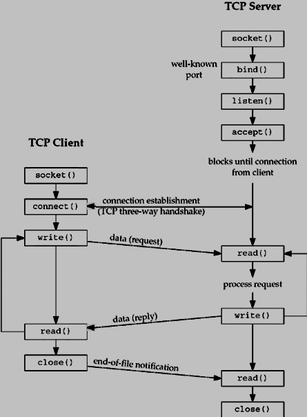

リバースエンジニアリング能力向上とWinDbgのプロになるため、自作のモジュールをリバーシングしてます。

今回は、C言語で実装したWindowsのソケット通信プログラムを解析していきます。

※検証目的に作成したプログラムでエラー処理などは実装していないため実用性は担保しません。

<!-- omit in toc -->
## もくじ
- [今回作成したプログラム](#今回作成したプログラム)
  - [winsock2](#winsock2)
  - [pragma comment()](#pragma-comment)
  - [ws2tcpip.h](#ws2tcpiph)
- [POSTリクエストを送信する関数](#postリクエストを送信する関数)
  - [WSADATAの初期化](#wsadataの初期化)
  - [通信先の指定](#通信先の指定)
  - [Socketの作成](#socketの作成)
  - [コネクションの確立](#コネクションの確立)
  - [HTTPリクエストの送信](#httpリクエストの送信)
  - [UDP通信を行う関数](#udp通信を行う関数)
- [通信の確認](#通信の確認)
- [リバーシングする](#リバーシングする)
  - [Ghidraでデコンパイルする](#ghidraでデコンパイルする)
  - [WinDbgでTTDトレースを取得する](#windbgでttdトレースを取得する)
  - [Socketの中身を追う](#socketの中身を追う)
  - [作成されたソケット](#作成されたソケット)
  - [sockaddr_in構造体を読む](#sockaddr_in構造体を読む)
- [まとめ](#まとめ)

## 今回作成したプログラム

今回作成したプログラムは以下のリポジトリに置いてあります。

参考：[Try2WinDbg/win_tcp_udp.c](https://github.com/kash1064/Try2WinDbg/blob/master/build/c/win_tcp_udp.c)

次の2つの機能を実装してます。

- TCPコネクションを確立してPOSTリクエストを送信する
- UDPでデータを送信する

ヘッダファイルは以下のものを使用してます。

``` c
#include <winsock2.h>
#include <stdio.h>
#include <stdlib.h>
#include <stdint.h>

#pragma comment(lib, "ws2_32.lib")

// IPアドレスを扱う場合などに利用
// #include <ws2tcpip.h>
// #include <iphlpapi.h>
// #pragma comment(lib, "iphlpapi.lib")

// winsock2.h と併用して使用する場合は、必ずwinsock2.hより後に定義する
// #include <windows.h>
```

### winsock2

`winsock2.h`は、Windows Sockets 2を含むいくつかの実装を行う際に使用するヘッダファイルです。

Windows環境におけるソケット通信に使用するAPI関数などが含まれています。

参考：[Winsock2.h header - Win32 apps | Microsoft Docs](https://docs.microsoft.com/en-us/windows/win32/api/winsock2/)

参考：[Windows Sockets 2 - Win32 apps | Microsoft Docs](https://docs.microsoft.com/en-us/windows/win32/api/_winsock/)

参考：[Winsock - Wikipedia](https://en.wikipedia.org/wiki/Winsock)

Windowsでソケットプログラミングを行う際の最初の一歩は、この`winsock2.h`で定義されている`WSAStartup`関数を使って`WSADATA`構造体の初期化を行うことです。

参考：[WSADATA (winsock.h) - Win32 apps | Microsoft Docs](https://docs.microsoft.com/en-us/windows/win32/api/winsock/ns-winsock-wsadata)

参考：[WSAStartup function (winsock2.h) - Win32 apps | Microsoft Docs](https://docs.microsoft.com/en-us/windows/win32/api/winsock2/nf-winsock2-wsastartup)

`WSAStartup`関数は使用するWindows Socketsのバージョンと、初期化する`WSADATA`構造体の2つを引数に取ります。

少々ややこしい点として、`WSAStartup`関数の第一引数は、16bit符号なし整数(WORD型)を取りますが、下位8bitにWindows Socketsのメジャーバージョン、上位8bitにマイナーバージョンを指定する必要があります。

そのため、引数に与える値は`MAKEWORD`マクロを使用して作成しています。

参考：[MAKEWORD macro (Windows) | Microsoft Docs](https://docs.microsoft.com/en-us/previous-versions/windows/desktop/legacy/ms632663(v=vs.85))

また、初期化に成功した場合、`WSAStartup`関数は戻り値0を返し、失敗した場合は定義されているエラーコードのいずれかを返します。

そのため、今回の実装には含めていませんが`WSAStartup`関数の戻り値でエラー処理を実装します。

### pragma comment()

`winsock2.h`などのヘッダファイルをインクルードしてコンパイルしようとすると、`error LNK2019: 未解決の外部シンボル`のようなエラーが返ってくる場合があります。

``` powershell
win_tcp_udp.obj : error LNK2019: 未解決の外部シンボル __imp__closesocket@4 が関数 _send_http_post で参照されました
win_tcp_udp.obj : error LNK2019: 未解決の外部シンボル __imp__connect@12 が関数 _send_http_post で参照されました
win_tcp_udp.obj : error LNK2019: 未解決の外部シンボル __imp__htons@4 が関数 _send_http_post で参照されました
win_tcp_udp.obj : error LNK2019: 未解決の外部シンボル __imp__inet_addr@4 が関数 _send_http_post で参照されました
win_tcp_udp.obj : error LNK2019: 未解決の外部シンボル __imp__send@16 が関数 _send_http_post で参照されました
win_tcp_udp.obj : error LNK2019: 未解決の外部シンボル __imp__sendto@24 が関数 _send_udp で参照されました
win_tcp_udp.obj : error LNK2019: 未解決の外部シンボル __imp__socket@12 が関数 _send_http_post で参照されました
win_tcp_udp.obj : error LNK2019: 未解決の外部シンボル __imp__WSAStartup@8 が関数 _send_http_post で参照されました
win_tcp_udp.obj : error LNK2019: 未解決の外部シンボル __imp__WSACleanup@0 が関数 _send_http_post で参照されました
.\build\bin\win_tcp_udp.exe : fatal error LNK1120: 9 件の未解決の外部参照
```

これは、コンパイラがライブラリをリンクできないことで発生します。

解決方法として、次のどちらかを実施します。

- VisualStudioで開発している場合は、プロジェクトのプロパティの[構成プロパティ]>[リンカー]>[入力]から[追加の依存ファイル]に参照エラーの発生しているライブラリを追加します
- `#pragma comment(lib, "<ライブラリ名>.lib")`を追記します。

今回はプロジェクトは作成せずCファイルをcl.exeでコンパイルしたいので、`pragma`を使っていきます。

`pragma`とは、コンパイル時に特定のアクションを指示する命令です。

特に、`comment`の`lib`構文を使用することで、コンパイル時にリンクするライブラリをソースコード側から指定することができます。

参考：[C Pragmas | Microsoft Docs](https://docs.microsoft.com/en-us/cpp/c-language/c-pragmas?view=msvc-170)

参考：[comment pragma | Microsoft Docs](https://docs.microsoft.com/en-us/cpp/preprocessor/comment-c-cpp?view=msvc-170)

そのため、`#pragma comment(lib, "ws2_32.lib")`の行を追加することで`winsock2.h`のリンクエラーを回避することができるようになります。

### ws2tcpip.h

今回の実装では不要ですが、`ws2tcpip.h`はIPアドレスの取得に関連する構造体などが定義された、TCP/IPを行うために必要なヘッダファイルです。

参考：[Creating a Basic Winsock Application - Win32 apps | Microsoft Docs](https://docs.microsoft.com/en-us/windows/win32/winsock/creating-a-basic-winsock-application)

参考：[Ws2Tcpip.h header - Win32 apps | Microsoft Docs](https://docs.microsoft.com/en-us/windows/win32/api/ws2tcpip/)

## POSTリクエストを送信する関数

任意のアドレスに対してPOSTリクエストを送信する関数は以下の通りです。

``` c
int send_http_post(unsigned char *senddata){
    char destination[] = RSERVER;
    unsigned short port = 80;
    unsigned char httppath[20] = "/upload";
    char httphost[] = LSERVER;
    int dstSocket;
    int result;
 
    char toSendText[MAXBUF];
    char postdata[MAXBUF];
    int read_size;

    // WSADATAの初期化
    WSADATA data;
    WSAStartup(MAKEWORD(2, 0), &data);

    // AF_INETを設定
    struct sockaddr_in dstAddr;
    memset(&dstAddr, 0, sizeof(dstAddr));
    dstAddr.sin_port = htons(port);
    dstAddr.sin_family = AF_INET;
    dstAddr.sin_addr.s_addr = inet_addr(destination);

    // Socket通信の開始(SOCK_STREAMを指定)
    printf("\t==>Creating socket...\n");
    dstSocket = socket(AF_INET, SOCK_STREAM, 0);
    if (dstSocket < 0){
        printf("\t==>Creating socket failed!!\n");
        return 0;
    }
    printf("\t==>Creating socket succeeded!!\n");
 
    // 通信の開始
    printf("\t==>Connecting...\n");
    result = connect(dstSocket, (struct sockaddr *) &dstAddr, sizeof(dstAddr));
    if (result < 0){
        printf("\t==>Binding failed!!\n");
        return 0;
    }
    printf("\t==>Connecting succeeded!!\n");
 
    // HTTPリクエストの作成
    printf("\t==>Creating HTTP request...\n");
    sprintf(toSendText, "POST %s HTTP/1.1\r\n", httppath);
    send(dstSocket, toSendText, strlen(toSendText) , 0);
 
    sprintf(toSendText, "Host: %s:%d\r\n", httphost, port);
    send(dstSocket, toSendText, strlen(toSendText), 0);

    sprintf(postdata, "%s\r\n", senddata);
    sprintf(toSendText, "Content-Length: %d\r\n", strlen(postdata));
    send(dstSocket, toSendText, strlen(toSendText), 0);
         
    sprintf(toSendText, "\r\n");
    send(dstSocket, toSendText, strlen(toSendText), 0);

    // HTTPリクエストの送信
    printf("\t==>Sending HTTP request...\n");
    send(dstSocket, postdata, strlen(postdata), 0);
  
    // 通信のクローズ
    printf("\t==>HTTP request is sent!!\n");
    closesocket(dstSocket);
    WSACleanup();

    return 0;
}
```

### WSADATAの初期化

まずはソケット通信に必要な`WSADATA`構造体を`WSAStartup`関数で初期化します。

Windows Socketsのバージョンは2.0を指定しています。

``` c
// WSADATAの初期化
WSADATA data;
WSAStartup(MAKEWORD(2, 0), &data);
```

### 通信先の指定

``` c
// AF_INETを設定
struct sockaddr_in dstAddr;
memset(&dstAddr, 0, sizeof(dstAddr));
dstAddr.sin_port = htons(port);
dstAddr.sin_family = AF_INET;
dstAddr.sin_addr.s_addr = inet_addr(destination);
```

`WSADATA`構造体の初期化後、`sockaddr_in`構造体を作成してアドレスファミリと通信先のアドレス、ポート番号を定義します。

公式ドキュメントでは`addrinfo`構造体を使用する方法が紹介されていますが、今回は`sockaddr_in`構造体を使用してます。

参考：[Creating a Socket for the Client - Win32 apps | Microsoft Docs](https://docs.microsoft.com/en-us/windows/win32/winsock/creating-a-socket-for-the-client)

`sockaddr_in`構造体はIPv4の通信にのみ利用でき、IPv6を使用する場合は`sockaddr_in6`構造体を使用します。

公式ドキュメントで使用している`addrinfo`構造体はIPv4とIPv6の両方にソケットを使用する場合に利用します。

特に理由がなければ`addrinfo`構造体を使っておけば問題なさそうですね。

参考：[Operating System 9 | Socket Programming Experiment 2: Enable IPv4 and IPv6 | by Adam Edelweiss | SereneField | Medium](https://medium.com/adamedelwiess/operating-system-9-socket-programming-experiment-2-enable-ipv4-and-ipv6-c2f034511cd4)

参考：[c - What is the difference between struct addrinfo and struct sockaddr - Stack Overflow](https://stackoverflow.com/questions/23401147/what-is-the-difference-between-struct-addrinfo-and-struct-sockaddr)

アドレスファミリには`AF_INET`を指定しています。

`AF_INET`はIPv4の通信を行う場合に定義するアドレスファミリです。

参考：[sockets - What is AF_INET, and why do I need it? - Stack Overflow](https://stackoverflow.com/questions/1593946/what-is-af-inet-and-why-do-i-need-it)

### Socketの作成

`socket`関数を使ってソケットを作成します。

``` c
// Socket通信の開始(SOCK_STREAMを指定)
printf("\t==>Creating socket...\n");
dstSocket = socket(AF_INET, SOCK_STREAM, 0);
if (dstSocket < 0){
    printf("\t==>Creating socket failed!!\n");
    return 0;
}
printf("\t==>Creating socket succeeded!!\n");
```

今回はTCP接続を行うため、第2引数には`SOCK_STREAM`を指定しています。

参考：[socket function (winsock2.h) - Win32 apps | Microsoft Docs](https://docs.microsoft.com/en-us/windows/win32/api/winsock2/nf-winsock2-socket)

第3引数には*プロトコル*パラメータであり、使用するプロトコルを定義できます。

今回はTCPを明示的に指定しておらず、0を渡しています。

これは、プロトコルの指定を呼び出し元が行わないことを意味します。

参考：[c - what does 0 indicate in socket() system call? - Stack Overflow](https://stackoverflow.com/questions/3735773/what-does-0-indicate-in-socket-system-call)

### コネクションの確立

次は`connect`関数でソケット接続を確立します。

``` c
// 通信の開始
printf("\t==>Connecting...\n");
result = connect(dstSocket, (struct sockaddr *) &dstAddr, sizeof(dstAddr));
if (result < 0){
    printf("\t==>Binding failed!!\n");
    return 0;
}
printf("\t==>Connecting succeeded!!\n");
```

`connect`関数はSocket通信におけるクライアント側の接続を行います。

参考：[Connecting to a Socket - Win32 apps | Microsoft Docs](https://docs.microsoft.com/en-us/windows/win32/winsock/connecting-to-a-socket)

この関数によってbindされているSocketサーバとのTCPコネクションを確立します。



画像引用元：[Unix Socket - Client Server Model](https://www.tutorialspoint.com/unix_sockets/client_server_model.htm)

### HTTPリクエストの送信

事前に作成したPOSTリクエストのデータを`send`関数でサーバに送信します。

``` c
// HTTPリクエストの送信
printf("\t==>Sending HTTP request...\n");
send(dstSocket, postdata, strlen(postdata), 0);
```

今回は実装していませんが、レスポンスを受信するには`recv`関数を使います。

参考：[Sending and Receiving Data on the Client - Win32 apps | Microsoft Docs](https://docs.microsoft.com/en-us/windows/win32/winsock/sending-and-receiving-data-on-the-client)

### UDP通信を行う関数

UDP通信を行う関数は以下の通りです。

``` c
int send_udp(unsigned char *senddata)
{
    char destination[] = RSERVER;
    unsigned short port = 80;
    char httphost[] = LSERVER;
    int dstSocket;
    int result;

    char toSendText[MAXBUF];
    int read_size;

    // WSADATAの初期化
    WSADATA wsaData;
    WSAStartup(MAKEWORD(2, 0), &wsaData);

    struct sockaddr_in dstAddr;
    memset(&dstAddr, 0, sizeof(dstAddr));
    dstAddr.sin_port = htons(port);
    dstAddr.sin_family = AF_INET;
    dstAddr.sin_addr.s_addr = inet_addr(destination);

    // Socket通信の開始(SOCK_DGRAMを指定)
    printf("\t==>Creating socket...\n");
    dstSocket = socket(AF_INET, SOCK_DGRAM, 0);
    if (dstSocket < 0)
    {
        printf("\t==>Creating socket failed!!\n");
        return 0;
    }
    printf("\t==>Creating socket succeeded!!\n");

    // UDPパケットの送信
    printf("\t==>Sending UDP...\n");
    sendto(dstSocket, senddata, strlen(senddata), 0, (SOCKADDR *)&dstAddr, sizeof(dstAddr));

    printf("\t==>UDP is sent!!\n");
    closesocket(dstSocket);
    WSACleanup();

    return 0;
}
```

基本的にはTCP接続の時と同じ実装なので詳細は割愛します。

違いとしては、UDP接続なのでSocketを作成する際の指定を`SOCK_DGRAM`にする点と、3wayハンドシェイクを行わないので`connect`関数を使用せず、`sendto`関数でデータ転送を行う点です。

## 通信の確認

このプログラムを実行し、実際に通信が行われているかWireSharkで確認してみました。

まず、以下の通りPOSTリクエストが送信されていることが確認できました。


また、UDPパケットも受信していることを確認しました。


これでプログラムがちゃんと動作していることが確認できたので、最後にリバーシングしてみたいと思います。

## リバーシングする

### Ghidraでデコンパイルする

まずは`entry`関数から`main`関数を特定しました。

その後、`send_http_post`関数と`send_udp`関数を特定した後、`win_tcp_udp.exe`を実行したときに展開されたイメージベースを設定しました。

### WinDbgでTTDトレースを取得する

解析を容易にするため、ビルドしたプログラムのTTDトレースを取得しました。

TTDトレースの取得方法は以下の記事にまとめてあります。

参考：[【WinDbg Preview】Time Travel Debuggingで始める新しいデバッグ手法](/windows-windbg-008-time-travel-debugging)

また、取得したトレースファイルは以下のリポジトリにも置いてあります。

参考：[kash1064/Try2WinDbg](https://github.com/kash1064/Try2WinDbg/blob/master/traces/win_tcp_udp.zip)

### Socketの中身を追う

とりあえず最初の解析ターゲットとして、`socket`関数の挙動を追っていくことにします。


Ghidraのディスアセンブリ結果から`0xdf726e`にブレークポイントを設定し、`g`コマンドで処理を進めます。

``` powershell
> bu 0x00df726e
> g
```

`Step into`で`socket`関数の中に入ってみると、`Prolog`とついたオブジェクトを扱っているように見えます。


`Prolog`に関してはしばらく調べたものの該当しそうな情報が見つからなかったのでいったんスキップしました。

誰か詳しい人いたら教えてください。。

### 作成されたソケット

続いて、`socket`関数の直後の行を見てみます。


`socket`関数は、作成したSocketを指すファイルディスクリプタを戻り値として返します。

EAXレジスタの中身を見てみると以下の値が格納されていました。

``` powershell
> r eax
eax=00000150
```

参考：[socket function (winsock2.h) - Win32 apps | Microsoft Docs](https://docs.microsoft.com/en-us/windows/win32/api/winsock2/nf-winsock2-socket)

このファイルディスクリプタを指すハンドルはTTDでは拾うことができませんが、ライブデバッグを行うと`!handle`コマンドで参照することができます。

``` powershell
> r eax
eax=00000108

> !handle 108 f
Handle 108
  Type         	File
  Attributes   	0
  GrantedAccess	0x16019f:
         ReadControl,WriteDac,Synch
         Read/List,Write/Add,Append/SubDir/CreatePipe,ReadEA,WriteEA,ReadAttr,WriteAttr
  HandleCount  	2
  PointerCount 	65534
  No Object Specific Information available
```

ファイルオブジェクトの中身も見ようと思ったら多分カーネルデバッグを仕掛けないとだめなのかな？（たぶん）

### sockaddr_in構造体を読む

次に解析するのはソースコードでいうと以下の箇所です。

``` c
struct sockaddr_in dstAddr;

memset(&dstAddr, 0, sizeof(dstAddr));
dstAddr.sin_port = htons(port);
dstAddr.sin_family = AF_INET;
dstAddr.sin_addr.s_addr = inet_addr(destination);
```

`sockaddr_in`のメモリ領域を確保して、ポート番号、アドレスファミリ、IPアドレスをセットしています。

`sockaddr_in`構造体は以下の構造になっています。

`in_addr`構造体には4バイトでIPv4アドレスが格納されます。

`sin_zero`はシステムに予約された領域で、すべて0埋めされます。

``` c
typedef struct sockaddr_in {
#if ...
  short          sin_family;
#else
  ADDRESS_FAMILY sin_family;
#endif
  USHORT         sin_port;
  IN_ADDR        sin_addr;
  CHAR           sin_zero[8];
} SOCKADDR_IN, *PSOCKADDR_IN;
```

参考：[SOCKADDR_IN (ws2def.h) - Win32 apps | Microsoft Docs](https://docs.microsoft.com/en-us/windows/win32/api/ws2def/ns-ws2def-sockaddr_in)

参考：[in_addr (winsock2.h) - Win32 apps | Microsoft Docs](https://docs.microsoft.com/en-us/windows/win32/api/winsock2/ns-winsock2-in_addr)

ちなみに、`sin_port`と`sin_addr`にはネットワークバイトオーダの値を入れる必要があるため、ソースコードでは`htons`関数と`inet_addr`関数を使用しています。

参考：[htons function (winsock.h) - Win32 apps | Microsoft Docs](https://docs.microsoft.com/en-us/windows/win32/api/winsock/nf-winsock-htons)

参考：[inet_addr function (winsock2.h) - Win32 apps | Microsoft Docs](https://docs.microsoft.com/en-us/windows/win32/api/winsock2/nf-winsock2-inet_addr)

解析対象の構造がおおむね確認できたところで、`memset`関数の呼び出し後のアドレス`0xdf7227`にブレークポイントを設定します。


ここで`memset`関数の戻り値を確認すると、確保されたアドレスが`0x55d810`から始まることがわかります。

``` powershell
> r eax
eax=0055d810
```

メモリアドレスを見てみると16バイト分の領域に値がセットされているように見えます。

`sockaddr_in`構造体は、ポートとアドレスファミリの領域にそれぞれ2バイトずつ、IPアドレスに4バイト、システム予約領域に8バイトを使用します。


このまま処理を進めていくと、空だったメモリの領域にポート番号、アドレスファミリ、IPアドレスが設定されました。


このままだと少しわかりづらいので表示を変えてみました。

``` powershell
> dyb 0055d810
          76543210 76543210 76543210 76543210
          -------- -------- -------- --------
0055d810  00000010 00000000 00000000 01010000  02 00 00 50
0055d814  10101001 11111110 01100100 00011110  a9 fe 64 1e
0055d818  00000000 00000000 00000000 00000000  00 00 00 00
0055d81c  00000000 00000000 00000000 00000000  00 00 00 00
```

ポート番号80が`0x0050`とネットワークバイトオーダ（ビッグエンディアン）形式で格納されています。

また、`0x55d814`からの4バイトは、IPアドレスが同じくネットワークバイトオーダで格納されています。

## まとめ

年の瀬にソケットプログラミングとリバーシングなどをしてました。

来年も良い年になるとよいですね。


