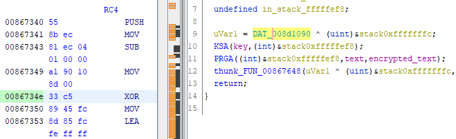
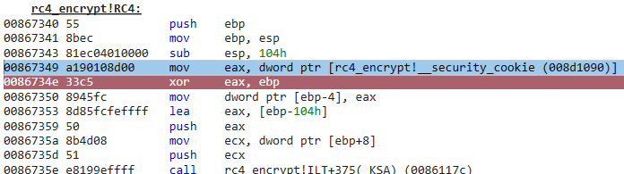
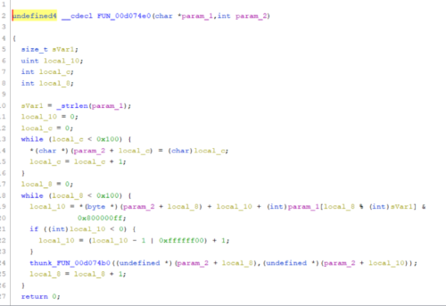
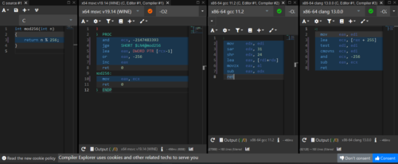

今回はC言語でRC4暗号を実装してWinDbgでリバーシングしてみたいと思います。

2021/12/24に開催されていた[Harekaze mini CTF 2021](https://harekaze.com/ctf/2021.html)のRev問で静的解析からRC4暗号が使われていることを見抜く問題があったのですが、残念ながらデコンパイル結果から見抜くことができませんでした。

参考：[harekaze-mini-ctf-2021 Pack](https://github.com/TeamHarekaze/harekaze-mini-ctf-2021-challenges-public/blob/main/rev/pack-program/solution/Pack%20Program-solve.pdf)

そこで、今回は復習を兼ねて実際に自分でRC4暗号を実装し、リバーシングしてみたいと思います。

<!-- omit in toc -->
## もくじ
- [RC4暗号とは](#rc4暗号とは)
  - [ストリーム暗号](#ストリーム暗号)
  - [RC4暗号](#rc4暗号)
  - [KSA](#ksa)
  - [PRGAで鍵ストリームを生成して暗号化](#prgaで鍵ストリームを生成して暗号化)
  - [復号](#復号)
- [ソースコード](#ソースコード)
- [RC4プログラムをリバーシングしてみる](#rc4プログラムをリバーシングしてみる)
  - [呼び出し関数のデコンパイル](#呼び出し関数のデコンパイル)
  - [TTDトレースを解析する](#ttdトレースを解析する)
  - [KSAのデコンパイル](#ksaのデコンパイル)
  - [PRGAのデコンパイル](#prgaのデコンパイル)
  - [追記(2022/1/2)](#追記202212)
- [まとめ](#まとめ)
- [参考書籍](#参考書籍)

## RC4暗号とは

RC4暗号はWEPやSSL通信などに使用されていたストリーム暗号の一種です。

現在は脆弱性が広く知られており、使用は推奨されておりません。

参考：[RC4 - Wikipedia](https://en.wikipedia.org/wiki/RC4)

### ストリーム暗号

ストリーム暗号は対象暗号(暗号化と復号に同じ鍵を使用する暗号)の一種で、bitごと、あるいはバイトごとに逐次暗号化を行っていく方式です。

ストリーム暗号以外の対象暗号としてはブロック暗号があり、ストリーム暗号と比較されることが多いです。

参考：[暗号技術 実践活用ガイド](https://amzn.to/3zi4Pew)

### RC4暗号

RC4暗号は、ストリーム暗号なので、生成した疑似乱数列と平文の排他的論理和を取ることで暗号化を行います。

RC4による暗号化は、ざっくり以下の流れです。

- 与えられた鍵を元に、KSAによって暗号化に使用する鍵ストリームを生成するための初期ステートSを生成します
- 初期ステートSを使い、PRGA(疑似乱数生成アルゴリズム)で平文を暗号化する鍵ストリームを生成します
- 生成した鍵ストリームを用いて平文をXOR暗号化します

### KSA

RC4暗号では、あらかじめ定義された配列S	を使用し、KSA(キースケージュールアルゴリズム)を用いて配列Sの初期化を行います。

実装はWikipediaのサンプルを参考にしています。

参考：[RC4 - Wikipedia](https://en.wikipedia.org/wiki/RC4)

``` c
#define N 256

void swap(unsigned char *a, unsigned char *b)
{
    int tmp = *a;
    *a = *b;
    *b = tmp;
    return;
}

int KSA(char *key, unsigned char *S)
{

    // 配列Sの初期化(S[0]=0, S[1]=1....S[255]=255)
    for (int i = 0; i < N; i++) S[i] = i;
    
    // KSAで初期ストリームを生成
    int j = 0;
    int len = strlen(key);
    for (int i = 0; i < N; i++)
    {
        j = (j + S[i] + key[i % len]) % N;
        swap(&S[i], &S[j]);
    }

    return 0;
}
```

上記のコードの通り、入力されたキーを元にKSAで初期ストリームを生成します。

### PRGAで鍵ストリームを生成して暗号化

RC4のPRGAから暗号化までは以下のステップで実装します。

- iをインクリメントする(`i = (i + 1) % 256`)
- S[i]をjを加算する(`j = (j + S[i]) % 256`)
- S[i]とS[j]をスワップする
- 鍵ストリームKを`S[(S[i] + S[j]) % 256]`として平文とXORをとる

実装は非常にシンプルですね。

``` c
int PRGA(unsigned char *S, char *text, unsigned char *encrypted_text)
{

    int i = 0;
    int j = 0;
    for (size_t n = 0, len = strlen(text); n < len; n++)
    {
        i = (i + 1) % N;
        j = (j + S[i]) % N;
        swap(&S[i], &S[j]);
        int K = S[(S[i] + S[j]) % N];
        encrypted_text[n] = K ^ text[n];
    }

    return 0;
}
```

これでRC4の暗号化処理が実装できました。

### 復号

RC4暗号は疑似乱数を用いたXORにより暗号化を行っています。

この疑似乱数の生成アルゴリズムは決定論的アルゴリズムなので、常に同じキーから同じ疑似乱数が取得できます。

そのため、RC4の暗号化に使用したものと同じキーを使用して生成した疑似乱数で、暗号化されたテキストを再びXORすることで元の平文を復号することができます。

## ソースコード

ソースコード全体は以下です。

こちらのリポジトリにも置いてあります。

参考：[Try2WinDbg/rc4_encrypt.c](https://github.com/kash1064/Try2WinDbg/blob/master/build/c/rc4_encrypt.c)

``` c
#include <stdio.h>
#include <string.h>
#include <stdlib.h>

#define N 256

void swap(unsigned char *a, unsigned char *b)
{
    int tmp = *a;
    *a = *b;
    *b = tmp;
    return;
}

int KSA(char *key, unsigned char *S)
{

    // 配列Sの初期化(S[0]=0, S[1]=1....S[255]=255)
    for (int i = 0; i < N; i++) S[i] = i;
    
    // KSAで初期ストリームを生成
    int j = 0;
    int len = strlen(key);
    for (int i = 0; i < N; i++)
    {
        j = (j + S[i] + key[i % len]) % N;
        swap(&S[i], &S[j]);
    }

    return 0;
}

int PRGA(unsigned char *S, char *text, unsigned char *encrypted_text)
{

    int i = 0;
    int j = 0;
    for (size_t n = 0, len = strlen(text); n < len; n++)
    {
        i = (i + 1) % N;
        j = (j + S[i]) % N;
        swap(&S[i], &S[j]);
        int K = S[(S[i] + S[j]) % N];
        encrypted_text[n] = K ^ text[n];
    }

    return 0;
}

int RC4(char *key, char *text, unsigned char *encrypted_text)
{

    unsigned char S[N];

    KSA(key, S);
    PRGA(S, text, encrypted_text);
    return 0;
}

int main(int argc, char *argv[])
{
    printf("RC4 module\n");

    // RC4のkeyは短いと簡単に推測されてしまうため、実際に使用する場合は注意が必要
    char *key = "testkey";
    char *text = "this is test.";

    unsigned char *encrypted_text = malloc(sizeof(int) * strlen(text));
    RC4(key, text, encrypted_text);

    printf("This is encrypted text\n");
    printf("==> ");
    for (size_t i = 0, len = strlen(text); i < len; i++)
    {
        printf("%02hhX", encrypted_text[i]);
    }
    printf("\n");

    unsigned char *decrypted_text = malloc(sizeof(int) * strlen(encrypted_text));
    RC4(key, encrypted_text, decrypted_text);

    printf("This is decrypted text\n");
    printf("==> ");
    for (size_t i = 0, len = strlen(text); i < len; i++)
    {
        printf("%c", decrypted_text[i]);
    }

    return 0;
}
```

最後に、このプログラムをリバーシングしてみます。

## RC4プログラムをリバーシングしてみる

とりあえずビルドしたバイナリをGhidraで解析してみます。

main関数の特定方法などは割愛します。

### 呼び出し関数のデコンパイル

まずはRC4の呼び出し関数をチェックしてみます。

ソースコードでいうと以下の部分です。

``` c
int RC4(char *key, char *text, unsigned char *encrypted_text)
{
    unsigned char S[N];
    KSA(key, S);
    PRGA(S, text, encrypted_text);
    return 0;
}
```

デコンパイル結果を見ると、何か変です笑

``` c
void __cdecl RC4(char *param_1,char *param_2,int param_3)
{
  uint uVar1;
  undefined extraout_DL;
  undefined in_stack_fffffef8;
  
  uVar1 = DAT_00471090 ^ (uint)&stack0xfffffffc;
  thunk_FUN_004071b0(param_1,(int)&stack0xfffffef8);
  thunk_FUN_00407260((int)&stack0xfffffef8,param_2,param_3);
  thunk_FUN_00407648(uVar1 ^ (uint)&stack0xfffffffc,extraout_DL,in_stack_fffffef8);
  return;
}
```

解析を容易にするため、関数名や変数名をリネームしました。

``` c
void __cdecl RC4(char *key,char *text,int encrypted_text)
{
  uint uVar1;
  undefined extraout_DL;
  undefined S;
  
  uVar1 = DAT_00471090 ^ (uint)&stack0xfffffffc;
  KSA(key,(int)&stack0xfffffef8);
  PRGA((int)&stack0xfffffef8,text,encrypted_text);
  thunk_FUN_00407648(uVar1 ^ (uint)&stack0xfffffffc,extraout_DL,S);
  return;
}
```

ソースコードにはない以下の2行が何をしているのかよくわからないですね。

``` c
uVar1 = DAT_00471090 ^ (uint)&stack0xfffffffc;
/* 中略 */
thunk_FUN_00407648(uVar1 ^ (uint)&stack0xfffffffc,extraout_DL,S);
```

というわけで、WinDbgのTTDトレースを使ってこの箇所を解析していきます。

### TTDトレースを解析する

例によってTTDトレースを取得しました。

トレースファイルは以下に配置してあります。

参考：[Try2WinDbg/rc4_encrypt.zip](https://github.com/kash1064/Try2WinDbg/blob/master/traces/rc4_encrypt.zip)

このトレースファイルをロードし、`uVar1 = DAT_00471090 ^ (uint)&stack0xfffffffc;`の処理を行っているアドレスにブレークポイントを設定します。



``` powershell
> bu 0086734e
```

WinDbgで読ませたところ、Ghidra上で`DAT_00471090`として表示されていたデータはどうやらSecurity Cookieだということがわかりました。



`__security_cookie`はデータセクション内に定義され、バッファオーバーフローの検出に利用されます。

参考：[ida - __security_cookie for function pointers in Windows 10](https://reverseengineering.stackexchange.com/questions/22182/security-cookie-for-function-pointers-in-windows-10)

どうやらこの用途のわからなかった2行は、この機構によってバッファオーバーフローの発生を検知するための処理のようですね。

``` c
uVar1 = DAT_00471090 ^ (uint)&stack0xfffffffc;
/* 中略 */
thunk_FUN_00407648(uVar1 ^ (uint)&stack0xfffffffc,extraout_DL,S);
```

ちょっとすっきりしたので、このままKSAとPRGAの解析を進めていきます。

### KSAのデコンパイル

KSA関数をGhidra でデコンパイルした結果はこんな感じでした。

``` c
undefined4 __cdecl KSA(char *param_1,int param_2)
{
  size_t sVar1;
  uint local_10;
  int local_c;
  int local_8;
  
  for (local_c = 0; local_c < 0x100; local_c = local_c + 1) {
    *(undefined *)(param_2 + local_c) = (undefined)local_c;
  }
  local_10 = 0;
  sVar1 = _strlen(param_1);
  for (local_8 = 0; local_8 < 0x100; local_8 = local_8 + 1) {
    local_10 = *(byte *)(param_2 + local_8) + local_10 + (int)param_1[local_8 % (int)sVar1] &
               0x800000ff;
    if ((int)local_10 < 0) {
      local_10 = (local_10 - 1 | 0xffffff00) + 1;
    }
    thunk_FUN_00867180((undefined *)(param_2 + local_8),(undefined *)(param_2 + local_10));
  }
  return 0;
}
```

[Harekaze mini CTF 2021](https://harekaze.com/ctf/2021.html)のRev問で出てきたバイナリのデコンパイル結果とよく似ていますね。



参考：[harekaze-mini-ctf-2021 Pack](https://github.com/TeamHarekaze/harekaze-mini-ctf-2021-challenges-public/blob/main/rev/pack-program/solution/Pack%20Program-solve.pdf)

これがすぐに見抜けてれば解けたと思うと悔しいです。

### PRGAのデコンパイル

以下がデコンパイル結果です。

``` c
undefined4 __cdecl PRGA(int param_1,char *param_2,int param_3)
{
  size_t sVar1;
  uint local_10;
  uint local_c;
  uint local_8;
  
  local_8 = 0;
  local_10 = 0;
  local_c = 0;
  sVar1 = _strlen(param_2);
  for (; local_c < sVar1; local_c = local_c + 1) {
    local_8 = local_8 + 1 & 0x800000ff;
    if ((int)local_8 < 0) {
      local_8 = (local_8 - 1 | 0xffffff00) + 1;
    }
    local_10 = *(byte *)(param_1 + local_8) + local_10 & 0x800000ff;
    if ((int)local_10 < 0) {
      local_10 = (local_10 - 1 | 0xffffff00) + 1;
    }
    thunk_FUN_00867180((undefined *)(param_1 + local_8),(undefined *)(param_1 + local_10));
    *(byte *)(param_3 + local_c) =
         param_2[local_c] ^
         *(byte *)(param_1 +
                  ((uint)*(byte *)(param_1 + local_8) + (uint)*(byte *)(param_1 + local_10) &
                  0x800000ff));
  }
  return 0;
}
```

ちょっと気になるのは、ソースコードで`(i + 1) % 256`としている箇所が、デコンパイル結果では以下のような表現になっている点です。

※ C言語では`+`と`&`の演算子の優先順位は同一なので、`i + 1`が先に評価されます。

``` c
i = i + 1 & 0x800000ff;
if ((int)i < 0) {
	i = (i - 1 | 0xffffff00) + 1;
}
```

実際に以下のようなスクリプトを作り試してみると、上記の演算で`% 256`と全く同じ演算結果を得ることができました。

``` python
def mod256(n):
    n = n & 0x800000ff
    if n < 0:
        n = (n - 1 | 0xffffff00)

    return n

def main():
    for i in range(250, 260):
        print(mod256(i), end=" ")
    print("")

    return

if __name__ == "__main__":
    main()
```

新たな発見ですね。

今後リバーシングしたときにこのようなデコンパイル結果を見かけたらmod演算としてリバースエンジニアリングすることができそうです。

### 追記(2022/1/2)

`mod 256`のコードはどれも上記のような出力になるのかと思ったのですが、結構コンパイラによって出力が違うようで、Twitterで親切な方にコメントいただきました。



引用：[引用元コメント](https://twitter.com/fujitanozomu/status/1477557557103558657?s=20)


## まとめ

今回はHarekaze mini CTF 2021の復習を兼ねて、RC4暗号を実装してリバーシングしてみました。

新しい発見もあったので試してみてよかったです。

## 参考書籍

- [暗号技術 実践活用ガイド](https://amzn.to/3zi4Pew)