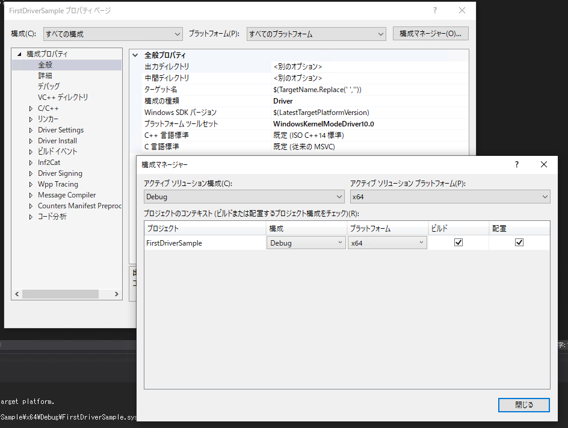
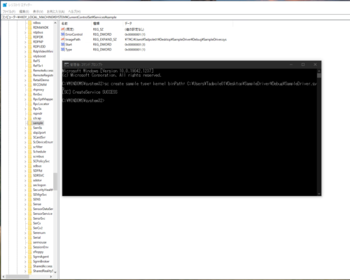
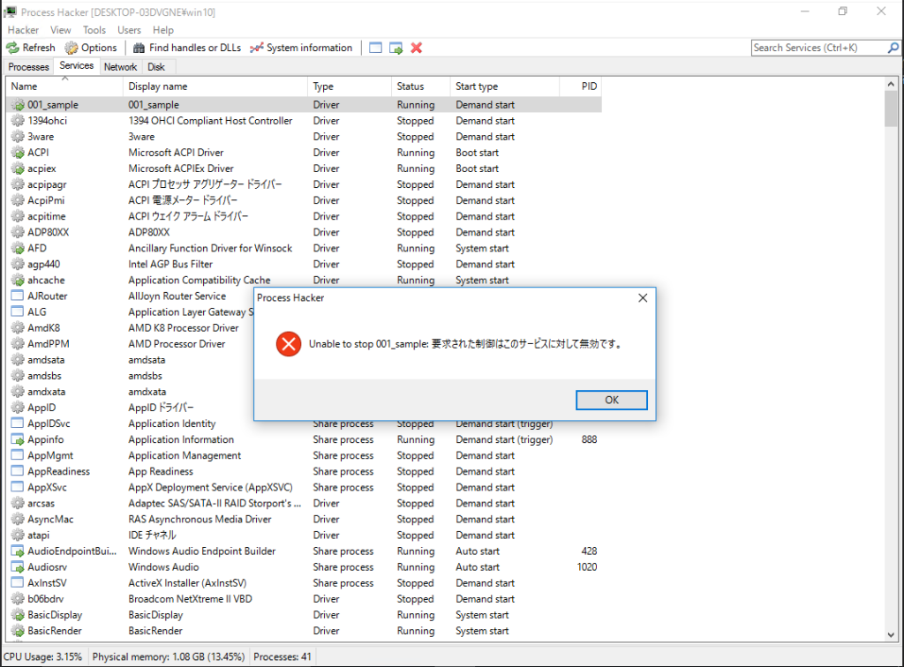
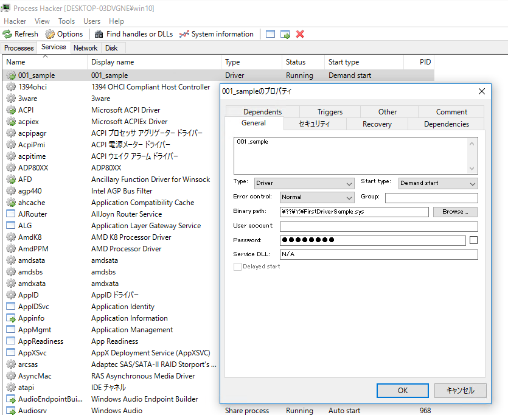
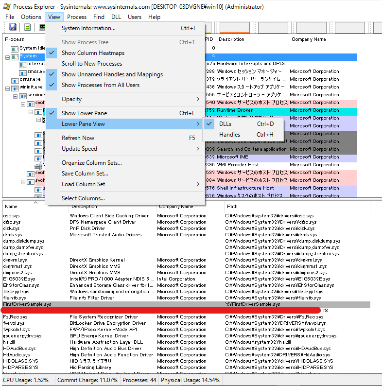
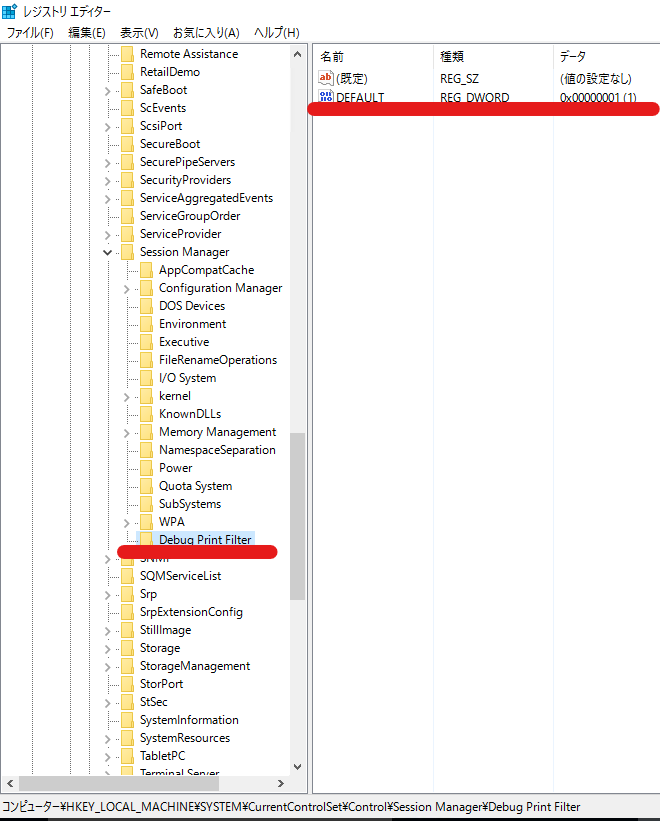
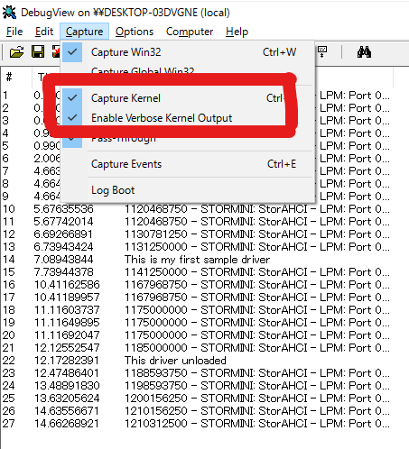
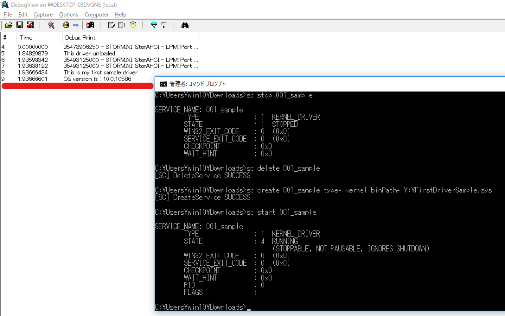

Windowsのカーネルデバッグを試す上で壁になったのが、詳細な仕様が公開されているカーネルドライバが少ないという壁にぶつかりました。

なければ作ってしまおう、と思いカーネルドライバの開発を始めました。

カーネルドライバの開発にあたっては、基本的に以下の書籍を参考にしつつ進めてます。

参考：[Windowsカーネルドライバプログラミング](https://amzn.to/3H3WMoe)

カーネルデバッグの設定方法については以下の記事でまとめてあります。

参考：[WinDbgでWindows10環境のカーネルデバッグを行う最初の一歩](/windows-windbg-004-kernel-debug)

<!-- omit in toc -->
## もくじ
- [最初のドライバを作る](#最初のドライバを作る)
  - [WDMとは](#wdmとは)
  - [シンプルなコード](#シンプルなコード)
  - [DriverEntry](#driverentry)
  - [FirstDriverUnload](#firstdriverunload)
  - [システムスレッド（カーネルモードシステムスレッド）](#システムスレッドカーネルモードシステムスレッド)
  - [ドライバをビルドする](#ドライバをビルドする)
  - [対象プラットフォームの設定](#対象プラットフォームの設定)
  - [カーネルドライバをロードする](#カーネルドライバをロードする)
  - [サービスの停止ができない問題](#サービスの停止ができない問題)
  - [サービスを再読み込みする](#サービスを再読み込みする)
  - [サービスの確認](#サービスの確認)
  - [ドライバがシステムに読み込まれていることを確認](#ドライバがシステムに読み込まれていることを確認)
  - [KdPrintマクロを追加する](#kdprintマクロを追加する)
  - [DebugViewを設定する](#debugviewを設定する)
- [カーネルデバッグで自作ドライバを解析してみる](#カーネルデバッグで自作ドライバを解析してみる)
- [まとめ](#まとめ)


## 最初のドライバを作る

とりあえず最初のドライバを作っていきます。

VisualStudioからWDMプロジェクトを作成します。

この時、本記事を執筆した2021/12/01時点では、VisualStudio 2022はカーネルドライバの開発に非対応でした。

そのため、VisualStudio 2022以降にアップデートしていると、WDMプロジェクトを作成することができませんので注意が必要です。

今回はVisualStudio 2019を使用しています。

### WDMとは

WDMは`Microsoft Windows Driver Model`の略称で、Windows 2000以降のデバイスドライバーのアーキテクチャです。

現在では非推奨のドライバモデルです。

現在カーネルドライバを作成する場合は、`Windows Driver Foundation(WDF)`かユニバーサルWindowsドライバが主流になっているのかな？

参考：[WDM の概要 - Windows drivers | Microsoft Docs](https://docs.microsoft.com/ja-jp/windows-hardware/drivers/kernel/introduction-to-wdm)

WDMドライバには、以下の3つの種類があります。

- bus driver
- function driver
- filter drivers

参考：[Bus Drivers - Windows drivers | Microsoft Docs](https://docs.microsoft.com/en-us/windows-hardware/drivers/kernel/bus-drivers)

参考：[Function Drivers - Windows drivers | Microsoft Docs](https://docs.microsoft.com/en-us/windows-hardware/drivers/kernel/function-drivers)

参考：[Filter Drivers - Windows drivers | Microsoft Docs](https://docs.microsoft.com/en-us/windows-hardware/drivers/kernel/filter-drivers)

### シンプルなコード

VisualStudioでWDMプロジェクトを作成したら、適当な名前のC++ソースファイルを追加して以下のコードを追加します。

``` c++
#include <ntddk.h>

void FirstDriverUnload(_In_ PDRIVER_OBJECT DriverObject)
{
	UNREFERENCED_PARAMETER(DriverObject);
}

extern "C"
NTSTATUS
DriverEntry(_In_ PDRIVER_OBJECT DriverObject, _In_ PUNICODE_STRING RegistryPath)
{
	UNREFERENCED_PARAMETER(DriverObject);
	UNREFERENCED_PARAMETER(RegistryPath);

	return STATUS_SUCCESS;
}
```

### DriverEntry

`DriverEntry`は、ドライバモジュールのエントリポイントになります。

`DriverEntry`は、システムスレッド（カーネルモードシステムスレッド）から`IRQL_PASSIVE_LEVEL(0)`のIRQLで呼び出されます。

### FirstDriverUnload

`FirstDriverUnload`は、ドライバのアンロードルーチンを定義します。

関数名は`FirstDriverUnload`以外に変更しても問題ありません。

上記のサンプルコードではまだ定義されていませんが、`DriverObject`の`DriverUnload`に指定することでドライバモジュールのアンロード時に呼び出す関数を定義します。

``` c++
// アンロードルーチンを定義
DriverObject->DriverUnload = FirstDriverUnload;
```

カーネルドライバの場合はアンロードされるタイミングでメモリリソースなどの解放が必要となるため、このアンロードルーチンでクリーンアップの処理を定義します。

### システムスレッド（カーネルモードシステムスレッド）

システムプロセス(プロセスID 4)が実行しているスレッドがシステムスレッドであり、カーネルモードで実行されています。

システムスレッドは、`Ntoskrnl.exe`か、ロードされているデバイスドライバのカーネルモードコードを実行します。

参考：[インサイドWindows 第7版 上](https://amzn.to/3ei56Eg)

### ドライバをビルドする

最低限のコードが作成できたらカーネルドライバをビルドします。

とりあえずデバッグビルドで作成するので、[Ctrl+Shift+B]を押してビルドします。

### 対象プラットフォームの設定

今回はx64環境向けのドライバモジュールをビルドするので、VisualStudioのプロジェクトのプロパティから、[アクティブソリューションプラットフォーム]の設定を[x64]にしておきます。



ここがデフォルトの設定のままだとx86環境向けのドライバモジュールがビルドされるので、64bit Windowsで起動しようとしても失敗する問題が発生します。

### カーネルドライバをロードする

ドライバのビルドができたら、ビルドしたドライバモジュールを仮想マシンの`Z:\FirstDriverSample.sys`として配置します。

※ここは任意のフォルダ、ドライバ名でOKです。

次に`sc`コマンドで、作成したドライバを`001_sample`サービスとしてロードします。

``` powershell
sc create 001_sample type= kernel binPath= Z:\FirstDriverSample.sys
```

成功すると次のような画面になり、レジストリの`HKLM\SYSTEM\CurrentControlSet\Services`配下に追加したサービスが登録されています。



次に、追加したサービスを起動します。

`sc start 001_sample`コマンドを実行すると、起動に失敗します。

``` powershell
> sc start 001_sample
[SC] StartService FAILED 1275:
このドライバーの読み込みはブロックされています
```

これは、64bitのシステムドライバには署名が必要なのに対して、自分で作成したドライバには署名が付与されていないためです。

このエラーを回避するため、ドライバを検証する仮想マシンをテスト署名モードで起動します。

以下のコマンドを実行し、再起動すればOKです。

``` powershell
bcdedit /set testsigning on
```

※ OSを再起動するまで、テスト署名モードには移行しません。

※ セキュアブート環境の場合、テスト署名モードへの移行に失敗します。

再起動には、管理者権限で起動したコマンドプロンプトで以下のコマンドを実行します。

``` powershell
shutdown /r /t 0
```

再起動後、再びサービス起動を実行すると、登録したサービスが起動しました。

``` powershell
> sc start 001_sample
SERVICE_NAME: sample
        TYPE               : 1  KERNEL_DRIVER
        STATE              : 4  RUNNING
                                (STOPPABLE, NOT_PAUSABLE, IGNORES_SHUTDOWN)
        WIN32_EXIT_CODE    : 0  (0x0)
        SERVICE_EXIT_CODE  : 0  (0x0)
        CHECKPOINT         : 0x0
        WAIT_HINT          : 0x0
        PID                : 0
        FLAGS              :
```

次はサービスの停止を実行します。

### サービスの停止ができない問題

ここまでのドライバモジュールでサービスの停止を実行しようとしても、停止に失敗します。

``` powershell
> sc stop 001_sample
[SC] ControlService FAILED 1052:s
要求された制御はこのサービスに対して無効です。
```

また、ProcessHackerなどのツールを利用してサービスの停止を実行しても同様になります。



これは、前述したアンロードルーチンをデバイスドライバに実装していないことに起因します。

参考：[Windowsデバイスドライバの基本動作を確認する (1) - Fixstars Tech Blog /proc/cpuinfo](https://proc-cpuinfo.fixstars.com/2017/06/windows-device-driver-1/)

そのため、コードを以下のように修正しました。

``` c++
#include <ntddk.h>

void FirstDriverUnload(_In_ PDRIVER_OBJECT DriverObject)
{
	UNREFERENCED_PARAMETER(DriverObject);
}

extern "C"
NTSTATUS
DriverEntry(_In_ PDRIVER_OBJECT DriverObject, _In_ PUNICODE_STRING RegistryPath)
{
	UNREFERENCED_PARAMETER(RegistryPath);

    // アンロードルーチンを定義
	DriverObject->DriverUnload = FirstDriverUnload;

	return STATUS_SUCCESS;
}
```

これでデバイスドライバを再読み込みし、サービスを起動した後に`sc stop 001_sample`コマンドを実行すると、サービスが停止できるようになりました。

``` powershell
> sc stop 001_sample
SERVICE_NAME: 001_sample
        TYPE               : 1  KERNEL_DRIVER
        STATE              : 1  STOPPED
        WIN32_EXIT_CODE    : 0  (0x0)
        SERVICE_EXIT_CODE  : 0  (0x0)
        CHECKPOINT         : 0x0
        WAIT_HINT          続いて、サービスの確認を行います。
```

### サービスを再読み込みする

サービスの再読み込みのためには、一度登録していたサービスを削除する必要があります。

以下のコマンドでサービスの削除と再登録が可能なので、これを`reload.bat`などの適当なバッチファイルとして保存して使用していきます。

``` powershell
sc stop 001_sample
sc delete 001_sample
sc create 001_sample type= kernel binPath= Z:\FirstDriverSample.sys
sc start 001_sample
```

次は登録されたカーネルドライバのサービスを確認します。

### サービスの確認

そもそもサービスとは、という話を簡単に触れておきます。

Windowsにおけるサービスは、サービスコントロールマネージャー（SCM）によって開始されるプロセスを指します。

カーネルドライバを追加した場合、サービスとして追加されるのでややこしいですが、多くの場合「Windowsサービス」と「ドライバサービス」は区別されることが多いようです。

インサイドWindowsでも、「サービス」とはSCMによって起動されるユーザモードプロセスであり、デバイスドライバはサービスとしては扱わないことが明示されています。

参考：[インサイドWindows 第7版 上](https://amzn.to/3ei56Eg)

参考：[サービス コントロール マネージャー - Win32 apps | Microsoft Docs](https://docs.microsoft.com/ja-jp/windows/win32/services/service-control-manager)

カーネルドライバは先ほど確認した通り`HKLM\SYSTEM\CurrentCntrolSet\Services`のサブキーとして登録され、SCMで起動されます。

ここで、`HKLM\SYSTEM\CurrentCntrolSet\Services`に登録されたサービスはカーネルドライバとWindowsサービスとで区別されており、各サブキーの[Type]の値が小さな値のものはカーネルドライバであり、0x10もしくは0x20の値のものはWindowsサービスとして登録されていることを意味します。

実際に登録されたカーネルドライバのサービスは、ProcessHackerやProexpなどのツールによって確認することができます。



続いて、ドライバ（.sysファイル）がシステムにロードされていることも確認してみます。

### ドライバがシステムに読み込まれていることを確認

Proexpで、[Lower Pane View]から[DLLs]を開きます。



画像の通り、作成したドライバモジュールがロードされていることが確認できます。

### KdPrintマクロを追加する

次に、デバイスドライバにPrintメソッドを追加します。

その前に、カーネルドライバの`KdPrint`の出力をDebugViewで拾えるようにするために、`HKLM\SYSTEM\CurrentControlSet\Control\Session Manager`配下にサブキー[Debug Print Filter]を作成し、DWORD型のキー`DEFAULT`を追加して、値を1に設定します。

※設定の反映にはOSの再起動が必要です。



次に、デバイスドライバのコードを以下のように書き換え、ビルド後にデバイスドライバを再読み込みします。

``` c++
#include <ntddk.h>

void FirstDriverUnload(_In_ PDRIVER_OBJECT DriverObject)
{
	UNREFERENCED_PARAMETER(DriverObject);

	KdPrint(("This driver unloaded\n"));
}

extern "C"
NTSTATUS
DriverEntry(_In_ PDRIVER_OBJECT DriverObject, _In_ PUNICODE_STRING RegistryPath)
{
	UNREFERENCED_PARAMETER(RegistryPath);

	DriverObject->DriverUnload = FirstDriverUnload;

	OSVERSIONINFOEXW osVersionInfo;
	NTSTATUS status = STATUS_SUCCESS;
	osVersionInfo.dwOSVersionInfoSize = sizeof(OSVERSIONINFOEXW);
	status = RtlGetVersion((POSVERSIONINFOW)&osVersionInfo);

	KdPrint(("This is my first sample driver\n"));
	KdPrint(("OS version is : %d.%d.%d\n", osVersionInfo.dwMajorVersion, osVersionInfo.dwMinorVersion, osVersionInfo.dwBuildNumber));

	return STATUS_SUCCESS;
}
```

ここでは、`KdPrint`マクロを使って、現在のOSのバージョン情報を出力しています。

OSのバージョン情報の取得には`RtlGetVersion`を使っています。

参考：[RtlGetVersion function (wdm.h) - Windows drivers | Microsoft Docs](https://docs.microsoft.com/en-us/windows-hardware/drivers/ddi/wdm/nf-wdm-rtlgetversion)

取得した情報は`OSVERSIONINFOEXW`構造体として取得されます。

参考：[OSVERSIONINFOA (winnt.h) - Win32 apps | Microsoft Docs](https://docs.microsoft.com/en-us/windows/win32/api/winnt/ns-winnt-osversioninfoa)

``` c++
typedef struct _OSVERSIONINFOA {
  DWORD dwOSVersionInfoSize;
  DWORD dwMajorVersion;
  DWORD dwMinorVersion;
  DWORD dwBuildNumber;
  DWORD dwPlatformId;
  CHAR  szCSDVersion[128];
} OSVERSIONINFOA, *POSVERSIONINFOA, *LPOSVERSIONINFOA;
```

### DebugViewを設定する

SysInternalのDebugViewでKdprintマクロの出力を拾っていきます。

まずはアプリケーションを起動し、[Caputure]から[Capture Kernel]と[Enable Verbose Output]を有効化します。



これで、ツールバーのキャプチャボタンを押してキャプチャを開始した状態でサービスを起動すると、DebugViewでOSのバージョン情報を取得することができます。



最後は、自作のドライバに対してWinDbgでカーネルデバッグを仕掛けてみます（ようやく本題）

## カーネルデバッグで自作ドライバを解析してみる

まずはカーネルデバッグを有効化します。

``` powershell
bcdedit /debug on
bcdedit /dbgsettings serial debugport:1 baudrate:115200
shutdown /r /t 0
```

詳しい設定方法は以下の記事にまとめてあります。

参考：[WinDbgでWindows10環境のカーネルデバッグを行う最初の一歩](/windows-windbg-004-kernel-debug)

カーネルデバッグの接続に成功したら、今回ビルドしたドライバのpdbファイルをSympathに追加します。

``` powershell
.sympath+ C:\Users\Tadpole01\source\repos\Try2WinDbg\drivers\FirstDriverSample\x64\Debug
```

モジュールの一覧を参照すると`FirstDriverSample`の存在が確認できます。

``` powershell
kd> lm
start             end                 module name
fffff800`64520000 fffff800`64527000   FirstDriverSample   (deferred)             
fffff801`74000000 fffff801`747cc000   nt         (pdb symbols)          C:\ProgramData\Dbg\sym\ntkrnlmp.pdb\F7971FB6AA7E450CBCA7054A98D659421\ntkrnlmp.pdb
Unloaded modules:
fffff800`62c80000 fffff800`62c8f000   dump_storport.sys
fffff800`62cc0000 fffff800`62ce5000   dump_storahci.sys
fffff800`62d10000 fffff800`62d2c000   dump_dumpfve.sys
fffff800`63400000 fffff800`63413000   dam.sys 
fffff800`61ec0000 fffff800`61ed0000   WdBoot.sys
fffff800`62ba0000 fffff800`62bae000   hwpolicy.sys
```

シンボルがロードされているので、関数名も確認できます。

``` powershell
kd> x /D /f FirstDriverSample!d*
fffff800`64521020 FirstDriverSample!DriverEntry (struct _DRIVER_OBJECT *, struct _UNICODE_STRING *)
fffff800`645210f7 FirstDriverSample!DbgPrint (DbgPrint)
```

`uf`コマンドでエントリ関数のディスアセンブル結果を見てみます。

``` powershell
kd> uf FirstDriverSample!DriverEntry
FirstDriverSample!DriverEntry [C:\Users\Tadpole01\source\repos\Try2WinDbg\drivers\FirstDriverSample\FirstDriver.cpp @ 13]:
   13 fffff800`64521020 4889542410      mov     qword ptr [rsp+10h],rdx
   13 fffff800`64521025 48894c2408      mov     qword ptr [rsp+8],rcx
   13 fffff800`6452102a 4881ec68010000  sub     rsp,168h
   13 fffff800`64521031 488b05c81f0000  mov     rax,qword ptr [FirstDriverSample!__security_cookie (fffff800`64523000)]
   13 fffff800`64521038 4833c4          xor     rax,rsp
   13 fffff800`6452103b 4889842450010000 mov     qword ptr [rsp+150h],rax
   16 fffff800`64521043 488b842470010000 mov     rax,qword ptr [rsp+170h]
   16 fffff800`6452104b 488d0daeffffff  lea     rcx,[FirstDriverSample!FirstDriverUnload (fffff800`64521000)]
   16 fffff800`64521052 48894868        mov     qword ptr [rax+68h],rcx
   19 fffff800`64521056 c744242000000000 mov     dword ptr [rsp+20h],0
   20 fffff800`6452105e c74424301c010000 mov     dword ptr [rsp+30h],11Ch
   21 fffff800`64521066 488d4c2430      lea     rcx,[rsp+30h]
   21 fffff800`6452106b ff158f0f0000    call    qword ptr [FirstDriverSample!_imp_RtlGetVersion (fffff800`64522000)]
   21 fffff800`64521071 89442420        mov     dword ptr [rsp+20h],eax
   23 fffff800`64521075 488d0d74010000  lea     rcx,[FirstDriverSample! ?? ::FNODOBFM::`string' (fffff800`645211f0)]
   23 fffff800`6452107c e876000000      call    FirstDriverSample!DbgPrint (fffff800`645210f7)
   24 fffff800`64521081 448b4c243c      mov     r9d,dword ptr [rsp+3Ch]
   24 fffff800`64521086 448b442438      mov     r8d,dword ptr [rsp+38h]
   24 fffff800`6452108b 8b542434        mov     edx,dword ptr [rsp+34h]
   24 fffff800`6452108f 488d0d7a010000  lea     rcx,[FirstDriverSample! ?? ::FNODOBFM::`string' (fffff800`64521210)]
   24 fffff800`64521096 e85c000000      call    FirstDriverSample!DbgPrint (fffff800`645210f7)
   26 fffff800`6452109b 33c0            xor     eax,eax
   27 fffff800`6452109d 488b8c2450010000 mov     rcx,qword ptr [rsp+150h]
   27 fffff800`645210a5 4833cc          xor     rcx,rsp
   27 fffff800`645210a8 e823000000      call    FirstDriverSample!__security_check_cookie (fffff800`645210d0)
   27 fffff800`645210ad 4881c468010000  add     rsp,168h
   27 fffff800`645210b4 c3              ret
```

今回は特に動きのあるカーネルドライバではないのでいったんここで終了します。

次回以降では、実際に自作のドライバに対してライブデバッグを仕掛けていこうと思います。

## まとめ

カーネルモードデバッグの検証のために、カーネルドライバの開発を始めました。

WinDbg関連記事はこちらにまとめてあります。

参考：[WinDbgを用いたデバッグとトラブルシューティングのテクニック](/windows-windbg-001-index)