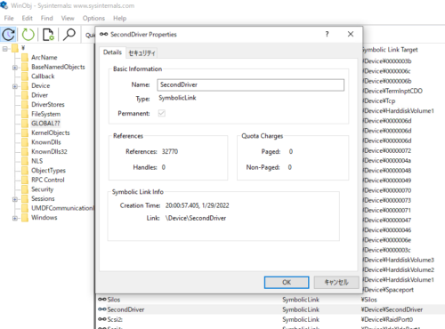
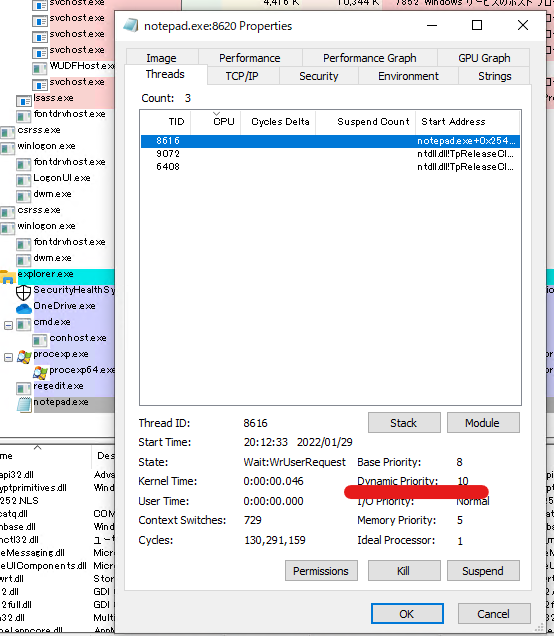
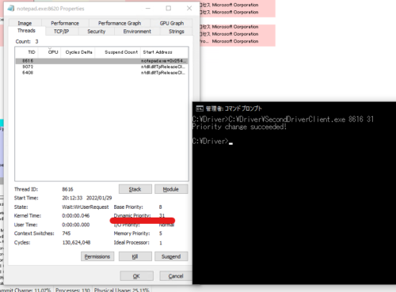
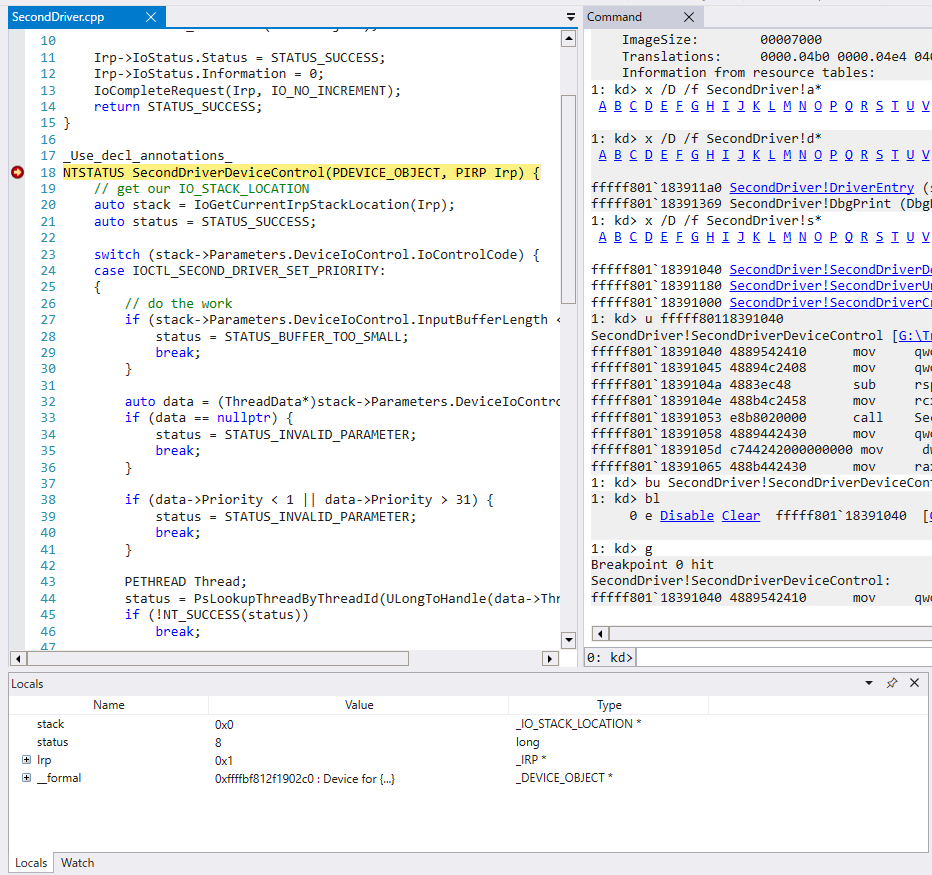
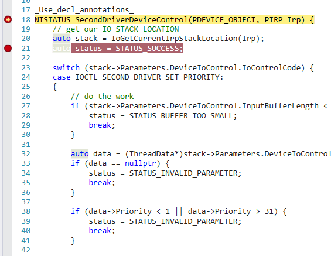
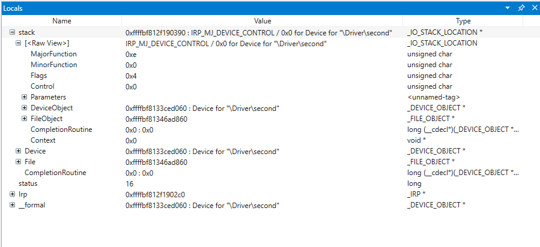
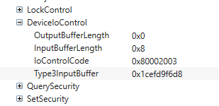
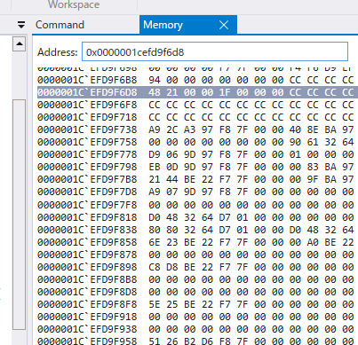

Windowsのカーネルデバッグを試す上で壁になったのが、詳細な仕様が公開されているカーネルドライバが少ないという壁にぶつかりました。

なければ作ってしまおう、と思いカーネルドライバの開発を始めました。

カーネルドライバの開発にあたっては、基本的に以下の書籍を参考にしつつ進めてます。

参考：[Windowsカーネルドライバプログラミング](https://amzn.to/3H3WMoe)

カーネルデバッグの設定方法については以下の記事でまとめてあります。

参考：[WinDbgでWindows10環境のカーネルデバッグを行う最初の一歩](/windows-windbg-004-kernel-debug)

[前回](/windows-windriver-001-tutorial)の記事ではDebugViewを設定してKdPrintでOSのバージョンを出力するだけのドライバを作成し、ライブデバッグを行いました。

今回はもう少し動きのあるドライバを作成してデバッグをしていきたいと思います。

<!-- omit in toc -->
## もくじ
- [カーネルプログラミングについて](#カーネルプログラミングについて)
	- [ユーザモードと比較した場合の、カーネルドライバ開発の相違点](#ユーザモードと比較した場合のカーネルドライバ開発の相違点)
	- [構造化例外処理(SEH)について](#構造化例外処理sehについて)
	- [カーネル関数について](#カーネル関数について)
	- [カーネルドライバのメモリ割り当てについて](#カーネルドライバのメモリ割り当てについて)
	- [デバイスオブジェクトについて](#デバイスオブジェクトについて)
- [カーネルドライバとクライアントアプリケーションを作成する](#カーネルドライバとクライアントアプリケーションを作成する)
	- [スケジュールの優先順位](#スケジュールの優先順位)
	- [DriverEntry関数を作る](#driverentry関数を作る)
- [DriverEntry関数を読む](#driverentry関数を読む)
	- [ディスパッチルーチンのサポート](#ディスパッチルーチンのサポート)
	- [カーネル関数が使用する文字列](#カーネル関数が使用する文字列)
	- [デバイスオブジェクトの作成](#デバイスオブジェクトの作成)
	- [シンボリックリンクの作成](#シンボリックリンクの作成)
- [ディスパッチルーチンに割り当てるルーチンのセットアップ](#ディスパッチルーチンに割り当てるルーチンのセットアップ)
	- [関数アノテーション](#関数アノテーション)
	- [IRPの受け取り](#irpの受け取り)
	- [デバイスコントロールのセットアップ](#デバイスコントロールのセットアップ)
	- [現在のスタックロケーションの取得](#現在のスタックロケーションの取得)
	- [要求された優先順位をスレッドに設定する](#要求された優先順位をスレッドに設定する)
- [ドライバのインストール](#ドライバのインストール)
- [カーネルデバッグで挙動を確認してみる](#カーネルデバッグで挙動を確認してみる)
	- [ブレークポイントを設定する](#ブレークポイントを設定する)
	- [IRPを解析する](#irpを解析する)
- [まとめ](#まとめ)
- [参考書籍](#参考書籍)

## カーネルプログラミングについて

[Windowsカーネルドライバプログラミング](https://amzn.to/3H3WMoe)を参考にカーネルドライバの開発を行っています。

前回インストールしたWDK(Windows Driver Kit)にはカーネルドライバ開発で使用するライブラリとヘッダファイルが格納されています。

カーネルAPIはC言語の関数群で構成されていますが、ユーザモード開発とは主に以下の点で異なります。

### ユーザモードと比較した場合の、カーネルドライバ開発の相違点

[Windowsカーネルドライバプログラミング](https://amzn.to/3H3WMoe)よりユーザモードと比較した場合の、カーネルドライバ開発の相違点について引用します。

- 未処理の例外発生時、システムをクラッシュさせる(BSOD)
- プロセスの終了時のアンロードルーチンでリソースを解放する必要がある(解放されない場合はリークが発生する)
- カーネルドライバ開発時のエラーは決して無視してはいけない
- IRQLが0より大きくなる場合がある
- 埋め込まれたバグがシステム全体に影響を及ぼす可能性がある
- デバッグは他のマシンからリモートデバッグする必要がある
- ほとんどの標準ライブラリは使えない
- 例外処理に使えるのは`Structured Exception Handling(SEH)`のみ
- C++ランタイムが利用できない

### 構造化例外処理(SEH)について

SEHはハードウェア障害などの特定の例外コードの状況を適切に処理するための機能です。

SEHを使用することで、例外が発生した場合でも、メモリブロックやファイルなどのリソースが正常に解放されるようにプログラムを書くことができるようになります。

SEHでは、「例外ハンドラ」と「終了ハンドラ」の2つのメカニズムを利用できます。

例外ハンドラは特定のエラーに対応するために使用されます。

参考：[例外ハンドラーの記述 | Microsoft Docs](https://docs.microsoft.com/ja-jp/cpp/cpp/writing-an-exception-handler?view=msvc-170)

一方、終了ハンドラはコードブロックの処理が正常に終了したか例外が発生したかに関わらず常に実行させることができます。

参考：[終了ハンドラーの記述 | Microsoft Docs](https://docs.microsoft.com/ja-jp/cpp/cpp/writing-a-termination-handler?view=msvc-170)

カーネルドライバ開発を行う場合は、SEHを使い、上記のいずれかを用いて例外処理を実装していく必要があります。

参考：[Structured Exception Handling (C/C++) | Microsoft Docs](https://docs.microsoft.com/ja-jp/cpp/cpp/structured-exception-handling-c-cpp?view=msvc-170)

### カーネル関数について

カーネルドライバ開発の際にはCの標準ライブラリは基本的には使用できません。

カーネルドライバ開発では、カーネルのコンポーネントからエクスポートされている関数を使用します。

多くのカーネル関数は`Ntoskrnl.exe`の中で実装されています。

`Ntoskrnl.exe`で実装されている関数には、文書化されているものと文書化されていないものがあります。

カーネル関数の名前にはある程度規則性があり、目的ごとに接頭語が付属しています。

接頭語の対応表については以下のWikipediaページに詳しく書いてありました。

参考：[ntoskrnl.exe - Wikipedia](https://en.wikipedia.org/wiki/Ntoskrnl.exe)

文書化されているカーネル関数については以下のページなどから参照することができます。

参考：[Windows kernel - Windows drivers | Microsoft Docs](https://docs.microsoft.com/ja-jp/windows-hardware/drivers/ddi/_kernel/)

### カーネルドライバのメモリ割り当てについて

カーネルはドライバが利用可能な以下の2つのメモリプールを提供しています。

- ページプール：必要に応じてページアウトされる領域
- 非ページプール：ページアウトされない領域

また、非ページプールは実行が可能な領域と実行不可の領域をそれぞれ制御することができます。

ページングを行わない非ページプールを使用すればページフォールトが発生しないことが保証されますが、ドライバ開発を行う場合は可能な限りページプールで開発することが推奨されるようです。

参考：[ExAllocatePool function (wdm.h) - Windows drivers | Microsoft Docs](https://docs.microsoft.com/en-us/windows-hardware/drivers/ddi/wdm/nf-wdm-exallocatepool)

### デバイスオブジェクトについて

カーネルドライバは原則として1つ以上のデバイスオブジェクトを作成する必要があります。

デバイスオブジェクトとは、OSがデバイスを表すために使用されるものです。

参考：[デバイス オブジェクトの概要 - Windows drivers | Microsoft Docs](https://docs.microsoft.com/ja-jp/windows-hardware/drivers/kernel/introduction-to-device-objects)

デバイスオブジェクトは`DEVICEOBJECT`構造体のインスタンスとして作成されます。

カーネルドライバは、デバイスオブジェクトを経由してクライアントアプリケーションと通信を行います。

参考：[_DEVICE_OBJECT (wdm.h) - Windows drivers | Microsoft Docs](https://docs.microsoft.com/en-us/windows-hardware/drivers/ddi/wdm/ns-wdm-_device_object)

## カーネルドライバとクライアントアプリケーションを作成する

[Windowsカーネルドライバプログラミング](https://amzn.to/3H3WMoe)の4章で解説されているコードを写経しつつSecondDriverSampleの開発を行っていきます。

4章では、スレッドの優先度をコントロールするカーネルドライバとクライアントアプリケーションのセットを作成しました。

### スケジュールの優先順位

そもそもの話ですが、僕はWindowsAPIを使ったスレッド優先度の設定が何かについてそもそもよく知らなかったので簡単に調べてみました。

Windows環境において、スレッドはスレッドの優先順位によってスケジュールされます。

スレッドの優先順位は以下の2つの条件で決定されます。

- プロセスの優先度クラス
- プロセスの優先度クラス内のスレッドの優先度レベル

プロセスの優先度クラスは以下のいずれかに属しており、`SetPriorityClass`によって設定することができます。

デフォルトではプロセスの優先度クラスは`THREAD_PRIORITY_NORMAL`になるようです。

- THREAD_PRIORITY_IDLE
- THREAD_PRIORITY_LOWEST
- THREAD_PRIORITY_BELOW_NORMAL
- THREAD_PRIORITY_NORMAL
- THREAD_PRIORITY_ABOVE_NORMAL
- THREAD_PRIORITY_HIGHEST
- THREAD_PRIORITY_TIME_CRITICAL

一方で、各優先度クラス内のスレッドの優先度レベルは以下のいずれかが設定されます。

`SetThreadPriority`で変更することができます。

こちらもデフォルトでは`THREAD_PRIORITY_NORMAL`が割り当てされます。

- THREAD_PRIORITY_IDLE
- THREAD_PRIORITY_LOWEST
- THREAD_PRIORITY_BELOW_NORMAL
- THREAD_PRIORITY_NORMAL
- THREAD_PRIORITY_ABOVE_NORMAL
- THREAD_PRIORITY_HIGHEST
- THREAD_PRIORITY_TIME_CRITICAL

参考：[SetPriorityClass function (processthreadsapi.h) - Win32 apps | Microsoft Docs](https://docs.microsoft.com/en-us/windows/win32/api/processthreadsapi/nf-processthreadsapi-setpriorityclass)

参考：[SetThreadPriority function (processthreadsapi.h) - Win32 apps | Microsoft Docs](https://docs.microsoft.com/en-us/windows/win32/api/processthreadsapi/nf-processthreadsapi-setthreadpriority)

これらの組みあわせによって各スレッドの優先順位が決定するものの、以下のリンク先の表の通り通常の設定方法では、すべてのレベルの優先順位を柔軟に設定することができないようです。

参考：[スケジュールの優先順位 - Win32 apps | Microsoft Docs](https://docs.microsoft.com/ja-jp/windows/win32/procthread/scheduling-priorities)

そこで、4章で開発するドライバとクライアントでは、スレッドの優先度を柔軟に設定できるようにすることを目標にしています。

### DriverEntry関数を作る

ベースは[過去の記事](/windows-windriver-001-tutorial)で作成した手順と同じです。

まずはエントリポイントになる`DriverEntry`関数を作ります。

`DriverEntry`関数では、以下の処理を実装します。

- アンロードルーチンの設定
- ドライバがサポートするディスパッチルーチンの設定
- デバイスオブジェクトの生成
- デバイスオブジェクトへのシンボリックリンクの作成

アンロードルーチンとデバイスオブジェクトが必要な理由は前述した通りです。

詳しくは以下の「必須の標準ドライバー ルーチン」の項が参考になります。

参考：[標準ドライバー ルーチンの概要 - Windows drivers | Microsoft Docs](https://docs.microsoft.com/ja-jp/windows-hardware/drivers/kernel/introduction-to-standard-driver-routines)

ディスパッチルーチンはIRP(受信I/O要求パケット)を処理するものです。

IRPには様々な要求に対してその要求に関する情報が格納されます。

カーネルドライバは、ドライバのデバイスハンドルをオープンするために、最低限`IRP_MJ_CREATE`と`IRP_MJ_CLOSE`のディスパッチルーチンについてはサポートする必要があるようです。

参考：[ディスパッチ ルーチンの機能 - Windows drivers | Microsoft Docs](https://docs.microsoft.com/ja-jp/windows-hardware/drivers/kernel/dispatch-routine-functionality)

参考：[DRIVER_DISPATCH (wdm.h) - Windows drivers | Microsoft Docs](https://docs.microsoft.com/en-us/windows-hardware/drivers/ddi/wdm/nc-wdm-driver_dispatch)

参考：[DispatchCreate, DispatchClose, and DispatchCreateClose Routines - Windows drivers | Microsoft Docs](https://docs.microsoft.com/en-us/windows-hardware/drivers/kernel/dispatchcreate--dispatchclose--and-dispatchcreateclose-routines)

デバイスオブジェクトへのシンボリックリンクを作成するのは、クライアントからカーネルドライバのデバイスオブジェクトを参照するためです。

例えば`CreateFile`関数などは第1引数にデバイスオブジェクトのシンボリックリンクを受け取ります。

## DriverEntry関数を読む

ここで、実際に写経しつつ作成した`DriverEntry`関数は次のようになりました。

``` c
extern "C" NTSTATUS
DriverEntry(_In_ PDRIVER_OBJECT DriverObject, _In_ PUNICODE_STRING RegistryPath) {
	UNREFERENCED_PARAMETER(RegistryPath);

	KdPrint(("SecondDriver DriverEntry started\n"));

	DriverObject->DriverUnload = SecondDriverUnload;

	DriverObject->MajorFunction[IRP_MJ_CREATE] = SecondDriverCreateClose;
	DriverObject->MajorFunction[IRP_MJ_CLOSE] = SecondDriverCreateClose;
	DriverObject->MajorFunction[IRP_MJ_DEVICE_CONTROL] = SecondDriverDeviceControl;

	UNICODE_STRING devName = RTL_CONSTANT_STRING(L"\\Device\\SecondDriver");

	//RtlInitUnicodeString(&devName, L"\\Device\\ThreadBoost");
	PDEVICE_OBJECT DeviceObject;
	NTSTATUS status = IoCreateDevice(DriverObject, 0, &devName, FILE_DEVICE_UNKNOWN, 0, FALSE, &DeviceObject);
	if (!NT_SUCCESS(status)) {
		KdPrint(("Failed to create device (0x%08X)\n", status));
		return status;
	}

	UNICODE_STRING symLink = RTL_CONSTANT_STRING(L"\\??\\SecondDriver");
	status = IoCreateSymbolicLink(&symLink, &devName);
	if (!NT_SUCCESS(status)) {
		KdPrint(("Failed to create symbolic link (0x%08X)\n", status));
		IoDeleteDevice(DeviceObject);
		return status;
	}

	KdPrint(("SecondDriverSecondDriver DriverEntry completed successfully\n"));

	return STATUS_SUCCESS;
}
```

### ディスパッチルーチンのサポート

とりあえず気になったのは以下の3行です。

ここではディスパッチルーチンのセットアップを行っています。

``` c
DriverObject->MajorFunction[IRP_MJ_CREATE] = SecondDriverCreateClose;
DriverObject->MajorFunction[IRP_MJ_CLOSE] = SecondDriverCreateClose;
DriverObject->MajorFunction[IRP_MJ_DEVICE_CONTROL] = SecondDriverDeviceControl;
```

`DriverObject`は`semi-documented`な構造体で、ロードされたカーネルモードドライバーのイメージを表します。

``` c
typedef struct _DRIVER_OBJECT {
  CSHORT             Type;
  CSHORT             Size;
  PDEVICE_OBJECT     DeviceObject;
  ULONG              Flags;
  PVOID              DriverStart;
  ULONG              DriverSize;
  PVOID              DriverSection;
  PDRIVER_EXTENSION  DriverExtension;
  UNICODE_STRING     DriverName;
  PUNICODE_STRING    HardwareDatabase;
  PFAST_IO_DISPATCH  FastIoDispatch;
  PDRIVER_INITIALIZE DriverInit;
  PDRIVER_STARTIO    DriverStartIo;
  PDRIVER_UNLOAD     DriverUnload;
  PDRIVER_DISPATCH   MajorFunction[IRP_MJ_MAXIMUM_FUNCTION + 1];
} DRIVER_OBJECT, *PDRIVER_OBJECT;
```

参考：[_DRIVER_OBJECT (wdm.h) - Windows drivers | Microsoft Docs](https://docs.microsoft.com/en-us/windows-hardware/drivers/ddi/wdm/ns-wdm-_driver_object)

「ロードされたカーネルモードドライバーのイメージ」とは？って感じですが`DriverEntry`関数が呼び出されるときにカーネル側で割り当てと初期化をされた後で渡されるオブジェクトとのことで、カーネル側でよしなにしてくれたオブジェクトなんだろうなと思ってます。（調べてもよくわからなかった・・・）

ここで、このドライバオブジェクトのメンバである`MajorFunction`にディスパッチルーチンを登録することでドライバがサポートする具体的な機能を指定できます。

`MajorFunction`は関数ポインタの配列として管理されていて、`IRP_MJ_`という接頭語がついたインデックスが事前定義されています。

ここで、サポートするディスパッチルーチンのみ追加すればいい理由は、`MajorFunction`配列はカーネル側で初期化された際にすべての要素がドライバがサポートしていないIRPであることを示す`nt!IopInvalidDeviceRequest`に設定されているためです。

そのため、サポートするディスパッチルーチンのみ更新を行う方式になっています。

参考：[DriverObject と DriverEntry](https://social.msdn.microsoft.com/Forums/ja-JP/4f42ce1d-cbd1-4968-b458-1d96239368a8/driverobject-12392-driverentry?forum=wdksupportteamja)

### カーネル関数が使用する文字列

カーネル関数で文字列を使用する場合、基本的には`UNICODE_STRING `型の構造体が期待されます。

参考：[_UNICODE_STRING (ntdef.h) - Win32 apps | Microsoft Docs](https://docs.microsoft.com/en-us/windows/win32/api/ntdef/ns-ntdef-_unicode_string)

ソースコードの以下の行では、`RTL_CONSTANT_STRING`マクロを使ってパスの文字列`\\Device\\SecondDriver`を`UNICODE_STRING`に変換して変数`devname`に格納しています。

そのあとに出てくる`symLink`の行も同様です。

``` c
UNICODE_STRING devName = RTL_CONSTANT_STRING(L"\\Device\\SecondDriver");

UNICODE_STRING symLink = RTL_CONSTANT_STRING(L"\\??\\SecondDriver");
```

参考：[RtlInitString function (wdm.h) - Windows drivers | Microsoft Docs](https://docs.microsoft.com/en-us/windows-hardware/drivers/ddi/wdm/nf-wdm-rtlinitstring)

### デバイスオブジェクトの作成

`DriverEntry`関数内で行う必要がある「デバイスオブジェクトの生成」はここで行います。

もともと`DriverEntry`関数の引数としてカーネルが初期化した`DriverObject`を受け取ってはいますが、これは`IoCreateDevice`関数でデバイスオブジェクトを作成するために必要な情報になります。

デバイスオブジェクトが存在しない場合、ハンドルをオープンしてユーザモードのクライアントがドライバと通信する方法がない状態となります。

デバイスオブジェクトは`IoCreateDevice`関数で作成します。

`IoCreateDevice`関数は以下の構造です。

``` c
NTSTATUS IoCreateDevice(
  [in]           PDRIVER_OBJECT  DriverObject,
  [in]           ULONG           DeviceExtensionSize,
  [in, optional] PUNICODE_STRING DeviceName,
  [in]           DEVICE_TYPE     DeviceType,
  [in]           ULONG           DeviceCharacteristics,
  [in]           BOOLEAN         Exclusive,
  [out]          PDEVICE_OBJECT  *DeviceObject
);
```

参考：[IoCreateDevice function (wdm.h) - Windows drivers | Microsoft Docs](https://docs.microsoft.com/en-us/windows-hardware/drivers/ddi/wdm/nf-wdm-iocreatedevice)

第1引数として受け取る`PDRIVER_OBJECT`型の`DriverObject`は呼び出し元のデバイスオブジェクトになります。

これは`DriverEntry`関数の引数として受け取っていたものです。

第7引数には、新しく作成する`DeviceObject`構造体のポインタが与えられます。

新たに宣言した`PDEVICE_OBJECT `型の`DeviceObject`のポインタを引数として与えられます。

`IoCreateDevice`関数が正常に動作した場合、このポインタの参照先に非ページプールから割り当てられたデバイスオブジェクトが格納されます。

また、第3引数の`DeviceName`では、作成するデバイスオブジェクトに名前を付けることができます。

ここでは、先ほど定義した`devname`を設定しています。

`DeviceType`には`FILE_DEVICE_UNKNOWN`を指定します。

その他設定可能なデバイスタイプについては以下のドキュメントにまとまってます。

参考：[Specifying Device Types - Windows drivers | Microsoft Docs](https://docs.microsoft.com/en-us/windows-hardware/drivers/kernel/specifying-device-types)

実際のコードは以下のようになります。

``` c
PDEVICE_OBJECT DeviceObject;
NTSTATUS status = IoCreateDevice(DriverObject, 0, &devName, FILE_DEVICE_UNKNOWN, 0, FALSE, &DeviceObject);
if (!NT_SUCCESS(status)) {
	KdPrint(("Failed to create device (0x%08X)\n", status));
	return status;
}
```

処理に失敗した場合は、`KdPrint`関数でエラーメッセージを出力します。

### シンボリックリンクの作成

デバイスオブジェクトを作成しましたが、このままではユーザモードのクライアントからはアクセスすることができません。

ユーザモードのクライアントからデバイスドライバにアクセスするためには、デバイスオブジェクトのシンボリックリンクの作成が必要になります。

シンボリックリンクの作成は`IoCreateSymbolicLink`関数で行います。

関数自体はシンプルで、`PUNICODE_STRING `構造体に変換したシンボリックリンクとデバイスオブジェクトの名前を引数に与えるだけです。

参考：[IoCreateSymbolicLink function (wdm.h) - Windows drivers | Microsoft Docs](https://docs.microsoft.com/en-us/windows-hardware/drivers/ddi/wdm/nf-wdm-iocreatesymboliclink)

実際のコードは以下のようになります。

``` c
UNICODE_STRING symLink = RTL_CONSTANT_STRING(L"\\??\\SecondDriver");
status = IoCreateSymbolicLink(&symLink, &devName);
if (!NT_SUCCESS(status)) {
	KdPrint(("Failed to create symbolic link (0x%08X)\n", status));
	IoDeleteDevice(DeviceObject);
	return status;
}
```

シンボリックリンクの作成に失敗した場合、すべての作業を取り消して終了する必要があります。

ここでは、`IoDeleteDevice`関数を用いてシステムからデバイスオブジェクトを削除しています。

参考：[IoDeleteDevice function (wdm.h) - Windows drivers | Microsoft Docs](https://docs.microsoft.com/en-us/windows-hardware/drivers/ddi/wdm/nf-wdm-iodeletedevice)

デバイスオブジェクトとシンボリックリンクの作成が完了したら`DriverEntry`の処理は終了します。

## ディスパッチルーチンに割り当てるルーチンのセットアップ

先ほど以下の行で設定したCREATEとCLOSEをサポートするルーチンをセットアップしていきます。

``` c
DriverObject->MajorFunction[IRP_MJ_CREATE] = SecondDriverCreateClose;
DriverObject->MajorFunction[IRP_MJ_CLOSE] = SecondDriverCreateClose;
```

4章で作成したプログラムでは、CREATEとCLOSEのルーチンが同じ`SecondDriverCreateClose`に設定されています。

これは、特別な処理をせずに単にIRP要求を受け入れるだけの挙動だからです。

CREATEとCLOSEで処理を分けたい場合は、ルーチンも異なるルーチンを作成して割り当てる必要があります。

実際にコードを見てみます。

``` c
_Use_decl_annotations_
NTSTATUS SecondDriverCreateClose(PDEVICE_OBJECT DeviceObject, PIRP Irp) {
	UNREFERENCED_PARAMETER(DeviceObject);

	Irp->IoStatus.Status = STATUS_SUCCESS;
	Irp->IoStatus.Information = 0;
	IoCompleteRequest(Irp, IO_NO_INCREMENT);
	return STATUS_SUCCESS;
}
```

なお、実際に書籍のサンプルのようにディスパッチルーチンを定義すると、ビルド時にコンパイルエラーC2440が発生しました。

``` c
エラー	C2440	'=': 'NTSTATUS (__stdcall *)(PDRIVER_OBJECT,PIRP)' から 'PDRIVER_DISPATCH' に変換できません。
```

ググっても正直よくわからなかったのですが、割り当てる関数をプロトタイプ宣言じゃなくて`DriverEntry`関数より前に直接定義してみたら解決しました。

ほんとにこれでいいのかはわからん。

そもそもWDMでカーネル開発すること自体が非推奨なので、最新のコンパイラだと何か引っかかっちゃうんですかね？

### 関数アノテーション

先頭行に`_Use_decl_annotations_`がありますが、用途が全く分かりませんでした。

`_Use_decl_annotations_`を使用することで、同じ関数のスコープ内のヘッダに表示されるアノテーションが`_Use_decl_annotations_`を持つ定義にも存在するかのように使用される、とドキュメントに記載があります。

参考：[c++ - what is _Use_decl_annotations_ meaning - Stack Overflow](https://stackoverflow.com/questions/24426875/what-is-use-decl-annotations-meaning)

参考：[Annotating function behavior | Microsoft Docs](https://docs.microsoft.com/en-us/cpp/code-quality/annotating-function-behavior?view=msvc-170)

しばらく調べたものの用途がわからなかったので、わかったら追記しようかと思います。

### IRPの受け取り

IRPはアプリケーションからI/O要求が発生した場合に、I/Oマネージャによって作成される構造体です。

IRPは非ページプールに割り当てされ、データのパケットとして受け渡されます。

先にコードを見てみます。

4章のドライバで行っていることはシンプルで、引数として受け取ったIRPの`IoStatus`の値を何やら書き換えた後、`IoCompleteRequest`に引き渡しています。

``` c
Irp->IoStatus.Status = STATUS_SUCCESS;
Irp->IoStatus.Information = 0;
IoCompleteRequest(Irp, IO_NO_INCREMENT);
```

IRPは大きくIRPヘッダとスタックロケーションで構成されています。

アプリケーションからの要求をI/Oマネージャが受け取った後、IRPを非ページプールメモリに割り当てます。

その後、IRPヘッダとスタックロケーションを初期化してドライバのディスパッチルーチンを呼び出します。

詳細な流れについては以下の記事が非常に参考になりました。

参考：[デバドラ講座25 │ サイエンスパーク株式会社](https://sciencepark.co.jp/device_driver/dvdr/report-25/)

`IoStatus`はI/Oステータスブロックで、IRPが完了するとその完了状態が`IoStatus.Status`に設定されます。

また`IoStatus.Information`には読み書きされたバイト長が保持されます。

ここでは何も読み書きをしていないので、`IoStatus.Information`は0を代入しています。

`IoCompleteRequest`マクロは、ディスパッチルーチンがI/O要求の処理をすべて完了し、IRPをI/Oマネージャに返却するためのマクロです。

これでCREATEとCLOSEに対してサポートするディスパッチルーチンの定義は完了しました。

### デバイスコントロールのセットアップ

次に、`DriverObject->MajorFunction[IRP_MJ_DEVICE_CONTROL] = SecondDriverDeviceControl;`の行で設定しているデバイスコントロールルーチンのセットアップを行います。

DEVICE_CONTROLは、ドライバとデータを受け渡す際に汎用的に使用可能なルーチンです。

DEVICE_CONTROLは入力バッファ、出力バッファ、制御コードの3つを受け取る必要があります。

参考：[IRP_MJ_DEVICE_CONTROL - Windows drivers | Microsoft Docs](https://docs.microsoft.com/en-us/windows-hardware/drivers/kernel/irp-mj-device-control)

参考：[Introduction to I/O Control Codes - Windows drivers | Microsoft Docs](https://docs.microsoft.com/en-us/windows-hardware/drivers/kernel/introduction-to-i-o-control-codes)

DEVICE_CONTROLには、以下のドキュメントに記載されている制御コードが渡され、操作が決定されます。

参考：[DeviceIoControl function (ioapiset.h) - Win32 apps | Microsoft Docs](https://docs.microsoft.com/en-us/windows/win32/api/ioapiset/nf-ioapiset-deviceiocontrol)

実際にコードを見てみます。

``` c
_Use_decl_annotations_
NTSTATUS SecondDriverDeviceControl(PDEVICE_OBJECT, PIRP Irp) {
	// get our IO_STACK_LOCATION
	auto stack = IoGetCurrentIrpStackLocation(Irp);
	auto status = STATUS_SUCCESS;

	switch (stack->Parameters.DeviceIoControl.IoControlCode) {
	case IOCTL_SECOND_DRIVER_SET_PRIORITY:
	{
		// do the work
		if (stack->Parameters.DeviceIoControl.InputBufferLength < sizeof(ThreadData)) {
			status = STATUS_BUFFER_TOO_SMALL;
			break;
		}

		auto data = (ThreadData*)stack->Parameters.DeviceIoControl.Type3InputBuffer;
		if (data == nullptr) {
			status = STATUS_INVALID_PARAMETER;
			break;
		}

		if (data->Priority < 1 || data->Priority > 31) {
			status = STATUS_INVALID_PARAMETER;
			break;
		}

		PETHREAD Thread;
		status = PsLookupThreadByThreadId(ULongToHandle(data->ThreadId), &Thread);
		if (!NT_SUCCESS(status))
			break;

		KeSetPriorityThread((PKTHREAD)Thread, data->Priority);
		ObDereferenceObject(Thread);
		KdPrint(("Thread Priority change for %d to %d succeeded!\n",
			data->ThreadId, data->Priority));
		break;
	}

	default:
		status = STATUS_INVALID_DEVICE_REQUEST;
		break;
	}

	Irp->IoStatus.Status = status;
	Irp->IoStatus.Information = 0;
	IoCompleteRequest(Irp, IO_NO_INCREMENT);
	return status;
}
```

### 現在のスタックロケーションの取得

`IoGetCurrentIrpStackLocation`関数は、現在のスタックロケーションを取得できます。

``` c
auto stack = IoGetCurrentIrpStackLocation(Irp);
```

スタックロケーションは`IO_STACK_LOCATION`構造体で定義されています。

ドライバはIRP内のスタックロケーションを利用してI/O操作に関するドライバ固有の情報を取得します。

参考：[IoGetCurrentIrpStackLocation function (wdm.h) - Windows drivers | Microsoft Docs](https://docs.microsoft.com/en-us/windows-hardware/drivers/ddi/wdm/nf-wdm-iogetcurrentirpstacklocation)

スタックロケーションには以下のような情報が含まれます。

- ドライバが実行するMajorFunctionsの情報
- ドライバが実行するMinorFunctionsの情報
- ドライバが転送するデータのバッファの長さや開始位置など
- ドライバーが作成したデバイスオブジェクトへのポインタ
- 開いているファイル、デバイス、ディレクトリ、またはボリュームを表すファイルオブジェクトへのポインタ

参考：[I/O Stack Locations - Windows drivers | Microsoft Docs](https://docs.microsoft.com/en-us/windows-hardware/drivers/kernel/i-o-stack-locations)

### 要求された優先順位をスレッドに設定する

ここが今回作成するドライバの核になる実装です。

`SecondDriverDeviceControl`関数内で定義しています。

`IoGetCurrentIrpStackLocation`関数で取得したスタックロケーションには、受け渡された制御コードなどの情報が含まれます。

そのため、`stack->Parameters.DeviceIoControl.IoControlCode`内の情報を元に処理を分岐させています。

ソースコードは以下です。

``` c
// switch (stack->Parameters.DeviceIoControl.IoControlCode)
case IOCTL_SECOND_DRIVER_SET_PRIORITY:
{
	// do the work
	if (stack->Parameters.DeviceIoControl.InputBufferLength < sizeof(ThreadData)) {
		status = STATUS_BUFFER_TOO_SMALL;
		break;
	}

	auto data = (ThreadData*)stack->Parameters.DeviceIoControl.Type3InputBuffer;
	if (data == nullptr) {
		status = STATUS_INVALID_PARAMETER;
		break;
	}

	if (data->Priority < 1 || data->Priority > 31) {
		status = STATUS_INVALID_PARAMETER;
		break;
	}

	PETHREAD Thread;
	status = PsLookupThreadByThreadId(ULongToHandle(data->ThreadId), &Thread);
	if (!NT_SUCCESS(status))
		break;

	KeSetPriorityThread((PKTHREAD)Thread, data->Priority);
	ObDereferenceObject(Thread);
	KdPrint(("Thread Priority change for %d to %d succeeded!\n",
		data->ThreadId, data->Priority));
	break;
}
```

`IOCTL_SECOND_DRIVER_SET_PRIORITY`は以下ように定義しています。

``` c
#define IOCTL_SECOND_DRIVER_SET_PRIORITY CTL_CODE(SECOND_DRIVER_DEVICE, 0x800, METHOD_NEITHER, FILE_ANY_ACCESS)
```

`CTL_CODE`マクロは、引数の情報を元に制御コードのオブジェクトを生成します。

参考：[CTL_CODE macro (d4drvif.h) - Windows drivers | Microsoft Docs](https://docs.microsoft.com/en-us/windows-hardware/drivers/ddi/d4drvif/nf-d4drvif-ctl_code)

受け渡された制御コードが`IOCTL_SECOND_DRIVER_SET_PRIORITY`の場合、処理を実行します。

以下は入力値チェックを行っています。

``` c
// do the work
if (stack->Parameters.DeviceIoControl.InputBufferLength < sizeof(ThreadData)) {
	status = STATUS_BUFFER_TOO_SMALL;
	break;
}

auto data = (ThreadData*)stack->Parameters.DeviceIoControl.Type3InputBuffer;
if (data == nullptr) {
	status = STATUS_INVALID_PARAMETER;
	break;
}

if (data->Priority < 1 || data->Priority > 31) {
	status = STATUS_INVALID_PARAMETER;
	break;
}
```

今回は最終的にスレッドの優先順位を設定するため、受け渡されたバッファに`ThreadData`を格納する必要があります。

そのため、`stack->Parameters.DeviceIoControl.InputBufferLength`のサイズの確認を行っています。

サイズ確認後、`(ThreadData*)stack->Parameters.DeviceIoControl.Type3InputBuffer`にてスタックロケーションのバッファを`ThreadData`にキャストします。

ヌルポインタになった場合はエラーを返します。

最後に、`ThreadData`の`Priority`の値が規定の範囲に収まっているかを確認します。

受け渡されたデータのチェックが完了したら、`KeSetPriorityThread`関数でスレッドの優先順位を設定します。

`KeSetPriorityThread`関数は、第1引数に優先順位を設定するスレッドのポインタを受け取る必要があります。

参考：[KeSetPriorityThread function (wdm.h) - Windows drivers | Microsoft Docs](https://docs.microsoft.com/en-us/windows-hardware/drivers/ddi/wdm/nf-wdm-kesetprioritythread)

そのため、`PsLookupThreadByThreadId`関数を用いて、受け渡されたスレッドIDからスレッドオブジェクトのポインタを取得します。

参考：[PsLookupThreadByThreadId function (ntifs.h) - Windows drivers | Microsoft Docs](https://docs.microsoft.com/en-us/windows-hardware/drivers/ddi/ntifs/nf-ntifs-pslookupthreadbythreadid)

`PsLookupThreadByThreadId`関数は`ntifs.h`をインクルードすることで使用可能です。

コンパイルエラーを回避するため、`ntifs.h`は`ntddk.h`より前にインクルードする必要があります。

コードを見てみます。

``` c
PETHREAD Thread;
status = PsLookupThreadByThreadId(ULongToHandle(data->ThreadId), &Thread);
if (!NT_SUCCESS(status)) break;

KeSetPriorityThread((PKTHREAD)Thread, data->Priority);
ObDereferenceObject(Thread);
KdPrint(
    ("Thread Priority change for %d to %d succeeded!\n",
      data->ThreadId, data->Priority
    )
);
break;
```

優先順位をセットした後に`ObDereferenceObject`マクロを呼び出しています。

このマクロは引数で受け取ったオブジェクトの参照カウントをデクリメントするマクロですが、用途がいまいちよくわかりませんでした。

参考：[ObDereferenceObject macro (wdm.h) - Windows drivers | Microsoft Docs](https://docs.microsoft.com/en-us/windows-hardware/drivers/ddi/wdm/nf-wdm-obdereferenceobject)

参照カウントとは、そのオブジェクトへの参照もしくはポインタがシステム内にいくつ存在しているかをカウントするもののようです。

この参照カウントが0であれば、システム(たぶんGCなど)によって破棄することが許可されます。

参考：[参照カウント - Wikipedia](https://ja.wikipedia.org/wiki/%E5%8F%82%E7%85%A7%E3%82%AB%E3%82%A6%E3%83%B3%E3%83%88)

ここで`ObDereferenceObject`による参照カウントのデクリメントを行うのは、システムのリークを防ぐためです。

`PsLookupThreadByThreadId`は、受け取ったスレッドに対しての参照カウントをインクリメントします。

そのため、終了時までに`ObDereferenceObject`によってデクリメントを行わないと参照カウントが増加したままになり、リークが発生します。

これでカーネルドライバ側の実装を一通り追うことができました。

クライアントの実装についてはこの記事では割愛します。

詳しくやりたい方は[Windowsカーネルドライバプログラミング](https://amzn.to/3H3WMoe)をご購入ください。

## ドライバのインストール

前の記事と同様の手順で、作成したドライバをシステムにインストールします。

``` powershell
$ sc create second type= kernel binPath= C:\Driver\SecondDriver\SecondDriver.sys
[SC] CreateService SUCCESS

$ sc start second
SERVICE_NAME: second
        TYPE               : 1  KERNEL_DRIVER
        STATE              : 4  RUNNING
                                (STOPPABLE, NOT_PAUSABLE, IGNORES_SHUTDOWN)
        WIN32_EXIT_CODE    : 0  (0x0)
        SERVICE_EXIT_CODE  : 0  (0x0)
        CHECKPOINT         : 0x0
        WAIT_HINT          : 0x0
        PID                : 0
        FLAGS              :
```

このあと`WinObj`の`GLOBAL??`を確認すると、作成した`SecondDriver`のシンボリックリンクが存在していることが確認できます。



ドライバがインストールできたので、クライアントアプリケーションを使ってスレッドの優先順位を設定してみます。

今回は検証のためにメモ帳アプリのスレッドを操作することにしました。

Proexpから、メモ帳のスレッドの優先順位が10に設定されていることがわかります。



このスレッドを最大の優先順位である31に設定してみます。

``` powershell
C:\Driver\SecondDriverClient.exe 8616 31
```

アプリケーションの実行が完了すると、このようにメモ帳スレッドの優先順位が31に変更されました。



## カーネルデバッグで挙動を確認してみる

さて、ここまでずいぶん時間がかかりましたが、ここからがようやく本題です。

WinDbgからカーネルデバッグを行い、自作したカーネルドライバの動きを見てみたいと思います。

カーネルデバッグの設定方法については過去にも紹介したので割愛します。

参考：[WinDbgでWindows10環境のカーネルデバッグを行う最初の一歩](/windows-windbg-004-kernel-debug)

参考：[Windowsカーネルドライバを自作してWinDbgで解析してみる](/windows-windriver-001-tutorial)

### ブレークポイントを設定する

とりあえずカーネルデバッグを仕掛けたあと、`SecondDriver`のモジュールがロードされていることを確認します。

``` powershell
kd> lmDvmSecondDriver
Browse full module list
start             end                 module name
fffff801`18390000 fffff801`18397000   SecondDriver   (deferred)             
    Image path: \??\C:\Driver\SecondDriver\SecondDriver.sys
    Image name: SecondDriver.sys
    Browse all global symbols  functions  data
    Timestamp:        Sat Jan 29 20:08:51 2022 (61F52043)
    CheckSum:         0000EB8D
    ImageSize:        00007000
    Translations:     0000.04b0 0000.04e4 0409.04b0 0409.04e4
    Information from resource tables:
```

ここまでソースコードを見てきた通り、クライアントからのIRPを受け取って実際に優先順位を変更する処理を行うのは`SecondDriverDeviceControl`です。

そのため、`SecondDriverDeviceControl`にブレークポイントを仕掛けた状態でクライアントアプリケーションによる優先順位変更を実施します。

``` powershell
kd> bu SecondDriver!SecondDriverDeviceControl
kd> bl
     0 e Disable Clear  fffff801`18391040  [G:\Try2WinDbg\drivers\SecondDriverSample\SecondDriver\SecondDriver.cpp @ 18]     0001 (0001) SecondDriver!SecondDriverDeviceControl
```

先ほど同様にメモ帳を起動して、メモ帳のスレッドの優先順位を31に変更するよう、クライアントアプリケーションから要求を実行します。

``` powershell
C:\Driver\SecondDriverClient.exe 8520 31
```

### IRPを解析する

今回はソースウィンドウも出してみました。

ブレークポイントで処理が停止したときに、ソースコードのどの箇所かが一目でわかるのでとても便利です。



ソースウィンドウは非常に便利で、ソースコードからブレークポイントをさらに設定することができます。

今回はクライアントアプリケーションから受け取ったIRPの情報を確認したいので、スタックロケーションの取得が終わった次の行にブレークポイントを設定します。



今回は今までと趣向を変えて、GUI中心に解析をしてみようと思います。

スタックロケーションの取得が終わった次の行に処理を進めた時点で、Localsウィンドウからスタックロケーションの情報を参照します。

WinDbgのGUI上では、こんな感じで構造体の情報が整形されて確認できるようになります。



アプリケーションから受け渡しされた引数は、デバイスコントロールルーチンに渡されたIRPの入力バッファに格納されているのでした。

入力バッファの参照先を確認すると`0x1cefd9f6d8`であることがわかります。



というわけで、メモリウィンドウから参照先のアドレスに格納されている値を見てみます。



クライアントアプリケーションでは、受け取った引数は以下のように`atoi`関数で数値化され、ドライバルーチンに渡されます。

``` c
data.ThreadId = atoi(argv[1]);
data.Priority = atoi(argv[2]);
```

C++の`atoi`関数は文字列を4バイトの`int`型の数値に変換します。

そのため、メモリに格納されているデータも4バイト単位のリトルエンディアン形式で読むのがよさそうです。

上記より、入力バッファの参照先のメモリに保存されている値は、以下の通りクライアントアプリケーションに与えた引数と一致していることがわかりました。

``` powershell
0x2148 = 8520
0x1F = 31
```

WinDbgを使うと、カーネルドライバに渡されたIRPの情報も簡単に参照できるので非常に便利ですね。

## まとめ

さて、これで最低限の機能をそろえたカーネルドライバの実装と、デバッグによるIRPの解析に入門することができました。

まだまだ先は長いですが、引き続きカーネルプログラミングとデバッグは続けていこうと思います。

## 参考書籍

- [Windowsカーネルドライバプログラミング](https://amzn.to/3H3WMoe)

