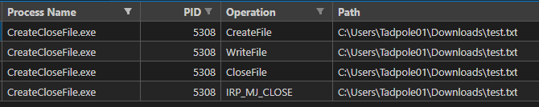
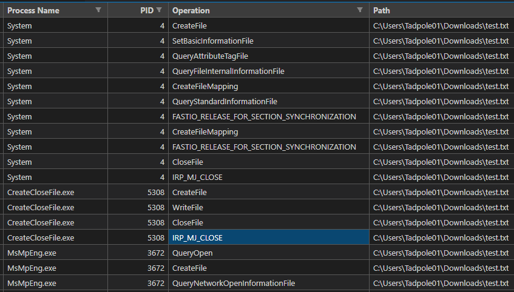
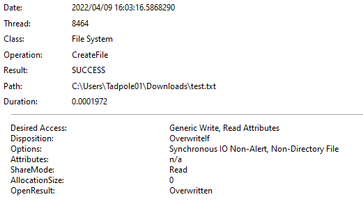
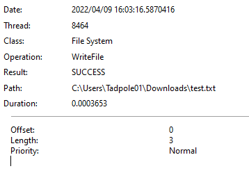

Windowsのカーネルデバッグを試す上で壁になったのが、詳細な仕様が公開されているカーネルドライバが少ないという壁にぶつかりました。

なければ作ってしまおう、と思いカーネルドライバの開発を始めました。

カーネルドライバの開発にあたっては、基本的に以下の書籍を参考にしつつ進めてます。

参考：[Windowsカーネルドライバプログラミング](https://amzn.to/3H3WMoe)

[前回](/windows-windriver-002-irp)は最小限のドライバを作成してカーネルデバッグを行い、ドライバとクライアントアプリケーション間でやり取りされているIRPの情報を参照してみました。

今回も引き続きWindowsカーネルの動きを確認していきます。

<!-- omit in toc -->

## もくじ


## 今回確認する項目

### 割込み処理

ハードウェア割込みにはIRQL(割込み要求レベル)という優先順位が割り当てられています。

CPUはIRQLが高いコードを実行するため、より高いIRQLが設定された割込みが発生した場合、スレッドは現在のスレッドの状態をカーネルスタックに保存した後、ISR(割込みサービスルーチン)を実行します。

この時、割込みを受けたスレッドのクォンタムが割込みによってへることはありません。

なお、ユーザモードのコードは原則としてすべてIRQLが0です。

ちなみに、タスクマネージャーで表示される「システムの割込み」というプロセスは、IRQLが2以上に設定されたものを表す疑似プロセスです。

### 遅延プロシージャコール(DPC)

クライアントがI/O操作を行うときは基本的に次のような流れになります。

1. ユーザモードアプリケーションのスレッドがファイルハンドルを開き`Readfile`を呼び出してファイルの読み出しを要求する


## ファイル操作の動きを確認する

ここでは、実際に`test.txt`というテキストファイルを開いて文字列を書き込んだ後に保存してファイルを閉じる一連の操作を実行する以下のようなアプリケーションを作成し、プロセスモニターログを取得してみました。

``` c
#include <stdio.h>
#include <windows.h>

int main(void) {
    char lpBuffer[] = { 0x41, 0x42, 0x43 };
    const WCHAR* lpFileName = L"C:\\Users\\Tadpole01\\Downloads\\test.txt";

    HANDLE hFile = CreateFile(
        lpFileName,
        GENERIC_WRITE,
        FILE_SHARE_READ,
        NULL,
        CREATE_ALWAYS,
        0,
        NULL
    );

    DWORD nNumberOfBytesToWrite = sizeof(lpBuffer);
    DWORD lpNumberOfBytesWritten;
    BOOL bResult = WriteFile(
        hFile,
        lpBuffer,
        nNumberOfBytesToWrite,
        &lpNumberOfBytesWritten,
        NULL
    );
    CloseHandle(hFile);
	return 0;
}
```

上記のコードは、`CreateFile`用いてファイルのハンドルを取得し`WriteFile`で書き込みを行った後に`CloseHandle`でハンドルを閉じる操作を行っています。

上記ソースコードをコンパイルした`CreateCloseFile.exe`に着目してログを抽出すると、以下の操作を行っていることがわかります。



`CreateFile`から`CloseFile`までの流れはソースコードで明示的に指定したものでしたが、`CloseFile`が呼び出された後に`IRP_MJ_CLOSE`という操作が行われていることがわかります。

`IRP_MJ_CLOSE`とは、[前回の記事](/windows-windriver-002-irp)で書いた通りI/Oマネージャに呼び出されるルーチンで、すべてのデバイスドライバが対応する必要があるルーチンです。

参考：[Methodology for Static Reverse Engineering of Windows Kernel Drivers | by Matt Hand | Posts By SpecterOps Team Members](https://posts.specterops.io/methodology-for-static-reverse-engineering-of-windows-kernel-drivers-3115b2efed83)

今度は少し対象を広げてフィルタしてみます。



`CreateCloseFile.exe`がファイルを開いて書き込む前に、Systemが何やら操作を行っているようです。

※ ProcmonのデフォルトフィルタだとSystemは非表示になっているので、とりあえず無視してもよさそうです。

また、ファイルに書き込みが行われクローズした後に、Defenderによる操作も行われてました。

他には、`CreateFIle`イベントの詳細を見てみるとソースコードで`CreateFile`の引数として与えたパラメータが反映されていることがわかります。



プロセスモニターログから`CreateFile`がどのような操作のために呼び出されたかを確認したい際には、この情報が参考になりそうです。

一方で`WriteFile`イベントの方はあまり詳しい情報はわかりませんが、書き込まれたバイト数についてはここからわかるようです。

今回は「ABC」の3文字を書き込ませているので、`Length`が3になっていました。




## WindowsシステムのIOについて

WindowsシステムにおけるI/Oシステムの中心にはI/Oマネージャーがあります。

I/OマネージャーはI/O操作を表現するために、メモリ内にIRPを作成し、そのポインタを適切なドライバに渡します。

また、I/Oが完了した場合は、I/OマネージャーがそのIRPを破棄します。

一方で、IRPを受け取ったデバイスドライバは指定された処理が完了した後、I/OマネージャーにIRPを返します。

ここでI/OマネージャーがIRPをデバイスドライバに渡すときに指定する処理がルーチンであり、すべてのデバイスドライバは最低源`IRP_MJ_CREATE`と`IRP_MJ_CLOSE`のディスパッチルーチンについてはサポートする必要があるというわけです。


