プライムデーで揃えたパーツでPCを自作したので、新しく環境をセットアップするついでにWindows10環境のセットアップ備忘録をまとめました。

この記事には以下の内容が含まれています。

- Windows10をクリーンインストールした後のこまごました設定
- 個人的によく使うアプリケーションのインストール方法
- OSのセットアップ方法

というわけで、さっそくクリーンインストール直後の環境でセットアップを行います。

<!-- omit in toc -->
## もくじ

- [クリーンインストール後の作業](#クリーンインストール後の作業)
  - [ドライバをインストールする](#ドライバをインストールする)
  - [Windows アップデートを行う](#windows-アップデートを行う)
  - [ネットワーク設定を変更する](#ネットワーク設定を変更する)
  - [RDPを有効化する](#rdpを有効化する)
  - [不要なアプリケーションをアンインストールする](#不要なアプリケーションをアンインストールする)
  - [キーボードのレジストリを変更する](#キーボードのレジストリを変更する)
  - [IME配列をカスタマイズする](#ime配列をカスタマイズする)
  - [ホスト名を変更する](#ホスト名を変更する)
  - [Microsoftアカウントにサインイン](#microsoftアカウントにサインイン)
  - [デスクトップの見た目を変更する](#デスクトップの見た目を変更する)
  - [Windowsの機能の有効化](#windowsの機能の有効化)
  - [PowerShellの権限を変更する](#powershellの権限を変更する)
  - [クリップボードを有効化する](#クリップボードを有効化する)
- [アプリケーションのインストールと設定](#アプリケーションのインストールと設定)
  - [Windows Package Managerを使ってアプリケーションをインストールする](#windows-package-managerを使ってアプリケーションをインストールする)
  - [その他のアプリケーションをインストールする](#その他のアプリケーションをインストールする)
  - [WLS2を設定する](#wls2を設定する)
  - [WSLの名前解決](#wslの名前解決)
  - [WSLに各種パッケージをインストール](#wslに各種パッケージをインストール)
  - [WSLからGithubにSSHで接続する](#wslからgithubにsshで接続する)
  - [VSCodeの拡張機能を入れる](#vscodeの拡張機能を入れる)
  - [Typoraの設定を変更する](#typoraの設定を変更する)
  - [Windows Terminalの設定を変更する](#windows-terminalの設定を変更する)
  - [Hyper-Vの設定](#hyper-vの設定)
- [アプリケーションインストール後の設定](#アプリケーションインストール後の設定)
  - [バックグラウンドアプリの無効化](#バックグラウンドアプリの無効化)
  - [プライバシー設定の変更](#プライバシー設定の変更)
  - [環境変数の設定](#環境変数の設定)
- [まとめ](#まとめ)


## クリーンインストール後の作業

1. ドライバを更新する（必要な場合）
2. Windows アップデートを行う
3. ネットワーク設定を変更する
4. RDPを有効化する
5. ホスト名を変更する
6. 不要なアプリケーションをアンインストールする
7. キーボードのレジストリを変更する
8. IME配列をカスタマイズする
9. ホスト名を変更する
10. Microsoftアカウントにサインイン
11. デスクトップの見た目を変更する
12. Windowsの機能の有効化
13. PowerShellの権限を変更する
14. クリップボードを有効化する

### ドライバをインストールする

今回は、[TUF GAMING Z490-PLUS](https://amzn.to/35OnUqC)という、ASUSのマザボで構成したPCにWindows10をクリーンインストールしたため、インターネット接続などのためにまずドライバのインストールが必要でした。

ドライバのインストールは、マザーボードに付属のCD-Rから行いました。

### Windows アップデートを行う

Windows の[設定]からWindows アップデートを行います。
完了後に再起動が必要です。

### ネットワーク設定を変更する

[コントロールパネル]の[ネットワークとインターネット]から、ネットワークアダプタの設定を変更します。
今回はIPアドレスの固定化は行わないのでこの設定はいじりませんでした。

次に、ホスト名でリモート接続ができるように、ネットワークの探索を[プライベートネットワーク]でのみ有効化します。

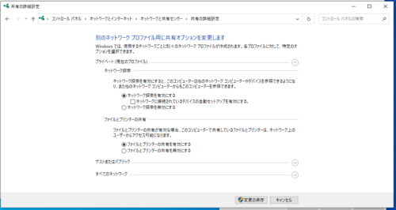

そして、[設定]から現在使っている自宅のネットワークが[プライベートネットワーク]に設定されていることを確認します。

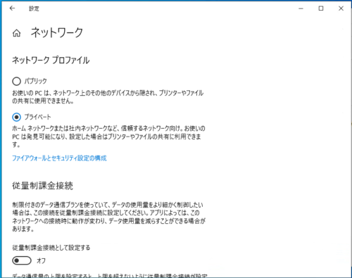

### RDPを有効化する

[コントロールパネル]から、リモートデスクトップ接続を有効化します。

リモートアシスタンスは落としておいてもいいと思います。

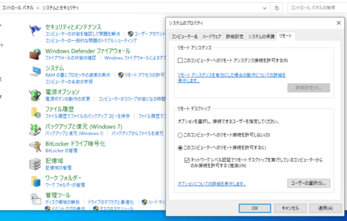

また、今回は変更しませんが、RDPの待ち受けポートを変更したい場合は、以下のレジストリを編集します。

- [HKEY_LOCAL_MACHINE\SYSTEM\CurrentControlSet\Control\Terminal Server\WinStations\RDP-Tcp\PortNumber ]


### 不要なアプリケーションをアンインストールする

プリインストールされているアプリで使用しないものを片っ端からアンインストールします。

ゲームとかSkypeとかOneNoteとかも全部消しました。

### キーボードのレジストリを変更する

Windowsのキーボード配列を好みに合うようにカスタマイズします。

まずは[changekey.reg]というファイルをメモ帳で作成し、以下の記述を入力します。

```
Windows Registry Editor Version 5.00

[HKEY_LOCAL_MACHINE\SYSTEM\CurrentControlSet\Control\Keyboard Layout]
"Scancode Map"=hex:00,00,00,00,00,00,00,00,06,00,00,00,1d,00,3a,00,4b,e0,70,00,\
  4d,e0,38,e0,0e,00,7b,00,7b,00,36,00,00,00,00,00
```

ここで変更しているキー配列については以下の記事にまとめていますので自由にカスタマイズしてください。

- [Windowsのキーボード配列を自由自在に設定する【フリーソフト不要！】](/windows-keybord-setting-byreg)

作成したレジストリファイルをダブルクリックすると、キーボード配列の変更がレジストリに書き込まれます。

変更したレジストリは再起動後に反映されます。

### IME配列をカスタマイズする

レジストリキーを変更しなくても、一部のキー入力については[IMEの設定]からカスタマイズすることができます。

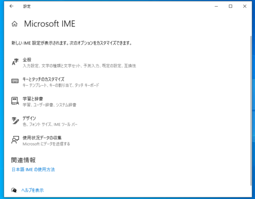

[設定]から利用できる[IMEの設定]はすべての設定をまだ網羅していないので、まずは互換性モードをオンにします。

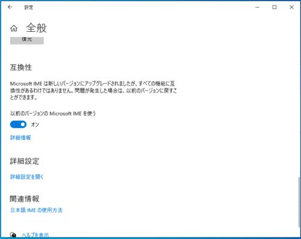

ここで、[IMEの詳細設定]から、以下の点を変更しました。

- [スペース]を[常に半角]にする
  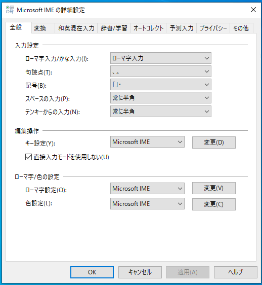
- [英字/数字/記号]を[常に半角に変換]する
  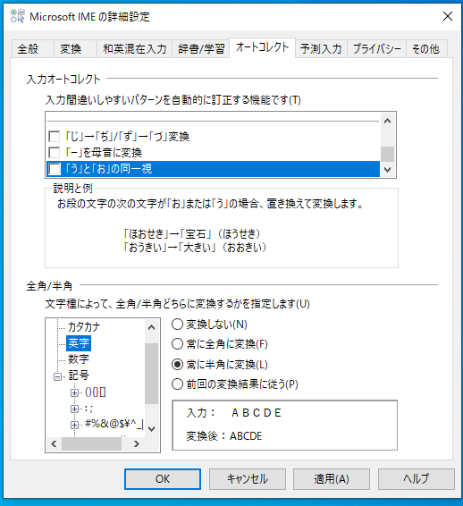

気になるようなら、入力履歴をMicrosoftに送信する設定も無効化しておくといいと思います。

### ホスト名を変更する

[設定]からホスト名を変更して再起動します。

### Microsoftアカウントにサインイン

まずはMicrosoftアカウントにサインインします。

すると強制的にログイン方法がMicrosoftアカウントによるサインインになるので、[アカウント設定]から[ローカルアカウントでのサインイン]に設定を切り替えます。

これは、自宅内でのリモート接続の手間を減らすためです。

### デスクトップの見た目を変更する

[個人用設定]から、タスクバーの位置を変更したり、テーマを適用して背景や色を変えたりします。

お好みで。

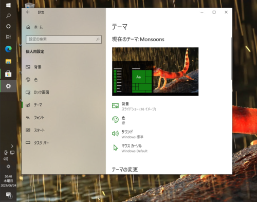

### Windowsの機能の有効化

[Windowsの機能の有効化または無効化]から、以下の機能を有効化します。

- Hyper-V
- Linux用Windowsサブシステム
- Windowsハイパーバイザープラットフォーム
- 仮想マシンプラットフォーム

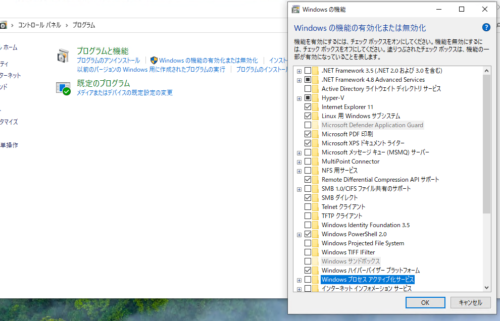

設定の反映のために再起動すれば完了です。

### PowerShellの権限を変更する

管理者権限でPowerShellを起動し、権限を[RemoteSigned]に変更します。

``` powershell
Set-ExecutionPolicy RemoteSigned
```

- [PowerShell のスクリプトが実行できない場合の対処方法 - Qiita](https://qiita.com/Targityen/items/3d2e0b5b0b7b04963750)

### クリップボードを有効化する

[Windows + v]を押してクリップボード機能を有効にします。

## アプリケーションのインストールと設定

### Windows Package Managerを使ってアプリケーションをインストールする

さて、最低限の設定が完了したところで、各種アプリケーションのインストールを行います。

今回は最近メジャーバージョンがリリースされたばかりのWindows Package Managerを使ってアプリケーションのインストールを行います。

Windows Package Managerを使ったアプリケーションのインストールについては長くなったので、以下の記事にまとめました。

- [Windows Package Manager(winget)でよく使うアプリケーションをインストールする](/windows-winget-setup)

### その他のアプリケーションをインストールする

- [Npcap: Windows Packet Capture Library & Driver](https://nmap.org/npcap/)
- [Sysinternals Suite - Windows Sysinternals | Microsoft Docs](https://docs.microsoft.com/ja-jp/sysinternals/downloads/sysinternals-suite)

### WLS2を設定する

まずはWSL2を有効化します。

方法はこちらの記事にまとめました。

- [WSL2のインストール方法【WindowsにLinuxを使う！】 - かえるのほんだな](/windows-wsl2-install)

管理者権限で起動したPowerShellで以下のコマンドを実行するだけ。

```powershell
wsl --set-version Ubuntu-20.04 2
```

### WSLの名前解決

まずは、[/etc/wsl.conf]を次のように編集します。

```
# This file was automatically generated by WSL. To stop automatic generation of this file, add the following entry to /etc/wsl.conf:
[network]
generateResolvConf = false
```

これで、WSL環境のresolv.confが自動作成されなくなります。

次に、一度[/etc/wsl.conf]を削除した後に、[8.8.8.8]を追加して再作成します。

``` bash
sudo rm /etc/resolv.conf
sudo sh -c "echo 'nameserver 8.8.8.8' > /etc/resolv.conf"
```

### WSLに各種パッケージをインストール

とりあえずaptでインストールします。

``` bash
sudo apt update && sudo apt upgrade -y
sudo apt install vim \
                 make \
                 python3.8 \
                 python3-pip \
                 unzip \
                 zip \
                 build-essential \
                 ufw \
                 python3.8-dev \
                 gdb \
                 yara \
                 radare2 \
                 ltrace \
                 strace \
                 -y
```

さて次、WSL2を有効にしたUbuntuにDockerをインストールします。

公式ドキュメントの手順でOKです。

- [Install Docker Engine on Ubuntu | Docker Documentation](https://docs.docker.com/engine/install/ubuntu/)

次に、Dockerをsudo権限なしで動かせるようにします。

``` bash
sudo gpasswd -a  $USER  docker
sudo chown "$USER":"$USER" /home/"$USER"/.docker -R
sudo chmod g+rwx "/home/$USER/.docker" -R
```

詳しくはこちら。

- [WSL2のUbuntuでDockerの環境構築をする！](/docker-setup-on-wsl2)

### WSLからGithubにSSHで接続する

普通にssh-keygenで作成した公開鍵をGithubに登録するだけ、なのですが毎回トラップに引っかかるのでまとめておきます。

[GitHub に SSH で接続する - GitHub Docs](https://docs.github.com/ja/github/authenticating-to-github/connecting-to-github-with-ssh)

というのも、GithubにSSHで接続しようとした場合、こんなエラーがでることがあります。

```
Warning: Permanently added the RSA host key for IP address '13.114.40.48' to the list of known hosts.
git@github.com: Permission denied (publickey).
fatal: Could not read from remote repository.

Please make sure you have the correct access rights
and the repository exists.
```

この問題の解消のために、.ssh/configの作成とssh-addを行います。

僕の環境では、GitHub用の秘密鍵は[github]という名前で作成しているので、以下のように.ssh/configを作成します。

``` bash
$ cat .ssh/config
Host github
User git
Hostname github.com
Port 22
IdentityFile ~/.ssh/github
```

また、なぜかssh-agentが落ちてる時があるので、起動もしておきます。
（最悪.bashrcなどに書き込み。。。）

``` bash
eval `ssh-agent`
ssh-add ~/.ssh/github
```

これで、WSLからSSHを使ってGithubに接続できました。

確認コマンドはこちら。

``` bash
ssh-add -l
```

### VSCodeの拡張機能を入れる

VSCodeの拡張機能はこんな感じに入れました。

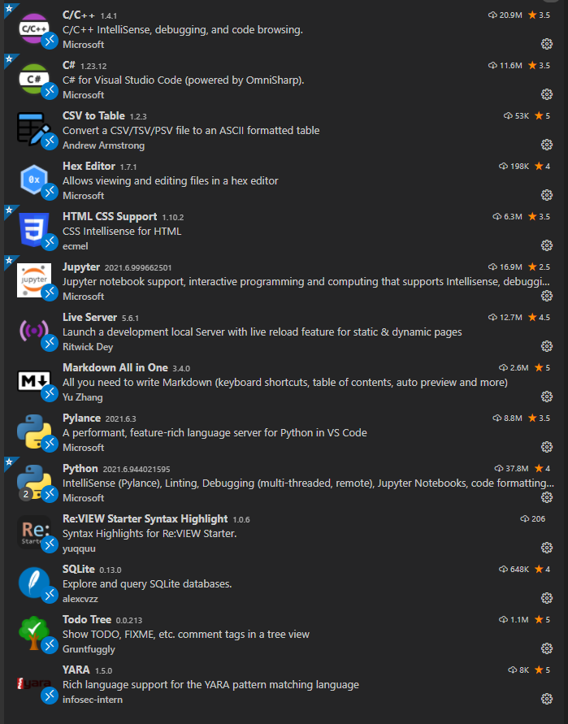

### Typoraの設定を変更する

まずはテーマをGithubDarkにします。

設定方法は[Github Night](https://theme.typora.io/theme/Github-Night/)を参照します。

### Windows Terminalの設定を変更する

Windows TerminalのProfilesとActionを編集して、見た目とショートカットをカスタマイズします。

```
"profiles": 
    {
        "defaults": {},
        "list": 
        [
            {
                "colorScheme": "One Half Dark",
                "guid": "{07b52e3e-de2c-5db4-bd2d-ba144ed6c273}",
                "hidden": false,
                "name": "Ubuntu-20.04",
                "source": "Windows.Terminal.Wsl",
                "startingDirectory": "//wsl$/Ubuntu-20.04/home/ubuntu"
            },
            {
                "commandline": "powershell.exe",
                "guid": "{61c54bbd-c2c6-5271-96e7-009a87ff44bf}",
                "hidden": false,
                "name": "Windows PowerShell"
            },
            {
                "commandline": "cmd.exe",
                "guid": "{0caa0dad-35be-5f56-a8ff-afceeeaa6101}",
                "hidden": false,
                "name": "\u30b3\u30de\u30f3\u30c9 \u30d7\u30ed\u30f3\u30d7\u30c8"
            },
            {
                "guid": "{58ad8b0c-3ef8-5f4d-bc6f-13e4c00f2530}",
                "hidden": false,
                "name": "Debian",
                "source": "Windows.Terminal.Wsl"
            },
            {
                "guid": "{b453ae62-4e3d-5e58-b989-0a998ec441b8}",
                "hidden": false,
                "name": "Azure Cloud Shell",
                "source": "Windows.Terminal.Azure"
            }
        ]
    }
```


```
"actions": 
    [
        // Copy and paste are bound to Ctrl+Shift+C and Ctrl+Shift+V in your defaults.json.
        // These two lines additionally bind them to Ctrl+C and Ctrl+V.
        // To learn more about selection, visit https://aka.ms/terminal-selection
        {
            "command": 
            {
                "action": "copy",
                "singleLine": false
            },
            "keys": "ctrl+shift+c"
        },
        {
            "command": "paste",
            "keys": "ctrl+shift+v"
        },
        // Press Alt+Shift+D to open a new pane.
        // - "split": "auto" makes this pane open in the direction that provides the most surface area.
        // - "splitMode": "duplicate" makes the new pane use the focused pane's profile.
        // To learn more about panes, visit https://aka.ms/terminal-panes
        // Press Ctrl+Shift+F to open the search box
        {
            "command": "find",
            "keys": "ctrl+f"
        },
        {
            "command": "newTab",
            "keys": "ctrl+t"
        },
        {
            "command": 
            {
                "action": "newTab",
                "index": 0
            },
            "keys": "ctrl+1"
        },
        {
            "command": 
            {
                "action": "newTab",
                "index": 1
            },
            "keys": "ctrl+2"
        },
        {
            "command": "closePane",
            "keys": "ctrl+w"
        },
        {
            "command": 
            {
                "action": "splitPane",
                "split": "auto",
                "splitMode": "duplicate"
            },
            "keys": "alt+shift+d"
        },
        {
            "command": 
            {
                "action": "splitPane",
                "split": "horizontal"
            },
            "keys": "alt+h"
        },
        {
            "command": 
            {
                "action": "splitPane",
                "split": "vertical"
            },
            "keys": "alt+v"
        }
    ]
```

- [【設定方法】WindowsTerminalに水平・垂直タブ分割機能が実装されました！](/windows-terminal-splitterminal)

### Hyper-Vの設定

続いて、Hyper-Vを有効にして仮想スイッチの設定を行います。

まずは管理者権限で起動したPowerShellで以下のコマンドをたたいてOSを再起動します。

``` powershell
Enable-WindowsOptionalFeature -Online -FeatureName Microsoft-Hyper-V -All
```

- [Windows 10 での Hyper-V の有効化 | Microsoft Docs](https://docs.microsoft.com/ja-jp/virtualization/hyper-v-on-windows/quick-start/enable-hyper-v)

これで、Hyper-Vマネージャからローカルホストのサービスに接続できるようになるので、[仮想スイッチ]の設定から、次の3つのネットワークを作成します。

- External ： インターネットに接続しているアダプタにブリッジ接続します。
- Internal ： ローカルホストと仮想マシン間で通信できます。RDPなどに使用。
- VirtualHostOnly ： 仮想マシン間のみで通信できます。

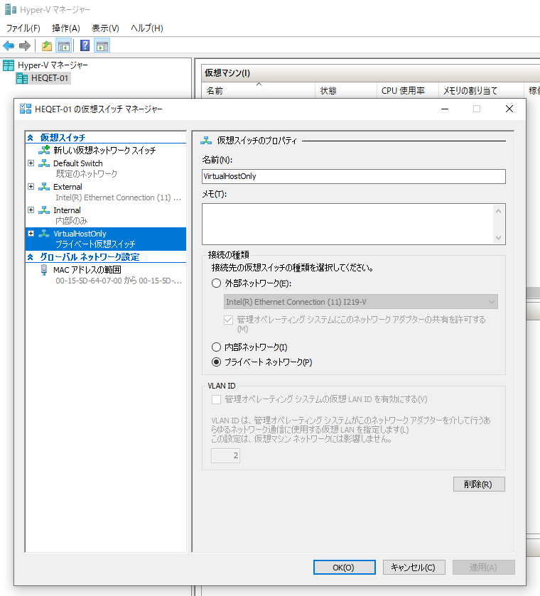

今回は割愛しますが、この後仮想マシンをセットアップしていきます。

仮想マシンのディスクの保存用に、一応パーティションも分割してます。
できれば別のディスクが理想ですが、M.2 SSDの容量もだいぶ余ってるので、今のところパーティション分割にしてます。

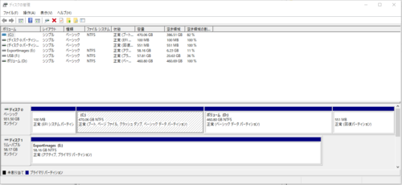

保存先は、[Hyper-Vの設定]から変更可能です。

ついでに、パフォーマンス優先でNUMAノードのメモリ割り当ても無効化しました。

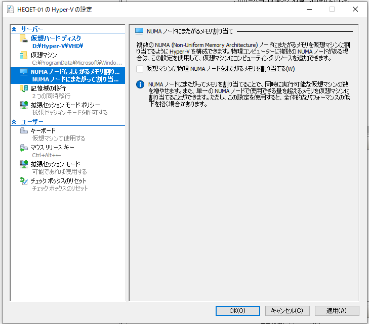

## アプリケーションインストール後の設定

1. バックグラウンドアプリの無効化
2. プライバシー設定の変更
3. 環境変数の設定

### バックグラウンドアプリの無効化

いらないバックグラウンドアプリを無効化します。
コルタナとかコルタナとかコルタナとか。

あとで他のアプリをインストールしたあとにも確認するので飛ばしてもいいです。

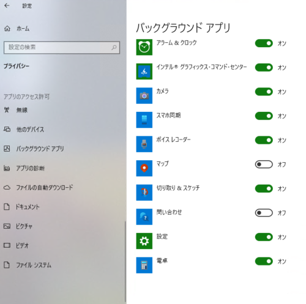

### プライバシー設定の変更

[プライバシー]の各項目で、送信したくない情報の送信をオフにします。

あとは、各種アプリの権限とかも適当に絞っておくといいと思います。

### 環境変数の設定

SysinternalToolsとQemuのフォルダにPATHを設定します。

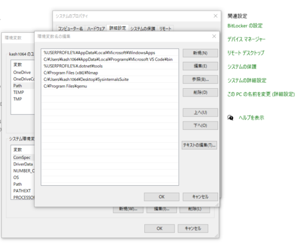

## まとめ

プライムデーで揃えたパーツでPCを自作したので、Windows10環境のセットアップ備忘録をまとめました。

また変更があれば適宜追記していきたいと思います。
