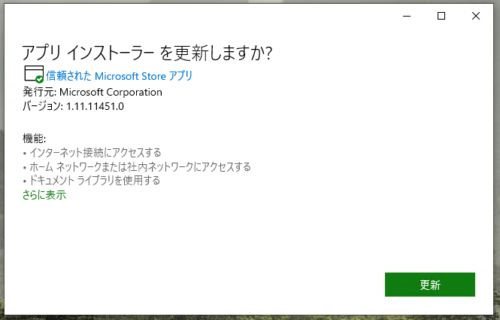
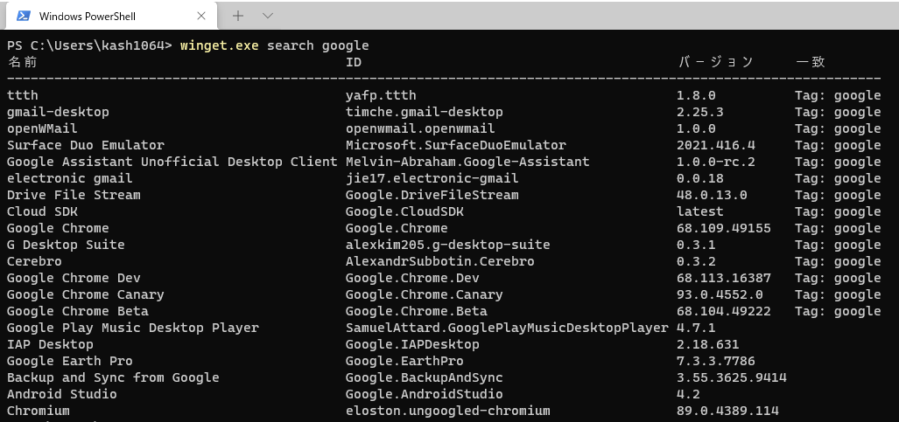
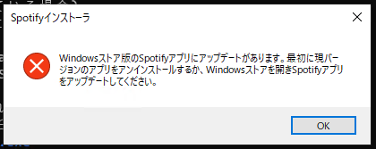

今回は最近メジャーバージョンがリリースされたばかりのWindows Package Managerを使って、普段僕が使用しているアプリケーションのインストールを行います。

この記事では、以下の内容について書いていきます。

1. Windows Package Managerを使う方法
2. Windows Package Managerのコマンド一覧
3. Windows Package Managerでよく使うアプリケーションをインストールする
4. Windows Package Managerを使うときに発生するエラーについて

基本的には、次の公式ドキュメントと公式ブログの内容を参考にします。

- [Use the winget tool to install and manage applications | Microsoft Docs](https://docs.microsoft.com/en-us/windows/package-manager/winget/)
- [Windows Package Manager 1.0 | Windows Command Line](https://devblogs.microsoft.com/commandline/windows-package-manager-1-0/)

<!-- omit in toc -->
## もくじ

- [Windows Package Managerを利用可能にする](#windows-package-managerを利用可能にする)
- [winget のコマンド](#winget-のコマンド)
- [アプリケーションをインストールする](#アプリケーションをインストールする)
  - [WEBブラウザ](#webブラウザ)
  - [開発ツール](#開発ツール)
  - [コミュニケーションツール](#コミュニケーションツール)
  - [その他](#その他)
  - [インストールスクリプト](#インストールスクリプト)
- [wingetでアプリケーションをインストールする際のトラブル](#wingetでアプリケーションをインストールする際のトラブル)
  - [ハッシュの不一致](#ハッシュの不一致)
  - [Microsoftソフトストア版とのバージョン不整合](#microsoftソフトストア版とのバージョン不整合)
- [まとめ](#まとめ)

## Windows Package Managerを利用可能にする

Githubのリリースページから[[Microsoft.DesktopAppInstaller_8wekyb3d8bbwe.appxbundle]をダウンロードします。

- [Releases · microsoft/winget-cli · GitHub](https://github.com/microsoft/winget-cli/releases)

現在最新版のv1.0.11692を利用します。(画像のバージョンは古いですが…。)



PowerShell上で、[winget.exe install --id search APPNAME]などのコマンドの動作が確認できればOKです。



## winget のコマンド

現在のewingetで使えるコマンドは以下のものがあるようです。

| コマンド  | 概要                                                         |
| --------- | ------------------------------------------------------------ |
| export    | インストールされているパッケージのリストをエクスポートします。 |
| features  | 実験的な機能のステータスを表示します。                       |
| hash      | インストーラーのSHA256ハッシュを生成します。                 |
| import    | すべてのパッケージをファイルにインストールします。           |
| install   | 指定されたアプリケーションをインストールします。             |
| list      | インストールされているパッケージを表示します。               |
| search    | アプリケーションを検索します。                               |
| settings  | アプリケーションを検索します。                               |
| show      | 指定したアプリケーションの詳細を表示します。                 |
| source    | wingetツールによってアクセスされるWindowsPackage Managerリポジトリを追加、削除、および更新します。 |
| validate  | WindowsPackageManagerリポジトリに送信するマニフェストファイルを検証します。 |
| uninstall | 指定されたパッケージをアンインストールします。               |
| upgrade   | 指定されたパッケージをアップグレードします。                 |

## アプリケーションをインストールする

というわけで、僕が普段使っているツールについて、wingetによるインストールを行いました。

wingetでインストールしているアプリケーションの一覧は以下のとおりです。

### WEBブラウザ

- Google Chrome
- Firefox

### 開発ツール

- VSCode
- Visual Studio 2019 Community
- Windows Terminal
- Git
- WSL Ubuntu
- WSL Debian
- Qemu
- Wire Shark
- Typora

### コミュニケーションツール

- Slack
- Discord
- ZOOM
- LINE

### その他

- Spotify
- OBS Studio
- Acrobat
- Power Toys

### インストールスクリプト

上記のツールは次のスクリプトでインストールできます。

``` powershell
winget.exe install --id Google.Chrome
winget.exe install --id Mozilla.Firefox
winget.exe install --id SlackTechnologies.Slack
winget.exe install --id Discord.Discord
winget.exe install --id Zoom.Zoom
winget.exe install --id LINE.LINE
winget.exe install --id Canonical.Ubuntu
winget.exe install --id Debian.Debian
winget.exe install --id Typora.Typora
winget.exe install --id Microsoft.VisualStudioCode
winget.exe install --id Microsoft.VisualStudio.2019.Community
winget.exe install --id Microsoft.WindowsTerminal
winget.exe install --id Git.Git
winget.exe install --id Amazon.Kindle
winget.exe install --id Microsoft.PowerToys
winget.exe install --id WiresharkFoundation.Wireshark
winget.exe install --id Adobe.AdobeAcrobatReaderDC
winget.exe install --id SoftwareFreedomConservancy.QEMU
winget.exe install --id Spotify.Spotify
winget.exe install --id OBSProject.OBSStudio
```

現在のところ、Linuxのaptコマンドのように、複数のパッケージを1行でまとめてインストールすることはできず、一括インストールのためには[--import-file]オプションを用いてJSON形式で定義したインポートファイルを読み込む必要があります。

## wingetでアプリケーションをインストールする際のトラブル

### ハッシュの不一致

wingetによるインストールの際には、バージョンを指定しなければlatestとして扱われ、インストール時にはwingetが持っているマニフェストファイルと比較したハッシュ検証が行われます。

ここで、wingetが持っているマニフェストファイルと不整合が発生する場合がよくあるようです。

```
PS C:`Users`kash1064> winget.exe install --id Google.Chrome
見つかりました Google Chrome [Google.Chrome]
このアプリケーションは所有者からライセンス供与されます。
Microsoft はサードパーティのパッケージに対して責任を負わず、ライセンスも付与しません。
Downloading https://dl.google.com/edgedl/chrome/install/GoogleChromeStandaloneEnterprise64.msi
  ██████████████████████████████  75.2 MB / 75.2 MB
インストーラーのハッシュが一致しません; このチェックを無効にするには、--force を使用します
```

issueを見たところ、現在の仕様上このエラーが発生する場合があることは避けられないようです。

スクリプトによる自動化の安定性としては低そうですね。

- [Use of installer hashes causes frequent errors. Instead, rely on signatures in binary. · Issue #714 · microsoft/winget-cli](https://github.com/microsoft/winget-cli/issues/714)

### Microsoftソフトストア版とのバージョン不整合

Microsoftストアで同一のアプリケーションをインストールしていると、以下の不整合エラーが発生する場合があります。

Microsoftストアでインストールしたアプリケーションをアンインストールすると解消されます。

\

## まとめ

メジャーバージョンがリリースされたWindows Package Managerによりアプリケーションのインストールを試してみました。

まだまだ課題は多そうですが、「Google検索→インストーラのダウンロード→インストール」という手順が不要で、コピペ一発でインストールしたいアプリケーションをインストールできるのはかなり便利だと思います。
