ラボ環境にAD環境を構築した際の備忘録です。

とりあえずドメインコントローラの設定とクライアントをADに参加させるところまでの手順とトラブルシューティングについてまとめました。

また他の構成を試す場合は追記していこうと思います。

<!-- omit in toc -->
## もくじ
- [ADサーバの構築](#adサーバの構築)
  - [ADの基本](#adの基本)
  - [環境情報](#環境情報)
  - [ADを有効化する](#adを有効化する)
  - [ドメインコントローラに昇格する](#ドメインコントローラに昇格する)
  - [IP固定](#ip固定)
  - [ADとDNSの確認](#adとdnsの確認)
  - [ADユーザの追加](#adユーザの追加)
- [サーバをADに参加させる](#サーバをadに参加させる)
  - [優先DNSサーバの宛先をドメインコントローラのIPアドレスに設定する](#優先dnsサーバの宛先をドメインコントローラのipアドレスに設定する)
  - [クライアントをドメインに参加させる](#クライアントをドメインに参加させる)
- [ADへの参加に失敗した場合のトラブルシューティング](#adへの参加に失敗した場合のトラブルシューティング)
  - [「指定されたドメインがないか、またはアクセスできません」のエラーが出る場合](#指定されたドメインがないかまたはアクセスできませんのエラーが出る場合)
  - [DNSのイベントを確認する](#dnsのイベントを確認する)
  - [ADドメイン名に.localを使っている](#adドメイン名にlocalを使っている)
  - [IPv6を無効化する](#ipv6を無効化する)
  - [DNSによりドメインコントローラの参照ができているのにADに参加できない](#dnsによりドメインコントローラの参照ができているのにadに参加できない)
  - [連携がうまくいかないときは](#連携がうまくいかないときは)
- [LDAPSを有効にしてアプリケーションとAD連携する](#ldapsを有効にしてアプリケーションとad連携する)
- [まとめ](#まとめ)


## ADサーバの構築

### ADの基本

AD環境において、リソースはドメインコントローラ（DC）によって管理されます。

このドメインコントローラの機能を提供しているのは、AD DSです。

今回構築するAD DSでは、組織単位のリソースグループ（OU）を作成して、ユーザやサーバなどのオブジェクトを管理します。

また、権限や設定は、グループポリシーによって定義することができます。

AD環境において、ドメインの集まりはフォレストと呼ばれます。ADを作成するときは、必ず一つのフォレストと一つのドメインが必要となります。

### 環境情報

ADサーバ用のWindowsServerの構成情報です。

※コンピュータ名を15バイト以上にしてしまっていると、NetBIOS名に変換する際に短縮されます。

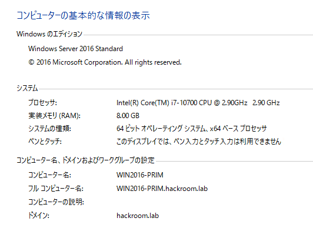

### ADを有効化する

まずはサーバの役割の追加から、Active Directory ドメインサービスを有効化します。

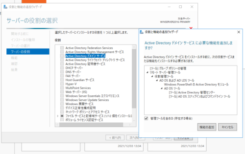

このまま次に進んでいき、[必要に応じて対象サーバーを自動的に再起動する]の設定を有効化した状態でインストールを開始し、しばらく待ちます。

より詳しい手順は以下のサイトなどが参考になると思います。

参考：[Active Directory サーバー（ADサーバー）の構築手順を初心者にも分かり易く徹底解説 | IT trip](https://ittrip.xyz/soft/windows/ad-setup-ad-easy)

また、ドメインコントローラはデフォルトではLDAPSが利用できません。

Active DirectoryとLDAPSで連携する他のアプリケーションを利用したい場合は、LDAPSを利用するための証明書が必要となります。

ドメインコントローラに認証サーバを導入して自己証明書でLDAPSを利用できるようにするためには、ここでAcrtive Directory 証明書サービスも一緒に追加しておきましょう。

### ドメインコントローラに昇格する

有効化が完了すると、以下の画像のような表示になります。

続いて、[このサーバーをドメインコントローラーに昇格する]をクリックしてドメインコントローラを作成していきます。

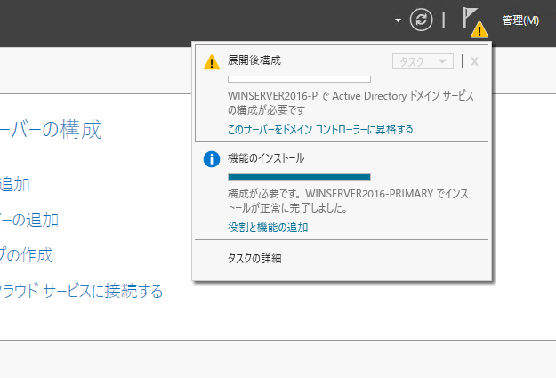

構成ウィザードが開いたら、[新しいフォレストを追加する]から任意のドメイン名を設定します。

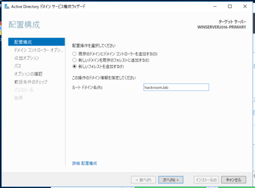

設定はデフォルトで問題ないので、ドメインコントローラオプションからパスワードを設定します。

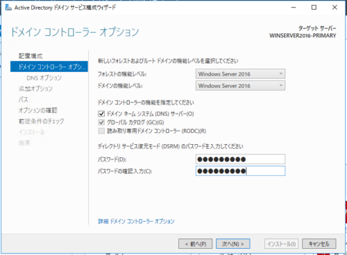

続くDNSオプション、追加オプションもデフォルトのまま進みます。

追加オプションのNetBIOSドメイン名には先ほど設定したルートドメイン名が入ります。

パス、オプションの確認もデフォルトのまま進め、最後にインストールを実行します。

インストールにはしばらくかかるので、完了するまでコーヒーブレイクを楽しみましょう。

インストールが完了すると再起動が実行され、ログイン画面にワークグループではなくドメイン名が表示されます。

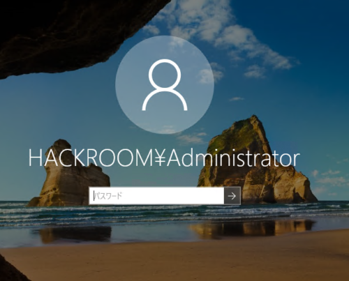

これでAD環境の構築は完了です。

この後は、ラボ環境に構築した他のマシンをADに追加し、グループポリシーで管理を行っていきます。

### IP固定

作成したADにサーバを参加させる場合、ドメインに参加するサーバ側で優先DNSサーバの設定をドメインコントローラのIPアドレスに指定する必要があります。

この作業を簡単にするため、ドメインコントローラ側のIPアドレスを固定します。

ネットワークプロパティを開くと、デフォルトで優先DNSサーバがローカルホストに設定されていました。

この設定のまま、IPアドレスを固定すれば完了です。

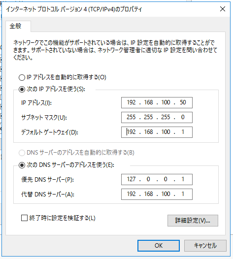

### ADとDNSの確認

サーバマネージャの [ツール]から[Active Directory ユーザとコンピュータ]を開き、[Domain Controllers]の欄に設定したコンピュータ名とルートドメイン名の組み合わせがDNS名に適切に設定されていることを確認します。

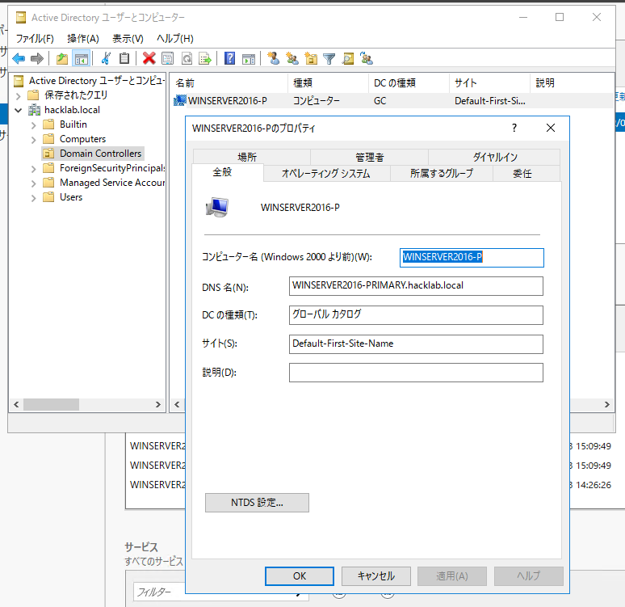

続いて、サーバマネージャの [ツール]から[DNS]を開き、前方参照ゾーンに作成したADに関連するゾーンが設定されていることを確認します。

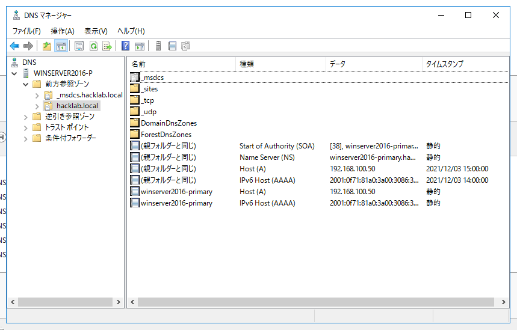

最後に、PowerShellを起動して、作成したドメインで適切にドメインコントローラのアドレスが参照できることを確認します。

``` powershell
$ nslookup hackroom.lab
サーバー:  localhost
Address:  ::1
名前:    hackroom.lab
Addresses:  2001:f71:81a0:3a00:3086:3ad5:664d:d4e0
          192.168.100.50
```

ADサーバの優先DNSサーバは、ドメインコントローラ昇格の後にデフォルトでローカルホストが定義されています。

これで`hacklab.local`という名前で自分のアドレスを参照できていることが確認できました。

### ADユーザの追加

ADの設定直後はデフォルトのユーザしか登録されていないので、ユーザを追加していきます。

サーバマネージャの [ツール]から[Active Directory 管理センター]を開きます。

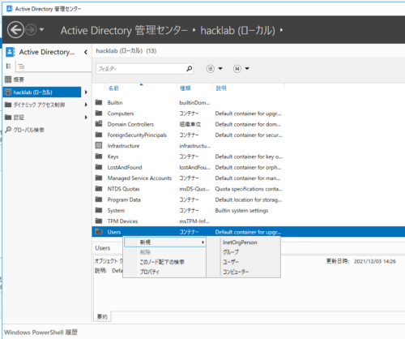

ここで、上記のように登録したドメインのUsersを右クリックして、ユーザの新規登録を行います。

ここでは、TESTUSERというユーザを作成しました。

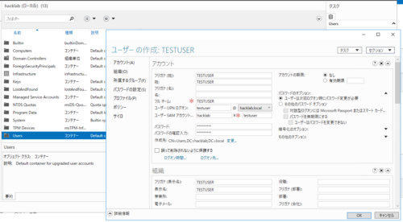

最後に、他のサーバをこのTESTUSERを使ってADに参加させます。

## サーバをADに参加させる

### 優先DNSサーバの宛先をドメインコントローラのIPアドレスに設定する

まずはネットワーク設定を開き、優先DNSサーバの宛先をドメインコントローラのIPアドレスに変更します。

### クライアントをドメインに参加させる

コントロールパネルのシステムから、コンピュータ名/ドメインの変更を選択し、`hackroom.lab`ドメインに参加させます。

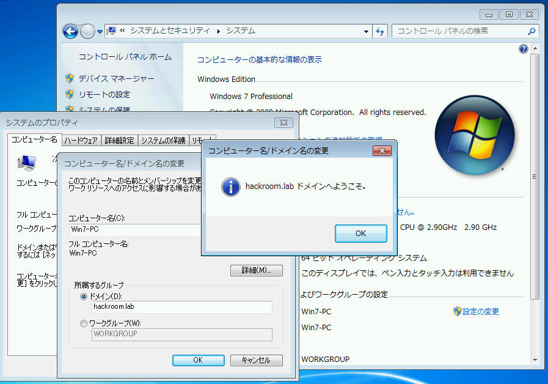

認証には、先ほど作成した`TESTUSER`の認証情報を利用しました。

## ADへの参加に失敗した場合のトラブルシューティング

### 「指定されたドメインがないか、またはアクセスできません」のエラーが出る場合

優先DNSサーバの宛先をドメインコントローラのIPアドレスに変更しているか、pingコマンドでドメインコントローラのサーバに疎通が可能かをまず確認します。

次に、ドメインコントローラ側でコマンドプロンプトからDNSサーバの稼働を確認します。

``` powershell
$ sc queryex dns
SERVICE_NAME: dns
        TYPE               : 10  WIN32_OWN_PROCESS
        STATE              : 4  RUNNING
                                (STOPPABLE, PAUSABLE, ACCEPTS_SHUTDOWN)
        WIN32_EXIT_CODE    : 0  (0x0)
        SERVICE_EXIT_CODE  : 0  (0x0)
        CHECKPOINT         : 0x0
        WAIT_HINT          : 0x0
        PID                : 2800
        FLAGS
```

これを確認しても問題が発生する場合は、nslookupで参加するドメインのドメインコントローラが参照できるかを確認します。

``` powershell
$ nslookup hackroom.lab
サーバー:  UnKnown
Address:  2404:1a8:7f01:b::3
*** UnKnown が hackroom.lab を見つけられません: Non-existent domain
```

このような出力となった場合、ドメインコントローラのDNSを適切に参照できていないため、AD参加ができません。

まずはドメインコントローラ側のファイアウォールを無効化してみて、DNS参照ができるかを試します。

次に、クライアント側（ADに参加したいサーバ）のコマンドプロンプトにて以下のコマンドを入力し、DNSキャッシュをクリアした後にもう一度nslookupを試します。

``` powershell
ipconfig/flushdns
```

これで失敗した場合、ドメインコントローラ側のDNSのイベントを確認します。

### DNSのイベントを確認する

サーバマネージャのDNSタブを開くと、以下のようにイベントが確認できます。

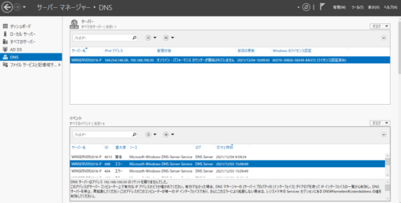

僕の環境では、DNSサーバが`192.168.100.50`でのソケットを開けなかったというエラーが出力されていました。

### ADドメイン名に.localを使っている

僕の環境ではこれをやらかしてました。

AD立て直しです。

参考：[Active Directoryのドメイン名に「.local」を使ってはいけない件 - asohiroblog](https://asohiroblog.net/active-directory-domain-name-local/)

### IPv6を無効化する

IPv6で名前解決を使用とするとAD参加に失敗する場合があるそう。

参考：[【Active Directory】ドメイン参加時に「ドメインxxxのActiveDirectoryドメインコントローラ(AD DC)に接続できませんでした。」メッセージが出力され失敗する | 株式会社ヴァンデミックシステム](https://vamdemicsystem.black/windows/%E3%80%90activedirectory%E3%80%91%E3%83%89%E3%83%A1%E3%82%A4%E3%83%B3%E5%8F%82%E5%8A%A0%E6%99%82%E3%81%AB%E3%80%8C%E3%83%89%E3%83%A1%E3%82%A4%E3%83%B3xxx%E3%81%AEactivedirectory%E3%83%89%E3%83%A1)

### DNSによりドメインコントローラの参照ができているのにADに参加できない

以下のようなエラーが発生している場合、DNSによりドメインコントローラの名前解決には成功しているにも関わらず、ドメインコントローラへの接続に失敗しているようです。

``` bash
クエリによって、次のドメイン コントローラが識別されました:

<DC>

このエラーの一般的な原因として挙げられるのは:

- ドメイン コントローラの名前を IP アドレスに割り当てるための Host (A) レコードが見つからないか、正しくないアドレスを含んでいる。
- DNS で登録されているドメイン コントローラがネットワークに接続されていないか、実行中でない。
```

僕の環境では、複数NIC構成でADを作成した際にこの問題が発生しており、ADサーバに割り当てるNICを一つにした状態でADを再作成したら解消されました。

### 連携がうまくいかないときは

以下を確認してみる。

参考：[ドメイン参加時にクライアントPC・サーバー設定で気をつけること: niyoな日記](http://niyodiary.cocolog-nifty.com/blog/2009/09/pc-499b.html)

以下の記事も参考にしました。

参考：[ValidationMemo: Active Directoryのドメイン名を検討するときに考えるべきこと](https://validationmemo.blogspot.com/2019/01/active-directory.html)

## LDAPSを有効にしてアプリケーションとAD連携する

LDAPSを利用して他のアプリケーションとAD連携を行うには、以下の記事が参考になりました。

Acrive Directory 証明書サービスをインストールして自己証明書で認証を行うだけれあれば、非常に簡単に設定できます。

参考：[Active DirectoryのLDAPS通信を有効化する | KMMR Note](https://kmmr.jp/post-413/)

参考：[Windows ADサーバーのLDAPS有効化の構築方法 | puti se blog](https://blog.putise.com/windows-ad%E3%81%AEldaps%E6%9C%89%E5%8A%B9%E5%8C%96%E3%81%AE%E6%A7%8B%E7%AF%89%E6%96%B9%E6%B3%95/)

## まとめ

中々問題が解消できず、トラブルシューティングにかなり時間がかかりました。

やっぱりAD連携そのものへの理解が不足しているとトラシューにも時間がかかりますね。


