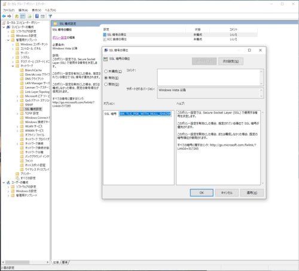
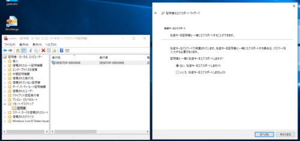
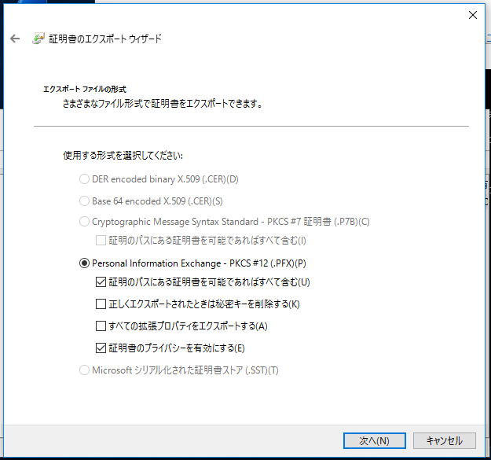
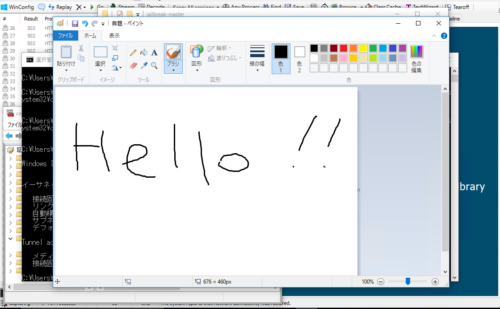
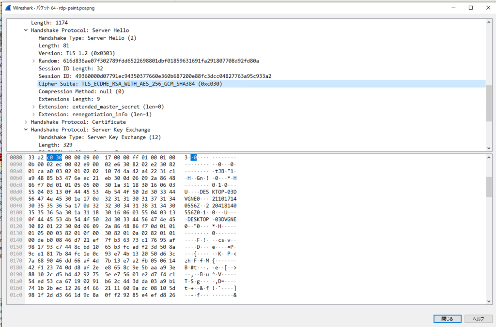
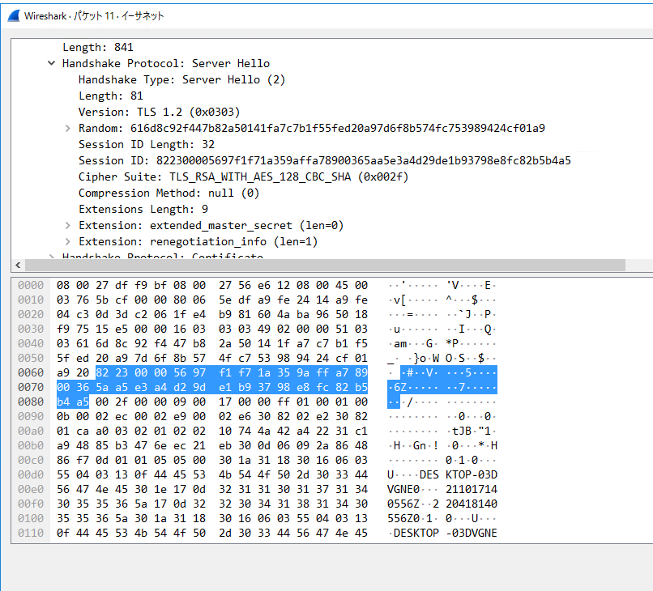
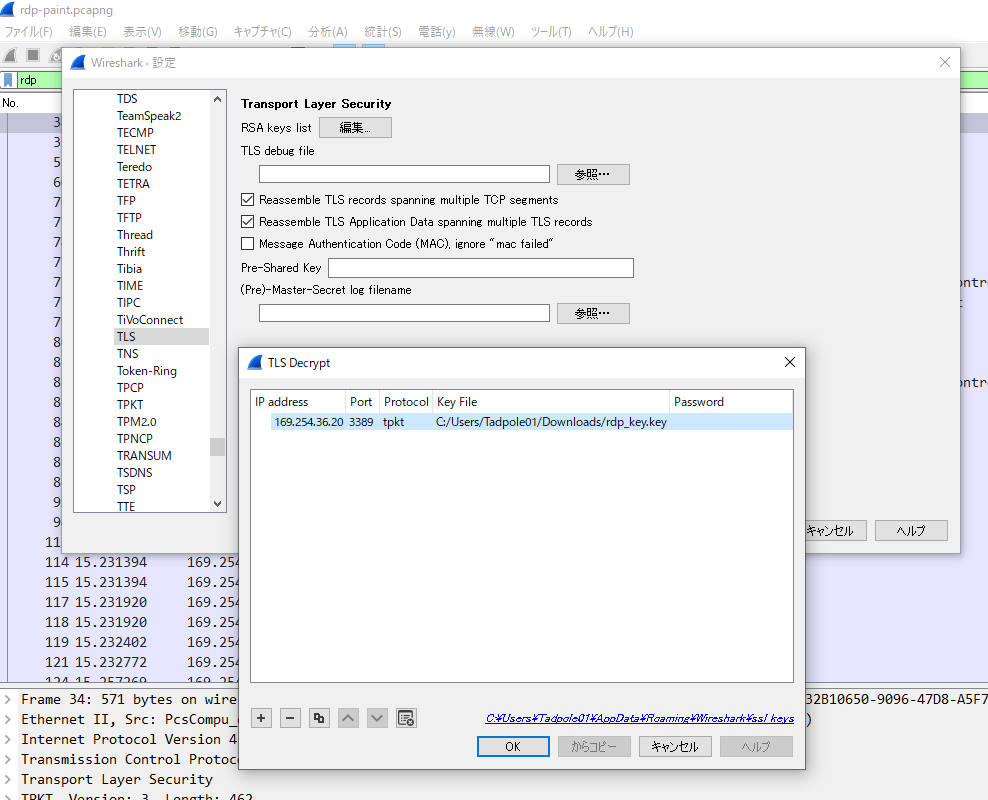
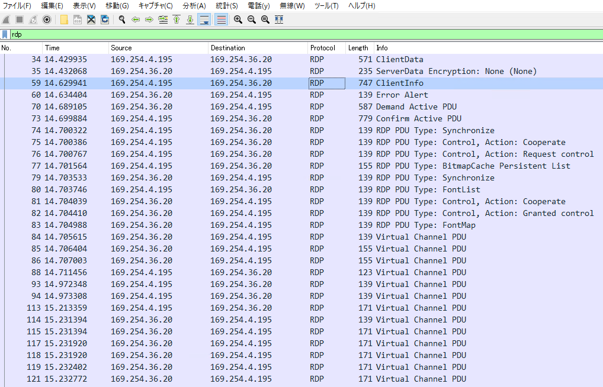

今回は、WireSharkでRDPパケットのキャプチャを行って復号する方法について紹介します。

単純にWireSharkでRDPパケットの中身を見るだけであれば、以下の公式サイトで配布されているpcapファイルとpemファイルを使うのが一番簡単でいいと思います。

参考：[Wiki · Wireshark Foundation](https://gitlab.com/wireshark/wireshark/-/wikis/home)

この記事では、[Wiresharkによるパケット解析講座 11: RDPトラフィックの復号](https://unit42.paloaltonetworks.jp/wireshark-tutorial-decrypting-rdp-traffic/)の記事の手順を参考にしながら進めていきます。

一部この記事の手順通りだと上手くいかない場面があったので、そのあたりも含めてまとめていきます。

<!-- omit in toc -->
## もくじ
- [環境](#環境)
- [クライアント側のRDPクライアントからForward Secrecy暗号を削除する](#クライアント側のrdpクライアントからforward-secrecy暗号を削除する)
- [RDPサーバ側の秘密鍵をエクスポートする](#rdpサーバ側の秘密鍵をエクスポートする)
- [RDPパケットをキャプチャしてみる](#rdpパケットをキャプチャしてみる)
- [秘密鍵でパケットキャプチャを復号する](#秘密鍵でパケットキャプチャを復号する)
- [まとめ](#まとめ)

## 環境

今回は以下の環境を構築しました。

- RDPクライアントホスト Windows 10 1511 
- RDPサーバ ホスト Windows 10 1511 

※ RDPサーバ ホストは、リモートデスクトップ接続を有効化しておきます。

※ いずれもVisualBoxの内部ネットワークで接続。

利用したアプリケーションは以下です。

- WireShark 3.4.8 ： パケットキャプチャの取得とpcapファイルの表示に使用
- jailbreak：RDPサーバの証明書を取得するために使用
- OpenSSL  v1.1.1L Light：証明書から秘密鍵を取得するために使用

## クライアント側のRDPクライアントからForward Secrecy暗号を削除する

まずはクライアント側のグループポリシーエディタ(`gpedit.msc`)を開いて、Forward Secrecy暗号を削除します。

Forward Securityとは、サーバの秘密鍵と公開鍵を利用した暗号化方法ではなく、クライアントとサーバのそれぞれの持つ秘密鍵から作成したデータによって暗号化を行う手法です。

Forward Securityを利用することで、もしクライアントとサーバのどちらか一方の秘密鍵が漏洩した場合でも、データが復号されず、安全性が保たれるメリットがあります。

デフォルトでは、WindowsのRDP通信はこのForward Securityを用いた暗号化がされているため、単一の秘密鍵を用いてWireSharkからパケットを復号することができません。

そのため、まずはクライアント側でForward Secrecy暗号を削除する必要があるというわけです。

以下の画像のように、SSL構成設定からSSL暗号の順位の設定を開き、設定を[有効]にします。



有効にすると[オプション]の項目にSSL暗号の一覧が格納されます。

僕の環境(Windows 10 Pro 20H2)で有効化した際には、デフォルトで以下の暗号化スイートが定義されました。

```bash
TLS_AES_256_GCM_SHA384、TLS_AES_128_GCM_SHA256、TLS_ECDHE_ECDSA_WITH_AES_256_GCM_SHA384、TLS_ECDHE_ECDSA_WITH_AES_128_GCM_SHA256、TLS_ECDHE_RSA_WITH_AES_256_GCM_SHA384、TLS_ECDHE_RSA_WITH_AES_128_GCM_SHA256、TLS_DHE_RSA_WITH_AES_256_GCM_SHA384、TLS_DHE_RSA_WITH_AES_128_GCM_SHA256、TLS_ECDHE_ECDSA_WITH_AES_256_CBC_SHA384、TLS_ECDHE_ECDSA_WITH_AES_128_CBC_SHA256、TLS_ECDHE_RSA_WITH_AES_256_CBC_SHA384、TLS_ECDHE_RSA_WITH_AES_128_CBC_SHA256、TLS_ECDHE_ECDSA_WITH_AES_256_CBC_SHA、TLS_ECDHE_ECDSA_WITH_AES_128_CBC_SHA、TLS_ECDHE_RSA_WITH_AES_256_CBC_SHA、TLS_ECDHE_RSA_WITH_AES_128_CBC_SHA、TLS_RSA_WITH_AES_256_GCM_SHA384、TLS_RSA_WITH_AES_128_GCM_SHA256、TLS_RSA_WITH_AES_256_CBC_SHA256、TLS_RSA_WITH_AES_128_CBC_SHA256、TLS_RSA_WITH_AES_256_CBC_SHA、TLS_RSA_WITH_AES_128_CBC_SHA、TLS_RSA_WITH_3DES_EDE_CBC_SHA、TLS_RSA_WITH_NULL_SHA256、TLS_RSA_WITH_NULL_SHA、TLS_PSK_WITH_AES_256_GCM_SHA384、TLS_PSK_WITH_AES_128_GCM_SHA256、TLS_PSK_WITH_AES_256_CBC_SHA384、TLS_PSK_WITH_AES_128_CBC_SHA256、TLS_PSK_WITH_NULL_SHA384、TLS_PSK_WITH_NULL_SHA256
```

この手順では、デフォルトで設定されている暗号化スイートのうち、いくつかを手動で削除します。

ここで削除しているのは、現在実用化されているForward Securityの暗号化手法である、DHE（ディフィー・ヘルマン鍵共有）と、ECDHE（楕円曲線ディフィー・ヘルマン鍵共有）に関連した暗号化スイートです。

削除後の設定は次のようになります。

面倒なので`TLS_RSA_WITH_AES_128_CBC_SHA256`一つに絞ってしまします。

``` bash
TLS_RSA_WITH_AES_128_CBC_SHA256
```

この設定値を[SSL暗号]のフォームにコピペしてOKボタンを押せば設定は完了です。

念のため、コマンドプロンプトで以下のコマンドを実行し、グループポリシーの設定を反映させます。

``` powershell
gpupdate /force
```

これでForward Securityの無効化は完了です。

**※ 後述しますが、この手順だけでは不十分で、手元の環境ではOSを再起動するまで暗号化スイートは変更されませんでした。**

## RDPサーバ側の秘密鍵をエクスポートする

次に、RDPサーバ側の証明書をエクスポートします。

エクスポートには、Mimikatzなどのツールも使えるようですが、今回は参考にしている記事内で使用されていた[Jailbreak](https://github.com/iSECPartners/jailbreak)をつかってみました。

Mimikatzで取得する場合は、以下の手順を参照します。

参考：[FreeRDP-wiki/Mimikatz.md at master · ypid/FreeRDP-wiki](https://github.com/ypid/FreeRDP-wiki/blob/master/Mimikatz.md)

[Jailbreakのリポジトリ](https://github.com/iSECPartners/jailbreak)からZIPファイルをダウンロードし、バイナリ本体が格納されている`binaries`内`jailbreak64.exe`を管理者権限で起動したコマンドプロンプトから実行します。

``` powershell
jailbreak64.exe %WINDIR%\system32\mmc.exe %WINDIR%\system32\certlm.msc -64
```

実行が完了すると証明書ストアの画面が起動し、[リモートデスクトップ]>[証明書]の中にRDPの証明書が作成されていることが確認できるため、これをエクスポートします。



エクスポートはこんな感じ。

パスワードの入力も求められますが、適当なパスワードでOKです。（今回は「test」にしました）



続いて、取得した証明書から秘密鍵を取得します。

Windows環境でOpenSSLをインストールする場合は、以下のリンクからインストーラをダウンロードできます。

参考：[Win32/Win64 OpenSSL Installer for Windows - Shining Light Productions](https://slproweb.com/products/Win32OpenSSL.html)

秘密鍵は以下のコマンドで取得できます。

``` powershell
openssl pkcs12 -in rdp_key.pfx -nocerts -nodes -password pass:test -out rdp_key.pem
openssl rsa -in rdp_key.pem -out rdp_key.key
```

手元の環境では、v3.0.0系のOpenSSLの場合は秘密鍵の取得に失敗したため、v1.1.1を使用しました。

## RDPパケットをキャプチャしてみる

RDPクライアント側のマシンでWireSharkを起動し、パケットのキャプチャを開始しました。

RDPクライアント側からRDP接続でサーバ側に接続し、ペイントアプリを起動してテキストを書き込むところまでのパケットを取得しました。



ここでキャプチャしたパケットを復号しようとしたものの、なぜか上手くいきませんでした。

鍵を変えたりいろいろしてみたものの、結果として上手くいきませんでした。

それもそのはず、RDP通信時のServer Helloのパケットを確認したところ、どうやら暗号化スイートとしてECDHEを使用しているようでした。（Forward Security無効化できてないじゃん・・・。）



どうやら`gpupdate /force`だけでは不十分だったようで、OSの再起動を実施しました。

その後再度パケットキャプチャを取得したところ、無事に`TLS_RSA_WITH_AES_128_CBC_SHA256`による暗号化スイートを使用したRDP通信のパケットを取得することができました。



## 秘密鍵でパケットキャプチャを復号する

ようやくここまでたどり着きました。

最後に、取得したパケットキャプチャを復号します。

取得したpcapファイルをWireSharkで開き、ツールバーの[編集]タブから[設定]を開きます。

続いて、左側のツリーのプロトコル一覧から、[TLS]を選択し、設定を開きます。

最後に、[RSA keys list]の編集から、以下の設定を入力します。

``` powershell
IP address : "RDPサーバ側のIPアドレス"
Port : "RDP接続先のポート（3389）"
Protocol : "tpkt"
Key File : "証明書から抽出したRSAキーファイル"
```



この設定を反映すると、RDPのパケットが複合され、フィルタリングできるようになります。



お疲れ様でした！！

## まとめ

基本的には、[Wiresharkによるパケット解析講座 11: RDPトラフィックの復号](https://unit42.paloaltonetworks.jp/wireshark-tutorial-decrypting-rdp-traffic/)の記事の手順に沿って進めてみましたが、一部の手順が記事通りに上手く再現できなかったので少し手間取りました。

結果として、WireSharkやWindowsの暗号化スイートについて勉強になったのでやってみてよかったかなとは思ってます。

気が向いたらRDPプロトコルの詳細についても記事を書こうと思ってます。

ただ、いまいちこの500ページくらいのリファレンスを読むモチベが湧いてこないので、ほんとに気が向いたときになると思います。

参考：[[MS-RDPBCGR]: Remote Desktop Protocol: Basic Connectivity and Graphics Remoting | Microsoft Docs](https://docs.microsoft.com/en-us/openspecs/windows_protocols/ms-rdpbcgr/5073f4ed-1e93-45e1-b039-6e30c385867c)